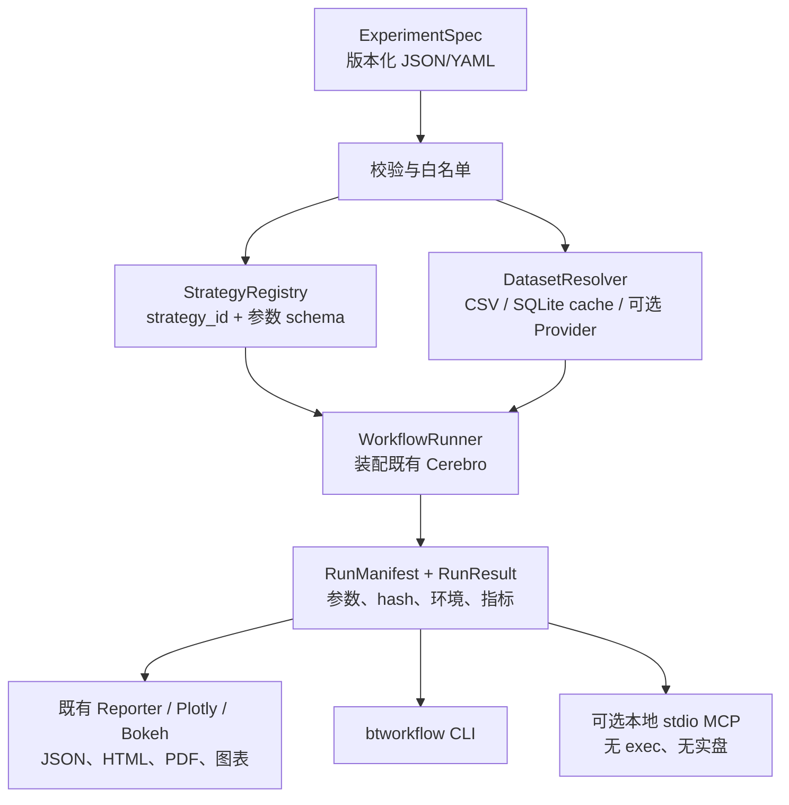

# 迭代 16：基于 ai-trader 与 backtrader-mcp 增强可复现工作流

> 状态：调研基线；原实施范围已于 2026-07-29 拆分，不再作为当前实施计划
>
> 创建日期：2026-07-28
>
> 当前检出分支：`dev`（严禁直接推送 `master`）
>
> 研究范围：`/Users/yunjinqi/Documents/量化交易框架/ai-trader` 与
> `/Users/yunjinqi/Documents/量化交易框架/backtrader-mcp`，以本仓库
> `backtrader` 为基线。

## 范围调整（2026-07-29）

用户将当前目标收敛为三个**互不依赖、各自功能完整**的产品：

1. `迭代17-backtrader-skills独立AI策略开发系统/任务.md`
2. `迭代18-backtrader-mcp独立AI策略开发系统/任务.md`
3. `迭代19-backtrader-agent独立AI策略开发智能体/任务.md`

三者都必须单独实现本地数据检查与加载、语料检索、需求规格化、策略生成、静态校验、
受控回测、测试、诊断修复和报告；不能拆成必须组合使用的若干半系统。

因此，本文件继续保留为 `ai-trader` 与旧 `backtrader-mcp` 的能力差距调研基线，
但其中“可复现实验工作流、行情 Provider、缓存、CLI 与 MCP 组合实施”的原范围不再
代表当前开发任务。若未来重新启动这些能力，应另行立项，不得默认并入迭代17、18
或19。

## 0. 原结论与立项决定（已被上述范围调整替代）

> 本节以下内容仅保留 2026-07-28 的调研和决策历史，不作为迭代17、迭代18、迭代19
> 的实施范围。

这不是一个“给 Backtrader 加一个 MCP Server”的迭代。两份参考实现真正有价值的
部分，是将一次回测组织为可描述、可重复、可审计的工作流：配置、数据获取/缓存、
策略选择、执行、指标、报告和结构化结果形成一条稳定链路。MCP 只应是这条链路成熟
之后的受控入口。

本迭代立项为：在不破坏现有 `Cerebro`、`btrun`、报告和绘图 API 的前提下，新增
“可复现实验工作流”内核；在其上提供可选、仅本地 `stdio` 的 MCP 适配层。第一版仅
支持离线回测，绝不引入实盘下单能力。

**优先级顺序：**

1. 可复现实验规范、运行清单和本地 CSV 数据闭环；
2. 白名单策略注册、可复用数据缓存与可选行情 Provider；
3. CLI、现有报告/绘图产物整合；
4. 受限 MCP 工具与协议级验收。

## 1. 调研证据快照

| 对象 | 已核验版本/提交 | 结构事实 | 调研判断 |
| --- | --- | --- | --- |
| 当前仓库 | `04adc08c2deb02cbf240efbd495e5eee68b375d8` | 当前运行时有 `Cerebro.plot()`、`btrun`、HTML/PDF/JSON 报告与常用 Analyzer；无 `Cerebro.addnotifycallback()`、无 `Broker.get_value_history()` | 不应重复造回测、图表和报告内核；应围绕其补工作流层。 |
| `ai-trader` | `7681fe331fb638beab1ae20d3552c802bbaa9174` | Python >= 3.11；包装上游 `backtrader==1.9.78.123`；Click CLI、Pydantic/YAML、SQLModel SQLite、五类行情抓取器、23 个具体策略、FastMCP 工具 | 产品化工作流方向可借鉴，但依赖和兼容性不能原样迁入。 |
| `backtrader-mcp` | `348b7ee936a7f8351c97e2f1362988bff0e7a6ac` | Python >= 3.10；单文件 MCP 服务、CCXT、Plotly；无测试目录 | 端到端工具体验有参考价值，但实现不能直接使用。 |

调研原始记录见：
`_bmad-output/planning-artifacts/research/technical-ai-trader-and-backtrader-mcp-capability-gap-research-2026-07-28.md`。

### 1.1 当前基线已经具备的能力

- `backtrader.btrun.btrun` 已能从命令行装配数据、策略、指标、Observer、Analyzer
  与 Signal；新 CLI 不能替代或改写它的既有语义。
- `Cerebro.plot()` 已支持 Matplotlib、Bokeh、Plotly 路径；
  `backtrader.reports.ReportGenerator` 已能生成 HTML、PDF、JSON。
- 现有 Analyzer 已包含 Sharpe、DrawDown、Returns、TradeAnalyzer、SQN 等常见指标。
- `live_trading/interface.py` 有 CCXT 适配器名称映射，但本次核查未发现可直接复用的
  在树 CCXT broker 实现。因此不能把“名字被映射”视为已有可用的交易所接入。

### 1.2 `ai-trader` 在 MCP 之外新增了什么

| 功能面 | 已观察到的实现 | 对本仓库的价值 | 本迭代处理 |
| --- | --- | --- | --- |
| 配置驱动回测 | YAML/配置对象描述数据、经纪商、策略、Analyzer 与运行参数 | 高：让实验可复跑、可自动化 | 采用更小的、版本化 `ExperimentSpec`；JSON 为核心，YAML 为可选输入。 |
| 统一回测装配 | `create_cerebro`、数据添加、Sizer、默认 Analyzer、`run_backtest` 等包装 | 高：避免每个用户脚本各自拼装 `Cerebro` | 建立显式 workflow service；不改变 `Cerebro` 生命周期。 |
| 数据抓取 | 美股、台湾、加密、外汇、VIX 五类 fetcher | 中：Provider 抽象和标准化输出值得采用 | 先做 CSV 与缓存；随后可选 Yahoo/CCXT，Provider 必须可替换、可 mock。 |
| 本地数据存储 | SQLModel/SQLite、数据实体和元数据 | 高：缓存和数据来源记录是可复现的基础 | 使用标准库 SQLite 的窄表结构和唯一键；补齐 hash、版本、抓取时间与区间。 |
| 策略包 | 20 个策略文件，23 个具体策略，包括技术指标和轮动策略 | 中：提供可发现的样例比策略数量更重要 | 手工实现少量独立样例并登记元数据；不批量搬运代码。 |
| CLI 体验 | 配置运行、快速回测、拉取数据、数据管理 | 高：降低工作流门槛 | 新建互补命令，不破坏原 `btrun`。 |
| 结构化结果 | MCP DTO/Analyzer 结果的 JSON 化 | 高：方便 CLI、测试、MCP 共用 | 将 `RunResult`/manifest 设为工作流稳定边界。 |
| Agent 示例 | 两个独立 Google ADK 子项目 | 低：依赖版本和运行时割裂 | 仅作后续示例参考，不纳入核心包或本迭代依赖。 |

需要吸取的反例：`ai-trader` 的基础环境在本机收集测试时因 eager import 的
`twstock`、`sqlmodel` 缺失而报 3 个收集错误（331 个测试已收集）。这不是其完整安装
后的质量结论，但足以说明可选 Provider 不应在包导入期强制加载。其 SQLite 模型也缺少
可复现所需的来源版本、内容 hash 和明确复合唯一约束。

### 1.3 `backtrader-mcp` 在 MCP 之外新增了什么

| 功能面 | 已观察到的实现 | 对本仓库的价值 | 本迭代处理 |
| --- | --- | --- | --- |
| 端到端请求 | 一次工具调用完成交易所 OHLCV 拉取、策略、回测、指标、图像 | 高：可作为用户任务模型 | 改为“受控实验执行”，数据集和策略必须来自白名单。 |
| CCXT 异步取数 | 分页 `fetch_ohlcv`、限速开关、进度通知 | 中高：适合可选 Provider 的接口设计 | 仅放入可选 `[marketdata]` 依赖；复用实例、关闭 async client、用 fixture/mock 验收。 |
| MCP prompt/tool 分离 | 策略生成 prompt 与 `run_backtest` tool 分开 | 中：有助于人机协作 | 保留“发现策略/校验规范/运行实验”的分层，不让 prompt 产生可执行代码。 |
| 图片型输出 | Plotly 转图并作为 tool 返回值 | 中：适合作为产物体验 | 优先复用现有 Plotly/Bokeh/ReportGenerator；MCP 返回结构化结果和相对产物引用。 |
| 杠杆/永续声明 | README 声称现货、永续、杠杆、资金费 | 低：代码未见资金费模型或完整市场约束 | 不承诺、不实现；未来须先有独立 broker/commission/funding 规格和验证。 |

`backtrader-mcp` 不可直接移植的原因：

- `exec(strategy_code, ...)` 直接执行工具输入的策略代码，是远程代码执行风险；
- 使用动态 `getattr(ccxt, exchange)`，没有交易所白名单和能力校验；
- 接收但未实际使用 `to_date`，回测数据边界不可靠；
- 调用当前仓库中不存在的 `Cerebro.addnotifycallback()` 和
  `broker.get_value_history()`，对当前 fork 不能直接运行；
- 无自动化测试，并将 traceback 原样回传，可能泄漏内部路径和细节。

## 2. 目标架构与边界



### 2.1 新增模块边界

拟新增而非立即承诺的目录边界如下；实施时以现有包命名和测试布局复核后落定：

```text
backtrader/
  workflows/
    contracts.py       # ExperimentSpec、DatasetRef、RunResult、RunManifest
    validation.py      # 版本、字段、资源上限和白名单校验
    registry.py        # 显式策略注册与参数 schema
    service.py         # 将规范装配为既有 Cerebro 回测
    provenance.py      # 内容 hash、环境与产物清单
    data/
      csv.py           # CSV 标准化与列映射
      cache.py         # SQLite cache（标准库 sqlite3）
      providers.py     # 可选 Provider 协议与延迟导入
  mcp/
    server.py          # 可选的本地 stdio server
    tools.py           # typed tool 适配，不包含回测业务逻辑
examples/workflows/
tests/unit/workflows/
tests/integration/workflows/
tests/integration/mcp/
```

**唯一职责：** `workflows` 是唯一可以装配实验的应用层；`mcp` 和 CLI 只能调用它，
不得分别实现第二套回测、数据转换、指标提取或报告逻辑。

### 2.2 不变性与兼容性约束

- 支持本仓库声明的 Python 3.8+；基础安装不新增强制第三方依赖。
- 核心规范以 JSON 和标准库 dataclass/显式校验实现；YAML、MCP、Yahoo/CCXT 分别通过
  extras 延迟安装和导入。建议 extras 名称为 `[workflows]`、`[marketdata]`、`[mcp]`，
  具体依赖约束在 M0 ADR 中确定。
- 工作流调用既有 `Cerebro`、Analyzer、`ReportGenerator`、绘图后端；不复制它们。
- 不修改默认 `btrun` 行为；可新增 `btworkflow` entry point，或仅在 ADR 证明兼容时增加
  独立子命令。
- 新策略通过 `strategy_id` 显式注册。禁止从 YAML/MCP 输入动态 import 任意模块、
  `eval`、`exec` 或反序列化不可信 pickle。
- 只允许离线历史回测；没有 `buy/sell` API 暴露给 MCP，没有实盘 store、API key、
  OAuth、HTTP server 或后台常驻任务。

## 3. 工作流契约

### 3.1 `ExperimentSpec` 最小字段

| 域 | 必填字段 | 规则 |
| --- | --- | --- |
| 规范 | `schema_version`、`run_name` | 未知 major 版本拒绝执行。 |
| 数据 | `dataset_id`、`source`、`timeframe`、`from`、`to` | 只能引用已登记 dataset 或允许的工作区相对路径；统一 OHLCV 时区/列名。 |
| 策略 | `strategy_id`、`parameters` | `strategy_id` 必须在 `StrategyRegistry`；参数由登记 schema 校验。 |
| 经纪商 | `cash`、`commission`、`slippage` | 参数范围有限制；不以此暗示永续资金费或实盘语义。 |
| 输出 | `artifact_dir`、`formats` | 输出目录必须位于运行根目录，格式限 JSON/HTML/PDF/已支持图表。 |
| 资源 | `max_bars`、`timeout_seconds` | 有保守默认值和上限；超限在运行前失败。 |

### 3.2 `RunManifest` 不可省略的审计字段

- 完整规范的 canonical JSON 与 SHA-256；
- 输入文件/缓存记录的内容 hash、Provider、请求参数、抓取时间、时区和覆盖区间；
- `backtrader.__version__`、源码提交（若可得）、Python/平台、依赖 extras；
- 解析后的策略 ID、参数、Analyzer、执行模式（`runonce` 等）和随机种子；
- 开始/结束时间、状态、规范化错误码、结构化指标和每个产物的相对路径/hash；
- 失败时的安全错误摘要，不包含 secrets、绝对工作区外路径或完整 traceback。

这比 `ai-trader` 的“保存一份数据记录”更严格，也是后续判断两次回测是否可比较的基础。

### 3.3 数据缓存与 Provider 协议

SQLite cache 的 key 至少包含 `provider`、`symbol`、`timeframe`、`from`、`to` 和
标准化请求参数 hash；数据表须有复合唯一约束。原始响应/CSV hash、抓取时间、版本和
时区必须进入 manifest。相同完整请求优先命中 cache；任何强制刷新都生成新的 provenance
记录而不是静默覆盖历史证据。

Provider 必须实现窄接口（发现能力、拉取、标准化、关闭），并在调用点延迟导入。实施
顺序是：

1. `CsvProvider`（无网络、回归测试的基线）；
2. SQLite cache；
3. 可选 Yahoo Finance Provider；
4. 可选 CCXT OHLCV Provider，交易所严格 allowlist、分页上限、时段裁剪和 fixture/mock
   测试齐备后才启用。

CCXT 的异步实例须按其官方建议复用、限速并关闭；不要为每一页创建新 client。
参见 [CCXT Manual](https://github.com/ccxt/ccxt/wiki/manual)。

## 4. 迭代范围

### 4.1 本迭代交付

- 本地 CSV 至 `ExperimentSpec` 至结果/manifest 的确定性回测闭环；
- 显式策略注册与少量独立编写的示例策略（至少买入持有、均线交叉、RSI 均值回归），
  以及参数 schema/发现 API；
- SQLite 缓存、数据来源和内容 hash；
- 可选 market-data Provider 框架，优先 CSV，远端 Provider 只在依赖独立、测试可控时加入；
- 与现有 JSON/HTML/PDF/绘图能力相连的产物目录和 CLI；
- 可选 MCP `stdio` server，提供白名单的发现、校验、运行、读取结果工具；
- 单元、集成、兼容性、导入隔离、安全负面和 MCP Inspector 验收。

### 4.2 明确不做

- 不复制 `ai-trader` 的所有 23 个策略、Google ADK 示例或其 Python 3.11/3.12 依赖面；
- 不实现台湾数据源、任何需要绕过 TLS 校验的 Provider 行为，或未验证的私有数据源；
- 不执行用户提交的 Python 策略代码，不支持路径任意读取、动态 import、`eval`/`exec`；
- 不声称支持永续合约资金费、实盘交易、交易所账户、杠杆清算或风控模型；
- 不重新实现 `Cerebro.plot`、Bokeh/Plotly、`ReportGenerator` 或已有 Analyzer；
- 第一版不提供 HTTP MCP、OAuth、远程多租户、后台队列或定时任务。

## 5. 分阶段任务与验收

### M0：边界 ADR、依赖与测试基线

**目标：** 在写功能前锁定兼容性、配置格式、依赖边界和安全模型。

1. 写 ADR：记录 `ExperimentSpec` schema version 策略、JSON/YAML 选择、extras 名称、
   `btworkflow` 与 `btrun` 的关系、manifest 目录规则、错误码和迁移策略。
2. 建立 `tests/unit/workflows/`、`tests/integration/workflows/`、
   `tests/integration/mcp/` 的 fixture、临时产物清理和无网络测试约定。
3. 添加 import-isolation 测试：基础安装可导入 `backtrader` 与 `backtrader.workflows`，
   未安装 YAML/MCP/CCXT/yfinance 时不触发它们的 import。
4. 固化当前 `Cerebro`、Analyzer、报告 API 的最小兼容烟测；测试应断言当前真实 API，
   不得模仿 `backtrader-mcp` 的缺失方法。

**完成标准：** ADR 被评审；`pytest` 的基础导入测试在 Python 3.8 最低支持环境和当前
开发环境均通过；新增可选依赖不会进入基础 `install_requires`。

### M1：可复现实验内核（CSV 优先）

**目标：** 让同一规范与同一 CSV 可重复得到相同的核心结果和可审计 manifest。

1. 实现不可变/显式的 `ExperimentSpec`、`DatasetRef`、`RunResult`、`RunManifest`；
   对未知字段、未知 schema version、非法时间范围、非法输出目录给出稳定错误码。
2. 实现 `CsvProvider`：明确列映射、日期解析、时区、排序、去重和 OHLCV 数值校验。
3. 实现 `WorkflowRunner`：用既有 `Cerebro` 添加 data、strategy、Sizer、Analyzer，
   统一提取 Sharpe、DrawDown、Returns、TradeAnalyzer、SQN 的 JSON 安全结果。
4. 生成 manifest 和 JSON artifact；使用 canonical JSON + SHA-256 记录规范和输入数据。
5. 添加 direct-`Cerebro` 与 workflow 结果对照测试，覆盖 `runonce=True/False` 的一致性。

**完成标准：** 使用固定 CSV 时，两次执行产生相同的核心指标、规范 hash 和数据 hash；
manifest 可以单独解释一次运行，不依赖控制台输出。

### M2：策略注册与可发现样例

**目标：** 从“用户提供任意代码”转为“用户选择已审核策略”。

1. 实现 `StrategyRegistry`，每项包含 `strategy_id`、版本、描述、参数 schema、
   可接受数据类型和 factory；注册表不接受来自配置的 import path。
2. 独立编写买入持有、均线交叉、RSI 均值回归三个基准策略；每项都有固定 CSV 回归测试。
3. 提供 `list_strategies()`、`describe_strategy()`、`validate_parameters()` 供 CLI 和 MCP
   共同使用。
4. 审核每个示例在 runonce/runnext、无成交、少于最小周期、非法参数下的行为。

**完成标准：** 未登记策略和多余/错误参数不可执行；策略发现结果稳定、可 JSON 序列化；
三个样例不依赖 `ai-trader` 源代码。

### M3：缓存与可选行情接入

**目标：** 用可审计数据层取代一次性在线抓取。

1. 实现 SQLite cache schema、复合唯一键、迁移/初始化函数、命中/刷新策略及并发写入
   保护；每条数据集记录 provenance。
2. 完成 CSV -> cache -> workflow 的离线回归；验证 cache 命中不调用 Provider。
3. 定义 `MarketDataProvider` 协议和延迟 import factory；不让 optional Provider 破坏基础
   `pytest` 收集。
4. 评估并实现一个可选 Yahoo Provider；只用录制 fixture/mock 覆盖 CI，真实网络检查须
   明确标记为手动/集成验证。
5. 仅在 1--4 稳定后实现可选 CCXT OHLCV Provider：交易所 allowlist、`to` 截断、
   分页/条数上限、重试分类、async client close、无凭据的公共市场数据模式。

**完成标准：** 每次远端数据运行均可从 manifest 识别来源和版本；`to_date` 不会像
`backtrader-mcp` 那样被忽略；无远端依赖的完整回归可离线通过。

### M4：CLI、产物与用户工作流

**目标：** 让人和自动化都使用同一个 workflow service。

1. 新增 `btworkflow validate <spec>`、`list-strategies`、`run <spec>`、
   `show <run-id>`、`cache` 等命令；所有命令返回机器可读 JSON 的可选模式和清晰退出码。
2. 将 JSON、HTML、PDF、图表产物收敛至每次运行的受限目录；优先调用既有
   `ReportGenerator`、Plotly/Bokeh 后端。
3. 命令只接受工作区相对输入、注册数据集 ID 或经审核的 import 根；拒绝目录穿越和
   输出到运行根之外。
4. 提供最小 `examples/workflows/`：一个完整 spec、固定 CSV、预期 manifest 结构和
   复跑说明。

**完成标准：** 示例只靠基础/声明的 extra 即可运行；CLI 与 Python API 使用同一 service
并产生等价 manifest；原 `btrun` 测试无回归。

### M5：受控、本地 MCP 适配

**目标：** 将已验证的工作流暴露为工具，而不是把解释器暴露给模型。

1. 将 MCP 置于可选 `[mcp]` extra，使用官方 SDK；第一版仅 `stdio` transport。
2. 提供 typed tools：`list_strategies`、`describe_strategy`、`validate_experiment`、
   `run_experiment`、`get_run_result`、`list_run_artifacts`。所有 tool 都委托给
   `workflows` service。
3. `run_experiment` 只接收规范或其受限引用，且策略与数据均走注册表/解析器；没有
   `strategy_code`、任意 file path、模块路径、shell 命令或实盘开关。
4. 以结构化 JSON 返回结果、状态和相对 artifact 引用；错误采用分类消息，日志写入本地
   受控目录，禁止回传完整 traceback 或 secret。
5. 进度通知只报告阶段和已处理数量；运行前校验 bar 数、超时和允许的数据源。客户端侧
   仍应保留人类确认，符合 [MCP tools 的安全建议](https://modelcontextprotocol.io/specification/2025-06-18/server/tools)。
6. 用 [MCP Inspector](https://modelcontextprotocol.io/docs/tools/inspector) 和协议集成测试
   验证工具发现、参数校验、成功/失败结果与不存在 `exec` 路径。

**完成标准：** 未安装 MCP extra 时核心包完全可用；Inspector 可发现并执行 fixture 回测；
所有拒绝案例无数据泄漏、无代码执行、无网络副作用。

### M6：全矩阵验收、文档与发布准备

**目标：** 证明能力可用、可重复、可维护，而不是只证明一个 demo 可跑。

1. 运行格式、lint、类型、安全、单元/集成/策略回归矩阵；性能结论只能以当次基准和
   运行 provenance 为准，不能用旧 benchmark 代替。
2. 增加“从 CSV 到 CLI 到 MCP”的教程、配置参考、Provider/缓存语义、故障排查和安全
   边界文档。
3. 更新 `AGENTS.md`：只有当最终目录、entry point、extras 和测试命令已经落地并经核验
   后才更新结构说明，不能提前写入猜测。
4. 输出迭代验收记录：测试命令、环境、提交、artifact hash、限制项和未实现声明。

**完成标准：** 所有下列“验收门”通过，且变更仅包含批准范围内的文件。

## 6. 验收门与命令

实施阶段所有 Python 命令使用本机 Anaconda base 环境：

```bash
/Users/yunjinqi/opt/anaconda3/bin/conda run -n base python -m pytest tests/unit/workflows -q
/Users/yunjinqi/opt/anaconda3/bin/conda run -n base python -m pytest tests/integration/workflows -q
/Users/yunjinqi/opt/anaconda3/bin/conda run -n base python -m pytest tests/integration/mcp -q
/Users/yunjinqi/opt/anaconda3/bin/conda run -n base python -m pytest tests -m "not slow" -q
/Users/yunjinqi/opt/anaconda3/bin/conda run -n base python -m pytest tests/functional/strategies -q
```

若新增的 extras 改变了安装路径，还必须在干净虚拟环境或等价 clean-install 环境验证：

| 门 | 必须证明的事实 |
| --- | --- |
| 基础安装 | 不安装 YAML、CCXT、MCP、Yahoo 等 optional 依赖时，`import backtrader`、现有测试和 CSV workflow 可用。 |
| 配置契约 | unknown schema、未知策略、越界参数、目录穿越、错误日期、未知列均被稳定拒绝。 |
| 可重复性 | 同一 spec + 同一 CSV/cache，核心指标、规范 hash、数据 hash 相同；manifest 完整。 |
| 回测正确性 | workflow 与直接 `Cerebro` 的固定数据基准一致；runonce/runnext 结果有针对性验证。 |
| 缓存正确性 | cache hit 不发起 Provider 请求；刷新保留前后 provenance；`to` 边界有测试。 |
| 可选依赖 | 无 optional 包不影响收集；每种 extra 的安装、导入和最小运行单测通过。 |
| MCP 安全 | 没有 `exec`/`eval`/配置动态 import；工具只能调用已注册策略、已批准数据源和受限目录。 |
| MCP 协议 | Inspector 和自动化客户端发现工具、验证 schema、运行 fixture、读取 artifact、处理错误。 |
| 回归 | `make quality-check`、快测、完整策略测试均通过；必要时单独重跑 timing-sensitive broker 测试。 |

MCP 采用 tools/resources/prompts 的协议模型，但本迭代只实现完成任务所需的 tools；
不要为了“协议齐全”制造空资源或 prompt。架构依据见 [MCP Architecture](https://modelcontextprotocol.io/docs/learn/architecture)。

## 7. 安全、数据和质量规则

| 风险 | 必须控制 | 验证方式 |
| --- | --- | --- |
| 模型/用户代码执行 | 不接受代码字符串；注册表 factory 仅从受审模块生成 | 源码扫描、负面 tool 测试、code review。 |
| 任意文件读取/写入 | 输入和产物均限制在 workspace run root；解析真实路径后比较 | `../`、symlink、绝对路径测试。 |
| 可选依赖污染基础包 | 延迟 import、extras、隔离测试矩阵 | clean install 与无依赖导入测试。 |
| 网络/交易所不确定性 | fixture 优先、allowlist、分页/条数/时间上限、分类重试 | mock transport、边界和关闭 client 测试。 |
| 结果不可审计 | canonical spec + 输入/产物 hash + 环境 + Provider 元数据 | 重跑和 manifest schema 测试。 |
| 误导性金融能力 | 不宣称资金费、杠杆清算、实盘或收益保证 | README/API 审查和端到端测试。 |
| 敏感信息泄漏 | secret 只来自受控环境；结果/错误做脱敏 | error/日志快照测试。 |

MCP 工具默认应要求客户端显式发起、展示输入和结果；协议规范也强调工具调用应保留人类
控制与确认边界。[MCP Tool Specification](https://modelcontextprotocol.io/specification/2025-06-18/server/tools)

## 8. 实施顺序、依赖和拆分建议

| 顺序 | 可独立提交的变更 | 前置 | 不可提前合并的原因 |
| --- | --- | --- | --- |
| 1 | M0 ADR + 测试骨架 | 无 | 没有依赖边界会把 optional 包带进核心。 |
| 2 | M1 contracts/CSV/manifest/service | M0 | CLI、Provider、MCP 都应调用此稳定边界。 |
| 3 | M2 registry/样例策略 | M1 | MCP 的安全前提是白名单策略。 |
| 4 | M3 cache/provider 协议 | M1 | 在线抓取必须被 provenance 和缓存包住。 |
| 5 | M4 CLI/artifact | M1--M3 | 用户入口不能另写一套编排。 |
| 6 | M5 MCP | M2、M4，M3 的 CSV/cache 已稳定 | 先有安全契约，再暴露给模型。 |
| 7 | M6 全矩阵与文档 | M0--M5 | 以真实安装和全量回归封版。 |

每个提交只覆盖一个上述单元；在共享工作区只暂存本迭代拥有的路径。任何涉及 `setup.py`、
`pyproject.toml`、CLI 入口或核心 `Cerebro` 的修改，都要在提交前检查与既有用户改动的
重叠并单独说明。

## 9. 风险、待决策项和退出条件

### 9.1 必须在 M0 决定

1. YAML 是否是 `[workflows]` extra 的唯一附加依赖，还是仅支持 JSON；
2. `btworkflow` 是否独立 console script（默认选项）以及产物默认根目录；
3. Python 3.8 的 schema/typing 实现方式与依赖上限；
4. 远端 Provider 是否本迭代只交付接口与 fixture，还是包含 Yahoo、CCXT 中的哪一个；
5. MCP SDK 的兼容版本范围与 Inspector 的 CI/手动验收位置。

### 9.2 停止/降级规则

- 如果全仓 Python 3.8 支持与任一候选 MCP SDK 不兼容，MCP 留在单独 optional package
  或下一迭代；不能抬高基础包的 Python 下限。
- 如果 CCXT 缺少可稳定的 fixture、`to` 截断或 close 行为验证，则只交付 Provider 协议和
  CSV/cache，不发布 CCXT 能力。
- 如果 ReportGenerator/绘图后端的结构化输出无法稳定复用，先发布 JSON manifest；图像
  artifact 是后续增强，不通过拼接临时内部 API 解决。
- 如果一个策略不能在 runonce/runnext 或固定 CSV 基准上得到可解释结果，就不登记到
  `StrategyRegistry`。

### 9.3 迭代完成定义

只有在 M1--M4 的离线闭环、所有批准的 M5 tool、所有验收门和发布文档均完成时，才可
声称“支持可复现实验工作流与 MCP”。若只完成 M1--M4，应表述为“支持可复现实验工作流，
MCP 尚未启用”。

## 10. 追溯来源

- 本地源码调研：`ai-trader` 的 `pyproject.toml`、`ai_trader/cli.py`、
  `ai_trader/utils/backtest.py`、`ai_trader/data/`、`ai_trader/mcp/`；
  `backtrader-mcp/main.py`、`pyproject.toml`、README；以及当前仓库的
  `btrun/btrun.py`、`cerebro.py`、`reports/reporter.py`、`plot/`、`setup.py`。
- [MCP Architecture](https://modelcontextprotocol.io/docs/learn/architecture)：工具层应与
  应用核心分离，先定义任务边界再接 transport。
- [MCP Tool Specification](https://modelcontextprotocol.io/specification/2025-06-18/server/tools)：
  MCP tool 需要输入校验、用户控制和安全处理。
- [MCP Inspector](https://modelcontextprotocol.io/docs/tools/inspector)：M5 的协议级调试和验收工具。
- [Python Packaging: optional dependencies](https://packaging.python.org/en/latest/guides/writing-pyproject-toml/)：
  extras 用于隔离工作流/市场数据/MCP 的可选依赖。
- [Python `sqlite3`](https://docs.python.org/3.9/library/sqlite3.html)：本迭代缓存层可使用的
  标准库基础。
