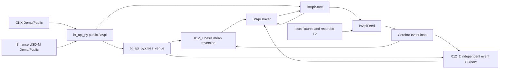
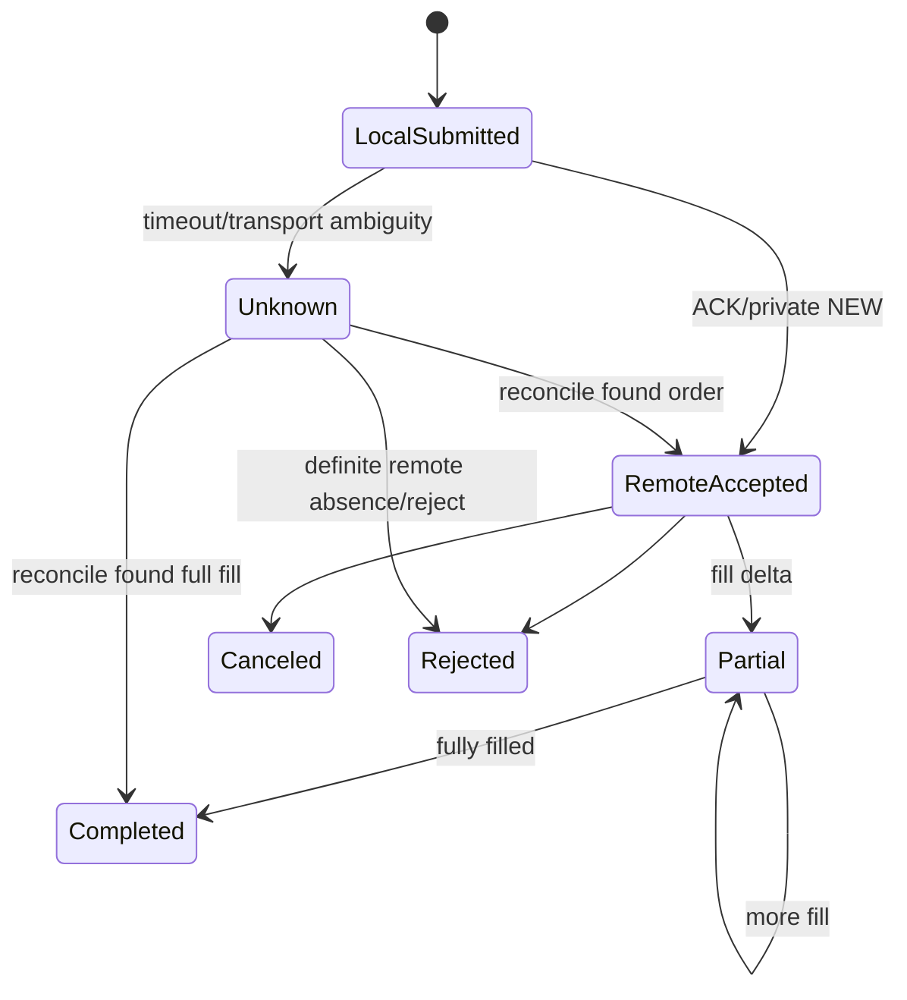
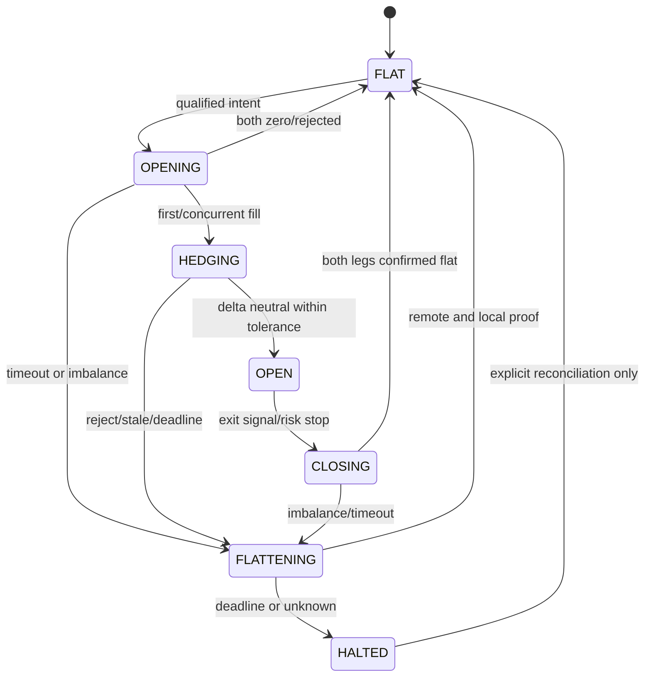

# 迭代21：跨所永续套利原生能力重构与策略重审 — 设计文档

> 版本：v1.2
> 状态：原生能力候选已实施；策略研究否决；生产安全闭环 `INCOMPLETE`
> 日期：2026-09-07；实施快照更新：2026-09-08
> 依据：`SPEC.md`、`需求文档.md`

## 1. 设计结论

1. `examples/cross_exchange_arbitrage_support` 不作为目标架构的一部分，也不整体搬到
   Backtrader core 或 `bt_api_py`。有效能力已按责任层替代，目录已移除，不保留转发包。
2. 两套策略已按独立假设重写：012_1 为基差均值回归，012_2 为独立的事件驱动
   taker-taker 候选。统一的乐观训练成本筛选已否决两者，所以它们只保留为
   replay/shadow 研究对象。
3. 交易所协议、模拟环境、合约单位、认证、私有流和执行恢复归 `bt_api_py`；其中
   `bt_api_py.cross_venue` 只提供无状态的 typed 跨所执行规划原语。Backtrader 只通过现有
   Store/Feed/Broker 映射框架语义。
4. Backtrader 的策略回调保持同步 API，但订单提交只入本地有界队列；网络 I/O 在 Store
   管理的执行 worker 中完成，结果回到 Cerebro 线程更新订单。
5. 跨所双腿不是原子事务。策略拥有配对意图与补偿决策，SDK 拥有单订单幂等/恢复，Broker
   拥有 Backtrader order 生命周期。暂不为了 012 单独新增公共“套利引擎”。
6. 示例代码自包含，但“自包含”不等于重复底层框架。每个目录只保留策略、装配、参数、说明
   和凭据模板；通用假客户端与合成数据放到 tests。
7. 候选清单、离线批准收据和 Backtrader/SDK 运行时溯源属于特定策略的准入政策，放在
   `examples/strategy_candidate_approval.py`；它既不是 Backtrader 通用工具，也不是 venue
   SDK 协议。

## 2. 目标架构



禁止的依赖：

```text
Strategy/Store/Feed/Broker ─X─> OKX/Binance HTTP or vendor schema
012_1                    ─X─> 012_2
012_1/012_2              ─X─> another examples support package
Backtrader               ─X─> _btapi_client.py / _btapi_crypto.py
```

## 3. 能力归属

| 能力 | `bt_api_py` | Store | Feed | Broker | 策略/runner | tests |
|---|---:|---:|---:|---:|---:|---:|
| demo endpoint/header/auth | 主责 | 传配置 | － | － | 只选 `environment=demo` | 路由/混用测试 |
| vendor request/response mapping | 主责 | － | － | － | － | mapper 合同 |
| typed order/cancel/query | 主责 | 调用 | － | 映射 BT order | 生成业务意图 | 故障注入 |
| position-mode read/mutation | 主责；公共 ACK + readback 合约 | 只读快照/路由 | － | 只验证并 fail closed | 只读 preflight；不保存 venue schema | 竞态/unknown/unsupported 合同 |
| canonical client ID/journal/reconcile | 原子预留、持久化、单订单恢复 | 会话/结果桥 | － | 申请 ID、保存 BT order ref | pair correlation scope | 重启恢复 |
| position exact-zero/tombstone | Decimal 归一化主责 | query 防御过滤；event 保留 | 传递事件 | 用 tombstone 清除腿仓 | － | 微量/精确零合同 |
| instrument/fee/funding metadata | 主责 | 缓存/路由 | － | comminfo/数量桥接 | 风险与成本使用 | 真实规则 fixture |
| typed cross-venue quantity/VWAP/cost planning | 主责；无状态纯 Decimal | 调用/事件验证 | － | － | 使用结果，不保存共享 pair state | SDK 合同与双策略一致性 |
| WS reconnect/orderbook rebuild | 主责 | 健康/队列 | 标准事件 | － | fail-closed | gap/reconnect |
| Backtrader data lines/callback | － | 源路由 | 主责 | － | 消费 | feed 测试 |
| Backtrader order lifecycle | － | 命令/结果桥 | － | 主责 | notify_order | broker 测试 |
| dual-side local ledger | 标准字段 | 远程快照 | － | 主责 | long/short 意图 | 分腿测试 |
| alpha/entry/exit/position sizing | － | － | － | － | 主责 | 策略语义测试 |
| pair compensation policy | typed 单订单原语 | 优先队列/结果桥 | － | 生命周期与分腿账本 | 决策并生成 close orders | 场景测试 |
| candidate approval/receipt/provenance | － | － | － | － | examples 准入模块主责 | 签名与 fail-closed 测试 |
| replay fake client/data | － | － | 标准 replay 接口 | paper broker | 参数 | 主责 |

### 3.1 公共能力提升门

一个对象只有同时满足以下条件才进入 Backtrader 或 SDK 公共 API：

1. 不含 OKX/Binance 专属业务字段或 012 专属阈值；
2. 能给出稳定的输入、输出、错误和恢复语义；
3. 至少有两个合理消费者，或它本身属于既有公共职责；
4. 有独立合同测试，不靠 examples 测试来定义公共行为；
5. 不破坏 CTP、MT5 和其他 provider。

因此，本迭代默认不新增公共多腿协调器。若 012_1、012_2 的状态机在实现后仍高度相同，先
提交一份 ADR 和第二消费者证据，再决定是否提升；没有证据时允许小量策略内重复。

### 3.2 跨所计算与候选准入的边界

`bt_api_py.cross_venue` 只接收 SDK 的 `InstrumentSpec`、`FeeSchedule`、
`FundingSnapshot`、标准化盘口和 Decimal 输入，输出共同数量格、可成交 VWAP、成本分解与
资金费时点校验。它没有网络、账户、订单、持仓、策略阈值、pair 状态或补偿动作，因而不是第二
交易客户端或公共多腿协调器。

`examples/strategy_candidate_approval.py` 绑定的是 012 候选清单、离线签名收据、策略源码和
实际运行时文件；它不能泛化为 CTP、MT5 或其它策略的 venue 契约，因此留在 examples 根目录。
Backtrader 核心和 utils 不保存这两类策略准入政策。

## 4. `bt_api_py` 公共合约设计

### 4.1 环境配置

公共 `BtApi` 继续用 exchange key 区分 venue/asset：

```python
BtApi(exchange_kwargs={
    "OKX___SWAP": {"environment": "demo", "api_key": ..., "api_secret": ..., "passphrase": ...},
    "BINANCE___SWAP": {"environment": "demo", "api_key": ..., "api_secret": ...},
})
```

设计规则：

- `environment` 是权威字段；`demo`/`testnet` boolean 只作兼容别名并在构造时规范化。
- OKX 另以 `api_region` 显式区分 `global`、`eea`、`us`、`tr`。SDK 用一个不可分割的
  官方 region profile 同时选择 REST、public/market WS、private WS 和 business WS；
  examples 不自己维护域名表。Global/EEA/US 支持 production 与 demo；目前只有 TR
  production endpoint 得到验证，所以 `tr+demo` 在任何网络 I/O 前 fail closed。
- 模拟环境不得接受 production REST/WS override；冲突在任何网络 I/O 前失败。
- 公开行情允许无凭据；私有流和交易预检必须使用明确的 demo 凭据。
- 环境回显提供 `environment`、`api_region`、`simulated`、脱敏 endpoint identity，供 Store
  预检。OKX 错误码 50119 证明所选 credential/domain 组合被 venue 拒绝；该错误码本身不能
  区分 region、key、secret、passphrase、失效或权限原因。预检必须保留原始错误码和脱敏
  endpoint identity，不将它改写为普通“缺凭据”或未经证明的“区域不匹配”。
- 日志只能输出 host 分类或 hash，不能输出签名、listen key、查询串和 credential 值。

官方语义依据：OKX demo 要求模拟交易标记并使用 demo 私有连接；Binance USD-M demo 有独立
REST/stream endpoint。实现前必须再次以当日官方文档复核，不把仓库旧文档当最终证据。

SDK 当前绑定的 OKX endpoint profile 如下；同一行的 REST 与三类 WS 必须原子使用：

| `api_region` | environment | REST host | public/private/business WS host | 状态 |
|---|---|---|---|---|
| `global` | production | `openapi.okx.com`（兼容 `www.okx.com` override） | `ws.okx.com` | 支持 |
| `global` | demo | `openapi.okx.com`（兼容 `www.okx.com` override） | `wspap.okx.com` | 支持 |
| `eea` | production | `eea.okx.com` | `wseea.okx.com` | 支持 |
| `eea` | demo | `eea.okx.com` | `wseeapap.okx.com` | 支持 |
| `us` | production | `us.okx.com` | `wsus.okx.com` | 支持 |
| `us` | demo | `us.okx.com` | `wsuspap.okx.com` | 支持 |
| `tr` | production | `tr.okx.com` | `ws.okx.com` | 支持 |
| `tr` | demo | 无已验证官方组合 | 无已验证官方组合 | 启动前拒绝 |

表中 host 只是 SDK 契约；每次候选发布仍需以当日官方资料和脱敏只读 preflight 证明账户
region 与 endpoint 一致。首次真实预检使用旧 global 默认 `openapi.okx.com` 返回 50119，只能
证明当次 credential/domain 组合被拒绝；它不能确定是 region、key、secret、passphrase、
失效或权限问题，也不能证明任何其他 region 可用。

### 4.2 标准合约元数据

在 SDK 公共 contracts 中补齐一个不可变、Decimal 化的标准品种对象（最终命名在 SDK ADR
确定，本文暂称 `InstrumentSpec`）：

```text
exchange_name, symbol, asset_type, base_currency, quote_currency,
contract_type, linear, contract_value, contract_multiplier,
price_tick, quantity_step, min_quantity, min_notional,
quantity_unit, status, observed_at, raw_rule_fingerprint
```

配套公共纯函数/方法：

- `quantize_price(price, side, aggressiveness)`；
- `base_to_native_quantity(base_qty)`；
- `native_to_base_quantity(native_qty)`；
- `quantize_quantity(qty, rounding="floor")`；
- `validate_order_quantity(qty, price=None)`。

要求：

- OKX contracts 与 Binance base quantity 的转换必须可逆到一个容差范围，并保留原始规则
  fingerprint；
- 缺失 `ctVal/lotSz/minSz/tickSz` 或对应 Binance filter 时显式失败；
- 不再以 warning 后原样发送数量；
- Store 可以读取该对象，但不重新维护交易所转换表。

### 4.3 费用与资金费

公共读模型分为：

- `FeeSchedule`：account/venue/symbol、maker/taker、币种、来源、freshness；
- `FundingSnapshot`：当前费率、下一结算时间、结算周期、来源、freshness；
- `TradingReadiness`：environment、can_trade、position_mode、instrument status、max size、
  leverage/margin mode、阻断原因。

Fee 不可用时策略使用显式配置的保守上界，但研究结果标为 `COST_ASSUMPTION`；不能把静默
fallback 当实际费率。资金费读路已实现为 SDK typed `FundingSnapshot` → Store 独立单并发
刷新工作线程 → 带 TTL/下次结算边界的本地缓存 → 策略 venue/symbol 绑定校验。刷新
不占用 order/cancel/reconcile 优先队列；缺失、过期、时区/周期非法或 identity 错配均
fail closed。

这个读模型只能用于入场前资金费 reserve 和结算窗口风控。跨越结算时点后的
realized net 必须由 OKX/Binance 认证资金费账单/私有流水聚合得到；当前 SDK 仅显式
报告 `funding_evidence_status=unavailable` 和 `signed_funding_cashflow=None`。策略因此对跨结算周期
经济结论 fail closed，该缺口是生产阻断项。

### 4.4 非阻塞类型化写操作

当前同步 `make_order(exchange_name, OrderRequest, normalized=True)` 已包含类型、环境和执行会话
语义；现有 `async_make_order` 是旧 feed 异步路径，并在 execution session 开启时拒绝。因此
本迭代扩展现有公共异步名称，而不是再造客户端：

```python
await api.async_make_order(exchange_name, order_request, normalized=True)
await api.async_cancel_order(exchange_name, cancel_request, normalized=True)
await api.async_query_order(exchange_name, query_request, normalized=True)
```

设计要求：

1. `normalized=True` 强制类型请求；返回字段和同步 normalized 路径一致。
2. `_ExecutionSession` 增加 async invoke，但复用同一 ID 预留、写前 journal、环境门禁、
   unknown 分类、私有事件合并和恢复状态；绝不能绕过同步路径的安全层。
3. 后端有原生 async 时直接 await；只有同步后端时由受控 worker 执行，不能堵塞调用者事件
   循环。
4. SDK 不实现 Backtrader placement queue 或 `flatten` 操作；它只提供 typed create/cancel/query、
   `reduce_only` 和单订单安全门。队列优先级由 Store/Broker 层负责。
5. REST/WS ACK 只更新到请求已接收/已提交；Filled/Rejected/Canceled 等终态由私有流或
   `query_order` 确认。
6. logging sink 包装成 no-throw；日志故障单独计数，不能把明确拒单改成 execution unknown，
   也不能阻止登录后的订阅初始化。

### 4.5 标准行情与私有事件

`DepthSnapshot`/事件合同至少补齐：

```text
exchange_time, received_wall_time, received_monotonic_ns, clock_domain_id,
sequence, previous_sequence, snapshot_or_delta, continuity_status,
bids, asks, source, stale, stale_reason
```

venue 插件负责增量簿重建、checksum/sequence 语义和断线后 snapshot + delta 恢复；只把验证过
的标准快照送给 Store。Store 不解释 `U/u/pu`、`seqId/prevSeqId` 等 vendor 字段。

两所事件只有在同一采集进程、同一 `clock_domain_id` 下才直接比较 monotonic time。跨进程/
跨机器采集必须提供 PTP/NTP/探针校准方法、误差上界和 epoch identity；原始 monotonic 数值绝不
直接跨 clock domain 比较。HFT 决策路径还必须有 lossless recorder 和 ingress→decision 守恒；
仅知道 coalesced/drop 数量不足以证明因果序列合格。

私有事件必须用 `(exchange, account_id, client_order_id/order_id, cumulative_fill)` 幂等合并。
同一状态重复到达不会重复记仓；跨 event type 的时序冲突由 execution session 的 revision 和
远程查询收敛。

### 4.6 公共 position-mode mutation

FR-SDK-013 的唯一账户变更入口是公共 `BtApi.set_position_mode`：

```python
result = api.set_position_mode(
    "BINANCE___SWAP",
    "dual_side",
    normalized=True,
)
```

它只接受规范值 `net`/`dual_side`，并按以下顺序执行：

1. 在 provider 写入前验证 exchange 是 `OKX___SWAP` 或 `BINANCE___SWAP`、环境可用、
   `normalized=True`、transport 非 ZMQ，并通过 execution-session write gate。CTP、MT5、
   现货或未实现转发协议的 ZMQ 均显式 `CapabilityNotSupported`，请求计数为零。
2. 持有账户级 mode lock，拒绝与已登记的 crypto placement 并发变更；变更进行中
   新 placement 必须等待锁并只能在已验证的新模式下开始。
3. 调用 provider mapper，但不将单独 acknowledgement 当作成功。ACK 后立即标记
   `verification_required`，再经公共只读 position-mode 查询回读账户。
4. 只有 readback 与请求值一致时才返回 `PositionModeUpdate(acknowledged=True,
   verified=True, cache_updated=True)` 并发布新 cache。definite provider reject 保留已验证
   旧 cache；变更超时、ACK 后 readback 失败或不一致均是 unknown，必须清除 cache 并
   建立 `position_mode_reconcile_required` latch。
5. unknown latch 覆盖所有公共 crypto placement：normalized sync、normalized async、raw typed、
   legacy sync 和 legacy async。任一入口都不得越过 latch；只有 fresh normalized
   `get_position_mode`/`get_account_config` 验证后才解除。

`BtApiStore`、`BtApiBroker` 和策略 runner 不调用该 mutation。它们只通过只读 preflight
验证 `dual_side`，发现不一致就以零订单写入失败。需调整账户时，由独立的显式管理步骤
调用上述 SDK 公共方法，不在 examples 中复制 OKX/Binance mapper、REST path 或布尔字段。

### 4.7 持仓的 Decimal exact-zero 语义

FR-SDK-014 把“查询列表省略已平仓行”与“事件流传递平仓通知”分开：

1. normalizer 在任何 `float` 兼容转换前用 `Decimal(str(raw_quantity))` 解析数量，
   并输出 `quantity_known=True` 与 `quantity_exact_zero=(exact_amount == 0)`。若非零值如
   `1E-400` 在二进制浮点中下溢，兼容 `quantity` 也必须保留该 `Decimal`，不能变成零。
2. normalized position query 只删除同时满足 `quantity_known is True` 且
   `quantity_exact_zero is True` 的行。未知数量、缺失 exact-zero 证据或非零微量持仓
   均保留并 fail closed。
3. position event 不使用 query 过滤；exact-zero 事件作为 close tombstone 传入
   Store/Broker，用来将对应 `(venue, symbol, LONG|SHORT)` 腿仓清零。
4. Store 的查询防御层重复同一证据规则，防止旧 provider/安装态返回不完整旗标时
   把风险仓位静默丢弃。

## 5. Backtrader 集成设计

### 5.1 `BtApiStore`

Store 继续直接保存一个 `BtApi` 对象，职责如下：

- 根据 `symbol_routes` 把 Backtrader dataname 映射到 `OKX___SWAP` 或
  `BINANCE___SWAP`；
- 管理 SDK 连接、订阅和一个有界行情队列；
- 管理一个有界、带优先级的订单命令队列与执行 worker；
- 把 SDK 标准事件转为 Backtrader `OrderBookSnapshot`、Tick 和 broker update；
- 暴露 ingress、coalesced、dropped、gap、queue depth、reconnect、age/lag/latency 指标；
- 缓存 `InstrumentSpec`、账户、fee、funding 和 readiness，但保留 freshness；资金费刷新使用
  独立单并发工作通道、请求合并和 generation fence；
- 停止时先拒绝新的 opening placement，再按 reconcile/query、cancel、已确认可安全且已持久化的
  close/reduce-only order、其他 placement 的顺序排空并关闭 SDK。

不负责：alpha、pair 状态、OKX/Binance JSON、凭据文件解析、交易所数量公式、账户
position-mode mutation 或 venue mutation schema。Store 只读取 SDK 已验证快照并在非
`dual_side` 时 fail closed。

建议新增/收敛的 Store 公共能力（名称以实现 ADR 为准）：

```text
enqueue_order(order) -> local command receipt
enqueue_cancel(order) -> local command receipt
poll_broker_update() -> normalized broker event
get_instrument_spec(dataname)
get_trading_readiness(dataname, expected_position_mode="dual_side")
get_stream_health(dataname)
get_cached_funding_snapshot(dataname, max_age_seconds=..., request_refresh=True)
```

Store 在事件进入时更新 `last_received_monotonic_ns` 和 stale/gap 状态；候选实现又通过
`notify_idle` 让无 bar 的 TickBroker/MixBroker 安全轮询，因此两家行情完全不再到达时
不需等待下一个事件就能推进 monotonic silence deadline。实施候选已覆盖该路径，
相关源码/安装态回归均为 727 passed，G2 engineering 为 `PASS`；实时网络中断的现场收据仍属
G4。

### 5.2 `BtApiFeed`

Feed 保持 `orderbook_as_ticks=True` 与 `TimeFrame.Ticks` 的公共用法。它：

- 从 Store 消费标准快照并推进 Backtrader 时钟；
- 通过 `notify_orderbook` 交付深度对象；
- 保留 exchange timestamp 与 local monotonic receive time；
- 当 gap/stale/disconnect 时发送数据状态，策略停止开仓；
- 不在 `_load`/通知回调中发 HTTP 请求或做 vendor orderbook 重建。

若 Backtrader 的 line 系统无法无损承载多档深度，深度继续走原生通知对象，tick line 只承载
用于时钟推进的最小字段，二者引用同一事件 ID。

### 5.3 `BtApiBroker`

Broker 的同步 `buy/sell/cancel` 对策略保持兼容，但内部只创建本地订单并入队：

1. 生成 pair correlation/idempotency scope，并向 SDK 原子申请、预留和持久化 canonical client
   order ID；Broker 自身不生成交易所 ID；
2. 校验 `dual_side`、position side、open/close 和本地风险门禁；
3. 状态转为 Submitted；
4. Store worker 执行 SDK async typed request；
5. Cerebro 线程在 `next()` 排空结果并发出 Accepted/Partial/Completed/Rejected/Canceled；
6. unknown 保持非终态并冻结 placement，直到 reconciliation 收敛。

Broker 维护 `(venue, symbol, LONG|SHORT)` 分腿账本；远程 position push 用于漂移审计，不直接
重复叠加本地已确认成交。每次开仓前及定期检查本地腿仓、远程腿仓、活动订单和 unknown，
不一致时 fail closed。

Broker 只消费 Store 传递的已验证 position mode；它不能在 `buy`/`sell`、startup 或
reconciliation 中自动变更账户。快照非 `dual_side`、过期或结果未知时，Broker 保持零订单
写入失败，并把账户配置动作交给 SDK 公共 FR-SDK-013 管理步骤。

### 5.4 订单 worker 与背压



- placement queue 有硬上限；满时新开仓立即本地拒绝并计数。
- cancel/reconcile 走最高优先级队列或保留容量；策略/Broker 把 flatten 决策转换为普通的
  typed close/reduce-only order，再由 Store 在已确认安全时按风险降低优先级处理，不能被
  opening placement 淹没。
- 网络任务永不直接修改 Backtrader order；它只产生不可变结果，Cerebro 线程应用状态。
- 每个命令记录 signal、enqueue、send、ack、first fill、terminal 时间戳。

## 6. 双腿策略公共安全模型

多腿业务状态暂留在两个策略，各自显式实现以下状态：



共同不变量：

- 启动必须证明两所目标合约无持仓、无挂单、无 unknown；
- 任何时刻只有一个 pair intent 可变更该交易对；
- 下单数量从同一 base delta 通过两家 `InstrumentSpec` 转换；
- 第二腿/补偿腿按已确认 fill delta，而不是原始委托量；
- unknown、gap、stale、权限变化或 margin 不足立即冻结 placement；
- 停止完成条件是远程挂单为 0、unknown 为 0、本地与远程腿仓在容差内归零。

执行策略不预先固定“总是 buy 先下”：

- `fill_then_hedge`：demo 和正确性基线。先在拒单率低、深度更好、可快速对冲的一侧 IOC，
  根据真实 fill 发第二腿；
- `concurrent_ioc`：只有双边 typed async、延迟、partial/unknown/补偿门禁通过后才能启用；
- maker-taker：本迭代只做研究候选，不进入默认 demo 执行。

## 7. 012_1 策略设计：可执行基差均值回归

### 7.1 假设

同一线性永续合约在两家交易所的可执行基差短期偏离后可能回归。该假设只有在基差稳定性、
机会寿命和完整往返成本上成立时才准入。

### 7.2 数据与特征

对目标 base 数量 `q`，从多档 L2 计算：

```text
buy_vwap(v, q)  = 吃完 q 所需的 asks VWAP
sell_vwap(v, q) = 吃完 q 所需的 bids VWAP
basis_A_buy_B_sell = sell_vwap(B,q) - buy_vwap(A,q)
basis_B_buy_A_sell = sell_vwap(A,q) - buy_vwap(B,q)
```

每个方向建立独立的可执行 basis 历史，用 rolling median/MAD 或经验证的 EWMA 得到稳健偏离。
事件对齐只使用同一 `clock_domain_id` 的 local monotonic time；跨 domain 时必须先应用有误差
上界的校准。任一盘口 gap、未证明安全的 coalescing/drop、age 超限或两所 skew 超限则样本
无效。

### 7.3 入场门槛

同时满足：

1. 训练阶段证明基差有可接受的均值回归半衰期，当前偏离超过冻结阈值；
2. 信号持续时间达到配置门槛，排除单帧脉冲；
3. 两所深度均能覆盖 q，量化后 delta mismatch 在容差内；
4. `expected_round_trip_net > safety_buffer`；
5. 两边独立余额、margin、最大 size、交易权限和 dual-side readiness 通过；
6. 没有活动 pair、unknown、数据 gap 或 wind-down。

成本分解：

```text
expected_round_trip_net
 = entry_executable_edge
 - entry_fees
 - expected_exit_execution_cost
 - predicted_exit_fees
 - latency_adverse_selection_reserve
 - signed_funding_cashflow_reserve
 - model_error_buffer
```

`entry_executable_edge` 已由目标数量的两边 L2 VWAP 计算，已经包含 entry bid/ask spread 与
entry depth impact；`entry_depth_impact` 只作为相对 BBO/mid 的审计分解，不能再次从 total
扣除。`expected_exit_execution_cost` 统一包含预计平仓 spread 与 exit depth impact。两个策略、
回放和报告重算必须调用同一 Decimal oracle。

### 7.4 出场与风险

- 反向可执行 basis 已收敛，且费用后可实现利润达到按 notional 缩放的目标；
- divergence stop、最大持仓期、最大回撤、margin buffer、数据失效；
- 即将跨资金费结算时按 long/short 方向评估真实 cashflow；
- 进程停止或任一 venue 降级时强制 wind-down。

固定 `$0.01` 止盈或 `$20` 止损被淘汰，改为 notional、波动和成本误差的比例/上界。

## 8. 012_2 策略设计：候选准入与 HFT 命名门

### 8.1 候选比较

编码前用同一批真实记录 L2 比较：

| 候选 | 优点 | 主要风险 | 本迭代倾向 |
|---|---|---|---|
| taker-taker 可执行价差 | 状态和成本最可解释 | 四笔成本高、机会短、跨所非原子 | 默认安全候选 |
| cross-venue lead-lag | 机会可能更多 | 带方向预测、易把 stale quote 当 alpha | 仅在预注册 OOS 门槛通过时可替代基线 |
| maker-taker | 可能降低费用/获 rebate | 队列位置、撤单竞争、库存和 hedge 风险 | 研究项，默认不交付 |

选择条件包括样本外净期望、机会寿命相对 p99 执行延迟、fill/hedge 比率、10/50/100/500ms
markout、最大裸腿时长和最大回撤。taker-taker 是默认比较基线；lead-lag 的特征、标签、阈值、
最大方向敞口和 OOS 判据必须在查看 holdout 前登记。若数据可用但所有候选被结果否决，记
`RESEARCH_REJECTED`，对应策略和总体目标 `FAIL`；只有合格外部数据不可得才记 `BLOCKED`。

### 8.2 已实现的事件策略候选

012_2 已以 taker-taker 基线独立实现下列机制；这些机制证明候选可被测试，不改变其
`RESEARCH_REJECTED_AT_CALIBRATION_SCREEN` 状态：

- 每个 validated book event 计算目标深度的双向 executable edge；
- 只使用最新连续状态，要求 opportunity lifetime 大于预测的 p99 双腿完成时间；
- 统一成本 oracle 在 L2 VWAP entry edge 的基础上扣 entry fee、预计 exit execution cost/fee、
  latency reserve 和短周期 adverse markout 后仍为正才提交；entry impact 只分解展示，不双扣；
- 按 venue RTT、reject rate、depth 和 hedgeability 动态选择先手腿；
- 使用更短且分别定义的 entry、hedge、cancel deadline；
- 记录每个决策被 fee/depth/stale/gap/latency/risk 拒绝的原因。

它与 012_1 不共享 z-score、均值回归窗口或持仓逻辑。

### 8.3 HFT 名称门

保留 `examples/012_2_highfreq_cross_exchange` 名称原需同时满足：

1. tick/orderbook 事件驱动，无 bar 轮询决策；
2. 策略回调无网络 I/O，本地命令入队 p99 ≤ 5ms；
3. typed async execution session、私有流和 gap recovery 通过；
4. 真实记录回放与在线决策输入处于同一 clock domain 或有误差上界，并且没有改变策略可见
   因果序列的 coalescing/drop；只有计数而无法证明因果不变时该门失败；
5. 报告 signal-to-enqueue、ack、fill、hedge p50/p95/p99；
6. 机会寿命和样本外净 edge 覆盖测得的 p99 路径。

当前没有端到端网络、交易所排队位置和真实成交延迟证据，经济筛选也已失败，因此该门
结论为 `FAIL/NOT_ADMITTED`，最终目录为 `012_2_event_driven_cross_exchange`。真正微秒级/
共址 HFT 不在 Python Backtrader 示例的承诺范围内。

### 8.4 每策略 demo 准入

012_1、012_2 分别生成 `STRATEGY_APPROVED_FOR_DEMO` 收据，必须在任何自动策略 pair demo
之前满足：

1. 数据资格、无前视、成本 oracle 和该策略语义测试 PASS；
2. 冻结的 holdout 中费用后期望与风险门通过，或达到预先登记的保守准入标准；
3. public shadow 的数据连续性、机会寿命和延迟输入完整；
4. SDK 单 venue 最小 smoke 已提供真实 ACK/fill/fee/延迟校准，但没有自动运行策略；
5. 配置中的最大数量、最大裸腿时长、最大亏损和 kill switch 已冻结。

若合格数据不可得，准入为 `BLOCKED`；若数据可用但经济假设不达标，为
`RESEARCH_REJECTED`，策略仍可作为 replay/shadow 研究示例，但禁止自动 demo pair，且原始
“两套可运行模拟套利策略”总体目标为 `FAIL`。平台子门禁可以单独 PASS，不能覆盖该结果。

## 9. 示例目录设计

最终目录：

```text
examples/012_1_midfreq_cross_exchange/
  README.md
  .env.example
  .gitignore
  config.yaml
  strategy.py
  run.py

examples/012_2_event_driven_cross_exchange/
  README.md
  .env.example
  .gitignore
  config.yaml
  strategy.py
  run.py
```

规则：

- `strategy.py` 清楚呈现该策略自己的 signal、risk 和 pair state；
- `run.py` 只解析模式/参数，构造 `BtApiStore.getdata()`、`getbroker()`、Cerebro 和报告输出；
- 两个目录不互相导入，不修改 `sys.path` 去加载 support；
- replay 通过正式 feed/paper broker 读取用户显式指定的标准数据；自动化测试可从
  `tests/datas` 注入 fixture，示例运行时不依赖 tests 目录，也不实例化 `ReplayClient` 这类
  第二 Store client；
- 每个目录使用自己的本地 ignored `.env`，迁移时按字节复制现有凭据而不打印内容；源码只
  提交 `.env.example`；
- SDK journal 使用 execution-account-scoped 的稳定 ignored runtime path，不再放进 support 目录；
  物理 ledger 按 `(provider, environment, account_id)` 唯一，`strategy_id` 只是记录分区，同一账户键只有
  一个有效 writer lease；迁移前必须能重载旧未决状态；
- 在 G2 冻结并在后续 Gate 追加签名收据的 `strategy-candidate-manifest.json` 是候选证据制品，
  记录每个 `strategy_id` 的 resolved example path、候选类型、HFT label、研究状态和
  `STRATEGY_APPROVED_FOR_DEMO` 收据 hash。它不含凭据，路径由验收命令显式传入并保存 SHA256；
  改名后的脚本和验收从 manifest 解析路径，不硬编码 012_2 名称。

## 10. support 逐文件处置

| 文件/目录 | 处置 | 迁移目标 |
|---|---|---|
| `.env.example` | `REWRITE` | 两个示例各自的无值模板 |
| ignored `.env` | `PRESERVE_BYTES` | 分别复制为两个示例的 ignored `.env`；禁止读取/输出 |
| `.gitignore` | `REWRITE` | 两个示例分别忽略 `.env`、runtime artifacts |
| `__init__.py` | `DROP` | 不保留 support package |
| `common.py` | `SPLIT` | 元数据/量化进 SDK；策略参数/派生特征进对应 strategy |
| `configuration.py` | `SPLIT` | SDK 环境 profile + 各 run.py CLI |
| `entrypoint.py` | `DROP` | 两个显式 run.py；删除未使用键集合 |
| `replay.py` | `MOVE_TO_TESTS` | 标准 replay feed、tests fixtures/datas |
| `run_network.py` | `SPLIT` | readiness 进 SDK/Store；模式装配/报告留各 run.py |
| `strategies.py` | `REWRITE` | 两个独立 strategy.py；只保留已证明安全不变量 |
| `reports/`、journal/lock | `PRESERVE_THEN_RELOCATE` | ignored runtime path；不得随目录直接删除 |

实施已将两个入口和测试切换到原生 SDK/Store/Feed/Broker 路径，保全 22/22 个用户
资产备份并字节级校验两份 ignored `.env`，随后删除 support 目录且不保留转发兼容包。
源码态零引用是独立的 source-removal `PASS`；v7 还通过五个同 epoch wheel、隔离安装、
禁止路径/import、Anaconda base wheel 强制重装和 repo 外 replay 证明了安装态 parity，故
G3 artifact-consumer 为 `PASS`。具体 hash 与范围见
`evidence/2026-09-08-v7-build-install-receipt.md`；它不证明 G4/G5 或策略收益。

## 11. 运行模式

| 模式 | 行情 | Broker | 私有凭据 | 写操作 | PnL 含义 |
|---|---|---|---|---|---|
| `replay` | 记录 L2 | paper broker | 否 | 否 | 模型假设下回放结果 |
| `paper-live`/`shadow` | 公开实时 | shadow 或显式 paper | 否 | 当前两候选禁止 paper fill | shadow 不生成 fills；新候选通过研究门前 paper 仅允许零写观察 |
| `demo` | demo/允许的公开行情 | `BtApiBroker` | demo | 当前两候选禁止 | 只读 preflight 可运行；无策略准入收据时订单写入为零 |

`paper-live` 必须在命令行和报告中区分 shadow 与 simulated fill，不能把“行情健康 PASS”写成
“策略盈利 PASS”。对当前两个被否决候选，simulated fill 和 demo order 分支必须在构建 Store/
Broker 之前拒绝，只读 preflight 不签发准入。

每个 runner 在启动前从候选 manifest 和配置推导 `required_observation_duration`，至少覆盖本次
声明要验证的最小统计窗口、最大持仓期、关停缓冲和 funding 场景。请求时长不足时必须拒绝
启动，或把未覆盖的验收项明确标为 `NOT_RUN`；不能用短运行推断长持仓或资金费行为。

## 12. 可观测性与报告

每个 run 生成唯一 `run_id`，报告至少包含：

- 代码 SHA、安装包 SHA/路径、配置 hash、数据 hash、开始/结束时间、模式；
- endpoint environment identity、账户 ID hash、symbol/instrument rule fingerprint；
- 行情 ingress/coalesced/dropped/gap/reconnect、age/lag/skew 分布；
- opportunity → qualified → submit → first fill → hedged → closed 漏斗；
- gross/net PnL、maker/taker fee、slippage/impact、funding、补偿腿损失；
- signal/enqueue/send/ack/first fill/terminal/hedge 的 p50/p95/p99；
- local/remote long/short、open orders、unknown 和 final reconciliation；
- 所有阻断/拒绝原因计数。

报告先脱敏再落盘；logging sink 错误写独立健康计数，不影响业务控制流。

## 13. 迁移与回滚

### 13.1 journal 单一真源与原子 cutover

旧共享 journal 不能直接复制成两个策略 journal。迁移协议如下：

1. 按 `(provider, environment, account_id)` 创建唯一目标 ledger；每条记录保存 `strategy_id`，但物理文件、
   writer lease 和恢复 owner 仍唯一。
2. 停止旧 runner，取得旧 journal 的独占 migration lease，并写入包含 `cutover_id`/旧 hash 的
   fence marker；旧版本 runner 看到 fence 后必须拒绝成为 writer。
3. 对旧 journal 做不可变 snapshot。生成 claim manifest：每个 intent/client order ID 只能映射
   到一个目标 account ledger 和一个 strategy partition；重复 claim 使迁移失败。
4. 无法确定账户/策略/终态的记录进入 quarantine。只要 quarantine 含 open/unknown，目标账户
   所有 placement 都被阻断，直到远程 query/private stream 人工收敛。
5. 导入写到临时 ledger，校验记录数、链式 hash、唯一 ID 和终态后以原子 rename/transaction
   发布；目标 SDK 新建 lock/lease，严禁复制或复用旧 lock 文件。
6. 发布后旧路径改为只读封存并保留 cutover marker；新 writer 获取更高 fencing epoch 后才可
   服务。任何时刻新旧 runner 只能有一个能写。
7. 完成全账户远程 open orders/positions/unknown 对账并写 cutover receipt 后，才允许策略
   placement 和 support removal。

回滚也遵循单 writer：先停止并 fence 新 writer。若 cutover 后已有任何新写，不能恢复旧快照
继续交易，只能从新 ledger 前向恢复；只有证明 cutover 后零写入时才可撤销发布。新旧 runner
并行是硬失败。

### 13.2 安全迁移顺序

1. 只记录 support 中 ignored 用户文件的路径、权限、size 和 hash；不做语义解析、不展示内容。
   暂停任何使用旧 journal 的进程，并做字节级备份。
2. 在 SDK 完成环境、元数据、量化、typed async、journal/reconcile 和事件连续性合同。
3. Store/Feed/Broker 切到这些公共能力，保留现有公开构造参数兼容。
4. 先完成 012_1 策略语义，再完成 012_2 候选准入和独立实现。
5. 将 fake/replay/合成场景迁到 tests，改完所有直接 imports。
6. 将 ignored `.env` 分别安全复制到两个示例目录；按 13.1 把 journal 原子迁到 SDK 稳定
   runtime path，验证唯一 owner、reload 与远程对账；测试不输出文件内容，lock 不复制。
7. 全仓零引用、源码/安装态和两示例门禁通过后，在同一变更中删除 support 源码与旧入口。
8. 更新 AGENTS、示例索引和 README。

### 13.3 回滚单位

- SDK、Backtrader integration、012_1、012_2、test migration、support removal 分别提交，
  每个提交可独立回滚；
- support removal 只在前序提交全部通过后发生；
- 回滚代码不得回滚或覆盖用户 `.env`、journal 和报告备份；
- runner/journal 回滚必须遵守 13.1 的 fencing epoch 和单一真源规则，不能让两个进程共享同一
  账户下单。

## 14. 官方协议参考

- [OKX API v5：Demo Trading Services](https://www.okx.com/docs-v5/en/#overview-demo-trading-services)
- [OKX API v5：WebSocket Login](https://app.okx.com/docs-v5/en/#overview-websocket-login)
- [OKX API v5 总文档](https://www.okx.com/docs-v5)
- [Binance USDⓈ-M Futures：General Info](https://developers.binance.com/en/docs/products/derivatives-trading-usds-futures/general-info)
- [Binance USDⓈ-M Futures：Local Order Book](https://developers.binance.com/docs/derivatives/usds-margined-futures/websocket-market-streams/How-to-manage-a-local-order-book-correctly)
- [Binance USDⓈ-M Futures：WebSocket New Order](https://developers.binance.com/docs/derivatives/usds-margined-futures/trade/websocket-api/New-Order)
- [Binance USDⓈ-M Futures：User Data Streams](https://developers.binance.com/en/docs/catalog/core-trading-derivatives-trading-usd-s-m-futures/api/ws-api/user-data-streams)
- [Binance USDⓈ-M Futures：Position Mode](https://developers.binance.com/docs/derivatives/usds-margined-futures/account/rest-api/Get-Current-Position-Mode)

官方文档会变化，实施和验收必须保存当日访问时间与具体页，不用本设计中的旧 endpoint 文本
替代实时复核。

## 15. 实施偏差、证据边界与后续设计

### 15.1 冻结候选的经济否决

结构化结果保存在 `evidence/strategy-economic-screen-v3.json`。输入是旧公开双 venue L2
训练校准记录，方法是因果 latest-opposite 配对、目标数量的开平仓可执行 VWAP，以及
四笔每笔 6 bps taker 费用。该证据是 `PRE_R1_CALIBRATION_TRAINING_SCREEN`，不是 OOS/R1。

17,533 条记录产生 12,469 个因果配对状态和 149,387 个有效往返。费后正样本为
0，最佳净结果仍为 -1.14246520 USDT；且还没有扣资金费、网络延迟、失败腿损失和
模型误差。因此 012_1 和 012_2 均为 `RESEARCH_REJECTED_AT_CALIBRATION_SCREEN`，OOS/holdout
保持 `NOT_CONSUMED`。这一结论否决当前冻结候选，不等于否决所有未来跨所设计。

### 15.2 历史预注册与工程配置变更

`evidence/research-preregistration.md` 和 `research-preregistration-v2.md` 中的候选、runner、策略与
config hash 是历史冻结收据，不覆写。实施后 config 增加了动态 funding refresh/TTL、安全
窗口和 fail-closed 路由；这些是工程与风控变更，没有改变 alpha 假设、训练数据、方向
模型或成本筛选结论。当前 `qualification-v3.json` 将模型资格与新工程配置重新绑定，
但显式保持 `oos_or_demo_approval=false` 和 `research_status=RESEARCH_REJECTED`。

### 15.3 生产阻断的闭环设计

1. **数据静默 watchdog**：候选已用 `notify_idle` 周期检查每个路由的
   `last_received_monotonic_ns`，并为无 bar 的 TickBroker/MixBroker 启用安全轮询。
   源码故障路径和相关源码/安装态 727 项回归已通过。无新事件、
   时钟回拨、stop/restart 和双 venue 同时静默在公开网络上的现场表现仍需 G4 收据。
2. **认证资金费流水**：SDK 需对 OKX bills 与 Binance income 提供同一 typed 读合同，返回
   venue/symbol/account identity、结算时间、币种、signed cashflow、原始引用和 freshness。执行会话只有
   在所有可能跨越的结算时点均已覆盖、没有 unresolved order 且单位可重算时，才返回
   `funding_evidence_status=actual_ledger`。

当前 Binance `get_income` 和 OKX trading-account `get_bills` 只是各 venue 的单页 raw
parser。它们没有统一 BtApi forwarding/contract，也没有分页覆盖证明、event 去重/高水位、
currency 汇总、账户/策略归因、结算延迟与空结果完整性证明。因此不能用单页 parser
冒充完整 ledger；当前状态是 `PRODUCTION_BLOCKED_ACTUAL_FUNDING_CASHFLOW_LEDGER`，
应由独立生产迭代实现，不在策略或 Backtrader 中硬编码 venue 分支。

统一认证资金费流水仍未完成，且 G4 网络证据未闭合；安装态通过或模拟账户权限
都不能因此形成实盘准入。

### 15.4 候选冻结与安装收据

schema 3 `examples/strategy-candidate-manifest.json` 已冻结，状态为
`RESEARCH_REJECTED_DEMO_PROHIBITED`。它把两个候选的
runner、strategy、config、qualification/economic-screen hash 与 `RESEARCH_REJECTED`、
OOS 未消费及仅允许 `replay`/`shadow` 的模式绑定。任何 runner/strategy/config 改动后必须
重新计算总 SHA，所以本文不携带可漂移的具体值。

G3 必须在同一新鲜 epoch 内从五个对应源码构建 wheel：`bt_api_base`、`bt_api_binance`、
`bt_api_okx`、`bt_api_py` 和 Backtrader。随后在 repo 外隔离目标安装全部五个制品，验证
import 来源、版本、公共 `set_position_mode`、exact-zero 语义、禁止模块/支持目录不存在，
再对 Anaconda base 执行 wheel 强制重装与安装态回归。旧的或生成目录残留的 wheel 不能关闭
当前 G3。

| v7 封版字段 | 当前状态 |
|---|---|
| candidate manifest SHA-256 | `ace39424097ad7667034b0cac7feaeeebc7dbe25ba1b37ec3c30be6ccaf96f94` |
| Backtrader / `bt_api_py` source SHA | `ab1ae150f73199fbd64449eb7c43fd1f45a29c5d` / `2be8dbc25b0f49f4734ad337fcd7abe53840c3b9` |
| 五个 wheel 文件名与 SHA-256 | `evidence/2026-09-08-v7-build-install-receipt.md` |
| repo 外隔离安装路径、import 来源与版本 | `PASS`，详见 v7 receipt |
| 安装态公共接口、exact-zero、禁止模块/目录验证 | `PASS`，详见 v7 receipt |
| Anaconda base wheel 强制重装与回归收据 | `PASS`，installed 相关集 `727 passed` |
