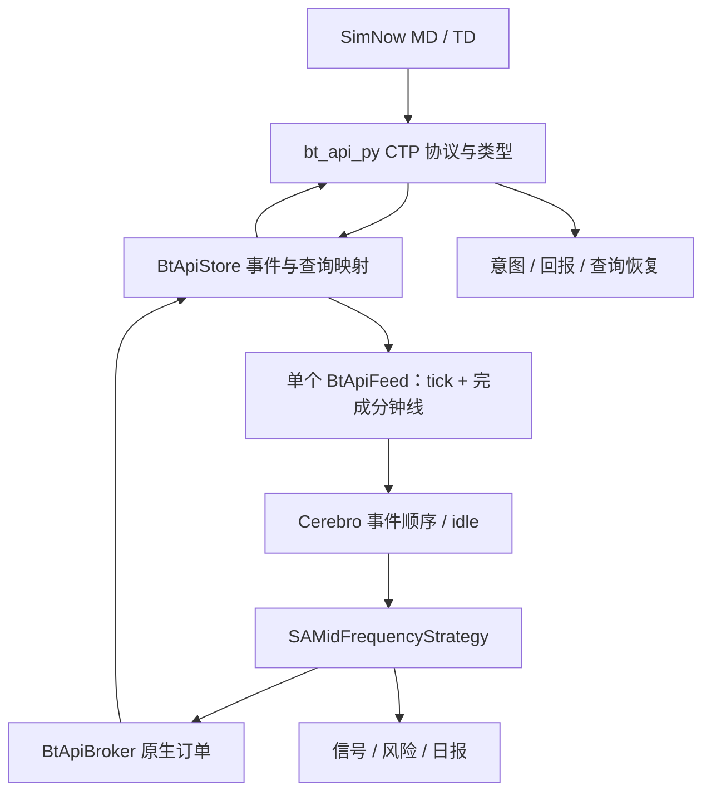

# 迭代22：CTP 纯碱中频模拟交易——设计文档

版本：1.3；日期：2026-09-08；更新日期：2026-09-10；状态：本地实现、冻结源码、制品和安装消费者验收已完成；第一套受控 API/结算/行情/撤单机械验证及第二套 7×24 只读 API 诊断已完成；真实策略 G3 观察、G4 闭环和研究门仍未完成。需求依据：[需求文档](需求文档.md)；实现与验证证据：[实施与验收记录](实施与验收记录.md)；原始差距证据：[基线与资料](基线与资料.md)。

## D01 架构、目录与能力归属



已实施目录：

```text
examples/013_3_sa_midfreq_simnow/
  README.md                            # 安装、启动、停止、故障交接
  run.py                               # CLI + Cerebro 装配，不计算 alpha
  strategy.py                          # 原生策略、执行状态和回调协调
  features.py                          # 一档快照时间窗，纯计算
  signal_model.py                       # 分钟与盘口融合，可独立回放
  risk.py                              # SA 风险预算/时段/退出策略
  reporting.py                         # 运行证据与交易日报
  config.yaml                          # 无凭据、默认 shadow
  .env.example                         # 仅变量名和占位符
  .gitignore                           # .env、运行证据、缓存
  fixtures/sa_v0_replay.json           # 不产生假设成交/PnL的确定性夹具
tests/unit/test_ctp_sa_midfreq_example.py  # 公式、生命周期、模式和证据用例
scripts/run_iteration22_ctp_benchmarks.py  # 10万快照延迟与4小时资源压力工具
```

不创建示例公共交易框架，也不导入 013_1/013_2 的 runner。它们只提供装配风格参考。CTP 查询完成性、身份关联、平仓字段、手续费查询、时间/累计量等跨策略协议能力已经放在 `bt_api_py` 与 `bt_api_ctp`；event schema、单 Feed 聚合、原生 Broker 对账、idle 时钟放在现有 Backtrader 模块；SA 权重、门槛、主力使用政策、风险金额和报表留在示例。

013_3 网络模式实际使用 `BtApiStore(provider="btapi")` 管理唯一顶层 `BtApi`，由顶层公共 CTP surface 访问 session、查询、metadata、结算和 durable execution 能力；示例不直接持有 native Trader，也不创建第二个查询/交易客户端。CTP native 仅使用 `bt_api_ctp` 随包提供的 audited bundle，不接入独立 OpenCTP 进程、库或客户端。原有 `provider=ctp` 兼容入口继续保留，但不能把它与本候选实际使用路径混为一谈。跨仓验证必须同时覆盖顶层 `bt_api_py`、CTP 子模块和 Backtrader 消费端。

## D02 数据契约与 SDK 必修项

以下契约已经在 SDK 公共 surface 和 Backtrader 消费端实现；字段的最终名称以代码与 `ctp.quote.v2` schema 为准，语义和验收字段不得省略。SDK是累计量转增量的唯一权威层：保留原始cum_volume，生成delta_volume及volume_semantics；Store 显式识别 schema，Feed只累加delta_volume。兼容旧事件时通过显式 schema 版本转换，禁止根据字段名volume猜单位。

| 对象 | 必需字段与约束 |
|---|---|
| `QuoteSnapshot` | provider、environment、exchange、instrument、TradingDay、ActionDay、event_time_utc、recv_time_utc、recv_monotonic_ns、connection_generation、ingest_seq、bid/ask价量、last、cum_volume、delta_volume、open_interest、上下限、quality/reason |
| `InstrumentSnapshot` | 原始 InstrumentID、ProductID、ExchangeID、到期/最后交易日、IsTrading、PriceTick、VolumeMultiple、最小手数、数据时间和来源；主连映射不得覆盖原始交易码 |
| `MinuteBar` | start/end UTC、exchange_calendar/session_id、TradingDay、OHLCV/OI、closed_at/available_at、first/last ingest_seq、complete、volume_complete、gap_flags、hash |
| `QueryResult[T]` | request_id、connection_generation、account_fingerprint、started/completed时间、is_last_seen、error_code、timed_out、complete、records；complete=false 时空列表不等于零记录 |
| `OrderIdentity` | intent_id、bt_order_ref、FrontID/SessionID/OrderRef、ExchangeID/OrderSysID、instrument、direction/offset、run_id；OrderSysID 返回前不得伪造 |
| `FeeSnapshot` | 合约/账户适用范围、开/平/平今按额与按手费率、币种、来源、effective/expiry时间、verified/estimate 标志 |
| `ExecutionArmProof` | account_fingerprint、TradingDay、instrument、connection_generation、profile、admission receipt hash、native/package identity、Stage A 查询 IDs/hash、issued/expires 时间；只对同一活动连接有效 |

完整查询要求：每请求独立 accumulator 和完成信号；只接收匹配 request ID/generation 的回调；必须收到终包并检查错误；超时后标无效，晚到回调只记审计；查询空终包可合法表示空，但必须同时有成功终包证据。订单、成交、持仓、账户查询统一限速串行调度，默认至少 1 秒间隔，支持柜台限流退避，不能在行情回调里阻塞等候。

不同查询不是原子快照。对账采用事件缓冲＋查询起止序号：冻结新开仓，查询账户/持仓/挂单/当日成交，应用查询期间回报，再复查存在变化的对象；连续两次完整快照与增量账本一致才标 `RECONCILED`。成交查询在当前公开路径不存在时必须补 SDK 能力，不能以订单数组替代成交证明。

SDK 对外提供 CTP 规范方向与 offset 的映射；拒绝未知 TIF/offset，不能静默把 IOC 改为 GFD。首版只请求 GFD，不要求为本策略实现所有 TIF。

CTP 会话现在提供 `auto_settlement_confirm=false`、显式确认和只读回查，并分别暴露认证、登录、结算、连接 generation、账户指纹及请求计数。shadow/preflight 使用关闭自动确认的会话；仅 `--prepare-settlement` 能触发显式确认，随后必须只读回查。只读请求白名单不含结算确认、报单、撤单或账户变更；离线验证检查真实调用计数，不只检查 runner 参数。真实柜台行为仍需 G3/G4 新证据。

macOS arm64 的随包 Trader framework 在 live `Join()` 尚未返回时采用受控停机：先解绑回调，再保留 native API、SWIG director 和 Join 线程到进程退出，避免 `Release()` 与回调并发造成悬空 director；仅在 Join 已返回时走正常 Release。该修复属于 native 生命周期安全，当前受控会话已证明可正常退出，但不能替代 G3/G4 的策略或成交验收。

同一连接从只读到执行的原子边界已收敛：顶层 SDK 提供 `BtApi.arm_execution_from_preflight(proof=...)`，Store 仅通过 `BtApiStore.arm_sdk_execution(proof)` 调用它。SDK 在一个原子操作内重新核对上述 proof 与当前 session；成功后才解锁 durable execution，失败不改变 `market_data_only`。冻结三仓回归、wheel 和安装消费者的本地证据见[实施与验收记录](实施与验收记录.md)；这不等同于 SimNow 柜台已接受结算、报单或成交。

## D03 合约、环境与启动顺序

1. 解析 CLI/config，检查模式、参数范围、来源 hash 和代码版本；加载凭据前验证日志脱敏器。
2. 独立子进程检查 native；冻结加载路径与包 hash。失败直接形成 `NATIVE_LOAD_FAILED`。
3. 校验明确的 SimNow profile：MD/TD 前置必须属于同一环境，不能仅凭 BrokerID=9999 推断安全；公开配置不携带密码。
   本地 `.env` 的 `ITER22_SIMNOW_PROFILE` 只能是冻结 profile 名，默认
   `simnow_first_group1`；进程同名变量可临时选择第二套，选择结果必须进入有效
   config、配置 hash、身份和 Store 构造。任意前置地址或与所选 profile 不同的成对
   `CTP_TD_FRONT`/`CTP_MD_FRONT` 都在联网前拒绝。
4. 先装配唯一Store/Broker/Feed/Cerebro，保持写闸关闭；`shadow` 与 `simnow` 均以 `market_data_only` 在框架生命周期内启动同一 SDK 连接。不得在 runner 临时创建第二个客户端查询后再重连。`simnow` 先获取本机账户排他文件锁；结算未确认时停止并指向独立准备步骤。
5. Stage A 读取真实合约全集、交易状态与日历。合约查询使用服务端产品和交易所范围；成交查询至少使用交易所范围，并验证返回记录未越出请求范围。自动主力使用上一完整交易日合格候选的 OI 降序、Volume 降序、到期升序、InstrumentID 字典序；同一快照中的候选不得使用不同时点的日内量混排。
6. 无完整全市场排名时采用配置的明确合约并保存 `MANUAL_VALIDATED` 来源和审阅日期；缺 metadata/合法 session 的代码无论手工或自动都拒绝。
7. 完整读账户、长短今昨持仓、活动订单和当日成交；确认本策略初始零仓或可证明归属的恢复状态。Stage B 对已冻结合约的成交查询同时使用合约和交易所范围，并校验响应范围；费率和保证金也只在 Stage B 查询，拒绝两个阶段之间的账户、TradingDay、generation 或 metadata 变化。
8. 在已创建的同一Store/Broker/分钟Feed实例中启用经确认合约，开启tick分发，`runonce=False`；验证 `notify_tick` 在预热期可用，`notify_idle` 在静默期被调度。若现有生命周期无法先查询再订阅，应扩展其阶段，不通过重复启动或提前启动native绕过。
9. 对 `simnow` 写路径生成 Stage A proof，绑定账户、TradingDay、instrument、generation、profile、receipt、native/package 与查询证据；调用 `BtApiStore.arm_sdk_execution`，由 SDK 的 `BtApi.arm_execution_from_preflight` 在同一连接原子复核并解锁。任何字段变化、proof 过期或重连均保持/恢复 `market_data_only`。
10. 录制、预热、生成 `READY` 收据，且 arming 状态仍与当前会话一致后，才进入可写信号决策；shadow 永不 arming。

已验证的第一套受控外部链路依次覆盖 VPN 路由认证/登录、显式结算确认与只读回查、产品范围合约查询和深度行情连接。runner 的只读 preflight 在这些受控查询后到达 `BLOCKED_CTP_TRADING_CALENDAR`，证明日历门未被网络或成交查询错误掩盖。另一次受控直连的一手非市价限价单撤单以 `CANCELED`、零成交和退出码 0 收敛；该机械结果没有使用策略信号、预热或 Stage A/B 运行器闭环，不能写作 G3/G4、经济性或 60 分钟观察通过。

`shadow --api-diagnostic` 是第二套 `simnow_second_7x24` 的独立受限分支：只允许
`purpose=observation` 和零运行时长；它只调用同一受管 Store 的启动、五类公开查询
（account、positions、orders、trades、instruments）、session 读取和停止。instruments 使用冻结
候选 `contract_selection.product/exchange` 作为有界参考数据过滤，`instrument_id=None`，因此不选择
具体月份合约或进入策略合约选择。它不创建 Feed/Cerebro、不开订阅、不验证或确认结算、不 arm、
不报单也不撤单。成功前必须同时
证明 native、profile、账户/TradingDay/generation 一致、`auto_settlement_confirm=false`、
查询期间三类写请求差分为零以及 Store 停止健康为 PASS；否则只写 fail-closed 工件，固定
`strategy_status=NOT_RUN`，不得把 API 连通性当作策略成功。

2026-09-10 的实际第二套运行得到 `PASS_API_DIAGNOSTIC`：五类查询均完整、三类状态变更请求差分均为
零、停止健康为 PASS；该结果只证明上述 API/session/query 路径，G3/G4 仍固定为
`NOT_RUN_API_DIAGNOSTIC`。

参考连续小节为 09:00–10:15、10:30–11:30、13:30–15:00、21:00–23:00。实际日历和临时公告优先；周五夜盘、节前夜盘不能按日期加一天猜 TradingDay。第二套 7×24 SimNow 仅可形成 API/连接工程诊断证据，且不提供本迭代所需的结算语义；它不能替代第一套实际时段的 G3 观察或 G4 订单验收。

## D04 时间归一化、分钟聚合与回调顺序

### 时间与数量

- 日历归属用交易日历及来源字段交叉校验。ActionDay 有效时用于自然日期，TradingDay 仅作结算分组；ActionDay 缺失或异常时必须用经测试的 provider 日历解析并标注 derivation，歧义时隔离。
- event_time 用于市场特征/分钟桶，recv_monotonic 用于在线超时。壁钟回拨不得延长持仓或报价有效期。重启不复用旧 monotonic 原点，利用已持久化成交 UTC 与当前时钟偏差界限保守恢复期限；不可靠则立即进入退出/对账模式。
- 统一注入`Clock`契约（utc_now、monotonic_now、advance/schedule）；在线使用真实时钟，回放使用记录的接收间隔与虚拟时钟，生成包括无tick区间在内的idle事件。同时间排序冻结为接收序号、事件类型稳定优先级，允许加速但不改变虚拟超时，不能用回放机器的真实速度决定确认/撤单/持仓时间。
- 每连接按合约分配 ingest_seq；时间相同但价格或数量变化的快照保留。精确重复指字段内容完全相同且属于同一接收序列重复投递；不能只按毫秒时间去重。
- 同交易日连续有效累计量：`delta=max(cum_now-cum_prev,0)`。初始快照 delta=0 且 `volume_complete=false`；乱序/重复不更新基线；新 TradingDay 重设基线，首条不把全天累计灌入当前分钟。
- 同日累计量下降或断线后跳增代表 `VOLUME_GAP`，不能简单 max 后当正常；受影响分钟无效，重新建立基线。原始累计量总量校验只在无缺口区间成立。

### 分钟线

使用单一 `BtApiFeed(timeframe=Minutes, compression=1, dispatch_ticks=True)`；不为同一 Store/symbol 建两个竞争 `poll_tick` 的 Feed。沿用现有分钟聚合结构补齐质量和成交量语义。

minute OHLC 仅在 delta_volume>0 且 last 有效时更新；纯报价快照更新盘口而不伪造该分钟成交。初始无量基线分钟、跨断线分钟标无效。无法从快照推断分钟内逐笔极值时，OHLC 明确称“快照可见成交价聚合”，不声称与交易所逐笔 K 线完全相同。

水位采用500ms观察窗口，维护尚未封闭的有界分钟桶。v0选择保守失效政策：晚到快照不修改累计量基线或已接受的OHLCV；若其累计量/时间可能改变成交增量的分钟归属，将该分钟及相邻受影响未封闭桶标为`ORDERING_VOLUME_GAP`，这些桶不得进入信号。封闭后迟到记录仅写审计、使当前依赖链失效并停止新开仓，不回改既有信号。盘口特征按到达顺序且仅接受不回退事件时间，不能因离线排序获得线上没有的知识。重新建立连续基线和预热后方能恢复。

bar 的可用时间是 `end+500ms` 之后、且闭合事件实际处理时。idle 在日历边界也推进封闭，但若缺口/无行情不能据时间构造有效 bar。封闭 bar 对无成交分钟不补前值；连续分钟收益要求所需时间点均存在，缺一则该特征无效。

**分钟边界同批次因果契约**：tick 更新盘口→水位封闭此前分钟→更新原生指标缓存→统一决策。若现有 EventPriority 导致当前 tick 先于该 bar 通知，允许本次 tick 使用此前一根已完成 bar，待 `next` 再生成新版本快照；不允许使用未交付 bar。每次决策记录 `tick_seq/bar_id/bar_available_at`，同一决策版本只生成一次意图。离线与在线使用同一规则，禁止 runner 手工调用策略 `next()`。

初次启动至少 60 个合格已完成 bar、各必需特征 ready、60 秒无质量缺口盘口。普通小节休息后可以保留已封闭 EMA/ATR 状态，重置跨边界收益和盘口窗，连续 60 秒合格行情后恢复；不把跨休市跳空放入 1/3/5 分钟连续收益。换日/换合约重做 bar 预热。状态缺少候选/合约/时间/hash 任一身份则不得加载。

## D05 因子、预测和成本过滤

设一档买价/卖价为 b/a，买量/卖量为 B/A，最小价位为 τ，乘数为 M；所有模型常量属于候选配置，下面是 **v0 研究假设**，尚无盈利证据。

### 一档特征

```text
mid = (a+b)/2
spread_ticks = (a-b)/τ
imbalance = (B-A)/(B+A)
microprice = (a*B+b*A)/(B+A)
micro_dev = clip((microprice-mid)/τ, -1, 1)
e_i = 1[b_i>=b_prev]*B_i - 1[b_i<=b_prev]*B_prev
      - 1[a_i<=a_prev]*A_i + 1[a_i>=a_prev]*A_prev
ofi_5s = clip(sum(e_i over 5s)/sum(B_i+A_i over 5s), -1, 1)
momentum_15s = clip((mid_now-mid_at_15s)/max(τ, sigma_60s_price), -1, 1)
```

ofi 分母为零、锚点缺失或窗口数据不足即无效，不填零。`mid_at_15s` 用不晚于该锚点且距锚点≤2秒的最新有效记录；sigma 为 60 秒内有效中价变动的均方根价格幅度，至少 20 个有效变动；普通 quote 质量门同时约束事件龄和接收龄。

额外输出`mid_return_1s_ticks=(mid_now-mid_at_1s)/τ`，锚点取≤t-1s且距锚点≤500ms的最近记录；窗口跨度不足1秒、缺锚或质量不合格即未就绪。该特征和1/5分钟收益首版仅作研究记录，不另行暗中增加分数权重。

imbalance 与 micro_dev 高度相关，不能把同时显著当两份独立证据；必须做消融。v0 使用最近 5 秒的时间加权 imbalance，微价格为当前有效快照，报价间隔最多按 2 秒计权，超过则窗无效。

### 分钟特征和融合

已封闭 bar 上使用 Backtrader `EMA(5)`、`EMA(20)`、`ATR(14)`；`trend=clip((EMA5-EMA20)/max(ATR14,τ),-1,1)`，`return3=clip((C_now-C_3min)/max(ATR14,τ),-1,1)`；另外记录1/5分钟收益和`volume_ratio=V_current/mean(V_previous_20_valid_bars)`，分母不含当前bar、不得为零，20根需来自同一TradingDay且无无效桶；不足时成交量比未就绪，阻断v0入场但不污染指标状态。分母、缺连续收益锚点或minperiod不足则不就绪。

```text
H = 0.45*imbalance_5s + 0.20*micro_dev + 0.25*ofi_5s + 0.10*momentum_15s
K = 0.65*trend + 0.35*return3
score = 0.40*H + 0.60*K
direction = sign(score)
move_proxy_ticks = abs(score)*min(ATR14/τ, 10)
```

`move_proxy_ticks` 是用于 v0 成本筛选的启发式幅度，不是预测均值或置信区间。日志明确 `prediction_kind=uncalibrated_score`。以后训练候选对 horizon∈{60,300,900} 秒分别预测 `mid(t+h)-mid(t)`，但只用 t 之前已可用特征；不在运行中自动训练。

开仓条件同时满足：H 与 K 同号、`abs(score)>=0.35`、连续合格确认≥2秒且至少3个有效快照、spread≤2 ticks、买卖一档各≥5手、特征/数据就绪、有效 bar 未过期、距小节结束>930秒、所有风险门通过。无新报价不能靠时间自行完成确认。

bar freshness定义为连续交易期间当前事件时间减最新已封闭bar.end≤90秒且available_at≤决策时间；恢复交易后至少封闭一根当前小节新bar，所需1/3/5分钟收益锚点连续有效后才开闸。方向翻转、得分跌破门槛、bar版本改变、盘口或任何风控门失效，都将确认起点与计数清零；新版本从零重新确认，不能累加异方向快照。

往返成本以 ticks 统一：

```text
fee_side_cny = price*M*lots*money_rate + lots*volume_rate
roundtrip_cost_ticks = spread_ticks + entry_slip_ticks + exit_slip_ticks
                       + (open_fee_cny+close_fee_cny)/(M*lots*τ)
admit if move_proxy_ticks > roundtrip_cost_ticks + edge_buffer_ticks
```

默认入/出场滑点预算各1 tick，缓冲1 tick；使用适用于预计退出的平仓费率，不明确时取可适用费率中的保守最大值。当前 spread 只是未来出场 spread 的代理，研究另用 2 倍价差和额外每侧1 tick压力场景。回放按实际模拟成交价计算 PnL 时，价差和滑点已经包含在成交价里，只额外扣手续费，不能二次扣减。

这里的费用是国内期货开平仓手续费、滑点与价差；保证金用于资金占用和可开仓判定，不当作交易损失扣除。本策略不引入永续合约funding费率或资金费结算门。

## D06 交易、风控与状态机

策略状态与订单状态分离，后者由 Broker/SDK 的真实回报推进。

| 策略状态 | 进入条件 | 允许操作 / 离开条件 |
|---|---|---|
| STARTING / RECONCILING | 启动、重启、断线恢复 | 只读查询；完整一致后 WARMING 或管理已确认仓位 |
| WARMING / OBSERVING | 特征未 ready 或 shadow | 录制、算分、解释阻断；通过门禁后 FLAT |
| ARMING | SimNow Stage A、receipt、预热与风险门已满足 | 同一 SDK 连接原子核验 ExecutionArmProof；失败回到只读并保持写闸关闭，成功后方可进入 FLAT |
| FLAT | 无持仓、挂单及 unknown | 合格信号一次性提交 intent，进入 ENTRY_PENDING |
| ENTRY_PENDING | 开仓已提交 | 等待回报；部分成交记录实际仓位并按时撤余量；禁止第二开仓 |
| OPEN | 已确认持仓且开仓单终结 | 风险检查；满足退出条件进入 EXIT_PENDING |
| EXIT_PENDING | 对可平余额提交平仓 | 处理部分成交/撤单/重报；所有目标余额为0且无活动单后 COOLDOWN |
| COOLDOWN | 完整平仓 | 至少60秒、账户状态新鲜且新确认后 FLAT |
| UNKNOWN / RECOVERING | 请求/回报身份或结果不明 | 禁止开仓和盲目重发，先对账；恢复后管理已确认的仓位 |
| HALTED / DRAINING | 日损、连续亏损、用户停止、到期 | 停开仓，撤开仓余单，管理本策略已确认持仓，最后完整核对 |
| STOPPED_FLAT / MANUAL_INTERVENTION | 收敛或无法自动收敛 | 只有 STOPPED_FLAT 可宣称归零；后者持续记录未决敞口 |

风控按优先级：未知执行状态/身份→连接和数据质量→账户/日损→时段→止损/止盈/最大持仓→正常信号。风险退出可覆盖60秒最短持仓；UNKNOWN 时退出策略不能假定可平量，必须先获得可确认余额。

默认止损距离为入场时冻结的 `max(3τ,ATR14)`；止盈为 `1.5*stop_distance`，止盈和普通信号退出都要求已持仓≥60秒；止损、日损等风险处置可提前。多仓以当前可执行 bid、空仓以 ask 判断盈亏；止损价格不是保证成交价。正常得分反向或衰减至 `abs(score)<0.10` 时，持仓≥60秒才退出；禁止原地反手，先完成平仓和冷却。

第一笔实际开仓成交维护`first_fill_earliest/first_fill_latest`双时间界：将源成交UTC映射到已校验的本地monotonic时间并包含时钟与时间精度误差；缺少可信源时间时，下界取已知订单发送时刻，上界取已知成交回报接收时刻。900秒最大期限按earliest算，普通退出的60秒最短门按latest算，不能将迟到回报收到时作为最大期限起点，也不能用较早的发送时刻提前普通止盈。上界与下界不一致时报告持仓时长区间；无法恢复可信边界或earliest已超900秒则立即进入风险退出/对账。退出截止为`min(first_fill_earliest+900s, session_end-30s)`；风险退出优先于最短门。小节结束前930秒禁开仓，可保留15分钟目标和30秒退出窗口。订单创建到提交超过1秒则信号失效，重新评估，不延期沿用旧意图。

默认一天最大30次入场尝试、100个交易写请求（报单＋撤单）；达到软阈值后停止开仓，另预留20次仅退出/撤单的应急预算，账户所有写入仍受SDK串行节流限制。应急预算耗尽进入人工处理，不能无限循环。退出可能受限时醒目标出风险；不得静默停机。

日损、连续亏损、入场尝试和写请求预算按账户指纹×TradingDay持久化，跨run/重启不得清零；“启动权益”指当日第一次完整预检冻结的权益基线，扣除已核验出入金/重置后比较。合法新TradingDay且完整对账后才重置当日计数；3连亏锁保持至该交易日结束，不能通过重启/改run_id/改候选恢复交易。无法恢复当日基线或计数则关闭开仓。

## D07 订单、持仓和未知结果恢复

首版全部限价 GFD：买按 ask，卖按 bid，加不超过1 tick 的显式价格保护，按方向和 tick 取整并限制在涨跌停内；下单前再检查价量。未知上下限、空单边、过期报价停发普通订单；已确认仓位的紧急平仓只有在合法价格与最新交易状态可确定时提交，否则告警并对账。

开仓挂单超时3秒发撤单；撤单确认等待5秒，超时进入 UNKNOWN。开仓不自动追单，等待终结后重新走冷却和信号；退出最多2次已确认撤单后的重报，每次取最新盘口并累计风险预算。绝不在“发出撤单”时立即重报。

即使配置1手，通用 Broker 的部分成交能力仍用多手故障夹具验收。部分开仓：已成交仓位立即进入风险计时，撤余单；部分平仓：仅按确认的剩余量续平。撤单与成交交叉回报以成交账本为准；成交可先于 accepted 回报，不能被丢弃。数量、价格采用整数 lots/ticks 或 Decimal，不以浮点近似判零。

开/平、今/昨仓与 hedge 标志只在 SDK 映射。SimNow 官方 CTP Mini API 手册规定上期所/能源中心有平今指令，其他交易所只有普通平仓；因此本迭代的 CZCE 恢复单必须映射 `offset='close'`，`close_today`/`close_yesterday` 在 native 调用前拒绝。对账仍保存长短今昨与冻结量：多头可平量扣 `LongFrozen`，空头可平量扣 `ShortFrozen`；数量不完整或冻结大于持仓时转人工处理。策略1手单向限制是业务政策，不改变账户真实持仓模型。官方字段规则解决映射契约，实际平仓、成交与归零仍须 G4 SimNow 回报验证。

优先扩展SDK已有execution session的耐久账本及CTP接入，单写者事务记录：intent→发送状态→回报/查询→确定终态。示例只保存分数和风险政策状态，不另建权威交易账本；现有能力不能满足时也在SDK内补齐。进程在发送前后任意一点中断都可能出现不确定；CTP 不保证按自定义 intent 幂等，恢复者只能靠持久化身份查询与核对，不能自动重发。

execution session 初始保持 `market_data_only`。`arm_execution_from_preflight` 必须在 SDK 内以不可分割的检查与状态切换验证 proof，不接受示例先改 mode 再补证据。connection generation、账户、TradingDay、instrument、profile、receipt 或 native/package 身份任一变化时立即撤销 arming；Store 同时关闭 Broker 写闸，回到查询恢复，不能沿用旧 proof。

恢复归属分成稳定身份和动态授权两层。`strategy_identity_sha256` 由 candidate ID、purpose、冻结配置、源码和稳定参数规范化计算，不含 run ID、receipt 文件路径或 receipt hash；它用于跨崩溃识别同一策略的耐久 journal。`ExecutionArmProof` 单独绑定当代 receipt hash、连接 generation、账户、TradingDay、合约、profile 与 native/package identity。receipt 续签后稳定身份保持不变，旧 proof 必须失效；候选、源码、配置或稳定参数变化则稳定身份必须变化，旧 journal 只能进入受控恢复或人工处理。

平仓后进入COOLDOWN之前及COOLDOWN转FLAT之前，须完成D02的两次一致查询屏障，订单终态、长短今昨、成交与未匹配回报全部收敛，并保存核对序号。迟到回报改变敞口或产生未匹配成交立即撤销FLAT资格、进入RECOVERING；新开仓不能仅靠本地position==0或一条Completed通知放行。

账户本机锁覆盖进程全生命周期，不用会过期的 PID 文件假装有效锁；进程崩溃由 OS 释放锁，但新进程仍必须恢复旧账本。第二台机器运行不在本版支持范围，操作规程要求专用账户独占。人工干预导致账本与账户不一致时停止自动接管。

## D08 idle、停机、日志和资源

idle 目标轮询≤250ms；连续交易时接收或事件龄>2秒即停止开仓，>5秒进入数据异常退出评估。所有年龄阈值为可配置工程初值，需要在第一套真实时段验证；休市不触发“丢行情”的假报警，但仍执行预定退出和收盘核对。

账户状态完成时间超过30秒禁止新开仓；挂单/持仓有变更时立即失效并排队刷新。查询限速期间继续处理回报与超时，不能让阻塞查询卡住 idle。

停止流程：关闭新信号→撤确认可撤的开仓单→等待并对账→平本策略可确认余额→查询订单/成交/长短今昨/费用→形成终态。`STOPPED_FLAT` 时才正常退出 Cerebro。默认自动 drain 最长 120 秒；到时不满足归零就停止自动重报，输出 `MANUAL_INTERVENTION` 并继续只读接收回报、定时对账和本地告警，保存账户/订单身份及待办，不删除账本。

人工接管必须在本次输出目录提交 `operator_takeover.json`，其字段严格为 `schema_version`、`action`、`approval_key_id`、`run_id`、`account_fingerprint`、`trading_day`、`instrument`、`recovery_evidence_sha256`、`acknowledged_at_utc`、`signature_hmac_sha256`。`schema_version=backtrader.ctp.operator-takeover.v1`、`action=takeover_execution_recovery`；除签名字段外按排序紧凑 JSON 用批准 HMAC key 签名，且 run、账户、交易日、合约和恢复证据 hash 必须与当前恢复计划一致。有效收据只交接处置责任，既不证明账户归零，也不使 G4 通过；进程以退出码 3 和 `RECOVERY_OPERATOR_TAKEOVER` 结束。SIGINT/SIGTERM 先落盘恢复证据，再以退出码 3 和 `RECOVERY_FORCED_TERMINATION` 结束，均属于非成功终态。

行情和审计队列分别有界；初值行情10000项、订单审计10000项。行情溢出计数并失效特征；订单审计积压接近上限停止新开仓并保留恢复数据，不丢成交。磁盘可用空间<1GB或录制失败关闭开仓，优先持久化退出/对账事件；资源耗尽不能依赖日志成功才能执行风控。日志按100MB轮转，行情按交易日分片，默认保留20个交易日；删除前确认该数据不被冻结研究或验收引用。

资源验收默认负载为20条快照/秒、每分钟5秒提升至200条/秒，共4小时；原生进程与子进程合计RSS峰值≤512MiB。前30分钟预热后，以30分钟窗口P95 RSS衡量，最后窗口相对首个稳定窗口增长≤max(32MiB,10%)。若本机native固定开销使初值不适用，须在候选验收之前根据独立基线测量修订需求/配置，不能测完失败再改阈值。

## D09 回放、研究与收益口径

回放分两层：纯公式/状态机夹具验证机制；真实快照按原接收顺序和可用时间驱动同一 Feed/Strategy 验证因果行为。不能用排序后的“完美数据”替代线上事件缺口。假设撮合最早使用信号和意图之后、加执行延迟后的下一可执行报价，按一档可用量限制；没有报价不成交，不能用同一 tick 生成信号并立即以 mid 成交。

研究候选 R1 的最低计划数据为60个完整有效交易日、同一可解释的合约选择策略；前30日训练、随后10日验证、最后20日冻结测试，标签跨段边界剔除15分钟并保留至少15分钟 embargo。各折允许合约切换，但每个原始行情/标签仍归属真实月份，不能用复权主连价格做真实下单回测。数据不够不缩短最终测试冒充通过。

每个交易日先聚合净收益，再按交易日块 bootstrap 10000次、固定 seed，报告平均净收益95%区间、盈利/亏损/零交易日比例、交易数、PF、回撤、持仓时长分布及执行覆盖率。R1 通过建议阈值：测试≥20天且≥100个闭环交易、成本后平均日净收益区间下界>0、PF≥1.1、最大权益回撤≤冻结权益2%，以及压力费用场景总净收益>0；这些是研究门槛而非未来盈利保证。

工程通过但无足够历史数据时，可在G1～G4约束下进行1手SimNow研究实验，状态为`RESEARCH_NOT_ESTABLISHED`。若R1/成本屏明确否决候选，则只保留shadow与故障复现；必须形成新候选、通过对应否决原因的冻结复核门并使用新的未触碰样本，才可恢复自然实验，不能只改ID回到证据不足状态。专用工程smoke在同一候选验收周期内最多2次开仓尝试（包括拒单和UNKNOWN），每次1手，跨run不重置，至多形成2个完整开平闭环；必要撤单与风险退出另受写预算约束。显式`purpose=engineering_smoke`，不更改自然策略阈值。

日界按 TradingDay，夜盘归其结算交易日。逐笔毛收益按方向、成交价、M和手数计算，净收益扣真实可核费用；平仓配对使用稳定成交身份，开平费均计入。缺结算费用时同时输出 `net_pnl_estimated` 与未知字段，不输出伪造的 `net_pnl_verified`。账户权益变化另剔除入出金/重置影响；对不上时 R2 对账不通过，不把差额当策略收益。

shadow 只输出行情/信号机会和成本筛选统计，不输出成交、持仓收益或假设权益。工程 smoke 与自然策略运行采用独立 run ID 和账本分区，报告的自然策略序列必须排除 smoke 的成交与费用。

R2计划至少20个第一套有效交易日，每日（含零交易日）做完整账务复核；经济覆盖至少100个自然闭环，smoke不计，覆盖不足为INCOMPLETE。账务门与经济门分开，经济统计/门槛沿用R1的日级框架；未通过R1不得声称总体研究通过。自然零交易可证明遵守准入规则，不证明自然执行闭环；M1仅能按[验收文档](验收文档.md)限定的机械链路与观察行为签收。

## D10 配置、CLI 和证据

以下是核心字段摘要；已实现的完整配置位于 `examples/013_3_sa_midfreq_simnow/config.yaml`，还包含批准的 SimNow profile、交易日历证据、合约选择、费用、质量、录制和保留策略。runner 在联网前校验基础 schema 与跨字段约束；交易日历 artifact/hash/schema 及其对 session TradingDay 的覆盖在 Stage A 只读查询阶段 fail-closed 校验。

```yaml
mode: shadow
environment: simnow_first_group1
candidate_id: iter22-sa-v0
instrument: null                      # 必须由有证据的选择/人工明确配置解决
timezone: Asia/Shanghai
feed: {timeframe: minutes, compression: 1, dispatch_ticks: true}
warmup: {bars: 60, quote_seconds: 60}
signal: {entry_score: 0.35, exit_score: 0.10, confirm_seconds: 2, confirm_quotes: 3}
execution: {order_type: limit, time_in_force: GFD, entry_timeout_seconds: 3}
risk:
  lots: 1
  max_position_lots: 1
  min_hold_seconds: 60
  max_hold_seconds: 900
  daily_loss_cny: 500
  daily_loss_equity_fraction: 0.005
  cooldown_seconds: 60
  cash_check_enabled: true
research: {status: RESEARCH_NOT_ESTABLISHED}
```

`.env.example` 以 `ITER22_SIMNOW_PROFILE=simnow_first_group1` 明确第一套默认值，并列出第一套和第二套冻结前置作为本地参考；运行器实际只从 `config.yaml` 的冻结 profile 取得前置。它还列 `CTP_USER_ID`、`CTP_PASSWORD`、`CTP_BROKER_ID`、`CTP_APP_ID`、`CTP_AUTH_CODE`、`CTP_MD_FRONT`、`CTP_TD_FRONT` 等变量；runner 也兼容明确列出的 `SIMNOW_*` 与旧小写命名，但只保存账户指纹，不提交任何真实值。runner 只加载本示例目录的忽略 `.env` 或进程环境，不会自动读取 Backtrader 根目录或 `bt_api_py` 的 `.env`。环境与非敏感 profile 在读取凭据前校验；异常输出不能 dump 整个连接对象。运行时应由账户负责人把完整专用变量注入该受控边界，不能复制到源码、文档或收据。

每次运行写 `manifest.json`、`preflight.json`、`contract_selection.json`、`quotes.*`、`bars.*`、`signals.jsonl`、`orders.jsonl`、`trades.jsonl`、`risk_events.jsonl`、`reconciliation.json`、`daily_report.json/md`。API 诊断另写 `api_diagnostic.json`，只保留 session/查询元数据、记录数与 hash，不保存记录负载或凭据；其固定不产生行情、订单、成交或 PnL 文件。恢复路径另外写 `execution_recovery.json`，在人工接管时条件性写入上述 `operator_takeover.json`。manifest 记录 UTC 时间、TradingDay、purpose、账户指纹、候选/代码/配置/data hash、软件加载路径、模式、费用来源、环境信息及退出状态。证据文件缺失不能由一条 PASS 文本补足。

`preflight.json` 必须分别保留 Stage A 与 Stage B 的查询范围、请求/响应范围校验和终包证据，避免全市场或跨交易所成交记录被误计入本策略的开仓前状态。范围字段是证据的一部分，不能只记录结果条数。

SimNow 写路径另外保存 `execution_arm_proof.json` 或等价 hash 绑定记录，包含 arming 前后 session 身份、Stage A 查询批次、receipt、native/package 和 SDK 返回状态。该文件只证明一次连接上的动态解锁；不能跨 generation 复制，也不能取代订单/成交/对账证据。

## D11 回归与交付

新增测试已经按公式、provider 契约、Feed 因果、Broker 恢复、策略闭环分层。SDK 改动在 SDK 仓库测试和打包，Backtrader 改动在本库测试；跨库提交、wheel hash 与安装路径同时记录，不能只报告版本号。触及 line/minperiod/时钟时按项目规范运行全部策略回归；无关源码不调整。冻结三仓的源码回归、性能、wheel 和仓外安装消费者均已完成，具体命令、提交、wheel/native hash 及消费者边界见[实施与验收记录](实施与验收记录.md)。这些本地 PASS 仍不能覆盖 G3/G4 的真实 SimNow 证据。

首版用户环境优先，不把 Win/Linux 矩阵作为“明天可用”的额外承诺；通用 SDK 修复的已有平台测试不得移除。外部服务测试与纯本地回归分开，只有合格本机 native 加载、源码/制品测试及 SimNow 证据组合才能通过 M1。

## D12 已选方案和替代方案

| 决策 | 采用理由 | 未采用方案及后续条件 |
|---|---|---|
| 单分钟 Feed 同时 dispatch tick | 现有原生能力可复用，避免同队列重复消费 | 双 Feed 仅在 Store 广播/游标隔离能力可证后考虑 |
| 确定性线性 v0 | 可解释、可回放、无需假定已有训练数据 | 机器学习需独立冻结数据、训练和样本外门 |
| GFD＋撤单确认 | 当前 CTP 限价路径实际为 GFD，语义可显式验证 | IOC 只有 SDK/柜台承认并有回归证据才启用 |
| 随包 CTP native 与受控停机 | 本机 macOS arm64 的 framework、ABI shim 和回调生命周期由同一已审计 bundle 管理 | 不额外接入 OpenCTP；跨平台或不同 vendor bundle 须各自重新核验 |
| 不跨小节、1手 | 控制首日工程实验规模，减少无行情时的持仓风险 | 跨夜、加仓、跨合约另行扩范围 |
| 技术门与研究门分开 | 次日模拟调试可以测接口与风险，长期收益需数据 | 不以20天收益报告阻止离线开发，也不把工程门当盈利结论 |
