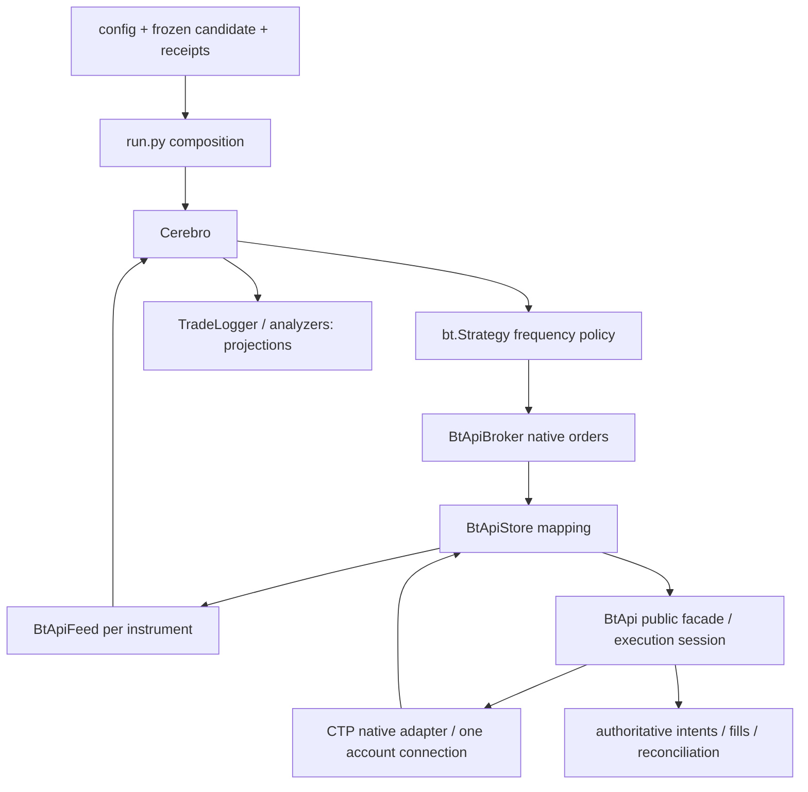

# 迭代23～25：公共架构、规则与能力基线

版本：1.2；核对日期：2026-09-10；适用范围：三个期货期权示例的设计契约。

> **DR-20260910-OPT-LEGS（已采纳）**：初始 C/P/F 三腿 conversion/reversal 只是一个策略族，不能作为所有期货期权策略必须三腿、必须 1∶1∶1、必须欧式，或“没有可行品种”的依据。SimNow 只读实测已在选定范围内获得 9 个期货、556 个期权及 42 个完整账户成本回报；在 10,000 元预算下，存在可继续研究的两腿静态资金候选。该结论不代表发现无风险套利、可交易信号、账户交易权限或任何收益/高频资格。完整证据见[品种实测筛选与两腿三腿分析](品种实测筛选与两腿三腿分析.md)。

> **DR-20260910-EXAMPLE-SELF-CONTAINED（已采纳）**：`014_1`、`014_2`、`015` 各自是一个可从本目录直接启动的完整策略产品。任何一个目录的运行时均不得导入、读取或隐式依赖另一个 `examples/` 目录的 Python、配置、fixture、审批收据、账户状态或公共包；禁止创建 `examples/ctp_options_common` 一类共享运行时层。策略专属代码和离线回放输入随该目录交付。只有具有明确领域所有者、至少两个真实消费者和独立契约测试的通用能力，才能进入 `backtrader`、`bt_api_py` 或 `bt_api_ctp`；不能把本限制作为复制私有执行账本、客户端或大型框架的理由。

本文件由[迭代23](需求文档.md)、[迭代24](../迭代24-CTP期权期货中频套利策略/需求文档.md)、[迭代25](../迭代25-CTP期权期货高频套利策略/需求文档.md)共同引用。三个策略目录现已各自交付本地、合成数据的可重复回放切片；这只证明各目录的本地策略逻辑和零外部写边界，不能表示共享目标能力、真实 CTP 链路或任何后续门已经完成。SDK 查询扩展、SimNow 只读合约/行情/成本采集以及本地源码级多合约 scope 验证也已发生；结算确认、真实交易、收益和高频资格验收均未执行。三个原始需求保留不变。

## C01 范围和裁决

| 项目 | 统一裁决 |
|---|---|
| 策略族 | C/P/F 同标的、同到期、同行权价的三腿 conversion/reversal 是首个候选族；两腿备兑、保护性或 delta 对冲是独立候选族。腿数由候选的 `LegSpec[]`、定价模型和风险约束决定，不把统计收敛称为无风险套利 |
| 迭代23 | 只使用已闭合 K 线；初版15分钟决策，日内低换手；不要求隔夜持有 |
| 迭代24 | tick 辅助信号，已闭合1分钟 K 线才产生新普通交易决策 |
| 迭代25 | 仅 tick 驱动信号；“高频”是需要实测的准入级别，不是目录名所证明的能力。原文“低频”按目录和 tick-only 解释为笔误 |
| 基本规模 | 三腿初始候选可采用各腿一手；两腿和 delta 对冲候选按乘数、整数手数、有效 delta、订单量限制及压力路径冻结比例。不得把 1∶1∶1 套用到所有候选，也不得自动扩大配比 |
| 资金 | 人民币10,000元是共同硬上限。初始三腿设计的 8,000 元操作额度＋2,000 元恢复储备是一个明确标记的情景，不是所有两腿候选的额外用户约束；任何策略仍须覆盖完整压力路径 |
| 使用场景 | 单账户、单运行所有者、单活跃篮子；三个示例不得共用账户并发写单 |
| 模板结构 | 每个目录独立交付 `config.yaml`、`run.py`、各自 `ctp_options_*_strategy.py` 及其必要的本目录文件；从该目录可直接运行，运行时不访问任何其他 `examples/` 路径。公共机制只归有明确 owner 的框架/SDK |
| 无可行品种 | 仅当目标候选所需的合约、账户成本、行情或风险证据均不可用时输出 `NO_FEASIBLE_CANDIDATE` 与逐项原因。部分/超时的全量查询不能推出市场没有期权；不得提高资金、忽略保证金或换成另一类策略冒充完成 |
| 不在首版范围 | 生产账户、跨所、自动行权/弃权指令、隔夜持仓、期权做市、多账户、期权链全量热路径扫描、未经验证的组合保证金优惠 |

实际亏损可能因跳空、涨跌停或无法成交而超过止损/预算模型；10,000元是资金分配和写入准入约束，不能承诺账户在任何行情下的损失上限。越界必须记事故而非截断报表。

### C01A 2026-09-10 选品实测结论

- 分批、只读查询的选定范围返回 9 个期货、556 个期权和 565 条深度行情快照；本次 `pp2701`、`v2701` 没有返回配套期权，不可外推到其他月份或全市场。
- 7 组期货/C/P 候选的 42 次账户成本查询均完整。56 个“1 手期货 + 1/2 手买方期权 × 0/2,000 元情景预留”静态场景中，48 个满足当时资金和展示挂量条件，4 个超预算，4 个因展示卖一数量不足而保持未知。
- 玻璃、纯碱、豆粕、玉米可作为后续连续盘口观察和模板研究的优先两腿候选；该优先级基于本次资金占用和参考快照，不是套利收益排序或交易指令。
- 以上采集没有报单、撤单、结算确认、成交、行权或 PnL。两腿资金可行性不能解除任何 G3/G4/R1/R2/HFT 门。

## C02 本次审计身份和原始材料

| 对象 | 当前事实 | 证据限制 |
|---|---|---|
| Backtrader | `dev`，HEAD `9375fa591d19f88f378ee0eb5e3d569e8d606d76` | 开始时11个已跟踪文件有修改，涉及 Broker/Store/TradeLogger/013_3 与测试；本次以磁盘源码为审计对象，HEAD不足以标识它们 |
| bt_api_py | HEAD `721ef3bbb70d271af83c4fcab76469c52e2fd5cc` | 有一个不相关未跟踪计划；未做安装消费者核验 |
| SDK内bt_api_ctp | HEAD `9bfc7d459c2a7e72a75007406b3294e8d49f307b`，`git status --short`为空 | 本轮核对了源码身份；native加载和制品来源仍NOT_RUN |
| 既有方案 | [迭代22基线](../迭代22_CTP中频模拟交易/基线与资料.md)、[迭代22验收记录](../迭代22_CTP中频模拟交易/文档验收记录.md) | 历史本地/受控API结果仅提供背景；不能继承为23～25的 PASS |
| 项目规则 | 仓库 `AGENTS.md` 及用户当次约束 | 所引用 `.joyincode/rules/backend.md`、`frontend.md` 在当前目录不存在；此次不开发前后端，不据此阻断文档；后续开发需复核 |

原始需求 SHA-256：

| 迭代 | hash |
|---|---|
| 23 | `11f1b0a7dc372acabac854145592227c3270715b47438e3da266c13fdafdf873` |
| 24 | `f2adebed1e3b475e44c66a5e11dae82da6624a0fb4959e7363301f511c92b9b3` |
| 25 | `82c6519b95f22c08cf63184fdb5caa890cbcaaac9bae2db85797b71d26f89073` |

## C03 官方依据与时效边界

下列资料于2026-09-10进行公开网页核对，保存的是来源链接与支持范围，不是当日账户能力、当前保证金或真实盘口证据。交易前还要固定页面/公告版本及 hash、有效期，并以目标账户完整查询交叉验证；文档内工程阈值不是交易所标准。

| ID | 一手来源 | 可据此形成的要求 |
|---|---|---|
| O01 | [SimNow 产品与服务](https://www.simnow.com.cn/product.action) | 官方检索内容说明第一套市场时段、第二套主要供 API 测试且不提供结算等服务，并列出所支持的期权范围。该页直接打开失败，此次以官方检索摘录为有限证据；不硬编码前置或保证品种当天可用 |
| O02 | [郑商所期权交易管理办法，2026-05-07发布](https://www.czce.com.cn/cn/content_file/flfg/zcjywgz/ywbf/2026/5/889576021a584f73abd8fdac4205188b.pdf) | 合约、行权/履约、保证金等须按产品与账户执行，不能由通用期货逻辑代替 |
| O03 | [上期所期权交易管理办法，2026-07-06生效](https://www.shfe.cn/regulation/exchangerules/otherrules/202606/t20260622_832190.html) | 行权履约、资金和持仓约束是交易生命周期的一部分；入场前要有匹配的处理能力 |
| O04 | [郑商所期权产品介绍，2024版](https://www.czce.com.cn/cn/rootfiles/2024/06/20/1715234707498668-1715234707540581.pdf) | 官方检索含 SA 的期货标的、一手单位及到期规则；旧产品资料不替代当期合约细则，不能由“15日”近似推到期日 |
| O05 | [中金所沪深300股指期权](https://www.cffex.com.cn/cn/hs300gzqq.html)、[沪深300股指期货](https://www.cffex.com.cn/hs300/) | IO 为指数标的欧式现金交割、100元/点，IF为300元/点；不满足本方案同一期货标的、同乘数的一手三腿契约，不能为寻找欧式品种直接替换 |
| O06 | [CME 欧式期权估值研究，附录B](https://www.cmegroup.com/trading/fx/files/huchede-wang-approach-to-compare-etd-otc-fxo-v1.pdf) | 给出带折现的期货期权平价关系；这里只借鉴数学条件，不照搬 CME 产品或保证金规则 |
| O07 | [CME 期货期权基础](https://www.cmegroup.com/education/whitepapers/fundamentals-of-options-on-futures) | 行权方式取决于合约规格；支持必须逐合约核验欧式/美式这一设计选择 |

国内商品候选首先核验行权方式。美式 C/P 的价格包含提前行权因素，不能直接按欧式等式放行。初版美式只读研究；拟升级美式模拟交易时，须以新候选预注册可验证的残差区间/提前行权模型、账户履约处理与恢复能力并重新通过全部门。因而当前完全可能没有符合首版模拟交易条件的品种，此结果必须如实保留。

## C04 复用边界和拟议分层



| 所有者 | 应负责 | 不应负责 |
|---|---|---|
| CTP native / SDK | 原始字段解析、官方合约身份、请求终包完整性、账户/交易日/generation、行权事件/查询、费率保证金、合法offset/TIF、持久意图/回报去重/未知单恢复、原子授权与资金预留 | 策略alpha、频率选择、哪个候选值得交易 |
| Backtrader Store | 一套公开 BtApi 对象、Feed订阅/消息映射、公共解锁委托 | 第二个客户端、再次解析原始CTP结构体、第二份权威仓位账本 |
| Backtrader Feed/Cerebro | 每合约单一消费、时间质量、聚合/封闭bar、事件顺序、idle轮询与有限队列 | 根据策略阈值决定下单、在日志中代替订单状态 |
| Backtrader Broker | `buy/sell/cancel` 到 SDK 的身份映射、费用/现金/持仓会计适配、原生 `notify_order/notify_trade` | 把期权当期货保证金产品、替示例决定交易方向 |
| 示例 Strategy | 合约候选过滤结果、纯信号/成本筛、唯一篮子状态与普通/风险动作策略；使用现有回调 | 网络IO、查询等待、绕过Broker下单、全局事件循环或独立持久交易系统 |
| run.py | 配置/来源验证、预检和装配、受控退出、证据目录 | 永久后台策略线程、隐藏登录写入、额外订单轮询循环 |

三个策略目录之间没有共享 examples 运行时：禁止 `examples/ctp_options_common`、`common.py`、相对导入、`sys.path` 拼接、读取兄弟目录 fixture，或借用另一示例的审批/账户/执行状态。每个目录可保留仅服务本策略的最小代码和离线输入；它们必须随目录直接运行。不要预先建设巨型 `BaseArbitrageFramework`，也不得因独立目录而各自复制客户端、持久执行账本或网络循环。真正可共享的纯计算先检索现有 SDK；新增时必须有明确所有者、至少两个真实消费者及契约测试，并落在 `backtrader`、`bt_api_py` 或 `bt_api_ctp`。策略类是正常 `bt.Strategy` 子类；值对象限于有独立语义和多个边界消费的快照、篮子意图、评估结果。禁止新元类。

### C04-A 当前源码复用/缺口表

路径相对对应仓库根；行号仅指2026-09-10当前磁盘快照。`BT`为Backtrader，`SDK`为bt_api_py，`CTP`为SDK的`bt_api/bt_api_ctp/src/bt_api_ctp`。除 C04-B 明确登记的本地源码测试外，本表是静态阅读结论；静态阅读或本地源码测试均不构成安装消费者、真实 CTP 或完整 Gate 通过。

| GAP / 事实 | 已核对入口 | 裁决与责任人 |
|---|---|---|
| B01 原生分层 | BT `examples/012_1_midfreq_cross_exchange/strategy.py:1,26,2149` | 保留SDK纯规划与`self.buy/sell`；不移植crypto funding逻辑 |
| B02 事件/idle | BT `examples/012_2_event_driven_cross_exchange/strategy.py:111,1743,1856`，`backtrader/cerebro.py:2654` | 复用事件入口；不继承HFT资格 |
| B03 旧013退化 | BT `examples/013_1_midfreq_cross_arbitrage/strategy.py:16,94,117,136`；013_2同类逻辑 | 缺bidask回退close、按前缀猜offset、按next检查超时不复用 |
| B04 013_3频率 | BT `examples/013_3_sa_midfreq_simnow/run.py:5458`，`strategy.py:525,687,1366,1418` | 单Feed分钟聚合/回调可参考；其tick执行不能当24一分钟下单契约 |
| GAP-MARKET 多腿因果 | BT `backtrader/feeds/ctpcohort.py`、`backtrader/feeds/btapifeed.py`、`backtrader/stores/btapistore.py` | 已有 side-effect-free 公共 `CtpQuoteCohortValidator`：严格 V2 身份/来源/时钟/质量/价位/代际 cohort，延迟旧 scope fail-closed；Feed 只消费上游明确 true 且在 dispatch 清除伪造决策时间。fake-SDK 的 Store→Feed→Cerebro 三腿子链已测；完整 Bar barrier、Broker 与 CTP 环境仍是 G1/G3 缺口。 |
| B05 完整查询基础 | SDK `bt_api_py/bt_api.py:3510`；CTP `ctp/client.py:585` | DIRECT公共`query_ctp_result`与请求终包可复用；不能宣称ZMQ相同支持 |
| GAP-OPT-SPEC 期权身份 | CTP `instrument.py`、SDK `bt_api_py/_normalization.py` | adapter 与规范化 V2 现保留 `product_class`、`contract_type`、`option_type`、`underlying_instrument`、`strike_price`；Store 预检严格核对 C/P/F、C/P 同到期/同K，期货交割日独立。完整官方规则/行权风格/生命周期公开契约仍缺。 |
| GAP-OPT-COST 期权资金 | CTP `instrument.py`；SDK `bt_api_py/bt_api.py`；BT Store 预检 | Store 可做只读三腿 reference、margin、commission 与 option-cost 证据预检，别名冲突失败关闭；这不等于 Broker 已有完整期权保证金、行权或现金流会计。 |
| GAP-ARM-SET 合约集合 | SDK `bt_api_py/_execution_session.py`；CTP `ctp/client.py`；BT `backtrader/stores/btapistore.py` | SDK facade/session/native 本地源码已加入 V2 `scope_version=ctp-contract-bundle-v1`：2--3 个同交易所、排序去重的原始 CTP ID，主合约必须属于集合，submit/cancel/recovery 均逐腿校验；Store 现有只读 V2 bundle-preflight，而非订单 arming。V2 外发仅接受无前后空白、无前缀的原始 `InstrumentID` 加规范 `ExchangeID`，V1 语义保留。安装消费者/native 隔离和外部验收仍未完成；单改示例不能解决。 |
| GAP-OFFSET 退出语义 | BT `backtrader/brokers/btapibroker.py:2663` | managed exit要求generic CZCE close；Broker/SDK补按交易所今昨持仓的合法拆单 |
| GAP-BAR-EXEC 纯K执行 | BT `backtrader/brokers/btapibroker.py:1407` | 现停机限价读取GOOD tick bid/ask/depth；23需bar-only执行与退出合同，不能原样使用后声称only-K |
| GAP-LIFECYCLE 行权/履约 | SDK公共query类型见`bt_api_py/bt_api.py:3525`；CTP client/feed/adapter搜索 | 未发现可用的公开行权处理闭环；SDK补事实读取/关联/恢复，示例保持禁用相关候选 |
| GAP-HFT 时间/队列 | CTP `feeds/live_ctp_feed.py:1371` | ingest_seq为本地接收序列，非交易所逐笔或排队序号；25不得推导queue fill |

共同P0至少包括GAP-OPT-SPEC、GAP-OPT-COST、GAP-ARM-SET、GAP-OFFSET、GAP-MARKET及适用频率的执行合同；期权premium现金与卖方保证金会计还须通过独立Broker oracle。源码中原始CTP字典可能保留部分期权字段，不等于这些规范化字段和公共方法已实现。所有缺口的完成证据是公开接口fixture、真实消费者和分层环境验收，不是增加一个类名。

### C04-B 2026-09-10 本地源码与示例切片状态

SDK 与 CTP adapter 的本地源码已实现并测试 V2 集合 scope：scope version 为 `ctp-contract-bundle-v1`，集合限为 2--3 条同交易所、排序去重的原始 CTP 合约 ID，且 primary future 必须是该集合成员。V2 的 submit/cancel/recovery 均逐腿执行成员校验；出站请求还拒绝带交易所前缀、后缀或前后空白的 symbol，只允许原始 bare InstrumentID 与规范 ExchangeID。既有 V1 单合约证明保持原有行为。public recovery 的每腿投影已有本地源码级测试，不按 C/P/F 净额合并。native adapter 的 reconnect generation/epoch 递增、旧 callback fence 及五个 C/P/F 身份字段也有本地回归；SDK 只会为直接、已注册、已就绪的原生 CTP quote 签发 parent attestation，raw mapping 不能自行声称可执行。

Backtrader 侧新增公开、无网络/下单依赖的 `backtrader.feeds.CtpQuoteCohortValidator` 与 `CtpCohortNow`。它要求调用者给出同域可信 current-time，拒绝未知 provenance、身份别名冲突、未恢复流、坏质量、过期/跨腿偏斜和旧 `(generation, subscription_epoch)` scope；不会把 parent receipt 时间当作 strategy decision 时间。`BtApiFeed` 会清除原运输负载中的 decision-time 字段，只接受显式同域 `ctp_decision_now_provider` 在同步 dispatch 边界重新附加；没有 provider 即保持拒绝。该公共能力有 fake-SDK Store→三 Feed→Cerebro 三腿子链测试，零订单写入。

三个示例也各有独立本地回放：014_1 使用 Cerebro、BackBroker 和合成三腿 15 分钟 bar；014_2 使用 Cerebro、BackBroker 和合成三腿 1 分钟 bar；015 使用 Cerebro channel、TickBroker 和冻结 tick cohort。它们不导入、不读取也不依赖其他 examples 目录；012/013 仅可作为设计参考。014_1/014_2/015 的 config/fixture 路径均封闭在各自目录，外部路径与解析后逃逸路径拒绝。上述结果统一标为 `LOCAL_REPLAY_PASS` 或 `LOCAL_SOURCE_TEST_PASS`，不产生真实订单、成交、实际 PnL、SimNow、native 安装消费者或 HFT 资格证据。

因此 GAP-ARM-SET 仍为部分完成：BT Store 的等价集合门、跨仓已安装消费者、native 制品隔离和第一套环境尚未验证。任何写入准入继续关闭，不能从本地源码测试或独立示例回放推导。

## C05 必需的公开数据契约（拟扩展）

这里的字段是规格说明，不是当前已有 API 名称。实施前必须给出“字段 → 公开方法 → native来源 → 单位 → 测试”映射。

1. **InstrumentFacts**：exchange、provider instrument ID（原样）、canonical ID、asset_type、underlying具体ID、C/P、K、option_expiry、future_last_trade/delivery、exercise_style、settlement/premium_style、multiplier、price_tick、lot_step/min_volume、币种、offset policy、session calendar/hash、当期价格上下限、有效时间、来源hash、generation。未知必填字段不得填 future/1/0。
2. **MarketEvidence**：event_time、receive_wall、receive_monotonic、TradingDay、ActionDay、sequence（源有则保留，无则UNKNOWN）、generation、quality、drop/duplicate/late标记。24/25需各腿 bid/ask 与对应数量；23只向策略提供bar与可用时间。CTP报价快照不能改名为逐笔成交或完整订单簿。
3. **BarEvidence**：instrument、timeframe、session_segment、start/end、available_at、OHLCV、trade_count可用性、quality、max_event_time、source cohort/hash。无成交不编造bar；聚合/回放均禁止修改已执行的历史bar。
4. **AccountReferenceSnapshot**：账户指纹、TradingDay、generation、request_id、terminal/completeness/errors、query_start/end、account/positions/orders/trades/reference版本、当日账户级期货与期权费率/保证金规则、持仓方向与今昨仓、结算确认状态、native身份。每类查询终包完成不等于跨查询同一时点；须用回报水位+完整复查证明收敛。
5. **BasketIntent / receipt**：candidate_hash、account、environment、TradingDay、generation、完整leg集合及各自side/offset/max_qty/price保护、cycle_id、attempt_id、预算预留、最大恢复动作、expires_at、签发者/认证来源、撤销状态。`cycle_id` 不是交易所原子成交保证。
6. **ExecutionEvidence**：SDK intent ID、Backtrader order ref、CTP FrontID/SessionID/OrderRef及后续ExchangeID/OrderSysID、trade去重键（账户×交易日×交易所×合约×TradeID等实际唯一域）、接受/拒绝/撤单/部分成交/成交终态、原始时间及接收时间、实付/估计费用标识。
7. **LifecycleEvidence**：行权、弃权、被指派、到期、结算与新增期货仓位的源记录、来源身份/完整性、关联原期权、风险重算结果。没有相关能力时禁止进入会触发该风险的候选，而不是假定日内无此风险。

公开方法的查询须幂等且只读，速率受柜台能力约束；单并发只读lane、合并重复请求、有效期和generation fencing。策略回调只读本地快照；不能同步 `sleep()` 或阻塞查询。累计Volume仅在SDK做一次差分，Feed聚合增量。

## C06 三腿方向、价格与真实损益

设同一标的期货 F、同到期 T 与同行权价 K 的欧式、权利金在交易时收付的 C/P；D=exp(-r×τ)，τ采用冻结的年化日数规则。确定利率、标的/结算一致等假设成立时，基准残差 `R=C-P-D(F-K)`。利率或结算风格不同须重新建模。

| 方向 | 三腿 | 24/25 的即时报价残差（人民币） |
|---|---|---|
| conversion，R偏正 | 买F、卖C、买P | `Gconv=M×[Cbid-Pask-D(Fask-K)]` |
| reversal，R偏负 | 卖F、买C、卖P | `Grev=M×[Pbid-Cask+D(Fbid-K)]` |

`score=G-fees_roundtrip-slippage_extra-financing_path-model_buffer`。买取ask、卖取bid已经计入开仓价差，不再重复扣同一开仓spread；退出价差/冲击、六笔开平手续费（区分平今）、保证金融资与提前结束损益另列。23以bar生成参考上下包络代替bid/ask，必须命名 `indicative_score`，不得称可执行套利价。

上述分数是理论偏离筛选，不等于已经锁定的利润。三腿各一手时，欧式理想模型 conversion 对F的残余delta为 `M(1-D)`，reversal取反；非零利率下不是精确静态delta对冲。整数手约束下把残余delta、gamma/vega模型误差和单腿敞口纳入压力损失；不得擅自用小数手或加仓消除。美式不能硬套这些Greeks恒等式。

现金流账按真实交易分开：期权买入支付权利金、卖出收取权利金并冻结卖方保证金；期货不收付合约全额而有保证金和盯市。闭环交易盈亏可以按每笔成交现金流/成本重建；日内简式为 `Σ M_i×direction_i×qty_i×(exit_i-entry_i) - actual_fees - attributed_financing`。日切账使用结算重置后的基准，不能再把同一盯市盈亏重复计入。无完整费用/结算或仍有仓位时结果为 `PNL_INCOMPLETE`，mark-to-liquidation 另列估计值。

独立手算基准：D=1、M=10、K=1000、F bid/ask=999/1001、C=15/16、P=9/10。conversion分数毛额40元，reversal为-80元；若六笔手续费12元、额外退出/滑点8元、融资2元、模型储备3元，conversion净筛为15元，低于20元初始入场门，拒绝。此数据为公式fixture，无订单、成交或收益证明。

## C07 10,000元资金契约

定义初始 `B_0=10000`，后续 `B_t=min(B_previous,10000+min(0,attributed_net_pnl_t))`，其中PnL从本候选首次运行起累计，含实际费用与当前保守清算估值；预算是单调不增的最低值，后续盈利不恢复预算。亏损、预算低点在重启和TradingDay切换后继续结转；估值未知时不得更新为0或放行新开。每日日损另外在TradingDay首个已对账权益冻结基线上计算。入金、SimNow重置资金和更换进程都不得重置候选亏损。例：PnL从0到-300再到-100，B依次10000、9700、9700。

对任一可达执行路径状态 s（所有腿成交子集、部分量、未决单可能成交、撤单后迟到成交、已有今昨仓与履约生成仓位）计算：

`U(s)=gross_margin(s)+paid_long_premium(s)+unresolved_order_reserve(s)+fees_and_financing_reserve(s)+stress_cash_loss(s)`。

各项必须是不重叠的资金占用定义：已成交转入持仓后相同意图的预留释放/转换，不与持仓保证金重复计费；不确定单仍按最坏可能成交占用。卖出权利金不增加可开仓预算。组合优惠默认为0；只有账户绑定、可用组合类型、形成时点与拆腿失效均经验证才允许新版本采用。取所有 s 的最大值，禁止只检查最终“对冲完毕”状态。

- 普通新意图：`max U(s) <= min(8000, B_t-2000)`；真实账户另做增量检查：柜台Available已经扣过的现有保证金/冻结不再扣一次，比较“未来路径相对该快照尚未计入的新增义务＋尚未计入的恢复储备”与Available；快照年龄默认≤5秒。两项检查须同时通过，不能拿Available代替策略总占用门。
- 恢复意图：不得增加策略目标仓位，仅用于已批准篮子的修复/减险；动作后最坏占用≤B_t，按全组合压力风险验证其为减险。强平/行情跳空导致实际超过预算时停止普通开仓并记录越界，不能修改数值使其通过。
- 运行锁：同账户仅一个写所有者；账户有非本策略未清持仓/订单时默认不启动。中途发现外部活动，撤销普通授权、对账并要求接管，不擅自平掉用户外部仓位。
- 1手也超过门限、缺费率/保证金/恢复能力、报价不足或UNKNOWN范围不明：明确 `BLOCKED_CAPITAL` / `BLOCKED_REFERENCE` / `BLOCKED_RECONCILIATION`。

例：期货保证金3,000＋期权卖方保证金2,500＋买方权利金800＋费用100＋压力储备1,200＝7,600，可再留2,000恢复储备；若卖方保证金升至3,500，总8,600，拒绝，即使账户显示2,000万元。以上数字只是边界测试。

预留转换oracle：发一笔买权单预留800，柜台尚未反映时新增义务为800；成交回报800已支付且新账户快照已经扣款后，预留转为已付权利金，总策略占用仍800，新增Available义务为0。两者都计800会双扣；都清零会漏预算。UNKNOWN未被完整证明终止时不得释放预留。恢复上限 `U(s)<=B_t` 指整个状态，2,000是事前保留的空间，不是另一个可在10,000之上追加的额度。

## C08 唯一篮子状态和恢复

```text
DISARMED -> PREFLIGHT -> OBSERVING -> READY -> RESERVED -> ENTERING
ENTERING -> OPEN -> EXITING -> RECONCILING -> FLAT_VERIFIED -> READY
any active state -> UNKNOWN / RECOVERING -> RECONCILING
unresolved deadline -> HALTED_MONITORING -> FLAT_VERIFIED or HANDOVER
```

Strategy拥有篮子的目标和阶段；SDK拥有每笔实际意图、订单/成交事实及权威持久日志。篮子阶段是对SDK事实的可恢复投影，不再保存一套独立成交账。单进程单线程事件owner串行处理，外部回调排队进入；`notify_order`即使先于局部 `buy()` 返回的关联建立也必须缓存/关联后重放。

初版先买保护期权，再用预注册路径完成F和卖方期权；退出优先处理卖方期权，再处理余腿。固定顺序只有在所有中间状态压力/可平性合格时才可执行，否则整篮子拒绝。每次实际发送前重验价格、剩余量、额度、receipt和generation。24/25补腿使用当下有效quote；23遵守其bar价格包络，不能偷偷改用tick。全部以原生限价单；未证明的IOC/FOK、组合原子成交、市价语义禁用。

发送请求已经跨越native边界但结果未知时进入UNKNOWN；不得以超时当拒单，也不得给新客户端ID盲重报。先查询并与异步成交/撤单回报对账；撤单ACK不证明不会有迟到成交。若存在未知开仓，任何减险动作必须评估其随后成交的最坏组合，无法证明风险不增加时保持只读监控并接管。

`FLAT_VERIFIED` 要求本候选各腿今昨/多空均为零、无活动/未知订单、全部成交已归属，且两轮完整账户/仓位/委托/成交查询在回报水位前后稳定一致。启动/重连丢失generation立即失效旧普通授权；不重新开第二连接重试。恢复授权必须在同一连接、同一完整腿集合和已知风险范围原子签发，不能循环 re-arm 单品种。

## C09 默认风险参数和市场时钟

下表是待预注册的工程初始值，不是最佳盈利参数。调参会改变候选hash；超硬预算的值直接配置错误。

| 参数 | 初值 / 行为 |
|---|---|
| 日损阈值 | 300元；真实/保守估值及费用计入，触发停止新开和风险退出 |
| 单篮子损失 | 150元；依赖可得数据估值，有缺口就判风险未知并停止新开；不能宣称止损必达 |
| 并行篮子 | 1；保护腿未收敛、UNKNOWN、退出或对账时都占用名额 |
| 总写尝试 | 每账户×TradingDay累计100；insert/cancel及失败/超时各算一次；普通最多80，剩余20保留安全操作 |
| 瞬时限流 | 取验证过的柜台/交易所/策略配置最小值；限额未知禁止写。恢复也服从硬限额，耗尽进入监控/接管，不无限重试 |
| 到期排除 | 期权到期至少剩5个交易日，且不能触及期货自然人最后持有/交割限制；日历与条款共同约束 |
| 每个闭市段 | 结束前30分钟禁新开，前10分钟开始退出，前3分钟未平进入接管告警；午休/节假日前停市段也按冻结会话日历处理 |
| 无行情 | `notify_idle`继续做单调时钟deadline、停开、撤单/恢复/接管；不等待下一bar |
| 停机 | 信号停止→撤普通剩单→按许可风险退出→完整对账→关闭；未归零不得返回成功。接管后保留只读监控与风险清单 |

交易日、自然日、夜盘ActionDay分开；交易所日历须包含小节、节假日夜盘、临时停市和产品状态。超时用单调时钟；跨进程恢复只能将持久壁钟/源事件时间保守映射，不把两次进程的monotonic值相减。时钟回拨、未知偏移或日志缺口须降级。

## C10 模式、审批和证据

| 模式 | 能力与明确禁止 |
|---|---|
| replay | 无网络、零交易写；通过Cerebro/Broker运行假设成交时必须单独标 `HYPOTHETICAL`，不得与实际订单/实收费用混记；公式fixture可为零模拟成交 |
| shadow / preflight | 公开/账户只读观察，禁止报撤单和自动结算确认；登录流程若不能关闭自动确认，则只读门失败 |
| simnow mechanical-smoke | 单独批准的机械验证作业：一手、一次篮子、限制价格/次数/资金/时段，验证机械能力，结果不计自然策略收益 |
| simnow strategy | 第一套，候选已冻结，G1/G2/G3/G4完整机械门及R1明确PASS，不能用NOT_RUN/INCOMPLETE/无FAIL替代；通过与同一会话绑定的receipt解锁，开始R2自然信号观察 |
| production | 首版不可配置开启；环境/账户错配在任何写前拒绝 |

Receipt同时绑定源码树/依赖制品hash、配置、合约全集、数据/模型版本、账户指纹、交易日、环境、generation、有效期、风险预算、签发与撤销证据。写在本地文件中的 `approved: true` 或可由策略任意重算的hash不是批准真实性；沿用并扩展既有候选审批机制，签发者来自独立操作动作/可验证凭证，策略进程无自批权。只读预检不换连接，最后一步才同连接原子解锁。

对经济失败的候选，禁止降低阈值、改名或用smoke生成交易充当策略复活；如果需要独立验证框架机械能力，应使用明确不同的机械测试任务/receipt与隔离证据，并重新通过全部风险门。此前用户仅授权文档，不等于已授权未来这些登录或写入步骤。

结算准备采用独立受控操作：shadow可以如实记录未确认并返回 `BLOCKED_SETTLEMENT`，绝不自动确认。单独的prepare-settlement批准仅允许一次当账户×TradingDay×generation的结算确认（不含订单权），计入当日100次写预算并单独计数；同连接完整回查成功后重新冻结preflight，才签发订单arming收据。若SDK尚无该公开、可审计操作，就以用户在外部终端完成确认后本连接回查为前置，不能自造已存在API或让普通交易receipt隐式包含确认。回查/重连改变generation则重新预检。

G4机械测试需G1/G2/G3及独立有限机械批准，无需先取得R1自然经济结论；它不得计入R2。25的HFT证据采集可在相应只读/机械权限内开展；HFT尚未通过不是采集自身证据的循环前置，但未通过不能给运行贴上已认证HFT标签。

23另有明确受限的 `exploration` purpose，用来解决只K线的桶内成交证据缺口：G1/G2/G3/G4均PASS、R0保守成本/结构筛PASS且无经济否决后，独立批准最多5个交易日、每日1次、累计5次真实bar信号篮子尝试；不需要先取得R1 PASS，但不能用作R2或最终holdout，也不能自动延长/续签。具体约束见D23-10。这是唯一此处定义的R1之前自然信号探索例外，不对24/25或普通策略授权作隐含放宽。

## C11 证据包和分层验收

完整 Gate 运行将保存 `run_manifest.json`、`capabilities.json`、`candidate.json`、`config.redacted.yaml`、`instrument_snapshot.json`、`calendar_receipt.json`、`account_snapshot.redacted.json`、`events.jsonl`、`orders.jsonl`、`fills.jsonl`、`reconciliation.json`、`pnl.json`、`gate_results.json`。本地 replay 报告只可记录其合成输入、零外部写和本地策略摘要，不能伪装成这套完整 Gate 证据包。完整 run_manifest 必须含三仓源码/dirty patch hash、构建wheel hash、导入路径、native版本/架构、测试命令与退出码、候选/账户/环境/日历/数据身份。凭据和完整账号不得进入证据或日志。

| Gate | 通过条件 / 不能推导的结论 | 当前 |
|---|---|---|
| G0 | 文档需求/D/AC追踪完整，关键裁决明确，独立审查和结构检查 | 见文档验收记录 |
| G1 | 冻结源码上的独立公式oracle、事件因果、资金、期权会计和恢复故障测试 | INCOMPLETE；各目录本地 replay、SDK/CTP 本地源码子集和 fake-SDK BtApiStore→BtApiFeed→Cerebro V2 三腿子链已验证，但未使用完整 BtApiStore→BtApiFeed→BtApiBroker→CTP 链 |
| G2 | SDK/CTP/Backtrader安装消费者、native加载、公共入口、平台矩阵；源码树测试不替代wheel | NOT_RUN |
| G3 | 第一套目标账户只读预检，完整三腿reference/权限/日历/质量观察 | NOT_RUN |
| G4 | 受控机械订单开平/部分成交/取消/对账，且资金门全程有效 | NOT_RUN |
| R1 | 预注册成本筛、时间隔离OOS、独立评估、失败与无交易日完整记录 | NOT_RUN |
| R0 / E1 | 仅23，bar结构/保守成本筛与独立限额模拟探索，不能等同R1/R2 | NOT_RUN |
| R2 | 冻结候选自然第一套SimNow前向观察及成本对账；非smoke触发 | NOT_RUN |
| HFT | 仅25，数据覆盖/延迟/队列/真实成交证据专项；SimNow不能证明生产排队或利润 | NOT_RUN / NOT_ADMITTED / NO-GO |

状态语义：`NOT_RUN`未执行；`BLOCKED`先决条件不满足；`FAIL`执行证据违反判据；`INCOMPLETE`样本不足/证据不全；`PASS`仅限当前gate；`NO-GO`不得进入对应下一阶段。空候选或零交易可证明拒绝行为正确，不能算G4/R2/HFT交易能力通过。

研发先后：23承载共同契约G1/G2→三代各自频率验收→各自G3/G4/R1/R2。24/25可并行编写和测试，但不能继承23的运行收据；复用代码只复用机制，每个候选重新封存数据/参数/权限与资金证明。三代共享样本时按一个实验族计数，先划定共同不可触碰holdout，禁止23结果污染24/25仍称独立测试。

跨频率数据切分的共同日历边界高于各代最低天数：如24要求40日OOS而23要求30日，共同holdout至少取40日且23也不得将其中前10日改作validation；25若要求更长则取最长并统一截止点。各代交易样本数是独立要求，不把另一频率的交易计入。后续数据不足应整体后移封存新holdout，不能拆开已有被查看部分继续声称未触碰。

## C12 实施切片与停止条件

| 切片 | 所有者与产物 | 进入下一步的证据 |
|---|---|---|
| T0 | 三代文档、参考事实和缺口清单 | G0；文档静态审查完成 |
| T1 | SDK/CTP期权metadata、费用保证金、会计字段、合约集合授权、恢复与生命周期 | V2 集合 scope 与逐腿 recovery 投影已有本地源码子集；公开接口完整映射、BT Store 等价约束及全部 fixture 仍待完成 |
| T2 | Broker期权会计/多腿身份，Store集合arming，Feed多腿因果 | 与SDK冻结版本集成，安装消费者，旧CTP/012/013回归 |
| T3 | 23 bar-only、24 bar/tick barrier、25 tick-only策略薄层 | 各自G1；改变clock/minperiod须执行全策略回归 |
| T4 | 录制/授权历史数据、预注册、基于真实成本的可行性筛选 | R1；筛失败停止经济推广，不能从优化后样本再选holdout |
| T5 | 第一天只读第一套观察，独立机械测试 | G3/G4；每次运行新receipt |
| T6 | 各代冻结自然前向运行和25 HFT测量 | R2/HFT分开结论；不自动解锁production |

如未找到万元内合格标的、SDK公开期权字段不足、集合授权/恢复未实现、历史/盘口覆盖不足，允许继续补文档或离线工程；对应模拟交易/经济验收必须保持BLOCKED，不把缺口藏进策略局部助手函数。
