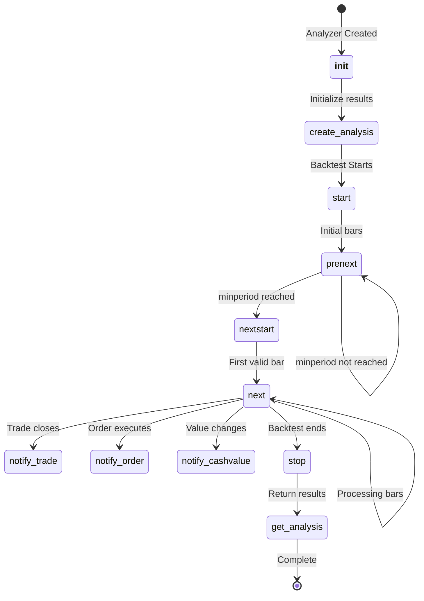

# Analyzer API

The `Analyzer` class is the base class for all performance analysis tools in Backtrader. Analyzers calculate and report strategy metrics including returns, drawdowns, Sharpe ratio, trade statistics, and more.

## Class Definition

```python
class backtrader.Analyzer:
    """Base class for all analyzers."""
```

## Parameters

### `params`

Tuple of parameter definitions for the analyzer.

```python
class MyAnalyzer(bt.Analyzer):
    params = (
        ('period', 20),
        ('threshold', 1.5),
    )
```

Access parameters via `self.p.parameter_name` or `self.params.parameter_name`.

## Core Methods

### `__init__(self)`

Called once during analyzer instantiation. Use to initialize data structures.

```python
def __init__(self):
    super().__init__()  # Always call super first
    self.trades = []
    self.total_pnl = 0.0
```

### `start(self)`

Called at the start of the backtest, after initialization is complete.

```python
def start(self):
    self.initial_cash = self.broker.getcash()
    self.start_value = self.broker.getvalue()
```

### `prenext(self)`

Called for each bar before minimum period is reached. By default calls `next()`.

### `nextstart(self)`

Called once when minimum period is first reached. By default calls `next()`.

### `next(self)`

Called for each bar after minimum period is reached. Contains per-bar analysis logic.

```python
def next(self):
    current_value = self.broker.getvalue()
    self.values.append(current_value)
```

### `stop(self)`

Called at the end of the backtest. Perform final calculations.

```python
def stop(self):
    total_return = (self.broker.getvalue() / self.start_value) - 1
    self.rets['total_return'] = total_return
```

## Notification Methods

### `notify_trade(self, trade)`

Called when a trade status changes.

```python
def notify_trade(self, trade):
    if trade.isclosed:
        self.trades.append({
            'pnl': trade.pnlcomm,
            'commission': trade.commission,
        })
```

**Trade Attributes**:

| Attribute | Description |
|-----------|-------------|
| `trade.status` | Current status (Open, Closed) |
| `trade.pnl` | Gross profit/loss |
| `trade.pnlcomm` | Net profit/loss (after commission) |
| `trade.commission` | Commission paid |
| `trade.isclosed` | Whether trade is closed |
| `trade.long` | Whether it was a long position |
| `trade.barlen` | Number of bars in trade |

### `notify_order(self, order)`

Called when an order status changes.

```python
def notify_order(self, order):
    if order.status == order.Completed:
        self.orders.append({
            'type': 'buy' if order.isbuy() else 'sell',
            'price': order.executed.price,
            'size': order.executed.size,
        })
```

**Order Status Values**:

| Status | Description |
|--------|-------------|
| `Order.Created` | Order created |
| `Order.Submitted` | Submitted to broker |
| `Order.Accepted` | Accepted by broker |
| `Order.Partial` | Partially filled |
| `Order.Completed` | Fully filled |
| `Order.Canceled` | Canceled |
| `Order.Margin` | Margin insufficient |
| `Order.Rejected` | Rejected |

### `notify_cashvalue(self, cash, value)`

Called when cash or portfolio value changes.

```python
def notify_cashvalue(self, cash, value):
    self.history.append({
        'cash': cash,
        'value': value,
    })
```

### `notify_fund(self, cash, value, fundvalue, shares)`

Called when fund-related data changes (when using fund mode).

```python
def notify_fund(self, cash, value, fundvalue, shares):
    self.fund_history.append({
        'fundvalue': fundvalue,
        'shares': shares,
    })
```

## Result Methods

### `create_analysis(self)`

Create the analysis results container. Override to customize structure.

```python
def create_analysis(self):
    self.rets = OrderedDict()
    self.rets['total_trades'] = 0
    self.rets['winning_trades'] = 0
```

### `get_analysis(self)`

Return the analysis results. Override to return custom format.

```python
def get_analysis(self):
    return self.rets
```

### `print(self)`

Print analysis results via standard print.

```python
analyzer.print()  # Equivalent to print(analyzer.get_analysis())
```

### `pprint(self)`

Pretty print analysis results.

```python
analyzer.pprint()  # Formatted output
```

## Built-in Analyzers

### SharpeRatio

Calculates the Sharpe ratio using a risk-free rate.

```python
cerebro.addanalyzer(bt.analyzers.SharpeRatio, _name='sharpe',
                    riskfreerate=0.01, timeframe=bt.TimeFrame.Days)
```

| Parameter | Default | Description |
|-----------|---------|-------------|
| `riskfreerate` | 0.01 | Annual risk-free rate (1%) |
| `timeframe` | TimeFrame.Years | Timeframe for calculation |
| `factor` | None | Annualization factor |
| `convertrate` | True | Convert annual rate to timeframe |
| `annualize` | False | Return annualized Sharpe ratio |
| `stddev_sample` | False | Use Bessel's correction |
| `fund` | None | Use fund mode |

**Output**:
```python
{'sharperatio': 1.23}
```

### SharpeRatio_Annual

Annualized Sharpe ratio (same as SharpeRatio with `annualize=True`).

```python
cerebro.addanalyzer(bt.analyzers.SharpeRatio_A, _name='sharpe')
```

### DrawDown

Calculates drawdown statistics.

```python
cerebro.addanalyzer(bt.analyzers.DrawDown, _name='drawdown')
```

| Parameter | Default | Description |
|-----------|---------|-------------|
| `fund` | None | Use fund mode |

**Output**:
```python
{
    'drawdown': 5.23,        # Current drawdown in %
    'moneydown': 5230.50,    # Current drawdown in currency
    'len': 10,               # Current drawdown length
    'max': {
        'drawdown': 15.67,   # Maximum drawdown in %
        'moneydown': 15670.00,
        'len': 45,           # Maximum drawdown length
    }
}
```

### TimeDrawDown

Time-frame based drawdown analyzer.

```python
cerebro.addanalyzer(bt.analyzers.TimeDrawDown, _name='dd',
                    timeframe=bt.TimeFrame.Months)
```

**Output**:
```python
{
    'maxdrawdown': 12.34,
    'maxdrawdownperiod': 30,
}
```

### Returns

Total, average, compound and annualized returns.

```python
cerebro.addanalyzer(bt.analyzers.Returns, _name='returns',
                    timeframe=bt.TimeFrame.Years, tann=252)
```

| Parameter | Default | Description |
|-----------|---------|-------------|
| `timeframe` | None | Timeframe for returns |
| `tann` | None | Annualization periods |
| `fund` | None | Use fund mode |

**Output**:
```python
{
    'rtot': 0.234,      # Total log return
    'ravg': 0.001,      # Average return
    'rnorm': 0.287,     # Annualized return
    'rnorm100': 28.7,   # Annualized return in %
}
```

### AnnualReturn

Year-by-year returns.

```python
cerebro.addanalyzer(bt.analyzers.AnnualReturn, _name='annret')
```

**Output**:
```python
{
    2020: 0.15,
    2021: 0.22,
    2022: -0.08,
}
```

### TradeAnalyzer

Detailed trade statistics.

```python
cerebro.addanalyzer(bt.analyzers.TradeAnalyzer, _name='ta')
```

**Output**:
```python
{
    'total': {
        'total': 100,
        'open': 2,
        'closed': 98,
    },
    'won': {
        'total': 55,
        'pnl': {'total': 5500.0, 'average': 100.0, 'max': 500.0},
    },
    'lost': {
        'total': 45,
        'pnl': {'total': -2250.0, 'average': -50.0, 'max': -200.0},
    },
    'long': {
        'total': 60,
        'pnl': {'total': 3000.0, 'average': 50.0},
    },
    'short': {
        'total': 40,
        'pnl': {'total': 250.0, 'average': 6.25},
    },
    'streak': {
        'won': {'current': 3, 'longest': 8},
        'lost': {'current': 0, 'longest': 5},
    },
    'pnl': {
        'gross': {'total': 3250.0, 'average': 33.16},
        'net': {'total': 3250.0, 'average': 33.16},
    },
    'len': {
        'total': 500,
        'average': 5.1,
        'max': 20,
        'min': 1,
    }
}
```

### SQN

System Quality Number (Van K. Tharp).

```python
cerebro.addanalyzer(bt.analyzers.SQN, _name='sqn')
```

**SQN Scale**:
- 1.6 - 1.9: Below average
- 2.0 - 2.4: Average
- 2.5 - 2.9: Good
- 3.0 - 5.0: Excellent
- 5.1 - 6.9: Superb
- 7.0+: Holy Grail?

**Output**:
```python
{
    'sqn': 2.34,
    'trades': 50,
}
```

### Calmar

Calmar ratio (annual return / maximum drawdown).

```python
cerebro.addanalyzer(bt.analyzers.Calmar, _name='calmar',
                    timeframe=bt.TimeFrame.Months, period=36)
```

| Parameter | Default | Description |
|-----------|---------|-------------|
| `timeframe` | TimeFrame.Months | Timeframe for calculation |
| `period` | 36 | Lookback period |
| `fund` | None | Use fund mode |

**Output**:
```python
{
    datetime(2021, 12, 31): 1.23,
    datetime(2022, 12, 31): 0.98,
}
```

### Transactions

Transaction log for all executed orders.

```python
cerebro.addanalyzer(bt.analyzers.Transactions, _name='txn')
```

**Output**:
```python
{
    datetime(2021, 1, 1, 9, 30): [
        [100, 150.0, 0, 'AAPL', -15000.0],  # [amount, price, sid, symbol, value]
    ],
}
```

### TimeReturn

Time-weighted returns by period.

```python
cerebro.addanalyzer(bt.analyzers.TimeReturn, _name='timeret',
                    timeframe=bt.TimeFrame.Months)
```

**Output**:
```python
{
    datetime(2021, 1, 31): 0.0234,
    datetime(2021, 2, 28): 0.0156,
}
```

### Positions

Position analysis.

```python
cerebro.addanalyzer(bt.analyzers.Positions, _name='pos')
```

### TotalValue

Total value tracking over time.

```python
cerebro.addanalyzer(bt.analyzers.TotalValue, _name='tv')
```

### PyFolio

Integration with pyfolio library for advanced analytics.

```python
cerebro.addanalyzer(bt.analyzers.PyFolio, _name='pyfolio')
```

### Other Analyzers

- `LogReturnsRolling`: Rolling logarithmic returns
- `PeriodStats`: Statistics by time period
- `Leverage`: Leverage tracking
- `VWR`: Variance-Weighted Return

## TimeFrameAnalyzerBase

Base class for time-frame aware analyzers.

```python
class MyTimeFrameAnalyzer(bt.TimeFrameAnalyzerBase):
    params = (
        ('timeframe', bt.TimeFrame.Days),
        ('compression', 1),
    )

    def on_dt_over(self):
        # Called when timeframe period changes
        pass
```

## Integration with Cerebro

```python
import backtrader as bt

# Create strategy
class MyStrategy(bt.Strategy):
    pass

# Create cerebro
cerebro = bt.Cerebro()

# Add strategy
cerebro.addstrategy(MyStrategy)

# Add analyzers
cerebro.addanalyzer(bt.analyzers.SharpeRatio, _name='sharpe')
cerebro.addanalyzer(bt.analyzers.DrawDown, _name='drawdown')
cerebro.addanalyzer(bt.analyzers.Returns, _name='returns')
cerebro.addanalyzer(bt.analyzers.TradeAnalyzer, _name='ta')

# Run
results = cerebro.run()
strat = results[0]

# Get analysis results
print('Sharpe Ratio:', strat.analyzers.sharpe.get_analysis())
print('Max Drawdown:', strat.analyzers.drawdown.get_analysis()['max']['drawdown'])
print('Total Return:', strat.analyzers.returns.get_analysis()['rnorm100'])
print('Total Trades:', strat.analyzers.ta.get_analysis()['total']['closed'])
```

## Custom Analyzer Example

### Simple Trade Counter

```python
class TradeCounter(bt.Analyzer):
    """Count total trades and win rate."""

    def create_analysis(self):
        self.rets = OrderedDict()
        self.rets['total'] = 0
        self.rets['wins'] = 0
        self.rets['losses'] = 0

    def notify_trade(self, trade):
        if not trade.isclosed:
            return

        self.rets['total'] += 1
        if trade.pnlcomm >= 0:
            self.rets['wins'] += 1
        else:
            self.rets['losses'] += 1

    def stop(self):
        if self.rets['total'] > 0:
            self.rets['win_rate'] = self.rets['wins'] / self.rets['total']
```

### Win/Loss Ratio Analyzer

```python
class WinLossRatio(bt.Analyzer):
    """Calculate win/loss ratio and average win/loss amounts."""

    def start(self):
        self.wins = []
        self.losses = []

    def notify_trade(self, trade):
        if not trade.isclosed:
            return

        if trade.pnlcomm >= 0:
            self.wins.append(trade.pnlcomm)
        else:
            self.losses.append(abs(trade.pnlcomm))

    def stop(self):
        self.rets = OrderedDict()

        if self.wins:
            self.rets['avg_win'] = sum(self.wins) / len(self.wins)
            self.rets['max_win'] = max(self.wins)
        else:
            self.rets['avg_win'] = 0
            self.rets['max_win'] = 0

        if self.losses:
            self.rets['avg_loss'] = sum(self.losses) / len(self.losses)
            self.rets['max_loss'] = max(self.losses)
        else:
            self.rets['avg_loss'] = 0
            self.rets['max_loss'] = 0

        if self.losses and self.rets['avg_loss'] > 0:
            self.rets['win_loss_ratio'] = self.rets['avg_win'] / self.rets['avg_loss']
        else:
            self.rets['win_loss_ratio'] = float('inf') if self.wins else 0
```

### Monthly Returns Analyzer

```python
class MonthlyReturns(bt.TimeFrameAnalyzerBase):
    """Calculate monthly returns."""

    params = (('timeframe', bt.TimeFrame.Months),)

    def __init__(self, *args, **kwargs):
        super().__init__(*args, **kwargs)
        self.month_start_value = None
        self.month_returns = OrderedDict()

    def start(self):
        self.month_start_value = self.strategy.broker.getvalue()

    def on_dt_over(self):
        month_end_value = self.strategy.broker.getvalue()
        ret = (month_end_value / self.month_start_value) - 1
        self.month_returns[self.dtkey] = ret
        self.month_start_value = month_end_value

    def get_analysis(self):
        return self.month_returns
```

### Hold Time Analyzer

```python
class HoldTimeAnalyzer(bt.Analyzer):
    """Analyze average hold time for trades."""

    def create_analysis(self):
        self.rets = OrderedDict()
        self.hold_times = []

    def notify_trade(self, trade):
        if not trade.isclosed:
            return

        self.hold_times.append(trade.barlen)

    def stop(self):
        if self.hold_times:
            self.rets['avg_hold_bars'] = sum(self.hold_times) / len(self.hold_times)
            self.rets['min_hold_bars'] = min(self.hold_times)
            self.rets['max_hold_bars'] = max(self.hold_times)
            self.rets['total_trades'] = len(self.hold_times)
        else:
            self.rets['avg_hold_bars'] = 0
            self.rets['min_hold_bars'] = 0
            self.rets['max_hold_bars'] = 0
            self.rets['total_trades'] = 0
```

## Fund Mode

Many analyzers support fund mode for fund-like accounting:

```python
# Enable fund mode on broker
cerebro.broker.set_fundmode(True, fundstart=10000.0)

# Analyzer will use fund value instead of portfolio value
cerebro.addanalyzer(bt.analyzers.DrawDown, _name='dd', fund=True)
```

## Analyzer Lifecycle



## CSV Output

Analyzers can save results to CSV (if `csv` attribute is `True`):

```python
cerebro.run()
# Results automatically saved to CSV if configured
```

## Best Practices

1. **Call `super().__init__()` first** - Always call parent constructor
2. **Use `create_analysis()`** - Initialize result structure here
3. **Check `trade.isclosed`** - Only count closed trades in `notify_trade`
4. **Use OrderedDict** - Preserves insertion order for results
5. **Handle edge cases** - Check for division by zero, empty collections
6. **Return dict-like objects** - Use `get_analysis()` to return results
7. **Access via strategy** - Results accessed via `strategy.analyzers.{_name}`

## Next Steps

- [Indicators API](indicator.md) - Technical indicators
- [Strategy API](strategy.md) - Strategy development
- [Data Feeds API](data-feeds.md) - Data sources
