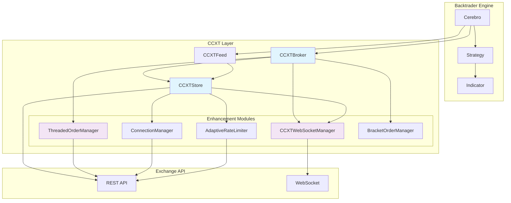
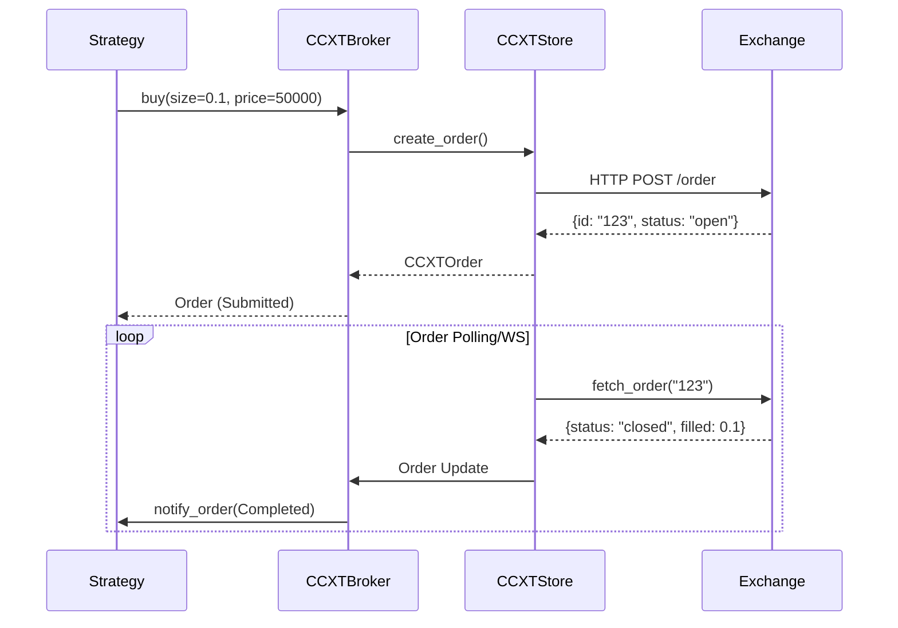
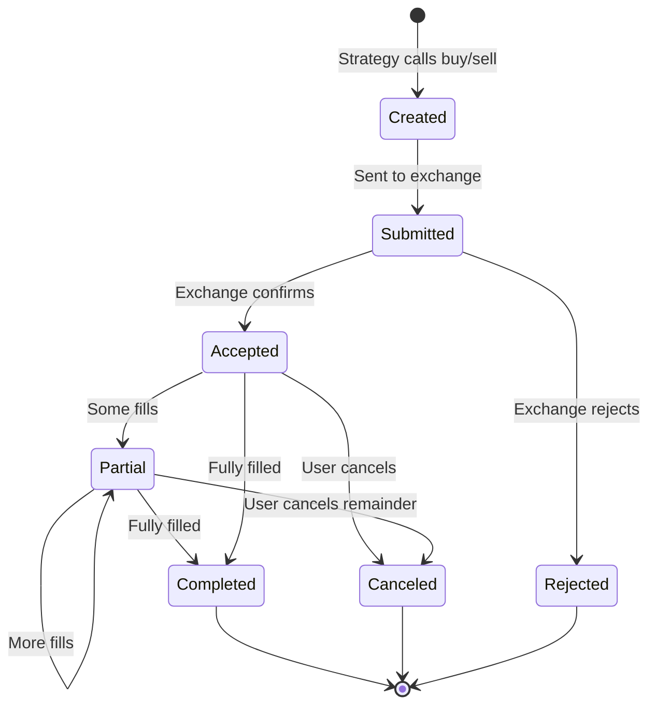
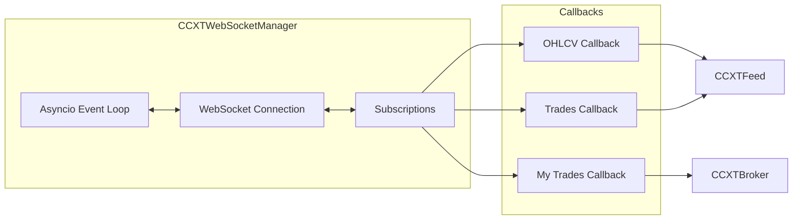
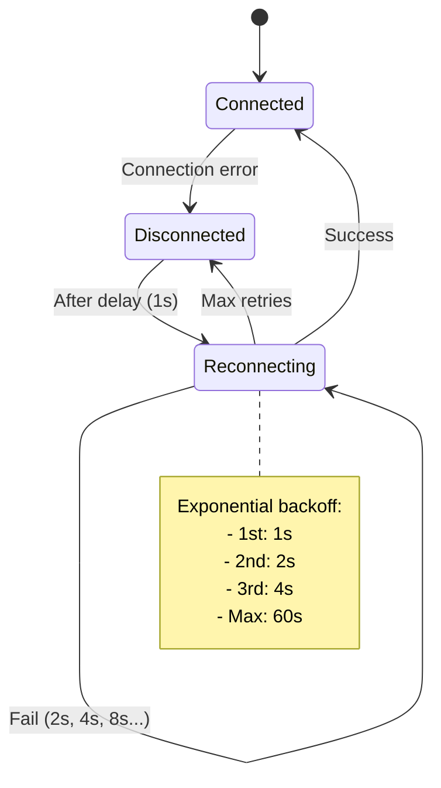
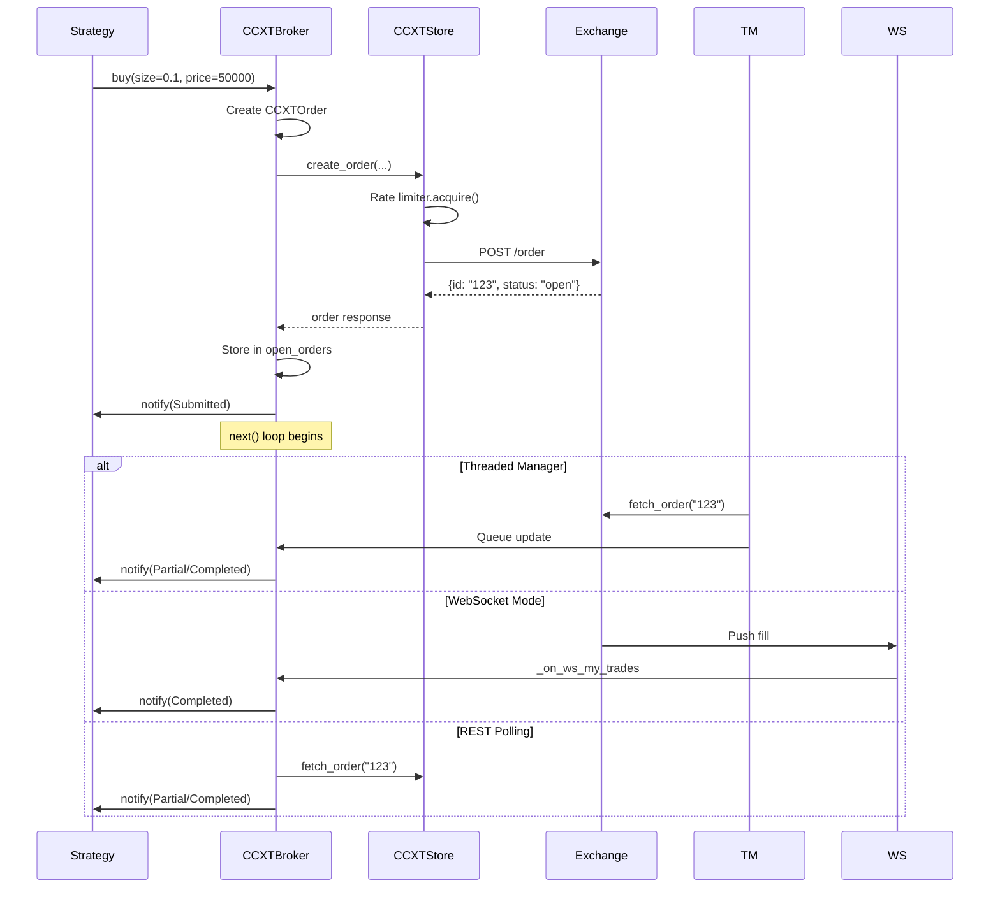

# CCXT Store and Broker API Reference

> CCXT (CryptoCurrency eXchange Trading) library integration for Backtrader
>
> This reference covers the `CCXTStore` and `CCXTBroker` classes that enable live trading on 100+ cryptocurrency exchanges through a unified API.

---

## Table of Contents

1. [Architecture Overview](#architecture-overview)
2. [CCXTStore Class](#ccxtstore-class)
3. [CCXTBroker Class](#ccxtbroker-class)
4. [Order Types and Execution](#order-types-and-execution)
5. [WebSocket vs REST Modes](#websocket-vs-rest-modes)
6. [Account Data Streaming](#account-data-streaming)
7. [Error Handling and Reconnection](#error-handling-and-reconnection)
8. [Configuration Examples](#configuration-examples)
9. [Advanced Features](#advanced-features)

---

## Architecture Overview



### Data Flow



---

## CCXTStore Class

The `CCXTStore` class manages connections to cryptocurrency exchanges and provides shared resources for feeds and brokers.

### Location
`backtrader/stores/ccxtstore.py`

### Class Signature

```python
class CCXTStore(ParameterizedSingletonMixin):
    """API provider for CCXT feed and broker classes."""

    BrokerCls = None  # Auto-registers CCXTBroker
    DataCls = None    # Auto-registers CCXTFeed
```

### Constructor

```python
CCXTStore(
    exchange: str,
    currency: str,
    config: dict,
    retries: int = 3,
    debug: bool = False,
    sandbox: bool = False,
    use_rate_limiter: bool = True,
    use_connection_manager: bool = False,
) -> None
```

**Parameters:**

| Parameter | Type | Default | Description |
|-----------|------|---------|-------------|
| `exchange` | str | *required* | Exchange ID (e.g., 'binance', 'okx', 'bybit') |
| `currency` | str | *required* | Base currency for balance (e.g., 'USDT', 'BTC') |
| `config` | dict | *required* | Exchange configuration with API keys |
| `retries` | int | `3` | Number of retry attempts for failed requests |
| `debug` | bool | `False` | Enable debug output |
| `sandbox` | bool | `False` | Use exchange testnet/sandbox mode |
| `use_rate_limiter` | bool | `True` | Enable intelligent rate limiting |
| `use_connection_manager` | bool | `False` | Enable auto-reconnect management |

**Config Dictionary Format:**

```python
config = {
    'apiKey': 'your_api_key',
    'secret': 'your_secret',
    'password': 'your_passphrase',  # Required for OKX, KuCoin
    'enableRateLimit': True,
    'timeout': 30000,
    'options': {
        'defaultType': 'spot',  # 'spot', 'future', 'margin'
        'adjustForTimeDifference': True,
    }
}
```

### Methods

#### getdata()

```python
def getdata(self, *args, **kwargs) -> CCXTFeed:
    """Returns data feed with this store instance."""
```

**Example:**
```python
data = store.getdata(
    dataname='BTC/USDT',
    timeframe=bt.TimeFrame.Minutes,
    compression=5,
    historical=False,
)
```

#### getbroker()

```python
def getbroker(self, *args, **kwargs) -> CCXTBroker:
    """Returns broker with this store instance."""
```

**Example:**
```python
broker = store.getbroker(
    use_threaded_order_manager=True,
    debug=False,
)
```

#### get_granularity()

```python
def get_granularity(self, timeframe: int, compression: int) -> str:
    """Convert backtrader timeframe to exchange granularity string.

    Args:
        timeframe: TimeFrame constant (e.g., TimeFrame.Minutes)
        compression: Compression factor

    Returns:
        Exchange-specific string (e.g., '5m', '1h', '1d')

    Raises:
        ValueError: If timeframe/compression not supported
    """
```

#### create_order()

```python
@retry
def create_order(
    self,
    symbol: str,
    order_type: str,
    side: str,
    amount: float,
    price: float,
    params: dict,
) -> dict:
    """Create an order on the exchange.

    Args:
        symbol: Trading pair (e.g., 'BTC/USDT')
        order_type: 'market', 'limit', etc.
        side: 'buy' or 'sell'
        amount: Order quantity
        price: Limit price (None for market)
        params: Exchange-specific parameters

    Returns:
        Order response dict from exchange
    """
```

#### cancel_order()

```python
@retry
def cancel_order(self, order_id: str, symbol: str) -> dict:
    """Cancel an existing order."""
```

#### fetch_order()

```python
@retry
def fetch_order(self, oid: str, symbol: str) -> dict:
    """Fetch details of a specific order."""
```

#### fetch_open_orders()

```python
@retry
def fetch_open_orders(self) -> list:
    """Fetch all open orders from the exchange."""
```

#### fetch_ohlcv()

```python
@retry
def fetch_ohlcv(
    self,
    symbol: str,
    timeframe: str,
    since: int,
    limit: int,
    params: dict = None,
) -> list:
    """Fetch OHLCV (candlestick) data.

    Returns:
        List of [timestamp, open, high, low, close, volume] lists
    """
```

#### get_balance()

```python
@retry
def get_balance(self) -> None:
    """Fetch and update current balance from exchange.

    Updates self._cash (free balance) and self._value (total balance)
    """
```

#### get_wallet_balance()

```python
@retry
def get_wallet_balance(self, params: dict = None) -> dict:
    """Fetch wallet balance with optional parameters.

    Useful for margin trading or multi-currency balances.

    Args:
        params: Exchange-specific parameters (e.g., {'type': 'future'})

    Returns:
        Balance dict with 'free' and 'total' sub-dicts
    """
```

#### private_end_point()

```python
@retry
def private_end_point(self, type: str, endpoint: str, params: dict) -> dict:
    """Call a private API endpoint not covered by CCXT unified API.

    Args:
        type: HTTP method ('Get', 'Post', 'Put', 'Delete')
        endpoint: Endpoint address
        params: Request parameters

    Example:
        store.private_end_point('Get', 'fapi/v2/positionRisk', {})
    """
```

#### get_websocket_manager()

```python
def get_websocket_manager(self) -> CCXTWebSocketManager:
    """Get or create the shared WebSocket manager.

    Multiple feeds/brokers share one WS connection.

    Returns:
        CCXTWebSocketManager or None if ccxt.pro not available
    """
```

#### stop()

```python
def stop(self) -> None:
    """Stop the store and cleanup resources.

    Stops WebSocket connections and connection monitoring.
    """
```

### Supported Granularities

| TimeFrame | Compression | Granularity |
|-----------|-------------|-------------|
| Minutes | 1 | `1m` |
| Minutes | 3 | `3m` |
| Minutes | 5 | `5m` |
| Minutes | 15 | `15m` |
| Minutes | 30 | `30m` |
| Minutes | 60 | `1h` |
| Minutes | 240 | `4h` |
| Days | 1 | `1d` |
| Days | 3 | `3d` |
| Weeks | 1 | `1w` |
| Months | 1 | `1M` |
| Years | 1 | `1y` |

---

## CCXTBroker Class

The `CCXTBroker` class executes orders on cryptocurrency exchanges and manages portfolio state.

### Location
`backtrader/brokers/ccxtbroker.py`

### Class Signature

```python
@_register_ccxt_broker_class
class CCXTBroker(BrokerBase):
    """Broker implementation for CCXT cryptocurrency trading."""

    order_types = {
        Order.Market: "market",
        Order.Limit: "limit",
        Order.Stop: "stop",
        Order.StopLimit: "stop limit",
    }

    mappings = {
        "closed_order": {"key": "status", "value": "closed"},
        "canceled_order": {"key": "status", "value": "canceled"},
    }
```

### Constructor

```python
CCXTBroker(
    broker_mapping: dict = None,
    debug: bool = False,
    use_threaded_order_manager: bool = False,
    use_websocket_orders: bool = False,
    store: CCXTStore = None,
    max_retries: int = 3,
    retry_delay: float = 1.0,
    **kwargs,
) -> None
```

**Parameters:**

| Parameter | Type | Default | Description |
|-----------|------|---------|-------------|
| `broker_mapping` | dict | `None` | Custom order type/status mappings |
| `debug` | bool | `False` | Enable debug output |
| `use_threaded_order_manager` | bool | `False` | Use background thread for order checking |
| `use_websocket_orders` | bool | `False` | Use WebSocket for order updates (lowest latency) |
| `store` | CCXTStore | `None` | Existing store instance |
| `max_retries` | int | `3` | Maximum retry attempts for API calls |
| `retry_delay` | float | `1.0` | Base delay for exponential backoff |

### Custom Broker Mapping

Some exchanges use different order type names. Use `broker_mapping` to customize:

```python
# For Kraken
broker_mapping = {
    'order_types': {
        bt.Order.Market: 'market',
        bt.Order.Limit: 'limit',
        bt.Order.Stop: 'stop-loss',  # Kraken uses 'stop-loss'
        bt.Order.StopLimit: 'stop-loss-limit',
    },
    'mappings': {
        'closed_order': {'key': 'status', 'value': 'closed'},
        'canceled_order': {'key': 'status', 'value': 'canceled'},
    }
}

broker = CCXTBroker(broker_mapping=broker_mapping, ...)
```

### Methods

#### buy()

```python
def buy(
    self,
    owner: Strategy,
    data: DataFeed,
    size: float,
    price: float = None,
    plimit: float = None,
    exectype: int = None,
    valid: float = None,
    tradeid: int = 0,
    oco: int = None,
    trailamount: float = None,
    trailpercent: float = None,
    **kwargs,
) -> CCXTOrder:
    """Create a buy order.

    Common kwargs:
        params: dict - Exchange-specific parameters

    Example:
        order = broker.buy(
            owner=self,
            data=self.data,
            size=0.001,
            price=50000,
            exectype=bt.Order.Limit,
            params={'postOnly': True}
        )
    """
```

#### sell()

```python
def sell(
    self,
    owner: Strategy,
    data: DataFeed,
    size: float,
    price: float = None,
    plimit: float = None,
    exectype: int = None,
    valid: float = None,
    tradeid: int = 0,
    oco: int = None,
    trailamount: float = None,
    trailpercent: float = None,
    **kwargs,
) -> CCXTOrder:
    """Create a sell order."""
```

#### cancel()

```python
def cancel(self, order: CCXTOrder) -> CCXTOrder:
    """Cancel an open order.

    Args:
        order: The CCXTOrder instance to cancel

    Returns:
        The canceled order instance
    """
```

#### get_balance()

```python
def get_balance(self) -> tuple:
    """Get and update account balance from exchange.

    Returns:
        (cash, value) tuple where cash is available funds
        and value is total portfolio value
    """
```

#### get_wallet_balance()

```python
def get_wallet_balance(
    self,
    currency_list: list,
    params: dict = None,
) -> dict:
    """Get wallet balance for multiple currencies.

    Args:
        currency_list: List of currency symbols (e.g., ['BTC', 'ETH'])
        params: Optional parameters for margin/futures balances

    Returns:
        {
            'BTC': {'cash': 0.5, 'value': 0.5},
            'ETH': {'cash': 10.0, 'value': 10.0},
        }
    """
```

#### getposition()

```python
def getposition(self, data: DataFeed, clone: bool = True) -> Position:
    """Get current position for a data feed.

    Args:
        data: The data feed
        clone: If True, return a copy (prevents modification)

    Returns:
        Position object with size, price attributes
    """
```

#### get_orders_open()

```python
def get_orders_open(self, safe: bool = False) -> list:
    """Get all open orders from exchange."""
```

#### create_bracket_order()

```python
def create_bracket_order(
    self,
    data: DataFeed,
    size: float,
    entry_price: float,
    stop_price: float,
    limit_price: float,
    entry_type: int = None,
    side: str = "buy",
) -> BracketOrder:
    """Create a bracket order (entry + stop-loss + take-profit).

    The stop-loss and take-profit are automatically placed when
    the entry order fills. Uses OCO (One Cancels Other) logic.

    Args:
        data: Data feed for the instrument
        size: Position size
        entry_price: Entry order price
        stop_price: Stop-loss trigger price
        limit_price: Take-profit price
        entry_type: Entry order type (default: Limit)
        side: 'buy' for long, 'sell' for short

    Returns:
        BracketOrder instance or None if enhancements unavailable

    Example:
        bracket = broker.create_bracket_order(
            data=self.data,
            size=0.01,
            entry_price=50000,
            stop_price=49500,
            limit_price=51000,
            side='buy'
        )
    """
```

#### private_end_point()

```python
def private_end_point(
    self,
    type: str,
    endpoint: str,
    params: dict,
) -> dict:
    """Call a private API endpoint.

    Example:
        # Get position risk on Binance Futures
        risk = broker.private_end_point(
            'Get',
            'fapi/v2/positionRisk',
            {'symbol': 'BTCUSDT'}
        )
    """
```

### Order Status Mapping

| Backtrader Status | CCXT Status | Description |
|-------------------|-------------|-------------|
| `Order.Created` | - | Order created locally |
| `Order.Submitted` | - | Sent to exchange |
| `Order.Accepted` | `open` | Accepted by exchange |
| `Order.Partial` | `open` | Partially filled |
| `Order.Completed` | `closed` | Fully filled |
| `Order.Canceled` | `canceled` | Cancelled |
| `Order.Margin` | `rejected` | Insufficient margin |
| `Order.Rejected` | `rejected` | Rejected by exchange |

---

## Order Types and Execution

### Order Types

```python
import backtrader as bt

# Market Order
order = broker.buy(
    owner=self,
    data=self.data,
    size=0.001,
    exectype=bt.Order.Market,
)

# Limit Order
order = broker.buy(
    owner=self,
    data=self.data,
    size=0.001,
    price=50000,
    exectype=bt.Order.Limit,
)

# Stop-Loss Order (market when triggered)
order = broker.sell(
    owner=self,
    data=self.data,
    size=0.001,
    price=49000,  # Stop price
    exectype=bt.Order.Stop,
)

# Stop-Limit Order
order = broker.buy(
    owner=self,
    data=self.data,
    size=0.001,
    price=50500,    # Limit price
    plimit=50400,   # Stop price
    exectype=bt.Order.StopLimit,
)
```

### Order Lifecycle



### Exchange-Specific Parameters

Pass exchange-specific options via the `params` kwarg:

```python
# Binance post-only order
order = broker.buy(
    owner=self,
    data=self.data,
    size=0.001,
    price=50000,
    exectype=bt.Order.Limit,
    params={
        'postOnly': True,
        'timeInForce': 'GTX',  # Good-Till-Crossing
    }
)

# Binance futures reduce-only
order = broker.sell(
    owner=self,
    data=self.data,
    size=0.001,
    price=50000,
    exectype=bt.Order.Stop,
    params={
        'reduceOnly': True,
        'stopPrice': 49000,
    }
)

# OKX post-only
order = broker.buy(
    owner=self,
    data=self.data,
    size=0.001,
    price=50000,
    exectype=bt.Order.Limit,
    params={
        'postOnly': True,
        'tdMode': 'cross',  # Cross margin mode
    }
)
```

---

## WebSocket vs REST Modes

### REST Polling Mode (Default)

**Characteristics:**
- Simple setup, no additional dependencies
- Rate-limited polling (3-second intervals)
- Higher latency (multi-second)
- Works on all exchanges

```python
# REST mode - default
data = store.getdata(
    dataname='BTC/USDT',
    timeframe=bt.TimeFrame.Minutes,
    compression=1,
    historical=False,
)

broker = store.getbroker(
    use_threaded_order_manager=True,  # Background polling
)
```

### WebSocket Mode (Recommended)

**Characteristics:**
- Requires `ccxtpro` package
- Push-based updates (lowest latency)
- Lower rate limit usage
- Automatic reconnection with exponential backoff
- Falls back to REST on connection issues

```python
# Install ccxtpro first
# pip install ccxtpro

# WebSocket data feed
data = store.getdata(
    dataname='BTC/USDT',
    timeframe=bt.TimeFrame.Minutes,
    compression=1,
    use_websocket=True,
    ws_reconnect_delay=5.0,
    ws_max_reconnect_delay=60.0,
    ws_health_check_interval=30.0,
    backfill_start=True,  # Backfill on reconnect
)

# WebSocket order tracking
broker = store.getbroker(
    use_websocket_orders=True,  # Real-time fill updates
)
```

### WebSocket Architecture



### Mode Comparison

| Feature | REST Polling | WebSocket |
|---------|--------------|-----------|
| Latency | 1-5 seconds | <100ms |
| Rate Limit Usage | High | Low |
| Dependencies | ccxt only | ccxt + ccxtpro |
| Reconnection | Manual | Automatic |
| Exchange Support | Universal | Limited |
| Complexity | Simple | Moderate |

---

## Account Data Streaming

### Balance Updates

**Cached Mode (Default):**

```python
# Cash and value are cached to reduce API calls
cash = broker.getcash()       # Returns cached value
value = broker.getvalue()     # Returns cached value

# Manual refresh when needed
broker.get_balance()          # Fetches from exchange
cash = broker.getcash()       # Now updated
```

**Multi-Currency Balances:**

```python
# Get multiple currency balances
balances = broker.get_wallet_balance(
    currency_list=['USDT', 'BTC', 'ETH'],
    params={'type': 'funding'}  # Binance funding account
)

for currency, info in balances.items():
    print(f"{currency}: {info['cash']} available")
```

### Position Tracking

```python
class MyStrategy(bt.Strategy):
    def next(self):
        # Get current position
        pos = self.getposition()
        print(f"Size: {pos.size}, Price: {pos.price}")

        # Get position for specific data feed
        pos_btc = self.getposition(data=self.data_btc)
        pos_eth = self.getposition(data=self.data_eth)

    def notify_order(self, order):
        if order.status == order.Completed:
            # Position has been updated
            pos = self.getposition(order.data)
            print(f"New position size: {pos.size}")
```

### Order Notifications

```python
class MyStrategy(bt.Strategy):
    def notify_order(self, order):
        # Order reference
        print(f"Order ref: {order.ref}")
        print(f"Order status: {order.getstatusname()}")

        if order.status in [order.Submitted, order.Accepted]:
            print(f"{'BUY' if order.isbuy() else 'SELL'} order pending")

        elif order.status == order.Completed:
            print(f"""
            Order Completed:
            - Side: {'BUY' if order.isbuy() else 'SELL'}
            - Size: {order.executed.size}
            - Price: {order.executed.price}
            - Cost: {order.executed.value}
            - Commission: {order.executed.comm}
            """)

        elif order.status in [order.Canceled, order.Margin, order.Rejected]:
            print(f"Order failed: {order.getstatusname()}")
            if hasattr(order, 'ccxt_order'):
                error = order.ccxt_order.get('error', '')
                if error:
                    print(f"Error: {error}")

        self.order = None  # Reset order reference
```

### Trade Notifications

```python
class MyStrategy(bt.Strategy):
    def notify_trade(self, trade):
        """Called when a trade is closed (position fully exited)."""
        print(f"""
        Trade Closed:
        - PnL: {trade.pnl:.2f}
        - PnL Net: {trade.pnlcomm:.2f}
        - Commission: {trade.commission:.2f}
        """)
```

---

## Error Handling and Reconnection

### Retry Logic

The broker implements exponential backoff for transient errors:

```python
# Default retry configuration
broker = CCXTBroker(
    store=store,
    max_retries=3,         # Maximum retry attempts
    retry_delay=1.0,       # Base delay in seconds
)

# Retry behavior:
# Attempt 1: Immediate
# Attempt 2: After 1 second (2^0 * 1.0)
# Attempt 3: After 2 seconds (2^1 * 1.0)
# Attempt 4: After 4 seconds (2^2 * 1.0)
```

### Error Categories

| Error Type | Base Exception | Behavior |
|------------|---------------|----------|
| Network timeout | `NetworkError` | Retry with backoff |
| Exchange unavailable | `ExchangeNotAvailable` | Retry with backoff |
| Rate limit exceeded | `ExchangeError` (429) | Retry with backoff |
| Insufficient balance | `ExchangeError` | Reject order |
| Invalid order | `ExchangeError` | Reject order |
| Order not found | `ExchangeError` | Cancel locally |

### Connection Manager

```python
from backtrader.ccxt.connection import ConnectionManager

# Create store with connection management
store = CCXTStore(
    exchange='binance',
    currency='USDT',
    config=config,
    use_connection_manager=True,
)

# Access connection manager
cm = store.get_connection_manager()

# Register callbacks
def on_disconnect():
    print("Exchange disconnected!")
    # Pause strategy, close positions, etc.

def on_reconnect():
    print("Reconnected to exchange")
    # Resume strategy, backfill data, etc.

cm.on_disconnect(on_disconnect)
cm.on_reconnect(on_reconnect)

# Check connection status
if cm.is_connected():
    print("Connection healthy")
```

### WebSocket Reconnection



### Polling Backoff

After consecutive failures, the broker reduces polling frequency:

```python
# Normal polling: every 3 seconds
# After 10+ failures: every 30 seconds

# This prevents hammering a struggling exchange
```

---

## Configuration Examples

### Binance Spot

```python
import backtrader as bt

# Store configuration
config = {
    'apiKey': 'YOUR_BINANCE_API_KEY',
    'secret': 'YOUR_BINANCE_SECRET',
    'enableRateLimit': True,
    'options': {
        'defaultType': 'spot',
        'adjustForTimeDifference': True,
    }
}

store = bt.stores.CCXTStore(
    exchange='binance',
    currency='USDT',
    config=config,
    retries=3,
    use_rate_limiter=True,
)

# Data feed
data = store.getdata(
    dataname='BTC/USDT',
    timeframe=bt.TimeFrame.Minutes,
    compression=1,
    ohlcv_limit=100,
    drop_newest=True,
    historical=False,
)

# Broker
broker = store.getbroker(
    use_threaded_order_manager=True,
)
```

### Binance Futures

```python
# For USDT-M futures
config = {
    'apiKey': 'YOUR_BINANCE_FUTURES_KEY',
    'secret': 'YOUR_BINANCE_FUTURES_SECRET',
    'enableRateLimit': True,
    'options': {
        'defaultType': 'future',  # Use 'delivery' for COIN futures
        'adjustForTimeDifference': True,
    }
}

# Or use binanceusdm store directly
store = bt.stores.CCXTStore(
    exchange='binanceusdm',
    currency='USDT',
    config=config,
)

# Futures trading requires specific symbol format
data = store.getdata(
    dataname='BTC/USDT:USDT',  # Perpetual futures
    timeframe=bt.TimeFrame.Minutes,
    compression=1,
)
```

### OKX

```python
# OKX requires passphrase
config = {
    'apiKey': 'YOUR_OKX_API_KEY',
    'secret': 'YOUR_OKX_SECRET',
    'password': 'YOUR_OKX_PASSPHRASE',  # Required
    'enableRateLimit': True,
    'options': {
        'defaultType': 'spot',  # 'spot', 'swap', 'futures'
    }
}

store = bt.stores.CCXTStore(
    exchange='okx',
    currency='USDT',
    config=config,
)

# OKX swap format
data = store.getdata(
    dataname='BTC/USDT:USDT',  # Perpetual swap
    timeframe=bt.TimeFrame.Minutes,
    compression=1,
)
```

### Bybit

```python
config = {
    'apiKey': 'YOUR_BYBIT_KEY',
    'secret': 'YOUR_BYBIT_SECRET',
    'enableRateLimit': True,
    'options': {
        'defaultType': 'linear',  # 'spot', 'linear', 'inverse'
    }
}

store = bt.stores.CCXTStore(
    exchange='bybit',
    currency='USDT',
    config=config,
)

data = store.getdata(
    dataname='BTC/USDT:USDT',  # USDT perp
    timeframe=bt.TimeFrame.Minutes,
    compression=1,
)
```

### Coinbase

```python
config = {
    'apiKey': 'YOUR_COINBASE_KEY',
    'secret': 'YOUR_COINBASE_SECRET',
    'enableRateLimit': True,
}

store = bt.stores.CCXTStore(
    exchange='coinbase',
    currency='USD',
    config=config,
)

# Coinbase uses different symbol format
data = store.getdata(
    dataname='BTC-USD',
    timeframe=bt.TimeFrame.Minutes,
    compression=5,
)
```

### Kraken

```python
# Kraken uses different order type names
broker_mapping = {
    'order_types': {
        bt.Order.Market: 'market',
        bt.Order.Limit: 'limit',
        bt.Order.Stop: 'stop-loss',  # Kraken specific
        bt.Order.StopLimit: 'stop-loss-limit',
    }
}

config = {
    'apiKey': 'YOUR_KRAKEN_KEY',
    'secret': 'YOUR_KRAKEN_SECRET',
    'enableRateLimit': True,
}

store = bt.stores.CCXTStore(
    exchange='kraken',
    currency='USDT',
    config=config,
)

broker = store.getbroker(
    broker_mapping=broker_mapping,
)
```

### Environment Variables (Recommended)

```python
# .env file
EXCHANGE_ID=binance
EXCHANGE_API_KEY=your_key
EXCHANGE_SECRET=your_secret
EXCHANGE_CURRENCY=USDT

# Python code
import os
from dotenv import load_dotenv

load_dotenv()

config = {
    'apiKey': os.getenv('EXCHANGE_API_KEY'),
    'secret': os.getenv('EXCHANGE_SECRET'),
    'enableRateLimit': True,
}

store = bt.stores.CCXTStore(
    exchange=os.getenv('EXCHANGE_ID'),
    currency=os.getenv('EXCHANGE_CURRENCY'),
    config=config,
)
```

---

## Advanced Features

### Bracket Orders (OCO)

```python
class MyStrategy(bt.Strategy):
    def next(self):
        if not self.position:
            # Create bracket order: entry + stop + limit
            bracket = self.broker.create_bracket_order(
                data=self.data,
                size=0.01,
                entry_price=50000,
                stop_price=49500,    # 1% stop loss
                limit_price=51000,   # 2% take profit
                side='buy',
            )

            # Bracket ID for tracking
            print(f"Bracket ID: {bracket.bracket_id}")
        else:
            # Modify existing bracket
            bm = self.broker.get_bracket_manager()
            active = bm.get_active_brackets()
            for bracket in active:
                bm.modify_bracket(
                    bracket.bracket_id,
                    stop_price=49600,  # Trail stop up
                )
```

### Rate Limiting

```python
from backtrader.ccxt.ratelimit import AdaptiveRateLimiter

# Create custom rate limiter
limiter = AdaptiveRateLimiter(
    initial_rpm=1200,  # Requests per minute
    min_rpm=60,        # Minimum when throttled
    max_rpm=2400,      # Maximum when no errors
)

# Store will use adaptive rate limiting
store = CCXTStore(
    exchange='binance',
    currency='USDT',
    config=config,
    use_rate_limiter=True,
)
```

### Multi-Strategy Trading

```python
# Single store, multiple strategies
cerebro = bt.Cerebro()

store = bt.stores.CCXTStore(...)

# Single broker for all strategies
broker = store.getbroker()
cerebro.setbroker(broker)

# Multiple data feeds
btc_data = store.getdata(dataname='BTC/USDT', ...)
eth_data = store.getdata(dataname='ETH/USDT', ...)

cerebro.adddata(btc_data)
cerebro.adddata(eth_data)

# Multiple strategies
cerebro.addstrategy(BTCStrategy)
cerebro.addstrategy(ETHStrategy)
```

### WebSocket Funding Rates

```python
# For perpetual futures funding rates
from backtrader.feeds.ccxtfeed_funding import CCXTFeedWithFunding

data = CCXTFeedWithFunding(
    store=store,
    dataname='BTC/USDT:USDT',
    use_websocket=True,
    funding_rate_callback=self.on_funding_rate,
)

class MyStrategy(bt.Strategy):
    def on_funding_rate(self, rate, next_time):
        """Handle funding rate updates."""
        print(f"Funding Rate: {rate}, Next: {next_time}")

        # Adjust position based on funding
        if rate > 0.0001:  # Positive = longs pay shorts
            self.close()  # Avoid paying funding
```

### Custom Order Validation

```python
class ValidatedStrategy(bt.Strategy):
    def next(self):
        if not self.position:
            # Pre-validate order parameters
            current_price = self.data.close[0]
            min_notional = 10  # Binance minimum

            # Calculate order value
            size = 0.001
            price = 50000
            notional = size * price

            if notional < min_notional:
                print(f"Order too small: {notional} < {min_notional}")
                size = min_notional / price

            # Submit validated order
            self.buy(size=size, price=price)
```

---

## API Reference Summary

### CCXTStore Key Attributes

| Attribute | Type | Description |
|-----------|------|-------------|
| `exchange` | ccxt.Exchange | CCXT exchange instance |
| `exchange_id` | str | Exchange identifier |
| `currency` | str | Base currency |
| `_cash` | float | Cached free balance |
| `_value` | float | Cached total balance |
| `retries` | int | Retry attempts |
| `debug` | bool | Debug flag |
| `_rate_limiter` | RateLimiter | Rate limiter instance |
| `_ws_manager` | CCXTWebSocketManager | WebSocket manager |

### CCXTBroker Key Attributes

| Attribute | Type | Description |
|-----------|------|-------------|
| `store` | CCXTStore | Associated store |
| `currency` | str | Account currency |
| `positions` | dict | Position objects by symbol |
| `open_orders` | dict | Active orders by ID |
| `cash` | float | Cached cash balance |
| `value` | float | Cached total value |
| `startingcash` | float | Initial cash |
| `startingvalue` | float | Initial value |

### Order Execution Flow



---

## See Also

- [CCXT Live Trading Guide](../CCXT_LIVE_TRADING_GUIDE.md) - Complete live trading setup
- [WebSocket Guide](../WEBSOCKET_GUIDE.md) - WebSocket architecture details
- [Funding Rate Guide](../FUNDING_RATE_GUIDE.md) - Perpetual futures funding rates
- [Environment Configuration](../CCXT_ENV_CONFIG.md) - Setup with environment variables

---

*Last updated: 2026-03-01*
