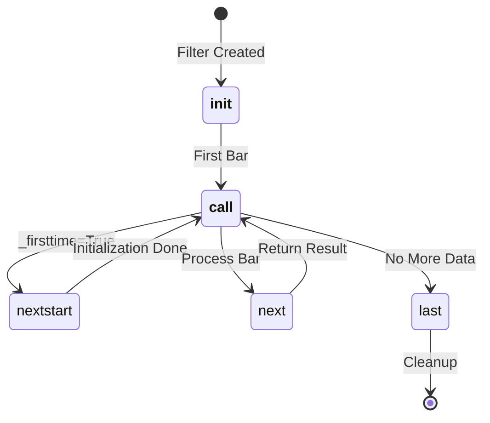

# Filter API

Filters in Backtrader transform or filter data bars before they are processed by strategies. Filters can be applied to data feeds to perform operations like filling missing bars, calculating derived data types (Heikin Ashi, Renko), and filtering by session times.

## Class Definition

```python
class backtrader.Filter(ParameterizedBase):
    """Base class for data filters."""
```

## Core Methods and Lifecycle

### `__init__(self, data, **kwargs)`

Initialize the filter with the data feed to be filtered.

```python
def __init__(self, data, **kwargs):
    super().__init__(**kwargs)
```

### `__call__(self, data)`

Process a data bar through the filter. This is the main entry point called for each bar.

```python
def __call__(self, data):
    if self._firsttime:
        self.nextstart(data)
        self._firsttime = False
    self.next(data)
```

**Return Values**:
- `False`: Stream was not modified (bar accepted)
- `True`: Stream was modified (bar filtered/rejected)

### `nextstart(self, data)`

Called on the first bar before filtering starts. Override this method to perform one-time initialization.

```python
def nextstart(self, data):
    """Override for initialization logic."""
    pass
```

### `next(self, data)`

Process each data bar. Subclasses must override this method to implement filtering logic.

```python
def next(self, data):
    """Override to implement filter logic."""
    pass
```

### `last(self, data)`

Called when data is no longer producing bars. Can be called multiple times to deliver extra bars.

```python
def last(self, data):
    """Override to deliver final bars."""
    return False  # True if something delivered
```

## Filter Lifecycle



## Integration with Data Feeds

Filters are applied to data feeds using the `addfilter` method:

```python
import backtrader as bt

# Create data feed
data = bt.feeds.GenericCSVData(dataname='data.csv')

# Apply filter
data.addfilter(bt.filters.HeikinAshi())

# Add to cerebro
cerebro.adddata(data)
```

## Built-in Filters

### CalendarDays

Fills missing calendar days in trading day data.

```python
class backtrader.filters.CalendarDays(ParameterizedBase):
    """Bar Filler to add missing calendar days to trading days."""
```

**Parameters**:

| Parameter | Type | Default | Description |
|-----------|------|---------|-------------|
| `fill_price` | float/None | None | Price to fill gaps (>0: use value, 0/None: last close, -1: mid of H-L) |
| `fill_vol` | float | NaN | Value for missing volume |
| `fill_oi` | float | NaN | Value for missing open interest |

**Example**:

```python
# Fill missing weekends and holidays
data = bt.feeds.GenericCSVData(dataname='data.csv')
data.addfilter(bt.filters.CalendarDays(
    fill_price=None,  # Use last close price
    fill_vol=0.0,     # Zero volume for filled bars
))
cerebro.adddata(data)
```

### SessionFilter

Filters out intraday bars that fall outside regular session times (pre/post market data).

```python
class backtrader.filters.SessionFilter(ParameterizedBase):
    """Filter out bars outside regular session times."""
```

**Example**:

```python
# Only keep bars during regular trading hours
data = bt.feeds.GenericCSVData(
    dataname='intraday.csv',
    sessionstart=datetime.time(9, 30),
    sessionend=datetime.time(16, 0),
)
data.addfilter(bt.filters.SessionFilter())
cerebro.adddata(data)
```

### SessionFiller

Fills missing bars over gaps within a trading session.

```python
class backtrader.filters.SessionFiller(ParameterizedBase):
    """Bar Filler to add missing bars over gaps in a session."""
```

**Parameters**:

| Parameter | Type | Default | Description |
|-----------|------|---------|-------------|
| `fill_price` | float/None | None | Price to fill gaps (None: last close) |
| `fill_vol` | float | NaN | Value for missing volume |
| `fill_oi` | float | NaN | Value for missing open interest |
| `skip_first_fill` | bool | True | Don't fill from session start to first bar |

**Example**:

```python
# Fill missing 5-minute bars within trading session
data = bt.feeds.GenericCSVData(
    dataname='intraday.csv',
    timeframe=bt.TimeFrame.Minutes,
    compression=5,
    sessionstart=datetime.time(9, 30),
    sessionend=datetime.time(16, 0),
)
data.addfilter(bt.filters.SessionFiller(
    fill_price=None,
    fill_vol=0.0,
))
cerebro.adddata(data)
```

### DataFilter

Generic filter that uses a callable function to filter bars.

```python
class backtrader.filters.DataFilter(AbstractDataBase):
    """Filter bars based on a callable function."""
```

**Parameters**:

| Parameter | Type | Default | Description |
|-----------|------|---------|-------------|
| `funcfilter` | callable | None | Function returning True to accept, False to reject |

**Example**:

```python
# Define filter function
def my_filter(data):
    """Reject bars with zero volume."""
    return data.volume[0] > 0

# Apply filter
data = bt.feeds.GenericCSVData(dataname='data.csv')
wrapped_data = bt.filters.DataFilter(dataname=data)
wrapped_data.p.funcfilter = my_filter
cerebro.adddata(wrapped_data)
```

### HeikinAshi

Remodels OHLC data into Heikin Ashi candlesticks.

```python
class backtrader.filters.HeikinAshi:
    """Remodels OHLC to Heikin Ashi candlesticks."""
```

**Heikin Ashi Formula**:
- Close = (Open + High + Low + Close) / 4
- Open = (Previous Open + Previous Close) / 2
- High = max(Open, Close, High)
- Low = min(Open, Close, Low)

**Example**:

```python
data = bt.feeds.GenericCSVData(dataname='data.csv')
data.addfilter(bt.filters.HeikinAshi())
cerebro.adddata(data)
```

### Renko

Converts price data into Renko bricks.

```python
class backtrader.filters.Renko(Filter):
    """Modify data stream to draw Renko bars (or bricks)."""
```

**Parameters**:

| Parameter | Type | Default | Description |
|-----------|------|---------|-------------|
| `hilo` | bool | False | Use high/low instead of close |
| `size` | float/None | None | Size of each brick |
| `autosize` | float | 20.0 | Divisor for auto-calculating brick size |
| `dynamic` | bool | False | Recalculate size for each brick |
| `align` | float | 1.0 | Alignment factor for price boundaries |
| `roundstart` | bool | True | Round initial start value |

**Example**:

```python
# Create 10-point Renko bricks
data = bt.feeds.GenericCSVData(dataname='data.csv')
data.addfilter(bt.filters.Renko(
    size=10.0,  # 10-point bricks
    hilo=False,  # Use close price
))
cerebro.adddata(data)
```

### DataFiller

Fills gaps in data feeds based on timeframe and session settings.

```python
class backtrader.filters.DataFiller(AbstractDataBase):
    """Fill gaps in source data."""
```

**Parameters**:

| Parameter | Type | Default | Description |
|-----------|------|---------|-------------|
| `fill_price` | float/None | None | Price to fill gaps |
| `fill_vol` | float | NaN | Value for missing volume |
| `fill_oi` | float | NaN | Value for missing open interest |

**Example**:

```python
# Wrap data feed with DataFiller
data = bt.feeds.GenericCSVData(dataname='data.csv')
filled_data = bt.filters.DataFiller(dataname=data)
cerebro.adddata(filled_data)
```

### DaySplitterClose

Splits daily bars into two parts for replay simulation.

```python
class backtrader.filters.DaySplitterClose(ParameterizedBase):
    """Splits daily bar into OHLX and CCCC ticks."""
```

**Parameters**:

| Parameter | Type | Default | Description |
|-----------|------|---------|-------------|
| `closevol` | float | 0.5 | Percentage of volume for closing tick (0.0-1.0) |

**Example**:

```python
# Split daily bars for replay
data = bt.feeds.GenericCSVData(dataname='daily.csv')
data.addfilter(bt.filters.DaySplitterClose(closevol=0.5))
cerebro.replaydata(data)  # Use with replaydata
```

### BarReplayerOpen (DayStepsFilter)

Splits bars into open and OHLC parts to simulate replay.

```python
class backtrader.filters.BarReplayerOpen:
    """Split bar into Open and OHLC parts."""
```

**Example**:

```python
data = bt.feeds.GenericCSVData(dataname='data.csv')
data.addfilter(bt.filters.BarReplayerOpen())
cerebro.adddata(data)
```

## Custom Filter Development

### Simple Filter (No Stack Management)

For filters that only need to accept/reject bars:

```python
class VolumeFilter(bt.Filter):
    """Filter out bars with volume below threshold."""

    params = (('min_volume', 1000),)

    def next(self, data):
        if data.volume[0] < self.p.min_volume:
            data.backwards()  # Remove bar from stream
            return True  # Signal stream was modified
        return False  # Bar accepted
```

### Complex Filter (Stack Management)

For filters that modify or add bars:

```python
class PriceModifier(bt.Filter):
    """Modify close price based on formula."""

    params = (('factor', 1.01),)  # 1% increase

    def next(self, data):
        # Modify the close price
        data.close[0] *= self.p.factor
        # Adjust high if needed
        if data.close[0] > data.high[0]:
            data.high[0] = data.close[0]
        return False  # Stream length unchanged
```

### Filter with State

```python
class RangeFilter(bt.Filter):
    """Filter bars based on average true range."""

    params = (('period', 14), ('threshold', 2.0),)

    def __init__(self, data, **kwargs):
        super().__init__(data, **kwargs)
        self.true_ranges = []

    def next(self, data):
        if len(data) < 2:
            return False

        tr = max(
            data.high[0] - data.low[0],
            abs(data.high[0] - data.close[-1]),
            abs(data.low[0] - data.close[-1])
        )
        self.true_ranges.append(tr)

        if len(self.true_ranges) > self.p.period:
            self.true_ranges.pop(0)

            avg_tr = sum(self.true_ranges) / len(self.true_ranges)
            current_range = data.high[0] - data.low[0]

            if current_range > avg_tr * self.p.threshold:
                data.backwards()
                return True

        return False
```

## Filter Return Values

Understanding the return value is critical for filter behavior:

| Return | Meaning | Effect |
|--------|---------|--------|
| `False` | Stream unchanged | Bar is accepted/processed normally |
| `True` | Stream modified | Bar was filtered out or modified |

## Common Patterns

### Filtering by Time

```python
class AfterHoursFilter(bt.Filter):
    """Remove pre-market and after-hours bars."""

    params = (('start', datetime.time(9, 30)),
              ('end', datetime.time(16, 0)),)

    def next(self, data):
        current_time = data.datetime.time(0)
        if not (self.p.start <= current_time <= self.p.end):
            data.backwards()
            return True
        return False
```

### Data Transformation

```python
class LogTransform(bt.Filter):
    """Apply log transformation to prices."""

    def next(self, data):
        import math
        data.open[0] = math.log(data.open[0])
        data.high[0] = math.log(data.high[0])
        data.low[0] = math.log(data.low[0])
        data.close[0] = math.log(data.close[0])
        return False
```

### Conditional Bar Addition

```python
class AddSignalBar(bt.Filter):
    """Add a signal bar when conditions are met."""

    def next(self, data):
        if len(data) < 10:
            return False

        # Check for crossover condition
        if data.close[0] > data.close[-1]:
            # Add a signal bar
            bar = [float('NaN')] * data.size()
            bar[data.DateTime] = data.datetime[0]
            for i in [data.Open, data.High, data.Low, data.Close]:
                bar[i] = data.close[0]
            bar[data.Volume] = 0.0
            data._add2stack(bar)

        return False
```

## Full Example: Custom Filter

```python
import backtrader as bt
from datetime import datetime

class VolatilityFilter(bt.Filter):
    """Filter out low volatility periods."""

    params = (
        ('period', 20),
        ('std_threshold', 0.02),  # 2% of price
    )

    def __init__(self, data, **kwargs):
        super().__init__(data, **kwargs)
        self.closes = []

    def next(self, data):
        self.closes.append(data.close[0])

        # Need enough data
        if len(self.closes) < self.p.period:
            return False

        # Keep only recent data
        if len(self.closes) > self.p.period:
            self.closes.pop(0)

        # Calculate standard deviation
        import statistics
        mean = statistics.mean(self.closes)
        std = statistics.stdev(self.closes)
        cv = std / mean if mean != 0 else 0

        # Filter if coefficient of variation is below threshold
        if cv < self.p.std_threshold:
            data.backwards()
            return True

        return False


# Usage
class MyStrategy(bt.Strategy):
    def __init__(self):
        self.sma = bt.indicators.SMA(self.data.close, period=20)

    def next(self):
        if not self.position:
            if self.data.close[0] > self.sma[0]:
                self.buy()


# Create cerebro
cerebro = bt.Cerebro()

# Add data with filter
data = bt.feeds.GenericCSVData(
    dataname='stock_data.csv',
    fromdate=datetime(2020, 1, 1),
    todate=datetime(2023, 12, 31),
)
data.addfilter(VolatilityFilter(period=20, std_threshold=0.02))
cerebro.adddata(data)

# Add strategy
cerebro.addstrategy(MyStrategy)

# Run
result = cerebro.run()
```

## Best Practices

1. **Always call `super().__init__()`** when overriding `__init__`
2. **Return correct values**: `True` if stream modified, `False` otherwise
3. **Use `data.backwards()`** to remove bars from stream
4. **Use `data._add2stack()`** to add bars to stream
5. **Check `len(data)`** before accessing historical values
6. **Consider performance** for large datasets - filters are called for every bar
7. **Test filters** with simple data before applying to complex strategies

## Next Steps

- [Strategy API](strategy.md) - Strategy development
- [Data Feeds API](data-feeds.md) - Data source configuration
- [Indicators API](indicator.md) - Technical indicators
