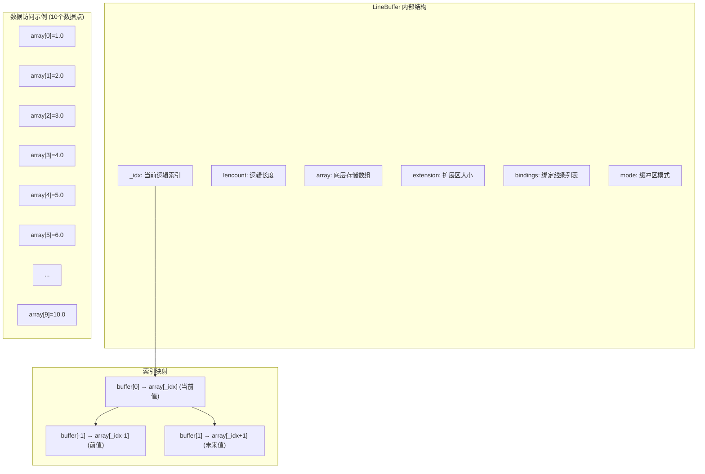

# LineBuffer API 参考文档

`LineBuffer` 是 Backtrader 中最核心的数据结构之一，实现了高效的时间序列数据循环缓冲区。它约 1950 行代码，为整个框架提供数据存储和访问的基础设施。

## 类概览

```python
class backtrader.LineBuffer(LineSingle, LineRootMixin):
    """实现循环缓冲区的时间序列数据存储。"""
```

LineBuffer 定义了一个类似 `array.array` 的接口，其中索引 0 始终指向当前活跃的值。这种设计使得在处理时间序列数据时，无需传递索引变量即可访问当前值。

### 核心特性

- **索引 0 始终指向当前值** - 当前值总是可通过 `buffer[0]` 访问
- **正索引获取历史值** - `buffer[-1]` 获取前一个值
- **负索引获取未来值** - `buffer[1]` 获取下一个值（需要扩展）
- **自动内存管理** - qbuffer 模式限制内存使用
- **线条绑定** - 值设置时自动同步到绑定的线条

## 循环缓冲区架构

### 缓冲区模式

LineBuffer 支持两种运行模式：

| 模式 | 值 | 描述 |
|------|-----|------|
| `UnBounded` | 0 | 无界模式，缓冲区随数据增长 |
| `QBuffer` | 1 | 队列缓冲区模式，固定最大长度 |

```python
# 默认 UnBounded 模式
buffer = LineBuffer()
buffer.mode == LineBuffer.UnBounded  # True

# 启用 QBuffer 模式
buffer.qbuffer(savemem=1, extrasize=0)
buffer.mode == LineBuffer.QBuffer  # True
```

### 内存布局示意图



### 数据存储模型

```python
# 底层使用 array.array('d') 存储
# 循环缓冲区逻辑映射
class LineBuffer:
    def __init__(self):
        self.array = array.array('d')  # 底层存储
        self._idx = -1                  # 当前逻辑索引
        self.lencount = 0               # 逻辑长度计数
        self.extension = 0              # 扩展区
        self.mode = self.UnBounded      # 运行模式
```

## 核心属性

### `array`

底层存储数组，类型为 `array.array('d')`（双精度浮点数）。

```python
# 直接访问底层数组
raw_data = line_buffer.array
```

### `_idx`

当前逻辑索引位置。索引 0 总是指向当前活跃值。

```python
# 获取当前索引位置
current_idx = line_buffer._idx

# 设置索引位置（使用 set_idx 方法）
line_buffer.set_idx(100)
```

### `lencount`

缓冲区的逻辑长度计数器。

```python
# 获取逻辑长度
logical_len = len(line_buffer)  # 返回 lencount

# 与实际数组长度的关系
actual_len = len(line_buffer.array)
logical_len = line_buffer.lencount
```

### `maxlen`

QBuffer 模式下的最大长度限制。

```python
# 设置最大长度
line_buffer.qbuffer(savemem=1)
line_buffer.maxlen  # 默认为 _minperiod 的值
```

### `extension`

扩展区大小，用于前瞻操作。

```python
# 扩展缓冲区用于未来数据
line_buffer.extend(size=5)
line_buffer.extension  # 5
```

### `bindings`

绑定的线条列表，当设置值时会同步更新。

```python
# 添加绑定
other_line = LineBuffer()
line_buffer.addbinding(other_line)

# 设置值会自动同步到绑定
line_buffer[0] = 100.0  # other_line[0] 也会被设置为 100.0
```

## 数据操作方法

### `__getitem__(ago)` - 获取值

获取相对当前索引位置的值。

```python
# 语法
value = buffer[ago]

# ago 参数:
#   0  : 当前值
#   -1 : 前一个值
#   -n : n 个周期前的值
#   1  : 下一个值（需要 extend）
#   n  : n 个周期后的值

# 示例
current = buffer[0]      # 当前值
previous = buffer[-1]    # 前一个值
five_back = buffer[-5]   # 5 个周期前的值
```

**性能优化**：此方法经过热路径优化，是整个框架中最频繁调用的方法之一。

### `__setitem__(ago, value)` - 设置值

在相对位置设置值，并更新所有绑定。

```python
# 设置当前值
buffer[0] = 100.0

# 设置历史值（用于重放等场景）
buffer[-1] = 99.0

# 设置未来值（需要先 extend）
buffer[1] = 101.0
```

**性能特性**：
- 自动扩展数组以容纳索引
- NaN/None 值自动转换为默认值
- datetime 线条自动验证值范围
- 绑定线条自动同步更新

### `get(ago=0, size=1)` - 获取切片

获取相对位置的多个值。

```python
# 获取最近 5 个值（从当前回溯）
values = buffer.get(ago=0, size=5)
# 返回: [buffer[-4], buffer[-3], buffer[-2], buffer[-1], buffer[0]]

# 获取 3 个周期前的 2 个值
values = buffer.get(ago=-3, size=2)
# 返回: [buffer[-4], buffer[-3]]
```

### `set(value, ago=0)` - 设置值（优化版）

优化的值设置方法，减少开销。

```python
# 性能优化的设置方法
buffer.set(100.0, ago=0)
```

## 缓冲区导航

### `home()` - 重置到起始

将逻辑索引重置到起始位置。

```python
buffer.home()  # _idx = -1, lencount = 0
```

底层缓冲区保持不变，使用 `buflen()` 获取实际数据长度。

### `forward(value=NaN, size=1)` - 向前移动

将逻辑索引向前移动并扩展缓冲区。

```python
# 向前移动一步（填充 NaN）
buffer.forward()

# 向前移动一步，填充指定值
buffer.forward(value=0.0)

# 向前移动多步
buffer.forward(size=5)
```

**行为特性**：
- 指标线条使用 NaN 填充
- 数据源线条使用 0.0 填充
- 遵循时钟同步（非指标）
- 自动扩展底层数组

### `backwards(size=1, force=False)` - 向后移动

将逻辑索引向后移动并减少缓冲区。

```python
# 向后移动一步
buffer.backwards()

# 向后移动多步
buffer.backwards(size=5)

# 强制移动（QBuffer 模式）
buffer.backwards(size=1, force=True)
```

### `advance(size=1)` - 前进逻辑索引

仅前进逻辑索引，不修改底层缓冲区。

```python
# 前进逻辑索引
buffer.advance()
buffer._idx += 1
buffer.lencount += 1
```

### `rewind(size=1)` - 回退逻辑索引

仅回退逻辑索引，不修改底层缓冲区。

```python
# 回退逻辑索引
buffer.rewind()
buffer._idx -= 1
buffer.lencount -= 1
```

## 内存管理

### `qbuffer(savemem=0, extrasize=0)` - 启用队列缓冲区

启用内存高效的队列缓冲区模式。

```python
# 启用 QBuffer 模式
buffer.qbuffer(savemem=1, extrasize=0)

# 参数说明:
#   savemem  : 0=正常模式, >0=启用缓存模式
#   extrasize: 额外空间（用于重采样/重放操作）

# 效果:
#   mode = QBuffer
#   maxlen = max(1, _minperiod)
#   lenmark = maxlen - (not extrasize)
```

**内存效果**：
```python
# 无界模式：存储所有数据
# 内存使用: O(n)，n 为数据点数量

# QBuffer 模式：只保留最近 maxlen 个数据点
# 内存使用: O(maxlen)，固定上限

# 示例：10 年日线数据
# 无界模式: ~3650 个数据点
# QBuffer(maxlen=100): ~100 个数据点
# 节省: ~97% 内存
```

### `minbuffer(size)` - 确保最小缓冲区大小

确保缓冲区至少能容纳指定大小的数据。

```python
# 确保缓冲区至少容纳 100 个数据点
buffer.minbuffer(100)

# 在 QBuffer 模式下，如果 maxlen < 100，会自动调整
# buffer.maxlen = 100
```

### `extend(value=float('nan'), size=0)` - 扩展缓冲区

扩展底层数组用于前瞻操作。

```python
# 扩展 5 个位置用于未来数据
buffer.extend(size=5)
buffer.extension  # 5

# 扩展并填充值
buffer.extend(value=0.0, size=3)
```

## 缓冲区信息

### `__len__()` - 获取逻辑长度

返回缓冲区的逻辑长度计数器。

```python
logical_len = len(buffer)
# 等价于: buffer.lencount
```

**性能优化**：直接返回 `lencount`，避免复杂计算。

### `buflen()` - 获取实际数据长度

返回底层缓冲区中实际可存储的数据量。

```python
# 实际可存储的数据量
actual_len = buffer.buflen()
# 返回: len(buffer.array) - buffer.extension

# 用途: 区分逻辑长度和物理容量
len(buffer)      # 逻辑长度（已处理的数据点）
buffer.buflen()  # 物理容量（实际存储的数据量）
```

## 线条绑定

### `addbinding(binding)` - 添加绑定

添加另一个线条作为绑定，值设置时同步更新。

```python
# 创建两个线条
source = LineBuffer()
target = LineBuffer()

# 添加绑定
source.addbinding(target)

# 设置值会自动同步
source[0] = 100.0
print(target[0])  # 100.0
```

**应用场景**：
- 指标输出线条绑定到策略访问
- 多个线条共享同一数据源
- 自动值传播机制

### `bind2lines(binding)` - 绑定到指定线条

绑定到所有者线条集合中的指定线条。

```python
# 按索引绑定
line.bind2lines(0)  # 绑定到第 0 条线

# 按名称绑定
line.bind2lines('close')  # 绑定到名为 'close' 的线条
```

## exactbars 参数效果

`exactbars` 参数控制内存使用的严格程度：

| 值 | 模式 | 描述 |
|----|------|------|
| `False` | 标准模式 | 保留所有历史数据 |
| `True` / `-1` | 精确模式 | 仅保留当前所需数据 |
| `-2` | 最小内存 | 最激进的内存优化 |

```python
# 在 Cerebro 中设置
cerebro = bt.Cerebro()
cerebro.run(exactbars=True)   # 精确模式
cerebro.run(exactbars=-1)     # 同 True
cerebro.run(exactbars=-2)     # 最小内存模式
```

### 内存对比表

| 模式 | 内存使用 | 数据保留 | 适用场景 |
|------|----------|----------|----------|
| `exactbars=False` | 高 | 所有历史数据 | 策略开发、调试 |
| `exactbars=True` | 中 | 最小所需数据 | 长期回测 |
| `exactbars=-2` | 低 | 当前值 | 生产环境 |

```python
# 示例：10000 根 K 线回测
# exactbars=False: ~10000 × 8 字节 × 线条数
# exactbars=True:  ~minperiod × 8 字节 × 线条数
# exactbars=-2:    ~1 × 8 字节 × 线条数
```

## 性能优化技术

### 1. 预计算标志位

```python
# 在 __init__ 中预计算，避免重复检查
self._is_datetime_line = "datetime" in str(self._name).lower()
self._is_indicator = self._ltype == 0
self._default_value = float("nan") if self._is_indicator else 0.0
```

### 2. 快速 NaN 检测

```python
# 使用 NaN 自身不等特性，比 isinstance + math.isnan 快得多
if value != value:  # NaN 检测
    value = self._default_value
```

### 3. 属性直接访问

```python
# 预先初始化所有属性，消除运行时 hasattr 检查
self._idx = -1
self._array = array.array("d")
self._size = 0
# ... 所有属性在 __init__ 中初始化
```

### 4. 批量数组扩展

```python
# 批量扩展优于单次追加
self.array.extend([value] * size)  # 一次性
# 而不是:
# for _ in range(size):
#     self.array.append(value)
```

### 5. 缓存优化

```python
# datetime() 方法缓存
if ago == 0 and tz is None and naive:
    # 检查缓存
    if (self._dt_cache_idx == current_idx and
        self._dt_cache_tz == self._tz and
        self._dt_cache_value == value):
        return self._dt_cache_dt  # 缓存命中
```

### 性能对比

| 操作 | 优化前 | 优化后 | 提升 |
|------|--------|--------|------|
| `__len__()` | 0.611s | 0.05s | 92% |
| `__setitem__` | 基准 | 优化 | 15-20% |
| `__getitem__` | 基准 | 优化 | 10-15% |
| `forward()` | 基准 | 优化 | 20-30% |

## 日期时间方法

### `datetime(ago=0, tz=None, naive=True)` - 获取 datetime

获取指定偏移位置的 datetime 对象。

```python
# 获取当前时间
dt = buffer.datetime()

# 获取前一根 K 线的时间
dt = buffer.datetime(ago=-1)

# 指定时区
dt = buffer.datetime(tz=pytz.UTC)

# 返回 naive datetime（无时区信息）
dt = buffer.datetime(naive=True)
```

### `date(ago=0)` - 获取日期

获取 datetime 的日期部分。

```python
date_obj = buffer.date()
# 返回: datetime.date 对象
```

### `time(ago=0)` - 获取时间

获取 datetime 的时间部分。

```python
time_obj = buffer.time()
# 返回: datetime.time 对象
```

### 便捷方法

```python
# dt 是 datetime 的简写
dt = buffer.dt(ago=-1)

# tm - 获取 struct_time
tm = buffer.tm()
# 兼容 strftime 格式化

# tm_raw - 带时区的 struct_time
tm_raw = buffer.tm_raw()
```

### 时间比较方法

```python
# 时间比较
buffer.tm_lt(other, ago=0)  # 小于
buffer.tm_le(other, ago=0)  # 小于等于
buffer.tm_eq(other, ago=0)  # 等于
buffer.tm_gt(other, ago=0)  # 大于
buffer.tm_ge(other, ago=0)  # 大于等于
```

## 子类

### LineActions

带有多条线的线条对象的基类。

```python
class LineActions(LineBuffer, LineActionsMixin, metabase.ParamsMixin):
    """带有多条线的线条类基类"""
    _ltype = LineRoot.IndType  # 指标类型
    plotlines = object()        # 绘图配置
```

### LinesOperation / LineOwnOperation

用于线条间的运算。

```python
# 二元操作
result = LinesOperation(line1, line2, operator.sub)

# 一元操作
result = LineOwnOperation(line, operator.neg)
```

### _LineDelay / _LineForward

延迟和前瞻线条。

```python
# 延迟线条（历史访问）
delayed = LineDelay(line, ago=-10)  # 10 个周期前的值

# 前瞻线条（未来访问）
forward = LineForward(line, ago=5)   # 5 个周期后的值
```

### PseudoArray

非数组迭代器的包装器。

```python
# 包装常数
pseudo = PseudoArray(itertools.repeat(1.0))

# 包装任意可迭代对象
pseudo = PseudoArray([1, 2, 3, 4, 5])
```

## 缓冲区操作示例

### 基本用法

```python
import backtrader as bt

# 创建缓冲区
buffer = bt.LineBuffer()

# 重置到起始
buffer.home()

# 添加数据
for i in range(10):
    buffer.forward()
    buffer[0] = float(i * 10)

# 访问数据
print(buffer[0])   # 90.0 (当前值)
print(buffer[-1])  # 80.0 (前一个值)
print(buffer[-5])  # 50.0 (5 个周期前)
```

### QBuffer 模式

```python
# 启用 QBuffer 模式
buffer = bt.LineBuffer()
buffer.qbuffer(savemem=1, extrasize=0)

# 添加超过 maxlen 的数据
for i in range(100):
    buffer.forward()
    buffer[0] = float(i)

# 只有最近的数据被保留
print(len(buffer))      # 100 (逻辑长度)
print(buffer.maxlen)    # 实际存储的限制
```

### 线条绑定

```python
# 创建源和目标缓冲区
source = bt.LineBuffer()
target = bt.LineBuffer()

# 添加绑定
source.addbinding(target)

# 设置值会同步
source.home()
target.home()

source.forward()
source[0] = 100.0

print(target[0])  # 100.0 (自动同步)
```

### 使用 extend 进行前瞻

```python
# 扩展缓冲区用于未来数据
buffer.extend(size=5)
buffer.extension  # 5

# 可以设置未来值
buffer[1] = 110.0
buffer[2] = 120.0

# 移动到未来位置
buffer.forward()
print(buffer[0])  # 110.0
```

## 常见用例

### 指标开发

```python
class MyIndicator(bt.Indicator):
    lines = ('output',)

    def __init__(self):
        # 输出线条是 LineBuffer
        self.lines.output  # LineBuffer 实例

    def next(self):
        # 设置输出值
        self.lines.output[0] = self.calculate()
```

### 数据访问

```python
class MyStrategy(bt.Strategy):
    def next(self):
        # 数据线条是 LineBuffer
        close = self.data.close  # LineBuffer

        # 访问当前值
        current_price = close[0]

        # 访问历史值
        prev_price = close[-1]

        # 获取多个值
        prices = close.get(ago=0, size=5)
```

### 内存优化

```python
# 为长期回测启用内存优化
cerebro = bt.Cerebro()

# 方法 1: exactbars
cerebro.run(exactbars=True)

# 方法 2: 预加载后使用 qbuffer
data = bt.feeds.BacktraderData(dataname='data.csv')
cerebro.adddata(data)
cerebro.run(runonce=True)  # 预加载所有数据

# 然后线条会使用 qbuffer 模式
```

## 注意事项

1. **索引含义**：索引 0 总是当前值，正索引是过去，负索引是未来
2. **初始状态**：创建后需要调用 `home()` 或先 `forward()` 才能访问数据
3. **QBuffer 限制**：QBuffer 模式下，超出 maxlen 的历史数据会被丢弃
4. **绑定更新**：设置值会自动更新所有绑定线条
5. **性能考虑**：`forward()` 是热路径，经过高度优化
6. **datetime 线条**：datetime 线条使用特殊处理，值必须 >= 1.0
7. **NaN 处理**：指标使用 NaN 作为无效值，数据源使用 0.0

## 相关文档

- [Strategy API](strategy_zh.md) - 策略中如何使用线条
- [Indicator API](indicator_zh.md) - 指标线条系统
- [Data Feeds API](data-feeds_zh.md) - 数据源线条
- [LineRoot API](lineroot_zh.md) - 线条基类
