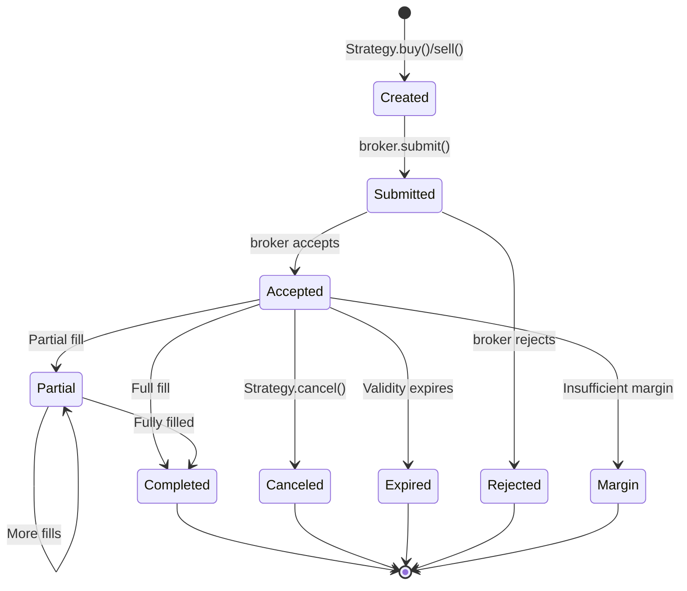

# Order API

The Order system in Backtrader manages order creation, execution tracking, and status management. It supports multiple order types including Market, Limit, Stop, StopLimit, StopTrail, and Close orders.

## Class Hierarchy

```
OrderBase
    Order
        BuyOrder
            StopBuyOrder
            StopLimitBuyOrder
        SellOrder
            StopSellOrder
            StopLimitSellOrder
```

## Order Base Class

### `OrderBase`

The base class for all order types. Provides common attributes and methods for order tracking, status management, and execution.

```python
class backtrader.OrderBase:
    """Base class for order objects."""
```

## Order Types

### `Order`

Main order class for buy/sell orders. Extends `OrderBase` with order direction and session end time handling.

```python
class backtrader.Order(backtrader.OrderBase):
    """Order class for buy/sell orders."""
```

### `BuyOrder`

Buy order with `ordtype` set to `Order.Buy`.

```python
class backtrader.BuyOrder(backtrader.Order):
    """Buy order class."""
    ordtype = Order.Buy
```

### `SellOrder`

Sell order with `ordtype` set to `Order.Sell`.

```python
class backtrader.SellOrder(backtrader.Order):
    """Sell order class."""
    ordtype = Order.Sell
```

## Execution Types

Orders can have different execution types specified via the `exectype` parameter.

| Type | Constant | Description |
|------|----------|-------------|
| Market | `Order.Market` | Execute at current market price |
| Close | `Order.Close` | Execute at session close price |
| Limit | `Order.Limit` | Execute at specified price or better |
| Stop | `Order.Stop` | Execute when price triggers stop level |
| StopLimit | `Order.StopLimit` | Becomes limit order when stop triggers |
| StopTrail | `Order.StopTrail` | Trailing stop order |
| StopTrailLimit | `Order.StopTrailLimit` | Trailing stop with limit price |
| Historical | `Order.Historical` | Historical order type |

```python
# Get execution type from string
exectype = Order.ExecType('Market')  # Returns Order.Market
```

## Order Status

Orders progress through various states during their lifecycle.

| Status | Constant | Description |
|--------|----------|-------------|
| Created | `Order.Created` | Order created but not submitted |
| Submitted | `Order.Submitted` | Submitted to broker |
| Accepted | `Order.Accepted` | Accepted by broker |
| Partial | `Order.Partial` | Partially filled |
| Completed | `Order.Completed` | Fully filled |
| Canceled | `Order.Canceled` | Canceled (alias: Cancelled) |
| Expired | `Order.Expired` | Order expired |
| Margin | `Order.Margin` | Insufficient margin |
| Rejected | `Order.Rejected` | Rejected by broker |

```python
# Check order status
if order.status == Order.Completed:
    print('Order filled')

# Get status name
status_name = order.getstatusname()  # e.g., 'Completed'
```

## Order Direction

| Direction | Constant | Description |
|-----------|----------|-------------|
| Buy | `Order.Buy` | Buy order |
| Sell | `Order.Sell` | Sell order |

```python
# Check order direction
if order.isbuy():
    print('Buy order')
elif order.issell():
    print('Sell order')
```

## Order Parameters

Orders are created with the following parameters via `Strategy.buy()`, `Strategy.sell()`, or `Strategy.close()`.

| Parameter | Type | Default | Description |
|-----------|------|---------|-------------|
| `owner` | Strategy | None | Strategy creating the order |
| `data` | Data feed | None | Data feed to trade |
| `size` | float | None | Position size (positive for buy/sell) |
| `price` | float | None | Limit/stop price |
| `pricelimit` | float | None | Limit price for stop-limit orders |
| `exectype` | Order.ExecType | Market | Execution type |
| `valid` | date/timedelta/float | None | Order validity period |
| `tradeid` | int | 0 | Trade identifier |
| `oco` | Order | None | One-cancels-other order |
| `trailamount` | float | None | Absolute trail amount |
| `trailpercent` | float | None | Percentage trail amount |
| `parent` | Order | None | Parent order (bracket orders) |
| `transmit` | bool | True | Whether to transmit order |
| `simulated` | bool | False | Simulated order |
| `histnotify` | bool | False | Historical notification |

## Order Attributes

### Creation Attributes

| Attribute | Type | Description |
|-----------|------|-------------|
| `ref` | int | Unique order reference number |
| `created` | OrderData | Order creation data |
| `owner` | Strategy | Strategy that created the order |
| `data` | Data feed | Associated data feed |
| `ordtype` | int | Order type (Buy/Sell) |
| `exectype` | int | Execution type |
| `status` | int | Current order status |

### Execution Attributes

| Attribute | Type | Description |
|-----------|------|-------------|
| `executed` | OrderData | Execution data |
| `size` | float | Requested/executed size |
| `price` | float | Execution price |
| `value` | float | Market value |
| `comm` | float | Commission |
| `pnl` | float | Profit/loss (closed trades) |
| `margin` | float | Margin required |
| `psize` | float | Position size after execution |
| `pprice` | float | Position price after execution |

### Validity Attributes

| Attribute | Type | Description |
|-----------|------|-------------|
| `valid` | float | Validity date/time |
| `dteos` | float | End of session date/time |
| `DAY` | timedelta | Constant for day orders |

## Order Methods

### Status Methods

#### `alive(self)`

Check if order can still be executed.

```python
if order.alive():
    print('Order is still active')
```

Returns `True` if status is Created, Submitted, Partial, or Accepted.

#### `active(self)`

Check if order is active.

```python
if order.active():
    print('Order is active')
```

#### `brokerstatus(self)`

Get current status from broker.

```python
status = order.brokerstatus()
```

### Type Methods

#### `isbuy(self)`

Returns `True` if order is a buy order.

```python
if order.isbuy():
    print('Buy order')
```

#### `issell(self)`

Returns `True` if order is a sell order.

```python
if order.issell():
    print('Sell order')
```

#### `getstatusname(self, status=None)`

Get status name as string.

```python
name = order.getstatusname()  # e.g., 'Completed'
name = order.getstatusname(Order.Submitted)  # 'Submitted'
```

#### `getordername(self, exectype=None)`

Get execution type name as string.

```python
name = order.getordername()  # e.g., 'Market'
name = order.getordername(Order.Limit)  # 'Limit'
```

#### `ordtypename(self, ordtype=None)`

Get order direction name as string.

```python
name = order.ordtypename()  # e.g., 'Buy'
name = order.ordtypename(Order.Sell)  # 'Sell'
```

### Lifecycle Methods

#### `submit(self, broker=None)`

Mark order as submitted to broker.

```python
order.submit(broker=self.broker)
```

#### `accept(self, broker=None)`

Mark order as accepted by broker.

```python
order.accept(broker=self.broker)
```

#### `reject(self, broker=None)`

Mark order as rejected.

```python
order.reject(broker=self.broker)
```

#### `cancel(self)`

Cancel the order.

```python
order.cancel()
```

#### `expire(self)`

Mark order as expired. Returns `True` if order should expire.

```python
if order.expire():
    print('Order expired')
```

#### `completed(self)`

Mark order as completed.

```python
order.completed()
```

#### `partial(self)`

Mark order as partially filled.

```python
order.partial()
```

#### `margin(self)`

Mark order as margin call.

```python
order.margin()
```

### Configuration Methods

#### `addcomminfo(self, comminfo)`

Associate commission scheme with order.

```python
order.addcomminfo(comminfo)
```

#### `addinfo(self, **kwargs)`

Add custom information to order.

```python
order.addinfo(reason='Entry', signal='MA Cross')
```

#### `setposition(self, position)`

Set current position for the asset.

```python
order.setposition(position)
```

#### `clone(self)`

Clone the order object.

```python
order_clone = order.clone()
```

## OrderData Class

### `OrderData`

Holds actual order data for creation and execution.

```python
class backtrader.OrderData:
    """Holds actual order data for Creation and Execution."""
```

### OrderData Attributes

| Attribute | Type | Description |
|-----------|------|-------------|
| `exbits` | deque | Execution bit history |
| `dt` | datetime | Creation/execution time |
| `size` | float | Requested/executed size |
| `price` | float | Execution price |
| `pricelimit` | float | Limit price for stop orders |
| `plimit` | float | Property for pricelimit |
| `trailamount` | float | Trailing stop amount |
| `trailpercent` | float | Trailing stop percent |
| `value` | float | Market value |
| `comm` | float | Commission |
| `pnl` | float | Profit/loss |
| `margin` | float | Margin required |
| `psize` | float | Position size |
| `pprice` | float | Position price |
| `remsize` | float | Remaining size to execute |
| `pclose` | float | Previous close price |

### OrderData Methods

#### `add(self, dt, size, price, ...)`

Add execution information to the order.

#### `addbit(self, exbit)`

Store an execution bit and recalculate values.

#### `getpending(self)`

Get list of pending execution bits.

#### `iterpending(self)`

Iterate over pending execution bits.

#### `markpending(self)`

Mark current execution bits as pending.

## OrderExecutionBit Class

### `OrderExecutionBit`

Holds information about a single order execution.

```python
class backtrader.OrderExecutionBit:
    """Holds information about order execution."""
```

### OrderExecutionBit Attributes

| Attribute | Type | Description |
|-----------|------|-------------|
| `dt` | datetime | Execution time |
| `size` | float | Size executed |
| `price` | float | Execution price |
| `closed` | float | Size of position closed |
| `opened` | float | Size of position opened |
| `closedvalue` | float | Value of closed position |
| `openedvalue` | float | Value of opened position |
| `closedcomm` | float | Commission for closed position |
| `openedcomm` | float | Commission for opened position |
| `value` | float | Total market value |
| `comm` | float | Total commission |
| `pnl` | float | Profit/loss |
| `psize` | float | Current position size |
| `pprice` | float | Current position price |

## Order Lifecycle



## Code Examples

### Market Order

Execute immediately at current market price.

```python
import backtrader as bt

class MyStrategy(bt.Strategy):
    def next(self):
        # Simple market buy
        order = self.buy()
        print(f'Order ref: {order.ref}')

        # Market sell
        order = self.sell()
```

### Limit Order

Execute at specified price or better.

```python
class MyStrategy(bt.Strategy):
    def next(self):
        # Buy at limit price
        if self.data.close[0] < 100:
            order = self.buy(price=99.5, exectype=Order.Limit)

        # Sell at limit price
        if self.data.close[0] > 100:
            order = self.sell(price=100.5, exectype=Order.Limit)
```

### Stop Order

Execute when price crosses stop level.

```python
class MyStrategy(bt.Strategy):
    def __init__(self):
        self.entry_price = None

    def next(self):
        if not self.position:
            # Enter with market order
            order = self.buy()
        else:
            if self.entry_price is None:
                self.entry_price = order.executed.price

            # Stop loss at 2% below entry
            stop_price = self.entry_price * 0.98
            self.sell(price=stop_price, exectype=Order.Stop)
```

### Stop-Limit Order

Becomes limit order when stop price is triggered.

```python
class MyStrategy(bt.Strategy):
    def next(self):
        # Stop at 95, then limit at 94.5
        order = self.sell(
            price=94.5,          # Limit price
            pricelimit=95.0,     # Stop trigger price
            exectype=Order.StopLimit
        )
```

### Trailing Stop Order

Stop price trails the market by specified amount.

```python
class MyStrategy(bt.Strategy):
    def next(self):
        if self.position:
            # Trailing stop with absolute amount
            self.sell(
                exectype=Order.StopTrail,
                trailamount=2.0
            )

            # Trailing stop with percentage
            self.sell(
                exectype=Order.StopTrail,
                trailpercent=0.05  # 5%
            )
```

### Close Order

Close existing position.

```python
class MyStrategy(bt.Strategy):
    def next(self):
        if self.position.size > 0:
            # Close long position
            order = self.close()

        if self.position.size < 0:
            # Close short position
            order = self.close()
```

### Order with Validity

Order that expires after certain time.

```python
from datetime import datetime, timedelta

class MyStrategy(bt.Strategy):
    def next(self):
        # Good for day
        order = self.buy(valid=timedelta())

        # Good for 3 days
        order = self.buy(valid=timedelta(days=3))

        # Good until specific date
        order = self.buy(valid=datetime(2024, 12, 31))
```

### Bracket Orders

Entry order with attached stop-loss and take-profit.

```python
class MyStrategy(bt.Strategy):
    def next(self):
        if not self.position:
            # Main entry order
            entry = self.buy(size=10)

            # Stop loss (child order, not transmitted immediately)
            stop_loss = self.sell(
                size=10,
                price=95,
                exectype=Order.Stop,
                parent=entry,
                transmit=False
            )

            # Take profit (child order, transmitted after stop)
            take_profit = self.sell(
                size=10,
                price=110,
                exectype=Order.Limit,
                parent=entry,
                transmit=True  # This transmits all bracket orders
            )
```

### OCO (One-Cancels-Other)

Cancel one order when the other executes.

```python
class MyStrategy(bt.Strategy):
    def next(self):
        if not self.position:
            # Two take-profit targets
            tp1 = self.sell(
                size=50,
                price=105,
                exectype=Order.Limit
            )

            tp2 = self.sell(
                size=50,
                price=110,
                exectype=Order.Limit,
                oco=tp1  # Cancel tp1 when tp2 executes
            )
```

### Order Notification

Handle order status changes.

```python
class MyStrategy(bt.Strategy):
    def notify_order(self, order):
        if order.status in [order.Submitted, order.Accepted]:
            return  # Wait for completion

        if order.status == order.Completed:
            if order.isbuy():
                self.log(
                    f'BUY EXECUTED: '
                    f'Price: {order.executed.price:.2f}, '
                    f'Size: {order.executed.size:.0f}, '
                    f'Cost: {order.executed.value:.2f}, '
                    f'Comm: {order.executed.comm:.2f}'
                )
            else:
                self.log(
                    f'SELL EXECUTED: '
                    f'Price: {order.executed.price:.2f}, '
                    f'Size: {order.executed.size:.0f}, '
                    f'Cost: {order.executed.value:.2f}, '
                    f'Comm: {order.executed.comm:.2f}'
                )

        elif order.status == order.Canceled:
            self.log('Order Canceled')

        elif order.status == order.Margin:
            self.log('Order Margin')

        elif order.status == order.Rejected:
            self.log('Order Rejected')
```

### CommissionInfo Integration

Orders work with commission schemes.

```python
class MyStrategy(bt.Strategy):
    def notify_order(self, order):
        if order.status == order.Completed:
            # Access execution details
            executed_value = order.executed.value
            commission = order.executed.comm
            pnl = order.executed.pnl

            self.log(
                f'Order {order.ref} completed. '
                f'Value: {executed_value:.2f}, '
                f'Commission: {commission:.2f}, '
                f'PnL: {pnl:.2f}'
            )
```

## CommissionInfo

The `CommissionInfo` class (defined in `broker.py`) works with orders to calculate commissions and margins.

Key methods that interact with orders:

- `getcommission(order)` - Calculate commission for order
- `setcommission(order)` - Set commission on order
- `getmargin(order)` - Get margin requirement
- `profitandloss(order)` - Calculate PnL

## Order Context (Internal)

### `OrderParams`

Internal parameter container for order configuration. Not typically used directly by users.

```python
class backtrader.OrderParams:
    """Simple parameter container for Order classes."""
```

## Best Practices

1. **Always store order references** when you need to track them:
   ```python
   self.order = self.buy()
   if self.order:
       return  # Wait for order to complete
   ```

2. **Check order status** before placing new orders to avoid over-trading.

3. **Use `notify_order`** to track order completion rather than polling.

4. **Set appropriate validity** for orders to avoid stale orders.

5. **Use bracket orders** for automatic stop-loss and take-profit.

6. **Consider commission** in your strategy calculations.

## Next Steps

- [Strategy API](strategy.md) - Order creation methods
- [Broker API](broker.md) - Order execution and portfolio management
- [Indicators API](indicator.md) - Trading indicators for order signals
