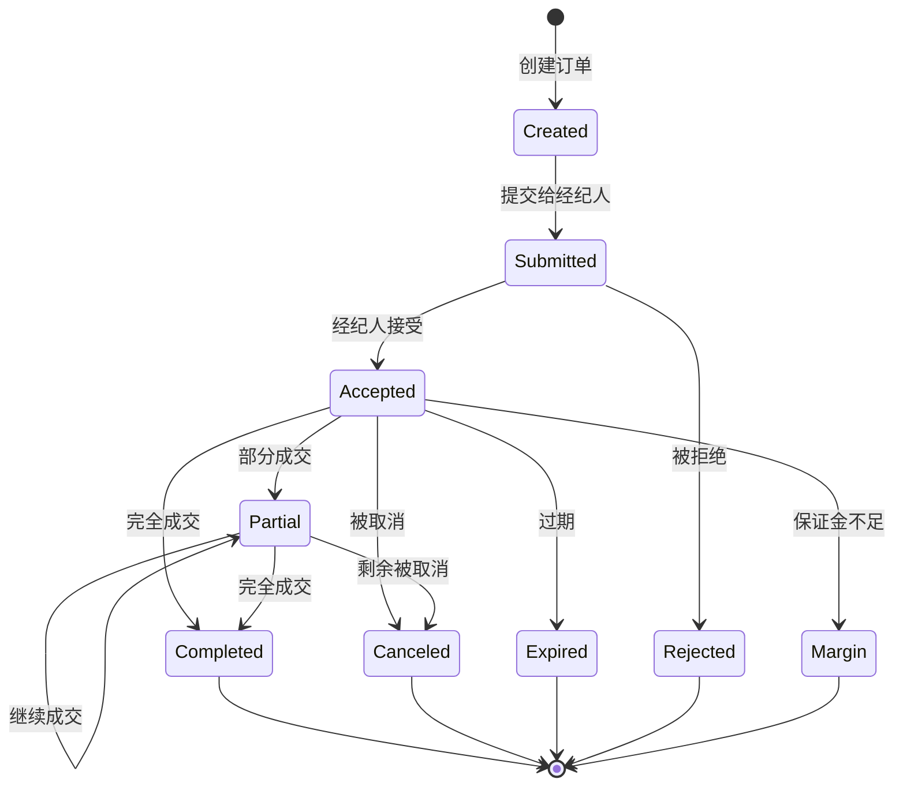

# Order API

`Order` 类是 Backtrader 中订单管理的核心，支持多种订单类型（市价、限价、止损、止损限价、追踪止损等）和完整的订单生命周期管理。

## 类层次结构

```python
OrderBase          # 订单基类，包含核心功能
    Order          # 主要订单类
        BuyOrder           # 买入订单
            StopBuyOrder           # 止损买入
            StopLimitBuyOrder      # 止损限价买入
        SellOrder          # 卖出订单
            StopSellOrder          # 止损卖出
            StopLimitSellOrder     # 止损限价卖出
```

## 核心类

### OrderBase

所有订单的基类，提供订单状态管理、执行跟踪和通用方法。

```python
class backtrader.OrderBase:
    """订单基类。"""
```

### Order

主要的订单类，继承自 OrderBase，添加了订单方向（买入/卖出）和会话结束时间处理。

```python
class backtrader.Order(OrderBase):
    """订单类，用于买入/卖出订单。"""
```

### OrderData

存储订单创建和执行的实际数据。

```python
class backtrader.OrderData:
    """存储订单创建和执行数据。"""
```

### OrderExecutionBit

存储单次执行的信息。

```python
class backtrader.OrderExecutionBit:
    """存储单次订单执行信息。"""
```

## 订单类型

### 执行类型 (Order.ExecType)

| 类型 | 常量 | 描述 |
|------|------|-------------|
| Market | `Order.Market` | 市价单，立即以当前价格执行 |
| Close | `Order.Close` | 收盘价单，以K线收盘价执行 |
| Limit | `Order.Limit` | 限价单，指定价格或更好价格执行 |
| Stop | `Order.Stop` | 止损单，触发后成为市价单 |
| StopLimit | `Order.StopLimit` | 止损限价单，触发后成为限价单 |
| StopTrail | `Order.StopTrail` | 追踪止损单，动态调整止损价 |
| StopTrailLimit | `Order.StopTrailLimit` | 追踪止损限价单 |
| Historical | `Order.Historical` | 历史订单 |

### 方向类型 (Order.OrdType)

| 类型 | 常量 | 描述 |
|------|------|-------------|
| Buy | `Order.Buy` | 买入订单 |
| Sell | `Order.Sell` | 卖出订单 |

## 订单状态

| 状态 | 常量 | 描述 |
|------|------|-------------|
| Created | `Order.Created` | 订单已创建 |
| Submitted | `Order.Submitted` | 已提交给经纪人 |
| Accepted | `Order.Accepted` | 经纪人已接受 |
| Partial | `Order.Partial` | 部分成交 |
| Completed | `Order.Completed` | 完全成交 |
| Canceled | `Order.Canceled` | 已取消 (也是 `Cancelled`) |
| Expired | `Order.Expired` | 已过期 |
| Margin | `Order.Margin` | 保证金不足 |
| Rejected | `Order.Rejected` | 已拒绝 |

## 订单参数

创建订单时可传递的参数：

| 参数 | 类型 | 默认值 | 描述 |
|-----------|------|---------|-------------|
| `data` | Data | None | 交易的数据源 |
| `size` | float | None | 订单数量 (正数) |
| `price` | float | None | 限价单的限价 |
| `pricelimit` | float | None | 止损限价单的限价 |
| `exectype` | Order.ExecType | Market | 执行类型 |
| `valid` | datetime/timedelta/float | None | 订单有效期 |
| `tradeid` | int | 0 | 交易ID |
| `oco` | Order | None | 一单一撤关联订单 |
| `trailamount` | float | None | 追踪止损金额 |
| `trailpercent` | float | None | 追踪止损百分比 |
| `parent` | Order | None | 父订单 (用于 bracket orders) |
| `transmit` | bool | True | 是否立即传输订单 |
| `simulated` | bool | False | 是否为模拟订单 |

## 订单属性

### OrderData 属性

| 属性 | 类型 | 描述 |
|-----------|------|-------------|
| `exbits` | deque | 执行记录队列 |
| `dt` | float | 创建/执行时间 |
| `size` | float | 请求/执行的数量 |
| `price` | float | 执行价格 |
| `pricelimit` | float | 限价 |
| `trailamount` | float | 追踪金额 |
| `trailpercent` | float | 追踪百分比 |
| `value` | float | 市场价值 |
| `comm` | float | 佣金 |
| `pnl` | float | 盈亏 |
| `margin` | float | 保证金 |
| `psize` | float | 当前持仓大小 |
| `pprice` | float | 当前持仓价格 |
| `remsize` | float | 剩余执行数量 |

### OrderExecutionBit 属性

| 属性 | 类型 | 描述 |
|-----------|------|-------------|
| `dt` | float | 执行时间 |
| `size` | float | 执行数量 |
| `price` | float | 执行价格 |
| `closed` | float | 关闭的持仓数量 |
| `opened` | float | 开仓数量 |
| `closedvalue` | float | 平仓价值 |
| `openedvalue` | float | 开仓价值 |
| `closedcomm` | float | 平仓佣金 |
| `openedcomm` | float | 开仓佣金 |
| `pnl` | float | 盈亏 |
| `psize` | float | 当前持仓大小 |
| `pprice` | float | 当前持仓价格 |

## 核心方法

### 状态检查

#### `alive(self)`

检查订单是否处于活跃状态。

```python
if order.alive():
    print("订单仍活跃")
```

#### `active(self)`

获取订单的激活状态。

```python
if order.active():
    print("订单已激活")
```

#### `isbuy(self)`

检查是否为买入订单。

```python
if order.isbuy():
    print("这是买入订单")
```

#### `issell(self)`

检查是否为卖出订单。

```python
if order.issell():
    print("这是卖出订单")
```

### 状态管理

#### `submit(self, broker=None)`

标记订单为已提交。

```python
order.submit(broker=self.broker)
```

#### `accept(self, broker=None)`

标记订单为已接受。

```python
order.accept(broker=self.broker)
```

#### `reject(self, broker=None)`

标记订单为已拒绝。

```python
order.reject()
```

#### `cancel(self)`

标记订单为已取消。

```python
order.cancel()
```

#### `expire(self)`

检查订单是否应该过期。

```python
if order.expire():
    print("订单已过期")
```

### 执行方法

#### `execute(self, dt, size, price, closed, closedvalue, closedcomm, opened, openedvalue, openedcomm, margin, pnl, psize, pprice)`

执行订单并存储执行数据。

```python
order.execute(
    dt=self.data.datetime[0],
    size=100,
    price=100.5,
    closed=0,
    closedvalue=0.0,
    closedcomm=0.0,
    opened=100,
    openedvalue=10050.0,
    openedcomm=10.0,
    margin=None,
    pnl=0.0,
    psize=100,
    pprice=100.5
)
```

#### `partial(self)`

标记订单为部分成交。

```python
order.partial()
```

#### `completed(self)`

标记订单为完全成交。

```python
order.completed()
```

### 信息获取

#### `getstatusname(self, status=None)`

获取状态的名称。

```python
status_name = order.getstatusname()  # 例如: "Completed"
status_name = order.getstatusname(Order.Submitted)  # "Submitted"
```

#### `getordername(self, exectype=None)`

获取订单类型的名称。

```python
order_type = order.getordername()  # 例如: "Market"
order_type = order.getordername(Order.Limit)  # "Limit"
```

#### `ordtypename(self, ordtype=None)`

获取订单方向的名称。

```python
direction = order.ordtypename()  # "Buy" 或 "Sell"
```

### 其他方法

#### `clone(self)`

克隆订单对象。

```python
order_copy = order.clone()
```

#### `addcomminfo(self, comminfo)`

添加佣金信息。

```python
order.addcomminfo(comminfo)
```

#### `addinfo(self, **kwargs)`

添加自定义信息。

```python
order.addinfo(strategy_id=1, reason="Breakout")
```

#### `setposition(self, position)`

设置当前持仓。

```python
order.setposition(current_position)
```

## 订单有效期

订单有效期可以设置为：

| 类型 | 格式 | 描述 |
|------|------|-------------|
| 当日有效 | `Order.DAY` 或 `datetime.timedelta()` | 当前交易日有效 |
| 日期有效 | `datetime.date` | 指定日期前有效 |
| 时间差 | `datetime.timedelta` | 当前时间 + 时间差 |
| 数值 | `float` | 时间偏移量 |

```python
# 当日订单
order = self.buy(valid=Order.DAY)

# 指定日期
from datetime import date
order = self.buy(valid=date(2024, 12, 31))

# 时间差
from datetime import timedelta
order = self.buy(valid=timedelta(days=7))

# 时间偏移 (秒)
order = self.buy(valid=3600)  # 1小时后过期
```

## 订单生命周期



## 订单创建示例

### 市价单

```python
import backtrader as bt

class MyStrategy(bt.Strategy):
    def next(self):
        # 简单市价买入
        order = self.buy()

        # 指定数量
        order = self.buy(size=100)

        # 指定数据源
        order = self.buy(data=self.datas[1])
```

### 限价单

```python
class MyStrategy(bt.Strategy):
    def next(self):
        # 限价买入
        order = self.buy(price=100.0)

        # 限价卖出
        order = self.sell(price=105.0)

        # 限价单带数量
        order = self.buy(size=100, price=100.0)
```

### 止损单

```python
class MyStrategy(bt.Strategy):
    def next(self):
        # 止损买入 (触发后变成市价单)
        order = self.buy(price=105.0, exectype=Order.Stop)

        # 止损卖出
        order = self.sell(price=95.0, exectype=Order.Stop)
```

### 止损限价单

```python
class MyStrategy(bt.Strategy):
    def next(self):
        # 止损限价单
        # price 是止损触发价，pricelimit 是限价
        order = self.buy(
            price=105.0,      # 触发价
            pricelimit=106.0,  # 触发后的限价
            exectype=Order.StopLimit
        )
```

### 追踪止损单

```python
class MyStrategy(bt.Strategy):
    def next(self):
        # 绝对金额追踪止损
        order = self.sell(
            exectype=Order.StopTrail,
            trailamount=2.0  # 追踪距离2元
        )

        # 百分比追踪止损
        order = self.sell(
            exectype=Order.StopTrail,
            trailpercent=0.05  # 追踪距离5%
        )
```

### 收盘价单

```python
class MyStrategy(bt.Strategy):
    def next(self):
        # 以收盘价成交
        order = self.buy(exectype=Order.Close)
```

### 平仓订单

```python
class MyStrategy(bt.Strategy):
    def next(self):
        # 平掉所有持仓
        order = self.close()

        # 限价平仓
        order = self.close(price=105.0)

        # 平掉指定数据源的持仓
        order = self.close(data=self.datas[1])
```

## 复杂订单组合

### Bracket Orders (括号订单)

使用父订单和子订单创建 OCO (One-Cancels-Other) 订单：

```python
class MyStrategy(bt.Strategy):
    def next(self):
        # 主订单
        main_order = self.buy(size=100, price=100.0)

        # 止盈订单
        take_profit = self.sell(
            size=100,
            price=110.0,
            exectype=Order.Limit,
            parent=main_order,
            transmit=False
        )

        # 止损订单
        stop_loss = self.sell(
            size=100,
            price=95.0,
            exectype=Order.Stop,
            parent=main_order,
            oco=take_profit
        )

        # 传输订单
        main_order.transmit = True
```

## 订单通知处理

```python
class MyStrategy(bt.Strategy):
    def notify_order(self, order):
        """订单状态变化时调用"""
        if order.status in [order.Submitted, order.Accepted]:
            # 订单已提交或接受，不需要处理
            return

        if order.status == order.Completed:
            # 订单成交
            if order.isbuy():
                self.log(f'买入成交: 价格={order.executed.price:.2f}, '
                        f'数量={order.executed.size}, '
                        f'佣金={order.executed.comm:.2f}')
            else:
                self.log(f'卖出成交: 价格={order.executed.price:.2f}, '
                        f'数量={order.executed.size}, '
                        f'佣金={order.executed.comm:.2f}')

        elif order.status == order.Canceled:
            self.log('订单已取消')

        elif order.status == order.Margin:
            self.log('保证金不足')

        elif order.status == order.Rejected:
            self.log('订单被拒绝')

        elif order.status == order.Partial:
            self.log(f'订单部分成交: {order.executed.remsize} 待执行')
```

## CommissionInfo 集成

订单通过 `CommissionInfo` 计算佣金和保证金：

```python
class MyStrategy(bt.Strategy):
    def notify_order(self, order):
        if order.status == order.Completed:
            # 访问佣金信息
            comminfo = order.comminfo

            # 执行信息
            executed = order.executed
            self.log(f'价值: {executed.value:.2f}')
            self.log(f'佣金: {executed.comm:.2f}')
            self.log(f'保证金: {executed.margin}')

            # 持仓信息
            self.log(f'持仓大小: {executed.psize}')
            self.log(f'持仓价格: {executed.pprice:.2f}')

            # 盈亏信息
            self.log(f'盈亏: {executed.pnl:.2f}')
```

## 订单执行记录

访问历史执行记录：

```python
class MyStrategy(bt.Strategy):
    def notify_order(self, order):
        if order.status == order.Completed:
            # 访问所有执行记录
            for exbit in order.executed.exbits:
                self.log(f'执行: 价格={exbit.price}, 数量={exbit.size}')

            # 访问特定执行记录
            if len(order.executed) > 0:
                first = order.executed[0]
                self.log(f'首次执行: {first.dt}, {first.price}')
```

## 完整策略示例

```python
import backtrader as bt

class OrderStrategy(bt.Strategy):
    """
    演示各种订单类型的策略
    """

    params = (
        ('buy_threshold', 0.02),   # 买入阈值
        ('sell_threshold', -0.02), # 卖出阈值
    )

    def __init__(self):
        super().__init__()
        self.sma = bt.indicators.SMA(self.data.close, period=20)
        self.rsi = bt.indicators.RSI(self.data.close, period=14)
        self.buy_order = None
        self.sell_order = None
        self.stop_order = None

    def next(self):
        # 如果有待处理订单，不操作
        if self.buy_order or self.sell_order:
            return

        # 计算变化率
        change = (self.data.close[0] - self.sma[0]) / self.sma[0]

        if not self.position:
            # 无持仓时
            if change > self.p.buy_threshold and self.rsi[0] < 70:
                # 限价买入
                self.buy_order = self.buy(
                    size=100,
                    price=self.data.close[0] * 0.99,  # 略低于当前价
                    exectype=Order.Limit,
                    valid=timedelta(days=1)
                )

        else:
            # 有持仓时
            if change < self.p.sell_threshold or self.rsi[0] > 70:
                # 平仓
                self.sell_order = self.close()

                # 或设置追踪止损
                if self.stop_order is None:
                    self.stop_order = self.sell(
                        size=self.position.size,
                        exectype=Order.StopTrail,
                        trailpercent=0.05  # 5% 追踪止损
                    )

    def notify_order(self, order):
        if order.status in [order.Submitted, order.Accepted]:
            return

        if order.status == order.Completed:
            if order.isbuy():
                print(f'买入: 价格={order.executed.price:.2f}, '
                      f'数量={order.executed.size}')
            else:
                print(f'卖出: 价格={order.executed.price:.2f}, '
                      f'数量={order.executed.size}, '
                      f'盈亏={order.executed.pnl:.2f}')

        elif order.status in [order.Canceled, order.Margin, order.Rejected]:
            print(f'订单 {order.getstatusname()}')

        # 清除订单引用
        if order is self.buy_order:
            self.buy_order = None
        if order is self.sell_order:
            self.sell_order = None
        if order is self.stop_order:
            self.stop_order = None

    def notify_trade(self, trade):
        if trade.isclosed:
            print(f'交易完成: 毛盈亏={trade.pnl:.2f}, '
                  f'净盈亏={trade.pnlcomm:.2f}')
```

## 常见问题

### Q: 为什么订单没有立即成交?

A: 市价单通常会立即成交，但限价单可能等待价格到达指定价格。检查：
1. 订单执行类型是否正确
2. 限价是否合理
3. 订单状态是否为 Accepted

### Q: 如何追踪部分成交?

A: 使用 `order.status == Order.Partial` 和 `order.executed.remsize`:

```python
if order.status == Order.Partial:
    print(f'已成交: {order.executed.size}, 剩余: {order.executed.remsize}')
```

### Q: 追踪止损如何工作?

A: 追踪止损会随着价格有利移动而调整止损价：
- 买入持仓的追踪止损：价格上升时，止损价随之上升
- 卖出持仓的追踪止损：价格下降时，止损价随之下降

### Q: 如何取消订单?

A: 使用策略的 `cancel()` 方法:

```python
self.cancel(order)
```

## 下一步学习

- [Strategy API](strategy_zh.md) - 策略开发
- [Broker API](broker_zh.md) - 经纪人和佣金
- [Data Feeds API](data_feeds_zh.md) - 数据源
