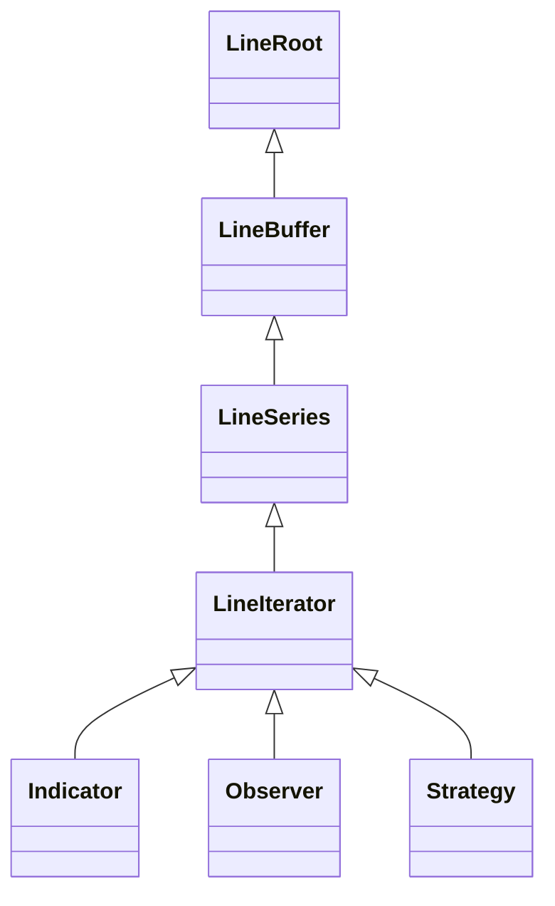

# Line System

The Line System is the fundamental data structure in Backtrader for handling time series data.

## Overview



## Hierarchy

### LineRoot

Base interface providing core operations:

```python
class LineRoot:
    def get(self, size=None):
        """Get data as array."""

    def __len__(self):
        """Return line length."""

    def datetime(self, index=0):
        """Get datetime at index."""
```

### LineBuffer

Circular buffer implementation for efficient memory usage:

```python
class LineBuffer:
    def __getitem__(self, key):
        """Access data by index.
        [0] = current, [-1] = previous, [-2] = 2 bars ago
        """

    def __setitem__(self, key, value):
        """Set data at index."""

    @property
    def minperiod(self):
        """Minimum data points needed."""
```

### LineSeries

Time series operations:

```python
class LineSeries:
    def align(self):
        """Align to data timeframe."""

    def date(self, index=0):
        """Get date at index."""

    def time(self, index=0):
        """Get time at index."""
```

### LineIterator

Execution phases and iteration logic:

```python
class LineIterator:
    # Line types
    IndType = 0  # Indicator
    ObsType = 2  # Observer
    StrType = 3  # Strategy

    def prenext(self):
        """Called before minperiod satisfied."""

    def nextstart(self):
        """Called when minperiod first satisfied."""

    def next(self):
        """Called for each bar after minperiod."""
```

## Access Patterns

### Current and Historical Data

```python
class MyStrategy(bt.Strategy):
    def next(self):
        # Current value
        current = self.data.close[0]

        # Previous values
        prev1 = self.data.close[-1]
        prev2 = self.data.close[-2]

        # Slice (returns array)
        recent = self.data.close.get(size=5)
```

### Data Length

```python
# Total bars available
total_bars = len(self.data)

# Bars processed so far in next()
processed_bars = len(self.data.close)
```

### Datetime Access

```python
# Current bar datetime
dt = self.data.datetime.datetime(0)
date = self.data.datetime.date(0)
time = self.data.datetime.time(0)
```

## Line Aliases

Common line aliases for data feeds:

| Alias | Line | Description |
|-------|------|-------------|
| `datetime` | datetime | Bar timestamp |
| `open` | open | Opening price |
| `high` | high | Highest price |
| `low` | low | Lowest price |
| `close` | close | Closing price |
| `volume` | volume | Trading volume |
| `openinterest` | openinterest | Open interest |

## Creating Custom Lines

### In Strategies

```python
class MyStrategy(bt.Strategy):
    def __init__(self):
        # Create a custom line
        self.lines.custom = self.data.close  # Alias
```

### In Indicators

```python
class MyIndicator(bt.Indicator):
    lines = ('signal',)  # Define output line

    def __init__(self):
        super().__init__()
        self.lines.signal = self.data.close - self.data.close(-1)
```

## Performance Considerations

### Circular Buffer

The circular buffer design:
- Fixed memory allocation
- Efficient append operations
- Automatic rollover

### Memory Management

```python
# Use qbuffer to limit memory for long backtests
data = bt.feeds.CSVGeneric(dataname='data.csv')
data.qbuffer(1000)  # Keep last 1000 bars in memory
```

## Common Patterns

### Lagging Values

```python
class MyStrategy(bt.Strategy):
    def __init__(self):
        # Lagged close price
        self.close_lag1 = self.data.close(-1)
        self.close_lag5 = self.data.close(-5)
```

### Price Change

```python
class MyStrategy(bt.Strategy):
    def __init__(self):
        # Price change
        self.change = self.data.close - self.data.close(-1)

        # Percent change
        self.pct_change = (self.data.close / self.data.close(-1)) - 1
```

### Rolling Operations

```python
class MyStrategy(bt.Strategy):
    def __init__(self):
        # Rolling sum (manual)
        self.rolling_sum = bt.indicators.SumN(self.data.close, period=20)

        # Or use indicator
        self.sma = bt.indicators.SMA(self.data.close, period=20)
```

## See Also

- [Phase System](phase-system.md)
- [Architecture Overview](overview.md)
