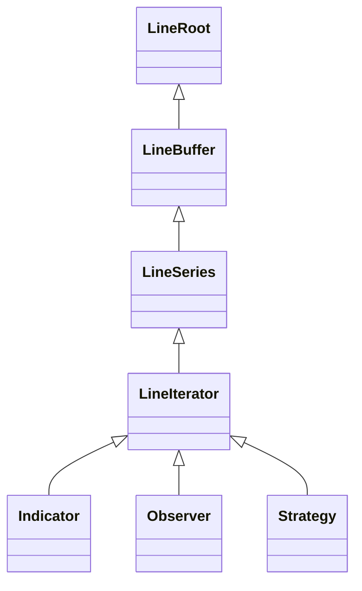

# Line 系统

Line 系统是 Backtrader 中处理时间序列数据的基础数据结构。

## 概述



## 层次结构

### LineRoot

提供核心操作的基础接口：

```python
class LineRoot:
    def get(self, size=None):
        """以数组形式获取数据。"""

    def __len__(self):
        """返回 line 长度。"""

    def datetime(self, index=0):
        """获取指定索引的日期时间。"""
```

### LineBuffer

循环缓冲区实现，高效使用内存：

```python
class LineBuffer:
    def __getitem__(self, key):
        """通过索引访问数据。
        [0] = 当前值, [-1] = 前一根, [-2] = 两根前
        """

    def __setitem__(self, key, value):
        """在指定索引设置数据。"""

    @property
    def minperiod(self):
        """所需的最小数据点数。"""
```

### LineSeries

时间序列操作：

```python
class LineSeries:
    def align(self):
        """对齐到数据时间周期。"""

    def date(self, index=0):
        """获取指定索引的日期。"""

    def time(self, index=0):
        """获取指定索引的时间。"""
```

### LineIterator

执行阶段和迭代逻辑：

```python
class LineIterator:
    # Line 类型
    IndType = 0  # 指标
    ObsType = 2  # 观察器
    StrType = 3  # 策略

    def prenext(self):
        """在满足 minperiod 之前调用。"""

    def nextstart(self):
        """在首次满足 minperiod 时调用。"""

    def next(self):
        """在满足 minperiod 后的每根K线调用。"""
```

## 访问模式

### 当前和历史数据

```python
class MyStrategy(bt.Strategy):
    def next(self):
        # 当前值
        current = self.data.close[0]

        # 历史值
        prev1 = self.data.close[-1]
        prev2 = self.data.close[-2]

        # 切片 (返回数组)
        recent = self.data.close.get(size=5)
```

### 数据长度

```python
# 可用的总K线数
total_bars = len(self.data)

# next() 中已处理的K线数
processed_bars = len(self.data.close)
```

### 日期时间访问

```python
# 当前K线的日期时间
dt = self.data.datetime.datetime(0)
date = self.data.datetime.date(0)
time = self.data.datetime.time(0)
```

## Line 别名

数据源的常用 line 别名：

| 别名 | Line | 描述 |
|------|------|------|
| `datetime` | datetime | K线时间戳 |
| `open` | open | 开盘价 |
| `high` | high | 最高价 |
| `low` | low | 最低价 |
| `close` | close | 收盘价 |
| `volume` | volume | 成交量 |
| `openinterest` | openinterest | 持仓量 |

## 创建自定义 Line

### 在策略中

```python
class MyStrategy(bt.Strategy):
    def __init__(self):
        # 创建自定义 line
        self.lines.custom = self.data.close  # 别名
```

### 在指标中

```python
class MyIndicator(bt.Indicator):
    lines = ('signal',)  # 定义输出 line

    def __init__(self):
        super().__init__()
        self.lines.signal = self.data.close - self.data.close(-1)
```

## 性能考虑

### 循环缓冲区

循环缓冲区设计：
- 固定内存分配
- 高效的追加操作
- 自动滚动

### 内存管理

```python
# 使用 qbuffer 限制长回测的内存使用
data = bt.feeds.CSVGeneric(dataname='data.csv')
data.qbuffer(1000)  # 在内存中保留最后 1000 根K线
```

## 常见模式

### 滞后值

```python
class MyStrategy(bt.Strategy):
    def __init__(self):
        # 滞后的收盘价
        self.close_lag1 = self.data.close(-1)
        self.close_lag5 = self.data.close(-5)
```

### 价格变化

```python
class MyStrategy(bt.Strategy):
    def __init__(self):
        # 价格变化
        self.change = self.data.close - self.data.close(-1)

        # 百分比变化
        self.pct_change = (self.data.close / self.data.close(-1)) - 1
```

### 滚动操作

```python
class MyStrategy(bt.Strategy):
    def __init__(self):
        # 滚动求和 (手动)
        self.rolling_sum = bt.indicators.SumN(self.data.close, period=20)

        # 或使用指标
        self.sma = bt.indicators.SMA(self.data.close, period=20)
```

## 相关文档

- [阶段系统](phase-system.md)
- [架构概览](overview.md)
