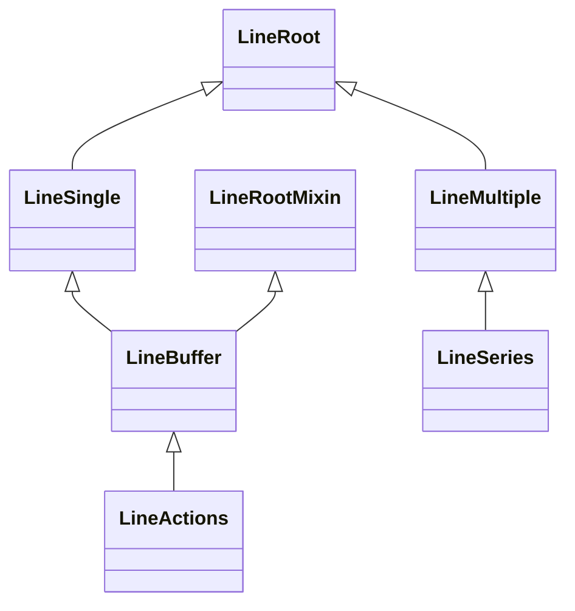
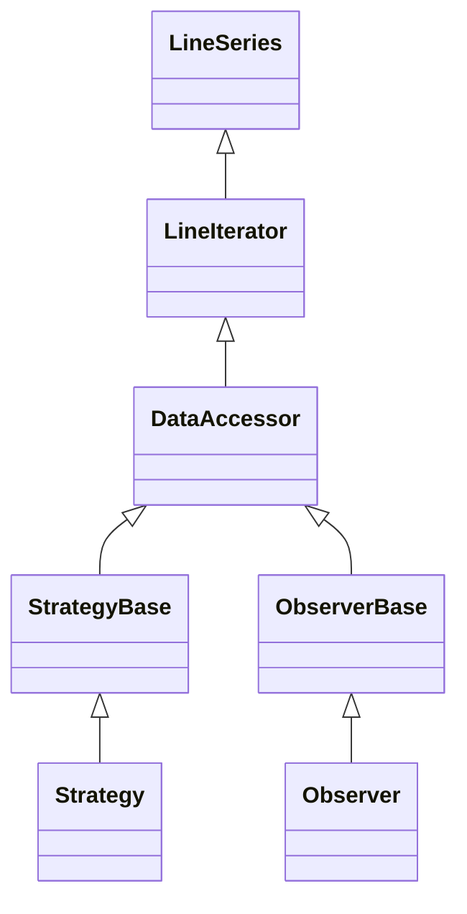
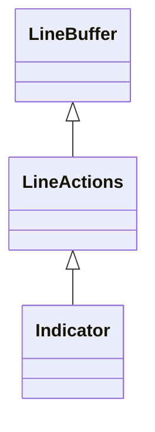
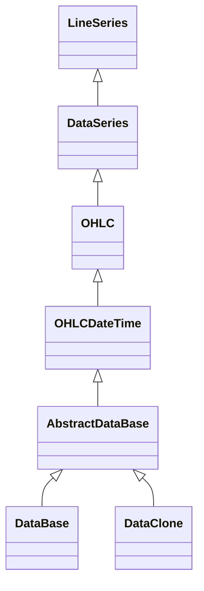
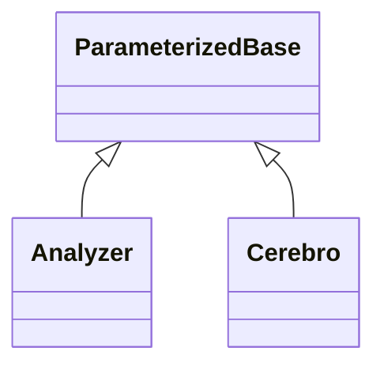

# Backtrader Class Inheritance Overview

This document summarizes the core class inheritance relationships in this refactored Backtrader codebase (metaprogramming removed). It focuses on the line model, strategy/indicator/observer stack, data feeds, and the parameter system.

- Codebase paths referenced below use Windows paths like `f:/source_code/backtrader/...` but consider them relative.
- Citations reference concrete classes and files from this repository, not upstream backtrader.

---

## High-level Overview

- **Lines model**: `LineRoot` → `LineSingle`/`LineMultiple` → `LineBuffer`/`LineSeries`
- **Iterators**: `LineSeries` → `LineIterator` → `DataAccessor` → `StrategyBase` / `ObserverBase` / (legacy `IndicatorBase`)
- **User-facing**: `Strategy` (extends `StrategyBase`), `Observer` (extends `ObserverBase`)
- **Indicators**: In this refactor, indicator base is `Indicator(LineActions)`, not `LineIterator`
- **Data feeds**: `LineSeries` → `DataSeries` → `OHLC` → `OHLCDateTime` → `AbstractDataBase` → concrete feeds (`DataBase`, `DataClone`, etc.)
- **Parameter system**: `ParameterizedBase` is the root for `Analyzer` and `Cerebro`

---

## Core Lines Architecture

- `LineRoot` and friends define the foundational line behavior and operations.
  - File: `backtrader/lineroot.py`
  - Classes:
    - `LineRoot`
    - `LineSingle`
    - `LineMultiple`
    - `LineRootMixin`

- `LineBuffer` implements a single mutable numeric buffer (current at index 0).
  - File: `backtrader/linebuffer.py`
  - Class: `LineBuffer(LineSingle, LineRootMixin)`
  - Provides: `array`, `_idx`, binding, forward/rewind/reset, etc.

- `LineActions` extends `LineBuffer` with operation semantics and parameters mixin.
  - File: `backtrader/linebuffer.py`
  - Class: `LineActions(LineBuffer, LineActionsMixin, metabase.ParamsMixin)`

- `LineSeries` manages a collection of lines (multi-line entities and descriptors/aliases).
  - File: `backtrader/lineseries.py`
  - Class: `LineSeries(LineMultiple, LineSeriesMixin, metabase.ParamsMixin)`

### Diagram: Core Lines

---

## Iteration, Strategy, Observer

- `LineIterator` extends `LineSeries` and adds iteration lifecycle (once/next), child iterators, minperiod handling, etc.
  - File: `backtrader/lineiterator.py`
  - Class: `LineIterator(LineIteratorMixin, LineSeries)`

- `DataAccessor` adds convenience aliases for price/volume/openinterest/datetime lines used by derived classes.
  - File: `backtrader/lineiterator.py`
  - Class: `DataAccessor(LineIterator)`

- `StrategyBase`, `ObserverBase` (and legacy `IndicatorBase`) extend `DataAccessor`.
  - File: `backtrader/lineiterator.py`
  - Classes:
    - `StrategyBase(DataAccessor)`
    - `ObserverBase(DataAccessor)`
    - `IndicatorBase(DataAccessor)` (legacy base; current Indicators do not subclass this in this refactor)

- User-facing classes:
  - File: `backtrader/strategy.py` → `class Strategy(StrategyBase)`
  - File: `backtrader/observer.py` → `class Observer(ObserverBase)`

### Diagram: Iteration & Strategy/Observer

---

## Indicator Stack (Refactor)

- In this codebase, `Indicator` is based on `LineActions`, not on `LineIterator`.
  - File: `backtrader/indicator.py`
  - Class: `Indicator(LineActions)`
  - Rationale: remove metaclass complexity and keep indicators as line-producing operations.
  - Note: `IndicatorBase(DataAccessor)` still exists in `lineiterator.py` for compatibility/transitional usage, but concrete indicators under `backtrader/indicators/` inherit from `Indicator`.

- Concrete indicators (examples):
  - `backtrader/indicators/sma.py` → `class MovingAverageSimple(…): alias = ("SMA", …)`
  - `backtrader/indicators/ema.py` → `class ExponentialMovingAverage(MovingAverageBase)` (composes smoothing)
  - `backtrader/indicators/crossover.py` → `CrossUp`, `CrossDown`, `CrossOver`
  - `backtrader/indicators/basicops.py` → `Average`, `SumN`, `Highest`, `Lowest`, etc.

### Diagram: Indicator Base (this repo)

> Contrast: upstream Backtrader has `Indicator(LineIterator)`. Here indicators are line action producers; strategies/observers remain on the `LineIterator` tree.

---

## Data Feeds and Series

- `DataSeries` and OHLC types:
  - File: `backtrader/dataseries.py`
  - `DataSeries(LineSeries)`
  - `OHLC(DataSeries)`
  - `OHLCDateTime(OHLC)`

- `AbstractDataBase` is the root for concrete data feeds (removes metaclass use).
  - File: `backtrader/feed.py`
  - `AbstractDataBase(dataseries.OHLCDateTime)`
  - Concrete subclasses (same file): `DataBase(AbstractDataBase)`, `DataClone(AbstractDataBase)`

### Diagram: Data Branch

---

## Parameter System and Runtime

- `ParameterizedBase` underpins modern parameter handling without metaclasses.
  - File: `backtrader/parameters.py`
  - `ParameterizedBase` (with `ParameterDescriptor`, `ParameterManager`)

- `Analyzer` and `Cerebro` derive from `ParameterizedBase` in this refactor.
  - `backtrader/analyzer.py` → `class Analyzer(ParameterizedBase)`
  - `backtrader/cerebro.py` → `class Cerebro(ParameterizedBase)`

### Diagram: Parameters & Runtime

---

## Cross-cutting Notes

- **Owner and clock assignment**: `LineRootMixin.donew()` and `LineIterator` init chain assign `_owner` and `_clock` appropriately for strategies/indicators/observers.
- **Minperiod propagation**: `LineIterator` computes `_minperiod` from params and child iterators, updates lines via `addminperiod/incminperiod`.
- **Indicator lifecycle**: indicators implement `next/once` (vectorized) on top of `LineActions`—see `backtrader/indicators/*`.
- **Observer/Analyzer lifecycle**: observers are derived from `ObserverBase` (no data consumption by default, `_mindatas = 0`), and analyzers run alongside strategies within `Cerebro`.

---

## Quick Reference (Classes → Files)

- **Lines**
  - `LineRoot`, `LineSingle`, `LineMultiple`, `LineRootMixin` → `backtrader/lineroot.py`
  - `LineBuffer`, `LineActions` → `backtrader/linebuffer.py`
  - `LineSeries` → `backtrader/lineseries.py`

- **Iterators**
  - `LineIterator`, `DataAccessor`, `StrategyBase`, `ObserverBase`, `IndicatorBase` → `backtrader/lineiterator.py`

- **User-facing**
  - `Strategy(StrategyBase)` → `backtrader/strategy.py`
  - `Observer(ObserverBase)` → `backtrader/observer.py`
  - `Indicator(LineActions)` → `backtrader/indicator.py`

- **Indicators (examples)**
  - `sma.py`, `ema.py`, `basicops.py`, `crossover.py` → `backtrader/indicators/`

- **Data**
  - `DataSeries`, `OHLC`, `OHLCDateTime` → `backtrader/dataseries.py`
  - `AbstractDataBase`, `DataBase`, `DataClone` → `backtrader/feed.py`

- **Parameters & Runtime**
  - `ParameterizedBase` → `backtrader/parameters.py`
  - `Analyzer(ParameterizedBase)` → `backtrader/analyzer.py`
  - `Cerebro(ParameterizedBase)` → `backtrader/cerebro.py`

---

## Summary

- The refactored architecture separates concerns:
  - Strategies/observers remain on the `LineIterator` branch (event-driven lifecycle).
  - Indicators are `LineActions`-based line producers (no longer inheriting `LineIterator`).
  - Data feeds build on `LineSeries` → `DataSeries` → `AbstractDataBase`.
  - Parameterized infra (`ParameterizedBase`) powers analyzers and `Cerebro`.

This design removes metaclass coupling, keeps vectorization-friendly once/next paths, and clarifies the inheritance graph for each subsystem.
