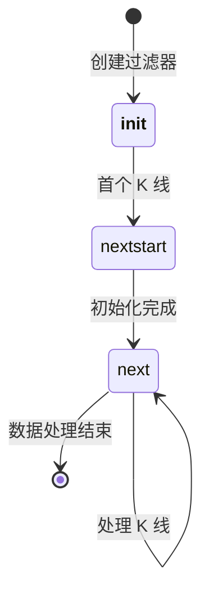

# Filter API

`Filter` 类是 Backtrader 中数据过滤的基类。Filter 可以应用于数据源，用于修改或过滤 K 线数据，支持日历日填充、交易时段过滤、自定义数据转换等功能。

## 类定义

```python
class backtrader.Filter:
    """数据过滤器基类。"""

```

## 核心 Filter

### `Filter`

数据过滤器基类，继承自 `ParameterizedBase`。

```python
class Filter(ParameterizedBase):
    """数据过滤器基类。"""

```

### 生命周期方法

#### `__init__(self, data, **kwargs)`

初始化过滤器。

```python
def __init__(self, data, **kwargs):
    super().__init__(**kwargs)

```

- *参数**:
- `data`: 要过滤的数据源
- `**kwargs`: 额外的参数

#### `nextstart(self, data)`

在处理第一个 K 线时调用，用于初始化。

```python
def nextstart(self, data):
    pass

```

#### `next(self, data)`

处理每个 K 线时调用。

```python
def next(self, data):
    pass

```

## 内置 Filter

### CalendarDays

填充日历日之间的缺失数据。

```python
class CalendarDays(ParameterizedBase):
    """日历日填充过滤器。"""

```

- *参数**:

| 参数 | 类型 | 默认值 | 描述 |

|-----------|------|---------|-------------|

| `fill_price` | float/None | None | 填充价格值 (>0: 使用指定值, 0/None: 使用上一收盘价, -1: 使用高低平均) |

| `fill_vol` | float | NaN | 填充分时成交量的值 |

| `fill_oi` | float | NaN | 填充持仓量的值 |

- *使用示例**:

```python
import backtrader as bt

# 创建数据源

data = bt.feeds.GenericCSVData(dataname='data.csv')

# 添加日历日过滤器

data.addfilter(bt.filters.CalendarDays(fill_price=None))

cerebro = bt.Cerebro()
cerebro.adddata(data)

```

- *填充逻辑**:
- 检测 K 线之间超过 1 天的间隔
- 自动填充缺失的日历日
- 价格可使用指定值或上一收盘价

### SessionFiller

填充交易时段内的缺失 K 线。

```python
class SessionFiller(ParameterizedBase):
    """交易时段 K 线填充过滤器。"""

```

- *参数**:

| 参数 | 类型 | 默认值 | 描述 |

|-----------|------|---------|-------------|

| `fill_price` | float/None | None | 填充价格值 (None: 使用上一收盘价) |

| `fill_vol` | float | NaN | 填充分时成交量的值 |

| `fill_oi` | float | NaN | 填充持仓量的值 |

| `skip_first_fill` | bool | True | 跳过从时段开始到首个 K 线的填充 |

- *使用示例**:

```python

# 分钟级数据，填充交易时段内的缺失分钟

data = bt.feeds.GenericCSVData(
    dataname='minute_data.csv',
    timeframe=bt.TimeFrame.Minutes,
    compression=1,
    sessionstart=datetime.time(9, 30),
    sessionend=datetime.time(16, 0)
)

data.addfilter(bt.filters.SessionFiller())

```

### SessionFilter / SessionFilterSimple

过滤交易时段之外的 K 线（盘前/盘后数据）。

```python
class SessionFilter(ParameterizedBase):
    """交易时段过滤器。"""

class SessionFilterSimple(ParameterizedBase):
    """简单交易时段过滤器。"""

```

- *使用示例**:

```python

# 仅保留交易时段内的 K 线

data = bt.feeds.GenericCSVData(
    dataname='intraday.csv',
    sessionstart=datetime.time(9, 30),
    sessionend=datetime.time(16, 0)
)

# 使用简单过滤器（推荐）

data.addfilter_simple(bt.filters.SessionFilterSimple())

# 或使用标准过滤器

data.addfilter(bt.filters.SessionFilter())

```

- *过滤逻辑**:
- 保留 `sessionstart` 到 `sessionend` 之间的 K 线
- 移除盘前和盘后数据

### DataFilter

基于自定义函数过滤 K 线。

```python
class DataFilter(AbstractDataBase):
    """函数式数据过滤器。"""

```

- *参数**:

| 参数 | 类型 | 默认值 | 描述 |

|-----------|------|---------|-------------|

| `funcfilter` | callable | None | 过滤函数 |

- *使用示例**:

```python

# 自定义过滤函数

def my_filter(data):
    """保留周一的 K 线，过滤其他"""
    return data.datetime.date().weekday() == 0  # 0 = Monday

# 应用过滤器

data = bt.feeds.GenericCSVData(dataname='data.csv')
data.addfilter(bt.filters.DataFilter(funcfilter=my_filter))

```

- *过滤函数签名**:
- 输入: `data` - 数据源对象
- 返回: `True` - 保留 K 线, `False` - 丢弃 K 线

### DataFiller

填充数据源中的缺口。

```python
class DataFiller(AbstractDataBase):
    """数据缺口填充器。"""

```

- *参数**:

| 参数 | 类型 | 默认值 | 描述 |

|-----------|------|---------|-------------|

| `fill_price` | float/None | None | 填充价格值 |

| `fill_vol` | float | NaN | 填充分时成交量的值 |

| `fill_oi` | float | NaN | 填充持仓量的值 |

- *使用示例**:

```python

# 填充缺失的分钟级 K 线

data = bt.feeds.GenericCSVData(
    dataname='sparse_minute_data.csv',
    timeframe=bt.TimeFrame.Minutes,
    compression=1
)

data.addfilter(bt.filters.DataFiller(fill_price=None))

```

### HeikinAshi

将标准 OHLC 数据转换为 Heikin Ashi K 线。

```python
class HeikinAshi:
    """Heikin Ashi K 线过滤器。"""

```

- *计算公式**:
- HA Close = (Open + High + Low + Close) / 4
- HA Open = (前 HA Open + 前 HA Close) / 2
- HA High = max(HA Open, HA Close, High)
- HA Low = min(HA Open, HA Close, Low)

- *使用示例**:

```python
data = bt.feeds.GenericCSVData(dataname='data.csv')
data.addfilter(bt.filters.HeikinAshi())

```

### Renko

将价格数据转换为 Renko 砖形图。

```python
class Renko(Filter):
    """Renko 砖形图过滤器。"""

```

- *参数**:

| 参数 | 类型 | 默认值 | 描述 |

|-----------|------|---------|-------------|

| `hilo` | bool | False | 使用最高/最低价而非收盘价判断 |

| `size` | float/None | None | 每个砖的固定大小 |

| `autosize` | float | 20.0 | 自动计算砖大小的除数 |

| `dynamic` | bool | False | 动态重新计算砖大小 |

| `align` | float | 1.0 | 价格对齐因子 |

| `roundstart` | bool | True | 四舍五入起始值 |

- *使用示例**:

```python

# 固定砖大小

data = bt.feeds.GenericCSVData(dataname='data.csv')
data.addfilter(bt.filters.Renko(size=10))

# 自动砖大小

data.addfilter(bt.filters.Renko(autosize=50))

```

### DaySplitterClose

将日线数据拆分为两个部分，用于回放模拟。

```python
class DaySplitterClose(ParameterizedBase):
    """日线拆分过滤器。"""

```

- *参数**:

| 参数 | 类型 | 默认值 | 描述 |

|-----------|------|---------|-------------|

| `closevol` | float | 0.5 | 分配给收盘 K 线的成交量比例 (0-1) |

- *使用示例**:

```python
data = bt.feeds.GenericCSVData(dataname='daily.csv')
data.addfilter(bt.filters.DaySplitterClose(closevol=0.5))

# 与 replaydata 一起使用

cerebro.replaydata(data, timeframe=bt.TimeFrame.Minutes)

```

- *拆分逻辑**:
- 第一部分 OHLX: 开盘时间，Close = (Open + High + Low) / 3
- 第二部分 CCCC: 收盘时间，OHLC 全等于收盘价

### BarReplayerOpen (DayStepsFilter)

将 K 线拆分为开盘价和完整 OHLC 两部分。

```python
class BarReplayerOpen:
    """K 线开盘拆分过滤器。"""

```

- *使用示例**:

```python
data = bt.feeds.GenericCSVData(dataname='data.csv')
data.addfilter(bt.filters.BarReplayerOpen())

```

## 与数据源集成

### addfilter 方法

将过滤器添加到数据源。

```python

# 方法签名

def addfilter(self, p, *args, **kwargs):
    """添加过滤器到数据源。"""

```

- *参数**:
- `p`: 过滤器类或实例
- `*args`: 位置参数
- `**kwargs`: 关键字参数

- *使用方式**:

```python

# 方式 1: 传递类

data.addfilter(bt.filters.CalendarDays, fill_price=None)

# 方式 2: 传递实例

data.addfilter(bt.filters.CalendarDays(fill_price=None))

# 方式 3: 使用 addfilter_simple (用于简单过滤器)

data.addfilter_simple(bt.filters.SessionFilterSimple())

```

### 应用多个过滤器

```python
data = bt.feeds.GenericCSVData(dataname='data.csv')

# 按顺序应用多个过滤器

data.addfilter(bt.filters.SessionFilterSimple())      # 首先过滤时段外数据

data.addfilter(bt.filters.SessionFiller())             # 填充时段内缺口

data.addfilter(bt.filters.HeikinAshi())                # 转换为 Heikin Ashi

```

## 自定义 Filter 开发

### 简单过滤器

返回 True/False 决定是否过滤 K 线。

```python
class MondayFilter:
    """仅保留周一的 K 线。"""

    def __init__(self, data):
        pass

    def __call__(self, data):

# 返回 True 表示过滤 K 线

# 返回 False 表示保留 K 线
        return data.datetime.date().weekday() != 0

# 使用

data.addfilter_simple(MondayFilter)

```

### 高级过滤器

继承 Filter 类，实现完整功能。

```python
import backtrader as bt

class PriceRangeFilter(bt.Filter):
    """仅保留指定价格范围内的 K 线。"""

    params = (
        ('min_price', 10.0),
        ('max_price', 1000.0),
    )

    def nextstart(self, data):
        """首次调用时的初始化。"""
        self.filtered_count = 0

    def next(self, data):
        """处理每个 K 线。"""
        close_price = data.close[0]

        if close_price < self.p.min_price or close_price > self.p.max_price:

# 移除 K 线
            data.backwards()
            self.filtered_count += 1
            return True

        return False

# 使用

data.addfilter(PriceRangeFilter, min_price=50, max_price=500)

```

### 带状态的过滤器

```python
class VolumeSpikeFilter(bt.Filter):
    """检测并标记成交量异常放大的 K 线。"""

    params = (
        ('threshold', 2.0),     # 成交量倍数阈值
        ('period', 20),          # 平均成交量周期
    )

    def nextstart(self, data):
        """初始化状态。"""
        self.avg_volume = None

    def next(self, data):
        """处理 K 线。"""
        if len(data) <= self.p.period:
            return False

# 计算平均成交量
        self.avg_volume = sum(data.volume.get(size=self.p.period)) / self.p.period

# 检测异常
        if data.volume[0] > self.avg_volume * self.p.threshold:

# 可以修改数据、标记或执行其他操作

# 这里我们只是记录
            pass

        return False

# 使用

data.addfilter(VolumeSpikeFilter, threshold=3.0, period=30)

```

## Filter 生命周期



## 常见使用场景

### 场景 1: 只交易时段内数据

```python
import backtrader as bt
import datetime

data = bt.feeds.GenericCSVData(
    dataname='full_day_data.csv',
    timeframe=bt.TimeFrame.Minutes,
    sessionstart=datetime.time(9, 30),
    sessionend=datetime.time(16, 0)
)

# 过滤时段外数据

data.addfilter_simple(bt.filters.SessionFilterSimple())

```

### 场景 2: 填充缺失数据并转换 K 线类型

```python
data = bt.feeds.GenericCSVData(
    dataname='data.csv',
    timeframe=bt.TimeFrame.Minutes
)

# 先填充缺口，再转换为 Heikin Ashi

data.addfilter(bt.filters.SessionFiller(fill_price=None))
data.addfilter(bt.filters.HeikinAshi())

```

### 场景 3: 日线数据回放为分钟线

```python
data = bt.feeds.GenericCSVData(
    dataname='daily.csv',
    timeframe=bt.TimeFrame.Days
)

# 拆分日线为两个 tick

data.addfilter(bt.filters.DaySplitterClose(closevol=0.5))

# 回放为分钟线

cerebro.replaydata(data, timeframe=bt.TimeFrame.Minutes)

```

### 场景 4: 过滤低成交量 K 线

```python
class LowVolumeFilter:
    """过滤成交量低于阈值的 K 线。"""

    def __init__(self, data, min_volume=1000):
        self.min_volume = min_volume

    def __call__(self, data):
        return data.volume[0] < self.min_volume

data.addfilter_simple(LowVolumeFilter, min_volume=5000)

```

## 注意事项

1. **过滤器顺序很重要**: 过滤器按照添加顺序执行
2. **时间一致性**: 修改 K 线时间时注意保持时间序列的一致性
3. **性能考虑**: 复杂的过滤器会影响回测速度
4. **数据完整性**: 使用填充过滤器时确保填充策略符合业务逻辑

## 下一步学习

- [Data Feeds API](data-feeds_zh.md) - 数据源管理
- [Strategy API](strategy_zh.md) - 策略开发
- [Indicator API](indicator_zh.md) - 指标开发
