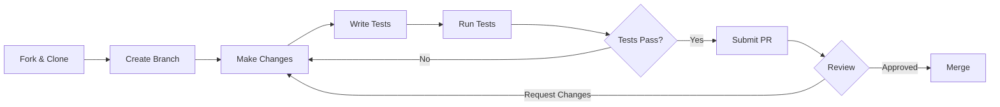

# Developer Guide

Welcome to the Backtrader development guide. This section covers everything you need to contribute to the project.

## Quick Links

| Topic | Link |

|-------|------|

| [Development Setup](setup.md) | Set up your development environment |

| [Testing](testing.md) | Testing guidelines and conventions |

| [Code Style](style.md) | Code formatting and style guide |

| [Contributing](contributing.md) | Contribution guidelines |

| [Release Workflow](release.md) | Version management and release process |

## Getting Started

1. Fork and clone the repository
2. Follow the [Development Setup](setup.md) guide
3. Read the [Code Style](style.md) guide
4. Write tests following [Testing](testing.md) guidelines
5. Submit a pull request

## Development Workflow



## Core Principles

### 1. No Metaclasses

```python

# ❌ WRONG

class MetaStrategy(type):
    pass

class MyStrategy(metaclass=MetaStrategy):
    pass

# ✅ CORRECT

def __new__(cls, *args, **kwargs):
    _obj, args, kwargs = cls.donew(*args, **kwargs)
    return _obj

```

### 2. Initialization Order

```python

# ❌ WRONG

class BadStrategy(bt.Strategy):
    def __init__(self):
        period = self.p.period  # Error!

# ✅ CORRECT

class GoodStrategy(bt.Strategy):
    def __init__(self):
        super().__init__()
        period = self.p.period

```

### 3. Specific Exception Handling

```python

# ❌ WRONG

try:
    order = api.place_order(...)
except Exception:
    pass  # Hides all errors

# ✅ CORRECT

try:
    order = api.place_order(...)
except (NetworkError, ExchangeError) as e:
    logger.error(f"Order failed: {e}")
    raise

```

## Adding Features

### New Indicator

1. Create file in `backtrader/indicators/`
2. Inherit from `bt.Indicator`
3. Define `lines` and `params`
4. Implement calculation in `__init__`
5. Add tests
6. Update documentation

### New Data Feed

1. Create file in `backtrader/feeds/`
2. Inherit from `bt.feed.DataBase`
3. Implement required methods
4. Add tests with `@pytest.mark.integration`
5. Add documentation

### New Observer

1. Inherit from `bt.Observer`
2. Define `_ltype = 2` (Observer)
3. Add at least one line
4. Implement `start()` for registration
5. Add to `observers/__init__.py`

## Testing

### Test Organization

```bash
tests/
├── original_tests/     # Core functionality

├── add_tests/          # Additional coverage

├── refactor_tests/     # Metaclass removal tests

└── strategies/         # Strategy-specific tests

```

### Test Markers

| Marker | Purpose |

|--------|---------|

| `priority_p0` | Core functionality |

| `priority_p1` | Core user journeys |

| `priority_p2` | Secondary features |

| `priority_p3` | Rarely used features |

| `integration` | Requires live connection |

| `websocket` | WebSocket-specific |

| `trading` | Sandbox order tests |

## Code Review Process

All pull requests are reviewed for:

1. Functionality
2. Code quality
3. Test coverage
4. Documentation
5. Performance impact

## Performance Guidelines

- Minimize `len()`, `isinstance()`, `hasattr()` in hot paths
- Use vectorized operations where possible
- Profile before optimizing
- Document performance-critical sections

## Documentation Updates

When making changes:

- Update relevant docs
- Add docstrings to new functions
- Update CHANGELOG.md for user-facing changes

## Resources

- [Project Context](../project-context.md) - AI-optimized rules
- [Architecture](../architecture/overview.md) - System architecture
- [Issue Tracker](<https://github.com/cloudQuant/backtrader/issues)> - Bug reports and feature requests

## Need Help?

- Open an issue for bugs
- Start a discussion for questions
- Join our community

Thank you for contributing to Backtrader!
