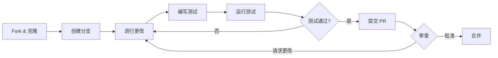

# 开发者指南

欢迎使用 Backtrader 开发指南。本节涵盖参与项目所需的所有内容。

## 快速链接

| 主题 | 链接 |

|-------|------|

| [开发环境设置](setup_zh.md) | 设置开发环境 |

| [测试](testing_zh.md) | 测试指南和约定 |

| [代码风格](style_zh.md) | 代码格式和风格指南 |

| [贡献](contributing_zh.md) | 贡献指南 |

| [发布流程](release_zh.md) | 版本管理和发布流程 |

## 快速开始

1. Fork 并克隆仓库
2. 按照[开发环境设置](setup_zh.md)指南操作
3. 阅读[代码风格](style.md)指南
4. 按照[测试](testing.md)指南编写测试
5. 提交 Pull Request

## 开发工作流



## 核心原则

### 1. 不使用元类

```python

# ❌ 错误

class MetaStrategy(type):
    pass

class MyStrategy(metaclass=MetaStrategy):
    pass

# ✅ 正确

def __new__(cls, *args, **kwargs):
    _obj, args, kwargs = cls.donew(*args, **kwargs)
    return _obj

```

### 2. 初始化顺序

```python

# ❌ 错误

class BadStrategy(bt.Strategy):
    def __init__(self):
        period = self.p.period  # 错误！

# ✅ 正确

class GoodStrategy(bt.Strategy):
    def __init__(self):
        super().__init__()
        period = self.p.period

```

### 3. 特定异常处理

```python

# ❌ 错误

try:
    order = api.place_order(...)
except Exception:
    pass  # 隐藏所有错误

# ✅ 正确

try:
    order = api.place_order(...)
except (NetworkError, ExchangeError) as e:
    logger.error(f"订单失败: {e}")
    raise

```

## 添加功能

### 新指标

1. 在 `backtrader/indicators/` 中创建文件
2. 继承 `bt.Indicator`
3. 定义 `lines` 和 `params`
4. 在 `__init__` 中实现计算
5. 添加测试
6. 更新文档

### 新数据源

1. 在 `backtrader/feeds/` 中创建文件
2. 继承 `bt.feed.DataBase`
3. 实现必需的方法
4. 使用 `@pytest.mark.integration` 添加测试
5. 添加文档

### 新观察器

1. 继承 `bt.Observer`
2. 定义 `_ltype = 2` (观察器类型)
3. 至少添加一条 line
4. 实现 `start()` 进行注册
5. 添加到 `observers/__init__.py`

## 测试

### 测试组织

```bash
tests/
├── original_tests/     # 核心功能

├── add_tests/          # 额外覆盖

├── refactor_tests/     # 元类移除测试

└── strategies/         # 策略特定测试

```

### 测试标记

| 标记 | 用途 |

|--------|---------|

| `priority_p0` | 核心功能 |

| `priority_p1` | 核心用户流程 |

| `priority_p2` | 次要功能 |

| `priority_p3` | 很少使用的功能 |

| `integration` | 需要实时连接 |

| `websocket` | WebSocket 特定 |

| `trading` | 沙盒订单测试 |

## 代码审查流程

所有 Pull Request 需要审查：

1. 功能性
2. 代码质量
3. 测试覆盖率
4. 文档
5. 性能影响

## 性能指南

- 在热路径中最小化 `len()`, `isinstance()`, `hasattr()` 调用
- 尽可能使用向量化操作
- 优化前先分析
- 记录性能关键部分

## 文档更新

更改时：

- 更新相关文档
- 为新函数添加文档字符串
- 为面向用户的更改更新 CHANGELOG.md

## 资源

- [项目上下文](../project-context.md) - AI 优化的规则
- [架构](../architecture/overview_zh.md) - 系统架构
- [Issue 追踪器](<https://github.com/cloudQuant/backtrader/issues)> - Bug 报告和功能请求

## 需要帮助？

- 为 Bug 提交 Issue
- 为问题发起讨论
- 加入我们的社区

感谢您对 Backtrader 的贡献！
