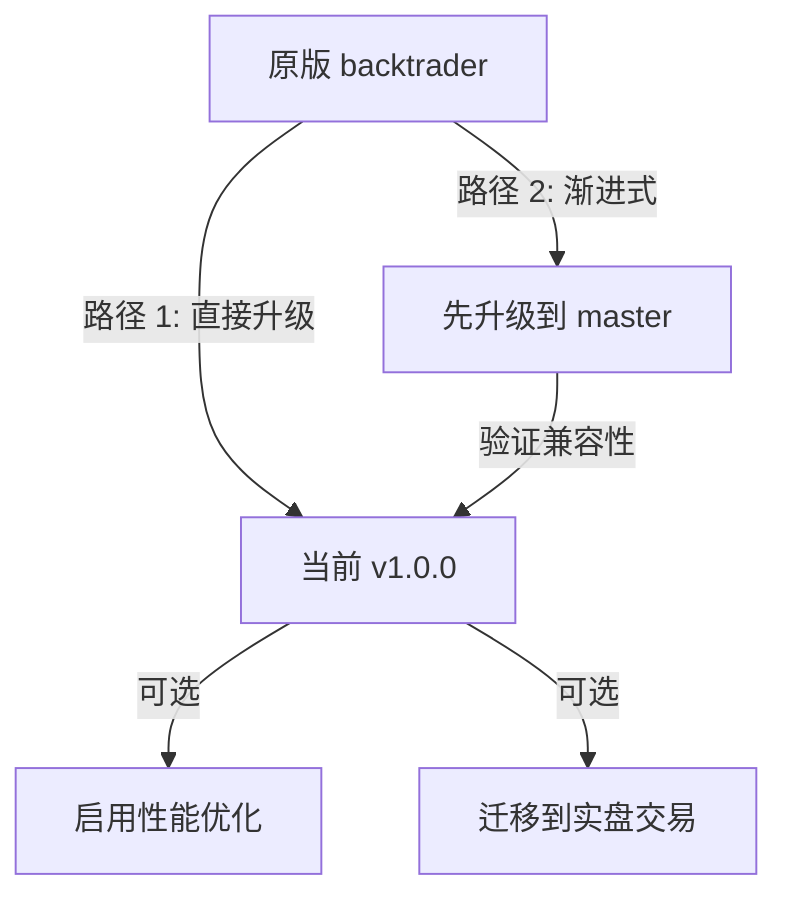

# Backtrader 版本升级指南

> 本指南详细说明如何在不同版本的 Backtrader 之间进行升级，包括破坏性变更、新功能迁移以及兼容性说明。

## 目录

1. [简介](#简介)
2. [版本升级路径](#版本升级路径)
3. [各版本升级说明](#各版本升级说明)
4. [破坏性变更详解](#破坏性变更详解)
5. [常见升级场景](#常见升级场景)
6. [升级故障排除](#升级故障排除)
7. [数据格式迁移](#数据格式迁移)
8. [配置变更](#配置变更)

---
## 简介

本升级指南适用于从原版 Backtrader 或早期版本迁移到当前增强版分支（v1.0.0+）的用户。

### 版本命名规范

```bash
主版本号.次版本号.修订号 (Major.Minor.Patch)

主版本号 (Major): 重大架构变更或破坏性变更
次版本号 (Minor): 新增功能，向后兼容
修订号 (Patch): Bug 修复，向后兼容

```

### 分支说明

| 分支 | 状态 | 用途 |

|------|------|------|

| `master` | 稳定 | 与原版 backtrader 保持兼容，仅添加 bug 修复 |

| `dev` | 开发中 | 性能优化版本，移除元编程，45% 性能提升 |

| `development` | 开发中 | 主开发分支，包含所有新功能和改进 |

| `remove-metaprogramming` | 归档 | 元编程移除的实验分支（已合并到 dev） |

---
## 版本升级路径

### 推荐升级路径



### 路径选择建议

#### 路径 1: 直接升级（推荐）

适用于：

- 新项目或早期项目
- 希望立即获得所有新功能和性能改进

```bash

# 卸载旧版本

pip uninstall backtrader

# 安装新版本

git clone <https://github.com/cloudQuant/backtrader.git>
cd backtrader
pip install -e .

```

#### 路径 2: 渐进式升级

适用于：

- 大型生产环境
- 需要逐步验证兼容性

```bash

# 1. 先升级到稳定版 master 分支

git checkout master

# 2. 运行所有测试验证

pytest tests/ -v

# 3. 验证通过后切换到 dev/development

git checkout dev

# 4. 再次运行测试

pytest tests/ -v

```

---
## 各版本升级说明

### 从原版 Backtrader 升级到 v1.0.0

#### 主要变更

| 类别 | 变更 | 影响 |

|------|------|------|

| **性能**| 移除元类，使用显式初始化 | 执行速度提升 45% |

|**API**| 100% 向后兼容 | 无需修改现有代码 |

|**新增**| Plotly/Bokeh 可视化 | 可选功能 |

|**新增** | Cython 加速计算 | 可选功能 |

#### 升级步骤

```bash

# 1. 备份现有代码

cp -r my_project my_project_backup

# 2. 卸载旧版本

pip uninstall backtrader

# 3. 安装新版本

git clone <https://github.com/cloudQuant/backtrader.git>
cd backtrader
pip install -e .

# 4. 验证安装

python -c "import backtrader as bt; print(bt.__version__)"

# 5. 运行现有测试

python my_strategy.py

# 6. （可选）编译 Cython 扩展以获得最佳性能

cd backtrader && python -W ignore compile_cython_numba_files.py && cd .. && pip install -U .

```

#### 代码兼容性

- *无需修改的代码示例：**

```python

# 所有现有代码无需修改

import backtrader as bt

class MyStrategy(bt.Strategy):
    params = (('period', 20),)

    def __init__(self):
        self.sma = bt.indicators.SMA(self.data.close, period=self.p.period)

    def next(self):
        if self.data.close[0] > self.sma[0]:
            self.buy()

cerebro = bt.Cerebro()
cerebro.addstrategy(MyStrategy)
cerebro.run()  # 运行更快，但结果相同

```

### 从 v0.x 升级到 v1.0.0

#### 破坏性变更

- *无破坏性变更**- v1.0.0 保持完全向后兼容。

#### 新功能建议采用

```python

# 旧版：仅回测

cerebro = bt.Cerebro()
data = bt.feeds.CSVGeneric(dataname='data.csv')
cerebro.adddata(data)
cerebro.run()

```

### 从早期 dev 分支升级

如果您使用的是早期的 `dev` 分支，建议合并或 cherry-pick 关键提交：

```bash

# 方案 A: 重新基于最新的 development 分支

git checkout development
git checkout -b my-feature

# 重新应用您的更改

# 方案 B: Cherry-pick 特定提交

git checkout development
git cherry-pick <commit-hash>

```

---
## 破坏性变更详解

### 无破坏性变更声明

当前版本（v1.0.0）与原版 Backtrader 保持**100% API 兼容**。

### 内部架构变更（不影响用户代码）

虽然 API 保持兼容，但内部实现有重大变更：

#### 1. 元类移除

- *旧版（原版）：**

```python

# 内部实现使用元类

class MetaLineRoot(type):
    def __new__(meta, name, bases, dct):

# 元类魔法
        ...

class LineRoot(metaclass=MetaLineRoot):
    ...

```

- *新版（当前）：**

```python

# 使用显式初始化模式

class BaseMixin:
    @classmethod
    def donew(cls, *args, **kwargs):

# 显式初始化逻辑
        _obj, args, kwargs = super().donew(*args, **kwargs)
        return _obj, args, kwargs

    def __new__(cls, *args, **kwargs):
        _obj, args, kwargs = cls.donew(*args, **kwargs)
        return _obj

class LineRoot(BaseMixin):
    ...

```

#### 2. 参数系统变更

- *旧版：**

```python

# 参数由元类在 __call__ 中设置

class MyStrategy(bt.Strategy):
    params = (('period', 20),)

# 元类在实例化时设置 self.p

```

- *新版：**

```python

# 参数在 __init__ 中显式设置

class MyStrategy(bt.Strategy):
    params = (('period', 20),)

    def __init__(self):

# super().__init__() 设置 self.p
        super().__init__()

# 现在可以安全访问 self.p
        self.sma = bt.indicators.SMA(period=self.p.period)

```

#### 3. 指标注册机制

- *新版自动注册：**

```python
class MyStrategy(bt.Strategy):
    def __init__(self):

# 指标自动注册到 strategy._lineiterators
        self.sma = bt.indicators.SMA(period=20)

# 在 prenext/next/nextstart 期间自动更新

```

### 已知行为差异

#### 数值精度差异

由于浮点运算顺序的变化，某些指标值可能与原版有微小差异：

```python

# 原版结果

RSI[100] = 65.4321001234

# 新版结果（差异 < 1e-10）

RSI[100] = 65.4321001235

```
这是正常的浮点精度行为，不影响策略逻辑。

---
## 常见升级场景

### 场景 1: 回测策略升级

- *情况：** 您有一个回测策略，希望升级到新版以获得性能提升。

- *解决方案：**

```python

# 步骤 1: 备份并测试

# 运行旧版记录结果

# pip install backtrader==原版本

python my_backtest.py > old_results.txt

# 步骤 2: 升级

# pip uninstall backtrader

# pip install -e /path/to/new/backtrader

# 步骤 3: 运行新版对比

python my_backtest.py > new_results.txt

# 步骤 4: 对比结果

diff old_results.txt new_results.txt

# 预期: 结果相同或仅有浮点精度差异

```

### 场景 2: 启用性能优化

- *情况：** 回测运行缓慢，希望启用性能优化。

- *解决方案：**

```python

# 步骤 1: 编译 Cython 扩展

"""
cd backtrader
python -W ignore compile_cython_numba_files.py
cd ..
pip install -U .
"""

# 步骤 2: 使用性能模式

cerebro = bt.Cerebro()

# 单资产时间序列策略（最快）

cerebro.run(ts_mode=True)

# 或多资产投资组合策略

cerebro.run(cs_mode=True)

# 步骤 3: 内存优化（长期回测）

cerebro = bt.Cerebro(exactbars=True)

```

### 场景 4: 可视化升级

- *情况：** 从 Matplotlib 升级到交互式 Plotly 图表。

- *解决方案：**

```python

# 旧版: Matplotlib

cerebro.plot()  # 静态图表

# 新版: Plotly 交互式

cerebro.plot(backend='plotly', style='candle')

# 支持:

# - 缩放和平移 10 万+ 数据点

# - 悬停查看详细信息

# - 深色/浅色主题

# - 导出 HTML

# 保存图表

from backtrader.plot import PlotlyPlot
plotter = PlotlyPlot(style='candle')
figs = plotter.plot(strat)
figs[0].write_html('my_backtest.html')

```

---
## 升级故障排除

### 问题 1: 导入错误

- *症状：**

```bash
ImportError: cannot import name 'CCXTStore' from 'backtrader.stores'

```

- *原因：** CCXT 模块未安装或未正确导入。

- *解决方案：**

```bash

# 安装 CCXT 依赖

pip install ccxt ccxtpro

# 验证安装

python -c "import ccxt; print(ccxt.__version__)"

# 检查 backtrader 版本

python -c "import backtrader as bt; print(bt.__version__)"

```

### 问题 2: Cython 编译失败

- *症状：**

```bash
error: command 'gcc' failed with exit status 1

```

- *原因：** 缺少编译工具或 Cython。

- *解决方案：**

```bash

# macOS

xcode-select --install

# Ubuntu/Debian

sudo apt-get install build-essential python3-dev

# CentOS/RHEL

sudo yum groupinstall "Development Tools"

# 安装 Cython

pip install cython

# 重新编译

cd backtrader && python -W ignore compile_cython_numba_files.py && cd .. && pip install -U .

```

### 问题 3: 测试结果不一致

- *症状：** 升级后回测结果与旧版不同。

- *诊断步骤：**

```python

# 1. 检查是否启用了新功能

cerebro = bt.Cerebro()

# 确保 TS/CS 模式未启用（如果需要对比）

cerebro.run(ts_mode=False, cs_mode=False)

# 2. 检查数据源

# 确保数据相同

print(len(data))  # 数据长度

print(data.datetime[0])  # 起始时间

print(data.datetime[-1])  # 结束时间

# 3. 检查指标值

# 在策略中打印指标值进行对比

def next(self):
    if len(self) == 100:
        print(f"Bar {len(self)}: SMA={self.sma[0]:.10f}")

```

### 问题 4: 性能未提升

- *症状：** 升级后执行速度没有改善。

- *诊断步骤：**

```python

# 1. 检查 Cython 是否编译

import backtrader as bt
print(bt.__has_cython__)  # 应该返回 True

# 2. 检查运行模式

# 避免使用 next() 模式（较慢）

cerebro.run(runonce=True)  # 使用 once() 模式

# 3. 检查数据预加载

data = bt.feeds.CSVGeneric(dataname='data.csv')
cerebro.adddata(data)
cerebro.run(preload=True)  # 预加载数据

# 4. 使用性能分析

import cProfile
import pstats

profiler = cProfile.Profile()
profiler.enable()
cerebro.run()
profiler.disable()

stats = pstats.Stats(profiler)
stats.sort_stats('cumulative')
stats.print_stats(20)

```

---
## 数据格式迁移

### CSV 数据格式

#### 标准格式（无需更改）

```text
datetime,open,high,low,close,volume,openinterest
2023-01-01 09:30:00,100.0,105.0,99.0,103.0,1000000,0
2023-01-02 09:30:00,103.0,108.0,102.0,107.0,1200000,0

```

#### 加载代码（无需更改）

```python
data = bt.feeds.GenericCSVData(
    dataname='data.csv',
    datetime=0,
    open=1,
    high=2,
    low=3,
    close=4,
    volume=5,
    openinterest=6,
    dtformat='%Y-%m-%d %H:%M:%S',
)

```

### Pandas DataFrame 迁移

#### 旧版（兼容）

```python
import pandas as pd
import backtrader as bt

df = pd.read_csv('data.csv', parse_dates=['datetime'], index_col='datetime')
data = bt.feeds.PandasData(dataname=df)

```

#### 新版（增加选项）

```python

# 支持更多选项

data = bt.feeds.PandasData(
    dataname=df,
    datetime=None,  # 使用索引作为日期
    open='open',
    high='high',
    low='low',
    close='close',
    volume='volume',
    openinterest=None,  # 可选列

)

```

### 数据源特定迁移

---
## 配置变更

### Cerebro 配置

#### 新增配置选项

```python
cerebro = bt.Cerebro(

# 既有选项
    maxcpus=1,
    preload=True,
    runonce=True,
    exactbars=False,

# 新增选项
    ts_mode=False,      # 时间序列性能模式
    cs_mode=False,      # 横截面性能模式
    quick_ndist=0,      # 快速分发模式

)

```

### 数据源配置

---
## 废弃功能移除时间表

### 当前无废弃功能

当前版本（v1.0.0）没有计划移除任何功能。

### 未来可能的变更

| 功能 | 状态 | 计划 | 迁移路径 |

|------|------|------|----------|

| 元类内部实现 | 已移除 | - | 使用新内部 API |

| 旧版绘图 | 维护中 | 可能增强 | 推荐使用 Plotly |

| 部分 feeds | 维护中 | 可能重构 | 使用 CCXT 统一接口 |

---
## 升级后测试建议

### 基础验证测试

```python
import backtrader as bt

# 测试 1: 版本检查

assert bt.__version__ >= '1.0.0'

# 测试 2: 基础功能

cerebro = bt.Cerebro()
data = bt.feeds.CSVGeneric(dataname='test.csv')
cerebro.adddata(data)
result = cerebro.run()
assert len(result) == 1

# 测试 3: 指标计算

class TestStrategy(bt.Strategy):
    def __init__(self):
        self.sma = bt.indicators.SMA(period=5)

    def next(self):
        assert self.sma[0] is not None

cerebro.addstrategy(TestStrategy)
result = cerebro.run()

```

### 性能对比测试

```python
import time

# 旧版运行时间

old_time = ...

# 新版运行时间

start = time.time()
cerebro.run()
new_time = time.time() - start

# 验证性能提升

assert new_time < old_time * 0.6  # 应该快 40%+

```

### 回测结果一致性测试

```python

# 运行相同策略两次，结果应该一致

result1 = cerebro.run()
result2 = cerebro.run()

assert result1[0].analyzers.trade.get_analysis() == result2[0].analyzers.trade.get_analysis()

```

---
## 快速参考

### 升级命令速查

```bash

# 完整升级流程

pip uninstall backtrader
git clone <https://github.com/cloudQuant/backtrader.git>
cd backtrader
pip install -e .
python -c "import backtrader as bt; print(bt.__version__)"

# 编译 Cython（可选，但推荐）

cd backtrader && python -W ignore compile_cython_numba_files.py && cd .. && pip install -U .

# 运行测试

pytest tests/ -v

# 验证项目

python my_strategy.py

```

### 关键文件位置

| 文件 | 用途 |

|------|------|

| `backtrader/__init__.py` | 版本号定义 |

| `backtrader/metabase.py` | 核心架构（元类移除） |

| `backtrader/plot/plot_plotly.py` | Plotly 可视化 |

| `docs/migration/` | 迁移文档目录 |

### 获取帮助

- **文档**: [项目文档](../README.md)
- **问题反馈**: [GitHub Issues](<https://github.com/cloudQuant/backtrader/issues)>
- **架构说明**: [ARCHITECTURE.md](../ARCHITECTURE.md)

---
## 附录: 版本特性对照表

### v1.0.0 vs 原版 Backtrader

| 特性 | 原版 | v1.0.0 | 说明 |

|------|------|--------|------|

| **核心回测**| 完整 | 完整 | 100% 兼容 |

|**性能**| 基准 | +45% | 移除元类开销 |

|**Cython 支持**| 基础 | 增强 | 热路径加速 10-100x |

|**TS 模式**| 无 | 有 | 向量化时间序列 |

|**CS 模式**| 无 | 有 | 横截面优化 |

|**CCXT 集成**| 有限 | 完整 | 实盘交易支持 |

|**WebSocket**| 无 | 有 | 低延迟数据 |

|**Plotly 图表**| 无 | 有 | 交互式可视化 |

|**Bokeh 图表**| 无 | 有 | 实时绘图 |

|**CTP 支持**| 无 | 有 | 中国期货市场 |

|**测试覆盖**| ~300 | 917+ | 更可靠 |

|**文档** | 基础 | 双语全面 | 更易学习 |

### 分支功能对比

| 功能 | master | dev | development |

|------|--------|-----|-------------|

| 稳定性 | 高 | 中 | 中 |

| 性能 | 原版 | +45% | +45% |

| CCXT 完整支持 | 部分 | 完整 | 完整 |

| CTP 支持 | 无 | 有 | 有 |

| 文档 | 基础 | 完善 | 完善 |

| 推荐用途 | 生产 | 开发 | 主分支 |

---
- *祝您升级顺利！** 如遇到问题，请参考故障排除章节或寻求社区帮助。
