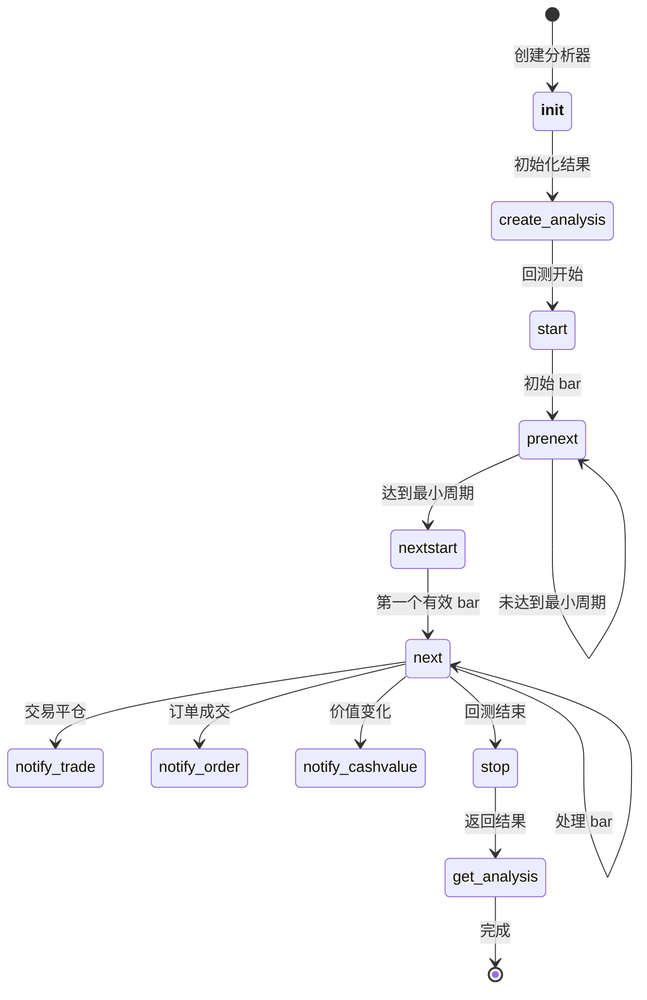

# 分析器 API

`Analyzer` 类是 Backtrader 中所有性能分析工具的基类。分析器用于计算和报告策略指标，包括收益率、回撤、夏普比率、交易统计等。

## 类定义

```python
class backtrader.Analyzer:
    """所有分析器的基类。"""

```

## 参数

### `params`

分析器的参数定义元组。

```python
class MyAnalyzer(bt.Analyzer):
    params = (
        ('period', 20),
        ('threshold', 1.5),
    )

```
通过 `self.p.parameter_name` 或 `self.params.parameter_name` 访问参数。

## 核心方法

### `__init__(self)`

在分析器实例化时调用一次。用于初始化数据结构。

```python
def __init__(self):
    super().__init__()  # 必须首先调用 super
    self.trades = []
    self.total_pnl = 0.0

```

### `start(self)`

在回测开始时调用，初始化完成后执行。

```python
def start(self):
    self.initial_cash = self.broker.getcash()
    self.start_value = self.broker.getvalue()

```

### `prenext(self)`

在达到最小周期前，每个 bar 都会调用。默认调用 `next()`。

### `nextstart(self)`

首次达到最小周期时调用一次。默认调用 `next()`。

### `next(self)`

达到最小周期后，每个 bar 都会调用。包含每个周期的分析逻辑。

```python
def next(self):
    current_value = self.broker.getvalue()
    self.values.append(current_value)

```

### `stop(self)`

回测结束时调用。执行最终计算。

```python
def stop(self):
    total_return = (self.broker.getvalue() / self.start_value) - 1
    self.rets['total_return'] = total_return

```

## 通知方法

### `notify_trade(self, trade)`

当交易状态变化时调用。

```python
def notify_trade(self, trade):
    if trade.isclosed:
        self.trades.append({
            'pnl': trade.pnlcomm,
            'commission': trade.commission,
        })

```

- *交易属性**：

| 属性 | 描述 |

|------|------|

| `trade.status` | 当前状态（Open, Closed） |

| `trade.pnl` | 毛盈亏 |

| `trade.pnlcomm` | 净盈亏（扣除佣金后） |

| `trade.commission` | 佣金 |

| `trade.isclosed` | 交易是否已关闭 |

| `trade.long` | 是否为多头头寸 |

| `trade.barlen` | 持仓 bar 数量 |

### `notify_order(self, order)`

当订单状态变化时调用。

```python
def notify_order(self, order):
    if order.status == order.Completed:
        self.orders.append({
            'type': 'buy' if order.isbuy() else 'sell',
            'price': order.executed.price,
            'size': order.executed.size,
        })

```

- *订单状态值**：

| 状态 | 描述 |

|------|------|

| `Order.Created` | 订单已创建 |

| `Order.Submitted` | 已提交到经纪商 |

| `Order.Accepted` | 已被经纪商接受 |

| `Order.Partial` | 部分成交 |

| `Order.Completed` | 完全成交 |

| `Order.Canceled` | 已取消 |

| `Order.Margin` | 保证金不足 |

| `Order.Rejected` | 被拒绝 |

### `notify_cashvalue(self, cash, value)`

当现金或投资组合价值变化时调用。

```python
def notify_cashvalue(self, cash, value):
    self.history.append({
        'cash': cash,
        'value': value,
    })

```

### `notify_fund(self, cash, value, fundvalue, shares)`

当基金相关数据变化时调用（使用基金模式时）。

```python
def notify_fund(self, cash, value, fundvalue, shares):
    self.fund_history.append({
        'fundvalue': fundvalue,
        'shares': shares,
    })

```

## 结果方法

### `create_analysis(self)`

创建分析结果容器。覆盖此方法以自定义结构。

```python
def create_analysis(self):
    self.rets = OrderedDict()
    self.rets['total_trades'] = 0
    self.rets['winning_trades'] = 0

```

### `get_analysis(self)`

返回分析结果。覆盖此方法以返回自定义格式。

```python
def get_analysis(self):
    return self.rets

```

### `print(self)`

通过标准打印输出分析结果。

```python
analyzer.print()  # 等同于 print(analyzer.get_analysis())

```

### `pprint(self)`

美化打印分析结果。

```python
analyzer.pprint()  # 格式化输出

```

## 内置分析器

### SharpeRatio

使用无风险利率计算夏普比率。

```python
cerebro.addanalyzer(bt.analyzers.SharpeRatio, _name='sharpe',
                    riskfreerate=0.01, timeframe=bt.TimeFrame.Days)

```

| 参数 | 默认值 | 描述 |

|------|--------|------|

| `riskfreerate` | 0.01 | 年化无风险利率 (1%) |

| `timeframe` | TimeFrame.Years | 计算周期 |

| `factor` | None | 年化系数 |

| `convertrate` | True | 将年利率转换为周期利率 |

| `annualize` | False | 返回年化夏普比率 |

| `stddev_sample` | False | 使用贝塞尔校正 |

| `fund` | None | 使用基金模式 |

- *输出**：

```python
{'sharperatio': 1.23}

```

### SharpeRatio_Annual

年化夏普比率（等同于 SharpeRatio 设置 `annualize=True`）。

```python
cerebro.addanalyzer(bt.analyzers.SharpeRatio_A, _name='sharpe')

```

### DrawDown

计算回撤统计。

```python
cerebro.addanalyzer(bt.analyzers.DrawDown, _name='drawdown')

```

| 参数 | 默认值 | 描述 |

|------|--------|------|

| `fund` | None | 使用基金模式 |

- *输出**：

```python
{
    'drawdown': 5.23,        # 当前回撤百分比
    'moneydown': 5230.50,    # 当前回撤金额
    'len': 10,               # 当前回撤长度
    'max': {
        'drawdown': 15.67,   # 最大回撤百分比
        'moneydown': 15670.00,
        'len': 45,           # 最大回撤长度
    }
}

```

### TimeDrawDown

基于时间周期的回撤分析器。

```python
cerebro.addanalyzer(bt.analyzers.TimeDrawDown, _name='dd',
                    timeframe=bt.TimeFrame.Months)

```

- *输出**：

```python
{
    'maxdrawdown': 12.34,
    'maxdrawdownperiod': 30,
}

```

### Returns

计算总收益、平均收益、复合收益和年化收益。

```python
cerebro.addanalyzer(bt.analyzers.Returns, _name='returns',
                    timeframe=bt.TimeFrame.Years, tann=252)

```

| 参数 | 默认值 | 描述 |

|------|--------|------|

| `timeframe` | None | 收益周期 |

| `tann` | None | 年化周期数 |

| `fund` | None | 使用基金模式 |

- *输出**：

```python
{
    'rtot': 0.234,      # 总对数收益
    'ravg': 0.001,      # 平均收益
    'rnorm': 0.287,     # 年化收益
    'rnorm100': 28.7,   # 年化收益百分比

}

```

### AnnualReturn

按年度计算收益率。

```python
cerebro.addanalyzer(bt.analyzers.AnnualReturn, _name='annret')

```

- *输出**：

```python
{
    2020: 0.15,
    2021: 0.22,
    2022: -0.08,
}

```

### TradeAnalyzer

详细的交易统计。

```python
cerebro.addanalyzer(bt.analyzers.TradeAnalyzer, _name='ta')

```

- *输出**：

```python
{
    'total': {
        'total': 100,      # 总交易数
        'open': 2,         # 开仓数
        'closed': 98,      # 平仓数
    },
    'won': {
        'total': 55,       # 盈利交易数
        'pnl': {'total': 5500.0, 'average': 100.0, 'max': 500.0},
    },
    'lost': {
        'total': 45,       # 亏损交易数
        'pnl': {'total': -2250.0, 'average': -50.0, 'max': -200.0},
    },
    'long': {
        'total': 60,       # 多头交易数
        'pnl': {'total': 3000.0, 'average': 50.0},
    },
    'short': {
        'total': 40,       # 空头交易数
        'pnl': {'total': 250.0, 'average': 6.25},
    },
    'streak': {
        'won': {'current': 3, 'longest': 8},    # 连续盈利
        'lost': {'current': 0, 'longest': 5},   # 连续亏损
    },
    'pnl': {
        'gross': {'total': 3250.0, 'average': 33.16},
        'net': {'total': 3250.0, 'average': 33.16},
    },
    'len': {
        'total': 500,      # 总 bar 数
        'average': 5.1,    # 平均持仓 bar 数
        'max': 20,         # 最长持仓
        'min': 1,          # 最短持仓
    }
}

```

### SQN

系统质量数（Van K. Tharp 提出）。

```python
cerebro.addanalyzer(bt.analyzers.SQN, _name='sqn')

```

- *SQN 等级**：
- 1.6 - 1.9：低于平均水平
- 2.0 - 2.4：平均水平
- 2.5 - 2.9：良好
- 3.0 - 5.0：优秀
- 5.1 - 6.9：卓越
- 7.0+：圣杯？

公式：`SQN = sqrt(N) *平均盈亏 / 盈亏标准差`

- *输出**：

```python
{
    'sqn': 2.34,
    'trades': 50,
}

```

### Calmar

卡玛比率（年化收益 / 最大回撤）。

```python
cerebro.addanalyzer(bt.analyzers.Calmar, _name='calmar',
                    timeframe=bt.TimeFrame.Months, period=36)

```

| 参数 | 默认值 | 描述 |

|------|--------|------|

| `timeframe` | TimeFrame.Months | 计算周期 |

| `period` | 36 | 回看周期 |

| `fund` | None | 使用基金模式 |

- *输出**：

```python
{
    datetime(2021, 12, 31): 1.23,
    datetime(2022, 12, 31): 0.98,
}

```

### Transactions

记录所有已执行订单的交易日志。

```python
cerebro.addanalyzer(bt.analyzers.Transactions, _name='txn')

```

- *输出**：

```python
{
    datetime(2021, 1, 1, 9, 30): [
        [100, 150.0, 0, 'AAPL', -15000.0],  # [数量, 价格, sid, 代码, 金额]
    ],
}

```

### TimeReturn

按周期计算的时间加权收益率。

```python
cerebro.addanalyzer(bt.analyzers.TimeReturn, _name='timeret',
                    timeframe=bt.TimeFrame.Months)

```

- *输出**：

```python
{
    datetime(2021, 1, 31): 0.0234,
    datetime(2021, 2, 28): 0.0156,
}

```

### Positions

持仓分析。

```python
cerebro.addanalyzer(bt.analyzers.Positions, _name='pos')

```

### TotalValue

总价值跟踪。

```python
cerebro.addanalyzer(bt.analyzers.TotalValue, _name='tv')

```

### PyFolio

与 pyfolio 库集成，提供高级分析功能。

```python
cerebro.addanalyzer(bt.analyzers.PyFolio, _name='pyfolio')

```

### 其他分析器

- `LogReturnsRolling`：滚动对数收益
- `PeriodStats`：按周期统计
- `Leverage`：杠杆跟踪
- `VWR`：方差加权收益

## TimeFrameAnalyzerBase

支持时间周期的分析器基类。

```python
class MyTimeFrameAnalyzer(bt.TimeFrameAnalyzerBase):
    params = (
        ('timeframe', bt.TimeFrame.Days),
        ('compression', 1),
    )

    def on_dt_over(self):

# 当时间周期变化时调用
        pass

```

## 与 Cerebro 集成

```python
import backtrader as bt

# 创建策略

class MyStrategy(bt.Strategy):
    pass

# 创建 cerebro

cerebro = bt.Cerebro()

# 添加策略

cerebro.addstrategy(MyStrategy)

# 添加分析器

cerebro.addanalyzer(bt.analyzers.SharpeRatio, _name='sharpe')
cerebro.addanalyzer(bt.analyzers.DrawDown, _name='drawdown')
cerebro.addanalyzer(bt.analyzers.Returns, _name='returns')
cerebro.addanalyzer(bt.analyzers.TradeAnalyzer, _name='ta')

# 运行

results = cerebro.run()
strat = results[0]

# 获取分析结果

print('夏普比率:', strat.analyzers.sharpe.get_analysis())
print('最大回撤:', strat.analyzers.drawdown.get_analysis()['max']['drawdown'])
print('总收益:', strat.analyzers.returns.get_analysis()['rnorm100'])
print('总交易数:', strat.analyzers.ta.get_analysis()['total']['closed'])

```

## 自定义分析器示例

### 简单交易计数器

```python
class TradeCounter(bt.Analyzer):
    """统计总交易数和胜率。"""

    def create_analysis(self):
        self.rets = OrderedDict()
        self.rets['total'] = 0
        self.rets['wins'] = 0
        self.rets['losses'] = 0

    def notify_trade(self, trade):
        if not trade.isclosed:
            return

        self.rets['total'] += 1
        if trade.pnlcomm >= 0:
            self.rets['wins'] += 1
        else:
            self.rets['losses'] += 1

    def stop(self):
        if self.rets['total'] > 0:
            self.rets['win_rate'] = self.rets['wins'] / self.rets['total']

```

### 盈亏比分析器

```python
class WinLossRatio(bt.Analyzer):
    """计算盈亏比和平均盈亏金额。"""

    def start(self):
        self.wins = []
        self.losses = []

    def notify_trade(self, trade):
        if not trade.isclosed:
            return

        if trade.pnlcomm >= 0:
            self.wins.append(trade.pnlcomm)
        else:
            self.losses.append(abs(trade.pnlcomm))

    def stop(self):
        self.rets = OrderedDict()

        if self.wins:
            self.rets['avg_win'] = sum(self.wins) / len(self.wins)
            self.rets['max_win'] = max(self.wins)
        else:
            self.rets['avg_win'] = 0
            self.rets['max_win'] = 0

        if self.losses:
            self.rets['avg_loss'] = sum(self.losses) / len(self.losses)
            self.rets['max_loss'] = max(self.losses)
        else:
            self.rets['avg_loss'] = 0
            self.rets['max_loss'] = 0

        if self.losses and self.rets['avg_loss'] > 0:
            self.rets['win_loss_ratio'] = self.rets['avg_win'] / self.rets['avg_loss']
        else:
            self.rets['win_loss_ratio'] = float('inf') if self.wins else 0

```

### 月度收益分析器

```python
class MonthlyReturns(bt.TimeFrameAnalyzerBase):
    """计算月度收益。"""

    params = (('timeframe', bt.TimeFrame.Months),)

    def __init__(self, *args, **kwargs):
        super().__init__(*args, **kwargs)
        self.month_start_value = None
        self.month_returns = OrderedDict()

    def start(self):
        self.month_start_value = self.strategy.broker.getvalue()

    def on_dt_over(self):
        month_end_value = self.strategy.broker.getvalue()
        ret = (month_end_value / self.month_start_value) - 1
        self.month_returns[self.dtkey] = ret
        self.month_start_value = month_end_value

    def get_analysis(self):
        return self.month_returns

```

### 持仓时间分析器

```python
class HoldTimeAnalyzer(bt.Analyzer):
    """分析交易的平均持仓时间。"""

    def create_analysis(self):
        self.rets = OrderedDict()
        self.hold_times = []

    def notify_trade(self, trade):
        if not trade.isclosed:
            return

        self.hold_times.append(trade.barlen)

    def stop(self):
        if self.hold_times:
            self.rets['avg_hold_bars'] = sum(self.hold_times) / len(self.hold_times)
            self.rets['min_hold_bars'] = min(self.hold_times)
            self.rets['max_hold_bars'] = max(self.hold_times)
            self.rets['total_trades'] = len(self.hold_times)
        else:
            self.rets['avg_hold_bars'] = 0
            self.rets['min_hold_bars'] = 0
            self.rets['max_hold_bars'] = 0
            self.rets['total_trades'] = 0

```

### 连续盈亏分析器

```python
class StreakAnalyzer(bt.Analyzer):
    """分析连续盈亏情况。"""

    def create_analysis(self):
        self.rets = OrderedDict()
        self.current_streak = 0
        self.current_winning = True
        self.max_win_streak = 0
        self.max_loss_streak = 0

    def notify_trade(self, trade):
        if not trade.isclosed:
            return

        is_winning = trade.pnlcomm >= 0

# 判断是否切换盈亏状态
        if is_winning != self.current_winning:

# 之前的连续 streak 结束
            if self.current_winning:
                self.max_win_streak = max(self.max_win_streak, self.current_streak)
            else:
                self.max_loss_streak = max(self.max_loss_streak, self.current_streak)

            self.current_streak = 1
            self.current_winning = is_winning
        else:
            self.current_streak += 1

    def stop(self):

# 处理最后一个 streak
        if self.current_winning:
            self.max_win_streak = max(self.max_win_streak, self.current_streak)
        else:
            self.max_loss_streak = max(self.max_loss_streak, self.current_streak)

        self.rets['max_win_streak'] = self.max_win_streak
        self.rets['max_loss_streak'] = self.max_loss_streak

```

### 交易时段分析器

```python
class TradingHourAnalyzer(bt.Analyzer):
    """分析不同交易时段的表现。"""

    def start(self):
        from collections import defaultdict
        self.hour_stats = defaultdict(lambda: {'trades': 0, 'pnl': 0.0})

    def notify_trade(self, trade):
        if not trade.isclosed:
            return

# 获取交易平仓时间
        close_dt = trade.dtclose
        hour = close_dt.hour

        self.hour_stats[hour]['trades'] += 1
        self.hour_stats[hour]['pnl'] += trade.pnlcomm

    def stop(self):
        self.rets = OrderedDict()
        for hour in sorted(self.hour_stats.keys()):
            stats = self.hour_stats[hour]
            if stats['trades'] > 0:
                self.rets[hour] = {
                    'trades': stats['trades'],
                    'total_pnl': stats['pnl'],
                    'avg_pnl': stats['pnl'] / stats['trades'],
                }

```

## 基金模式

许多分析器支持基金模式，用于类似基金的会计处理：

```python

# 在经纪商上启用基金模式

cerebro.broker.set_fundmode(True, fundstart=10000.0)

# 分析器将使用基金价值而非投资组合价值

cerebro.addanalyzer(bt.analyzers.DrawDown, _name='dd', fund=True)

```

## 分析器生命周期



## CSV 输出

分析器可以将结果保存到 CSV 文件（如果 `csv` 属性为 `True`）：

```python
cerebro.run()

# 如果配置了，结果自动保存到 CSV

```

## 最佳实践

1. **首先调用 `super().__init__()`**- 必须首先调用父类构造函数

2.**使用 `create_analysis()`**- 在此初始化结果结构
3.**检查 `trade.isclosed`**- 在 `notify_trade` 中只统计已平仓交易
4.**使用 OrderedDict**- 保留结果插入顺序
5.**处理边界情况**- 检查除零、空集合等情况
6.**返回类字典对象**- 使用 `get_analysis()` 返回结果
7.**通过策略访问** - 结果通过 `strategy.analyzers.{_name}` 访问

## 分析器选择指南

根据分析需求选择合适的分析器：

| 分析需求 | 推荐分析器 |

|----------|-----------|

| 风险调整收益 | SharpeRatio, Calmar |

| 回撤分析 | DrawDown, TimeDrawDown |

| 收益统计 | Returns, AnnualReturn, TimeReturn |

| 交易统计 | TradeAnalyzer |

| 系统质量 | SQN |

| 交易记录 | Transactions |

| 高级分析 | PyFolio |

## 常见用法模式

### 组合多个分析器

```python

# 添加多个分析器

cerebro.addanalyzer(bt.analyzers.SharpeRatio, _name='sharpe')
cerebro.addanalyzer(bt.analyzers.DrawDown, _name='dd')
cerebro.addanalyzer(bt.analyzers.Returns, _name='rets')
cerebro.addanalyzer(bt.analyzers.TradeAnalyzer, _name='ta')

# 运行后获取所有结果

strat = cerebro.run()[0]
sharpe = strat.analyzers.sharpe.get_analysis()
dd = strat.analyzers.dd.get_analysis()
rets = strat.analyzers.rets.get_analysis()
ta = strat.analyzers.ta.get_analysis()

# 打印汇总报告

print(f"夏普比率: {sharpe.get('sharperatio', 'N/A')}")
print(f"最大回撤: {dd['max']['drawdown']:.2f}%")
print(f"年化收益: {rets['rnorm100']:.2f}%")
print(f"总交易数: {ta['total']['closed']}")
print(f"胜率: {ta['won']['total'] / ta['total']['closed'] * 100:.2f}%")

```

### 按数据分别分析

```python

# 为特定数据添加分析器

cerebro.adddata(data1, name='AAPL')
cerebro.adddata(data2, name='MSFT')

# 使用 TradeAnalyzer 自动处理多数据

cerebro.addanalyzer(bt.analyzers.TradeAnalyzer, _name='ta')

```

## 下一步

- [指标 API](indicator_zh.md) - 技术指标
- [策略 API](strategy_zh.md) - 策略开发
- [数据源 API](data-feeds_zh.md) - 数据源
