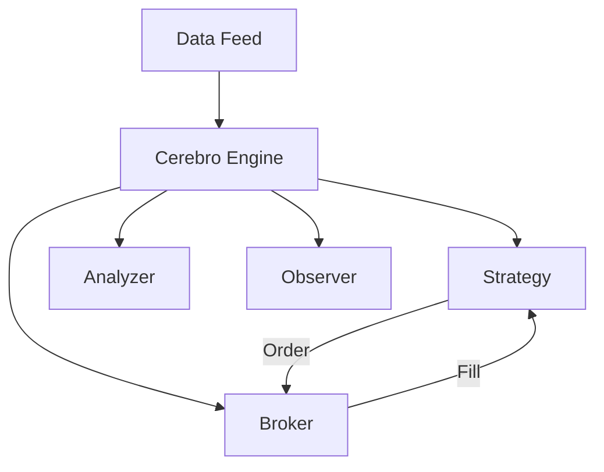
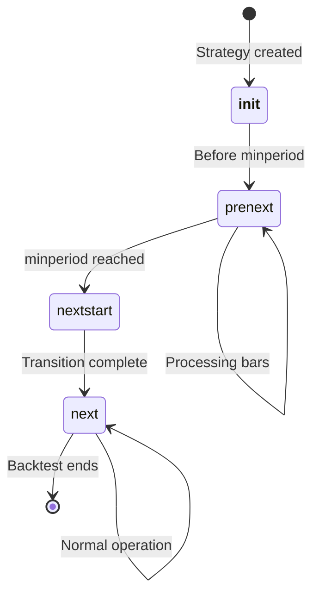

# Basic Concepts

Backtrader uses an event-driven architecture for backtesting trading strategies. Understanding these core concepts is essential for effective strategy development.

## Core Components



## Cerebro

- *Cerebro** is the central engine that orchestrates the backtesting process.

```python
cerebro = bt.Cerebro()

# Add components

cerebro.adddata(data)           # Add data feed

cerebro.addstrategy(MyStrategy)  # Add strategy

cerebro.addanalyzer(bt.analyzers.SharpeRatio)  # Add analyzer

# Configure

cerebro.broker.setcash(10000)   # Set initial cash

cerebro.broker.setcommission(0.001)  # Set commission

# Run

results = cerebro.run()

```

## Data Feeds

Data feeds provide market data to your strategy. Backtrader supports multiple data sources.

### Creating a Data Feed

```python

# From CSV

data = bt.feeds.CSVGeneric(
    dataname='AAPL.csv',
    datetime=0,    # Column index for datetime
    open=1,        # Column index for open
    high=2,        # Column index for high
    low=3,         # Column index for low
    close=4,       # Column index for close
    volume=5,      # Column index for volume
    dtformat='%Y-%m-%d'
)

# From Pandas DataFrame

import pandas as pd
df = pd.read_csv('data.csv')
data = bt.feeds.PandasData(dataname=df)

# From Yahoo Finance

data = bt.feeds.YahooFinanceData(
    dataname='AAPL',
    fromdate=datetime(2023, 1, 1),
    todate=datetime(2023, 12, 31)
)

```

### Accessing Data in Strategy

```python
class MyStrategy(bt.Strategy):
    def next(self):

# Current bar data
        current_price = self.data.close[0]
        current_high = self.data.high[0]
        current_low = self.data.low[0]

# Previous bar data
        previous_price = self.data.close[-1]

# Data length
        print(f"Current bar: {len(self.data)}")

```

## Lines

- *Lines** are time series data structures. Every data feed has predefined lines:

| Line | Description |

|------|-------------|

| `datetime` | Bar timestamp |

| `open` | Opening price |

| `high` | Highest price |

| `low` | Lowest price |

| `close` | Closing price |

| `volume` | Trading volume |

| `openinterest` | Open interest (for futures) |

### Accessing Line Data

```python

# Current value (index 0)

current_close = self.data.close[0]

# Previous values (negative indices)

prev_close = self.data.close[-1]   # 1 bar ago

prev_close2 = self.data.close[-2]  # 2 bars ago

# Line length

data_length = len(self.data.close)

```

## Strategies

Strategies contain your trading logic.

```python
class MyStrategy(bt.Strategy):
    """
    Strategy parameters
    """
    params = (
        ('period', 20),
        ('threshold', 0.5),
    )

    def __init__(self):
        """
        Initialize indicators and calculations
        """
        self.sma = bt.indicators.SMA(self.data.close, period=self.p.period)

    def next(self):
        """
        Called for each bar
        """
        if self.sma[0] > self.data.close[0]:
            self.buy()

```

### Strategy Lifecycle



| Phase | Description |

|-------|-------------|

| `__init__` | Initialize strategy, create indicators |

| `prenext()` | Called while indicators have insufficient data |

| `nextstart()` | Called once when minperiod is first satisfied |

| `next()` | Called for each bar after minperiod is satisfied |

## Indicators

Indicators calculate technical analysis values.

### Built-in Indicators

```python

# Moving averages

sma = bt.indicators.SMA(self.data.close, period=20)
ema = bt.indicators.EMA(self.data.close, period=20)

# Momentum indicators

rsi = bt.indicators.RSI(self.data.close, period=14)
macd = bt.indicators.MACD(self.data.close)

# Volatility indicators

atr = bt.indicators.ATR(self.data, period=14)
bollinger = bt.indicators.BollingerBands(self.data.close)

```

### Accessing Indicator Values

```python
class MyStrategy(bt.Strategy):
    def __init__(self):
        self.sma = bt.indicators.SMA(self.data.close, period=20)

    def next(self):

# Current SMA value
        current_sma = self.sma[0]

# Previous SMA value
        previous_sma = self.sma[-1]

```

## Broker

The Broker simulates order execution and portfolio management.

```python

# Configure broker

cerebro.broker.setcash(10000)           # Set initial cash

cerebro.broker.setcommission(0.001)     # Set commission (0.1%)

cerebro.broker.set_slippage_perc(0.5)   # Set slippage (0.5%)

```

### Orders

```python

# Market orders

self.buy()                              # Buy with default size

self.buy(size=100)                      # Buy specific quantity

self.sell()                             # Sell to close position

self.close()                            # Close existing position

# Limit orders

self.buy(price=100.5)                   # Buy at specific price

self.sell(limit=105.0)                  # Sell at limit price

# Stop orders

self.sell(stop=95.0)                    # Stop-loss sell

```

## Position

Track your current position.

```python
class MyStrategy(bt.Strategy):
    def next(self):

# Check if in position
        if self.position:
            print(f"Position size: {self.position.size}")

# Check position details
        if self.position:
            print(f"Entry price: {self.position.price}")
            print(f"Current profit: {self.position.price * self.position.size}")

```

## Next Steps

- [Indicators](indicators.md) - Explore all built-in indicators
- [Strategies](strategies.md) - Advanced strategy patterns
- [Analyzers](analyzers.md) - Performance analysis
- [Data Feeds](data-feeds.md) - More data sources
