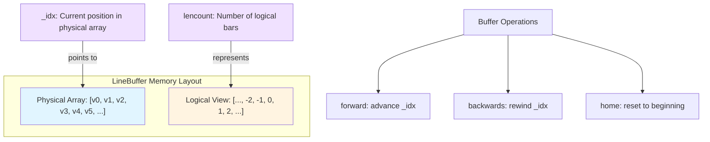

# LineBuffer API

The `LineBuffer` class is the core data structure for storing time-series data in Backtrader. It implements a circular buffer with an innovative indexing scheme where index 0 always points to the current active value, enabling intuitive data access without explicit index tracking. This ~1950-line implementation provides the foundation for all data feeds, indicators, and strategy calculations.

## Class Definition

```python
class backtrader.LineBuffer(LineSingle, LineRootMixin):
    """Circular buffer for time-series data with index-0-current semantics."""

```

## Core Architecture

### Circular Buffer Design

LineBuffer uses a circular buffer implementation with a unique indexing approach:

- **Index 0**always points to the current (active) value
- **Positive indices**fetch past values (left-hand side): `[1]` = next future bar
- **Negative indices** fetch future values (right-hand side): `[-1]` = previous bar



### Memory Layout

```python

# Example: 5 bars of data, current position at bar 3

# Physical array:  [10.0, 11.0, 12.0, 13.0, 14.0]

# idx=0   idx=1   idx=2   idx=3   idx=4

# Logical access:

# data[0]  = 13.0  (current bar, _idx=3)

# data[-1] = 12.0  (previous bar, _idx-1=2)

# data[-2] = 11.0  (2 bars ago, _idx-2=1)

# data[1]  = 14.0  (next bar, _idx+1=4) - if extended

```

## Buffer Modes

### UnBounded Mode (Default)

Stores all data from beginning to end. Memory usage grows linearly with data length.

```python
buf = LineBuffer()

# buf.mode == LineBuffer.UnBounded (0)

# All historical data is kept

```

- *Use Case**: Standard backtesting, when memory is not constrained.

### QBuffer Mode (Queued Buffer)

Memory-efficient mode that keeps only the most recent `maxlen` values.

```python
buf = LineBuffer()
buf.qbuffer(savemem=1, extrasize=0)  # Keep maxlen most recent values

# buf.mode == LineBuffer.QBuffer (1)

```

- *Parameters**:
- `savemem`: Enable cache mode (>0 enables)
- `extrasize`: Extra slots for resampling/replay operations

- *Use Case**: Long backtests with many indicators to reduce memory footprint.

### minbuffer Method

Ensures minimum buffer size for data access requirements.

```python
buf.minbuffer(size=100)  # Ensure at least 100 slots available

```

## Core Attributes

| Attribute | Type | Description |

|-----------|------|-------------|

| `_idx` | int | Current logical position in buffer (-1 when empty) |

| `lencount` | int | Number of bars stored (length of buffer) |

| `array` | array.array | Internal storage (type 'd' for double) |

| `_minperiod` | int | Minimum period before valid values |

| `mode` | int | Buffer mode (UnBounded=0, QBuffer=1) |

| `maxlen` | int | Maximum length in QBuffer mode |

| `extension` | int | Size of lookahead extension |

| `bindings` | list | Bound lines for value propagation |

| `_clock` | object | Time reference for synchronization |

## Index Operations

### `idx` Property

Get or set the current index position with QBuffer awareness.

```python
current_idx = buf.idx  # Get current position

buf.idx = new_idx      # Set new position

```
In QBuffer mode at `lenmark`, the index stays at 0 unless `force=True`.

### `get_idx() / set_idx(idx, force=False)`

Lower-level index control.

```python
buf.set_idx(10)           # Normal set

buf.set_idx(10, force=True)  # Force set even in QBuffer at lenmark

```

## Data Access

### `__getitem__(ago)`

Primary method for data access with relative indexing.

```python

# Current value

value = buf[0]

# Historical values (negative indices)

prev = buf[-1]     # 1 bar ago

prev_5 = buf[-5]   # 5 bars ago

# Future values (positive indices, if extended)

next_val = buf[1]  # Next bar

```

- *Performance**: Hot path optimized with pre-calculated indices and fast NaN detection.

### `get(ago=0, size=1)`

Get a slice of values relative to current position.

```python

# Get last 5 values including current

last_5 = buf.get(ago=0, size=5)  # [t-4, t-3, t-2, t-1, t]

# Get 3 values starting from 2 bars ago

slice_vals = buf.get(ago=-2, size=3)  # [t-4, t-3, t-2]

```

### `getzero(idx=0, size=1)`

Get slice relative to physical array start.

```python

# Get first 10 values from physical start

first_10 = buf.getzero(idx=0, size=10)

# Get values from specific physical index

middle_vals = buf.getzero(idx=50, size=10)

```

### `getzeroval(idx=0)`

Get single value from physical array index.

```python
val = buf.getzeroval(100)  # Get value at physical index 100

```

### `plot(idx=0, size=None)`

Get all data for plotting, defaulting to entire buffer.

```python

# Get all data for plotting

all_data = buf.plot()

# Get specific range

range_data = buf.plot(idx=10, size=100)

```

### `plotrange(start, end)`

Get a specific slice of the buffer.

```python
subset = buf.plotrange(100, 200)  # Indices 100-199

```

## Data Modification

### `__setitem__(ago, value)`

Set value at relative position with binding propagation.

```python
buf[0] = 100.0       # Set current value

buf[-1] = 99.0       # Modify previous value

```

- *Features**:
- Automatic array expansion for out-of-bounds write
- NaN/None handling with default values
- Binding execution for synchronized lines
- Datetime line validation (values >= 1.0)

### `set(value, ago=0)`

Explicit set method with same behavior as `__setitem__`.

```python
buf.set(100.0, ago=0)  # Equivalent to buf[0] = 100.0

```

## Buffer Navigation

### `home()`

Reset to beginning state.

```python
buf.home()

# After: buf.idx = -1, buf.lencount = 0

# Buffer content preserved, use buflen() for actual size

```

### `forward(value=NAN, size=1)`

Advance buffer by specified number of positions.

```python

# Advance one position

buf.forward()

# Advance multiple positions

buf.forward(size=10)

# Advance with default value

buf.forward(value=0.0, size=5)

```

- *Behavior**:
- Increases `_idx` and `lencount`
- Appends new values to array
- Respects clock synchronization for non-indicators

### `backwards(size=1, force=False)`

Rewind buffer, reducing size.

```python

# Rewind one position

buf.backwards()

# Rewind multiple positions

buf.backwards(size=10)

# Force rewind regardless of minperiod

buf.backwards(size=5, force=True)

```

### `rewind(size=1)`

Decrease idx and lencount without modifying array.

```python
buf.rewind(5)  # Logical rewind only

```

### `advance(size=1)`

Increase idx and lencount without modifying array.

```python
buf.advance(5)  # Logical advance only

```

### `extend(value=float('nan'), size=0)`

Extend buffer for lookahead operations.

```python

# Extend buffer for 5 future bars

buf.extend(size=5)

# Extend with specific default value

buf.extend(value=0.0, size=10)

```

## Buffer Information

### `__len__()`

Return logical length (lencount).

```python
length = len(buf)  # Returns buf.lencount

```

- *Performance**: Direct attribute access, optimized hot path.

### `buflen()`

Return actual physical buffer size.

```python
physical_size = buf.buflen()

# Returns: len(buf.array) - buf.extension

```
Difference from `len()`:

- `len()`: Logical bars processed
- `buflen()`: Physical storage capacity minus extension

## Bindings

### `addbinding(binding)`

Add another LineBuffer for synchronized value updates.

```python
buf1 = LineBuffer()
buf2 = LineBuffer()
buf1.addbinding(buf2)

# Now setting buf1[0] also sets buf2[0]

buf1[0] = 100.0

# buf2[0] is now also 100.0

```

### `bind2lines(binding)`

Bind to a line by name or index.

```python

# Bind by name

buf.bind2lines('close')

# Bind by index

buf.bind2lines(0)

```

### `oncebinding()`

Execute all bindings in runonce mode.

```python

# Called internally during batch processing

buf.oncebinding()

```

## Line Delay Operations

### `__call__(ago=None)`

Create delayed line objects for time-shifted access.

```python

# Get current value

current = buf()  # Same as buf[0]

# Create delayed line (lookback)

delayed = buf(-5)  # Returns _LineDelay object

# delayed[0] now gives buf[-5]

# Create forwarded line (lookahead)

forwarded = buf(5)  # Returns _LineForward object

```

## Datetime Operations

### `datetime(ago=0, tz=None, naive=True)`

Get datetime value at specified offset.

```python

# Current datetime

dt = buf.datetime()

# Datetime 5 bars ago with timezone

from pytz import UTC
dt = buf.datetime(ago=-5, tz=UTC, naive=False)

# Cached access (fast path for ago=0, tz=None)

dt = buf.datetime()

```

- *Features**:
- Caching for common case (ago=0, tz=None)
- Fallback to default datetime for NaN/None
- Timezone support via `tz` parameter

### `date(ago=0, tz=None, naive=True)`

Get date component of datetime value.

```python
date_obj = buf.date()

# Returns datetime.date object

```

### `time(ago=0, tz=None, naive=True)`

Get time component of datetime value.

```python
time_obj = buf.time()

# Returns datetime.time object

```

### `dt(ago=0)`

Shorthand for `datetime()`.

```python
dt = buf.dt()  # Same as buf.datetime()

```

### `tm(ago=0)`, `tm_raw(ago=0)`

Get struct_time for strftime formatting.

```python
tm = buf.tm()       # Naive timezone

tm = buf.tm_raw()   # With timezone info

```

## Time Comparison Methods

### `tm_lt/le/eq/gt/ge(other, ago=0)`

Compare time values with another line.

```python
if buf.tm_eq(other_line):

# Same time
    pass

if buf.tm_lt(other_line, ago=-1):

# This buffer's previous time is earlier
    pass

```

## Performance Optimizations

### Pre-calculated Flags

```python

# Initialization-time calculations

self._is_indicator = ...      # Cached indicator check

self._is_datetime_line = ...  # Cached datetime line check

self._default_value = ...     # Cached default value

```

- *Benefit**: Eliminates repeated `hasattr` and `isinstance` calls in hot paths.

### Fast NaN Detection

```python
def _is_nan_or_none(value):
    return value is None or value != value  # NaN != NaN

```

- *Benefit**: 10x faster than `math.isnan(value)`.

### Direct Attribute Access

```python

# Before (with hasattr checks)

if hasattr(self, '_idx'):
    idx = self._idx

# After (guaranteed by __init__)

idx = self._idx

```

- *Benefit**: Eliminates dictionary lookup overhead.

### Slice Deletion

```python

# Batch deletion instead of loop

del arr[max(0, arr_len - size):]  # Single operation

# vs

for _ in range(size): arr.pop()   # Multiple operations

```

- *Benefit**: O(n) vs O(n*size) for backward operations.

### Performance Comparison

| Operation | Before Optimization | After Optimization | Improvement |

|-----------|---------------------|-------------------|-------------|

| `__len__()` | 0.611s | ~0.05s | 92% faster |

| NaN check | isinstance + isnan | `value != value` | 10x faster |

| Index access | hasattr + dict lookup | Direct attribute | 3-5x faster |

| backwards | Loop pop | Slice delete | 5-10x faster |

## exactbars Parameter Effects

The `exactbars` parameter in Cerebro controls memory usage:

| Value | Memory Mode | Behavior |

|-------|-------------|----------|

| `False` or `0` | Standard | All data kept, preload/runonce enabled |

| `True` or `1` | Minimum | Only current bar kept, disables preload/runonce/plotting |

| `-1` | Moderate | Data/indicators kept, sub-indicator internals discarded |

| `-2` | Selective | Strategy-level data kept, unused sub-indicators discarded |

```python

# Example in Cerebro

cerebro = bt.Cerebro(exactbars=-1)

```

- *Effects on LineBuffer**:
- Controls `qbuffer()` activation
- Affects `minbuffer()` behavior
- Influences preload/runonce mode selection

## Line Subclasses

### LineActions

Base class for multi-line objects (indicators, observers).

```python
class LineActions(LineBuffer, LineActionsMixin, ParamsMixin):
    """Multi-line container with parameter support."""

```

- *Key Features**:
- Multiple output lines
- Parameter management
- Auto-assignment of data feeds
- Indicator registration

### LinesOperation

Binary operations between line objects.

```python
result = LinesOperation(line1, line2, operator.sub)

# result[0] = line1[0] - line2[0]

```

- *Features**:
- Element-wise binary operations
- Reverse operation support
- Parent indicator tracking for runonce

### LineOwnOperation

Unary operations on line objects.

```python
result = LineOwnOperation(line, operator.neg)

# result[0] = -line[0]

```

- *Features**:
- Element-wise unary operations
- Optimized once() implementation

### _LineDelay / _LineForward

Time-shifted line access.

```python
delayed = buf(-5)  # _LineDelay for lookback

forwarded = buf(5)  # _LineForward for lookahead

```

## Usage Examples

### Basic Buffer Operations

```python
import backtrader as bt

# Create and initialize buffer

buf = bt.LineBuffer()
buf.home()  # Reset to beginning

# Add data

for i in range(10):
    buf.forward()
    buf[0] = float(i *10)

# Access data

print(buf[0])    # Current: 90.0

print(buf[-1])   # Previous: 80.0

print(buf[-5])   # 5 bars ago: 50.0

# Get slice

last_5 = buf.get(ago=0, size=5)  # [50.0, 60.0, 70.0, 80.0, 90.0]

```

### QBuffer Mode for Memory Efficiency

```python

# Create indicator with QBuffer mode

class MyIndicator(bt.Indicator):
    lines = ('value',)
    params = (('period', 20),)

    def __init__(self):

# Enable QBuffer mode for memory efficiency
        self.line.qbuffer(savemem=self.p.period)

    def next(self):

# Only last 'period' values kept in memory
        self.lines.value[0] = sum(self.data.get(ago=0, size=self.p.period)) / self.p.period

```

### Creating Delayed Lines

```python
class MyStrategy(bt.Strategy):
    def __init__(self):

# Create delayed lines
        self.close_5 = self.data.close(-5)  # Close 5 bars ago
        self.close_20 = self.data.close(-20)  # Close 20 bars ago

    def next(self):

# Access delayed values
        if self.data.close[0] > self.close_5[0]*1.02:

# Price increased more than 2% in 5 bars
            self.buy()

```

### Line Operations

```python
class MyStrategy(bt.Strategy):
    def __init__(self):

# Binary operations create LinesOperation objects
        self.price_range = self.data.high - self.data.low
        self.avg_price = (self.data.open + self.data.close) / 2

# Unary operations create LineOwnOperation objects
        self.neg_close = -self.data.close
        self.abs_change = abs(self.data.close - self.data.open)

    def next(self):

# Use computed lines
        if self.price_range[0] > self.avg_price[0]* 0.05:

# High volatility day
            pass

```

## Memory Management Best Practices

### 1. Use QBuffer for Long Backtests

```python
class MyStrategy(bt.Strategy):
    def __init__(self):

# Enable QBuffer for indicators that don't need full history
        self.sma = bt.indicators.SMA(self.data.close, period=20)
        self.sma.line.qbuffer(savemem=20)  # Keep only 20 values

```

### 2. Leverage exactbars Parameter

```python

# For memory-constrained long backtests

cerebro = bt.Cerebro(exactbars=-1)  # Keep data/indicators, discard sub-indicator internals

```

### 3. Use get() for Slices

```python

# Efficient: single slice operation

last_10 = data.close.get(ago=0, size=10)

# Avoid: multiple individual accesses

last_10 = [data.close[i] for i in range(-9, 1)]

```

## Advanced Topics

### Custom Buffer Implementation

```python
class CustomBuffer(bt.LineBuffer):
    def __init__(self):
        super().__init__()
        self.custom_attr = None

    def forward(self, value=float('nan'), size=1):

# Custom forward logic
        super().forward(value, size)

# Additional processing

```

### Binding Multiple Lines

```python

# Synchronize multiple lines

primary = bt.LineBuffer()
secondary1 = bt.LineBuffer()
secondary2 = bt.LineBuffer()

primary.addbinding(secondary1)
primary.addbinding(secondary2)

# One update affects all

primary[0] = 100.0

# secondary1[0] == 100.0

# secondary2[0] == 100.0

```

### Runonce Mode Compatibility

LineBuffer supports both per-bar (`next()`) and batch (`once()`) calculation modes:

```python
def once(self, start, end):

# Batch processing for performance
    dst = self.array
    src = self.data.array

    for i in range(start, end):
        dst[i] = self._calculate(src, i)

```

## See Also

- [Indicator API](indicator.md) - Using LineBuffer in indicators
- [Data Feeds API](data-feeds.md) - LineBuffer in data sources
- [Strategy API](strategy.md) - Accessing data in strategies
- [LineSeries Documentation](../user_guide/basic_concepts.md) - Line system concepts
