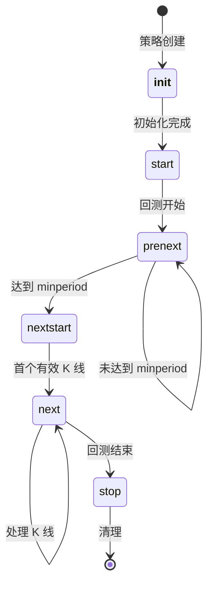

# Strategy API

`Strategy` 类是 Backtrader 中所有用户定义交易策略的基类。它提供订单管理、持仓跟踪、指标集成和事件驱动执行。

## 类定义

```python
class backtrader.Strategy:
    """交易策略基类。"""

```

## 参数

### `params`

策略的参数定义元组。

```python
class MyStrategy(bt.Strategy):
    params = (
        ('period', 20),
        ('threshold', 1.5),
    )

```
通过 `self.p.parameter_name` 或 `self.params.parameter_name` 访问参数。

## 核心方法

### `__init__(self)`

在回测开始前调用一次。用于初始化指标和计算。

```python
def __init__(self):
    super().__init__()  # 始终先调用 super
    self.sma = bt.indicators.SMA(self.data.close, period=self.p.period)

```

### `start(self)`

在回测开始后、初始化完成后调用。

```python
def start(self):
    self.initial_cash = self.broker.getcash()

```

### `prenext(self)`

在达到最小周期前每根 K 线调用。

### `nextstart(self)`

首次达到最小周期时调用一次。

### `next(self)`

达到最小周期后每根 K 线调用。包含主要交易逻辑。

```python
def next(self):
    if self.data.close[0] > self.sma[0]:
        self.buy()

```

### `stop(self)`

回测结束后调用。

```python
def stop(self):
    final_value = self.broker.getvalue()
    print(f'最终组合价值: {final_value}')

```

## 订单方法

### `buy(self, **kwargs)`

创建买入订单。

| 参数 | 类型 | 默认值 | 描述 |

|-----------|------|---------|-------------|

| `data` | Data | None | 交易的数据源 |

| `size` | float | None | 仓位大小 (正数) |

| `price` | float | None | 限价 |

| `plimit` | float | None | 止损限价单的限价 |

| `stoplimit` | float | None | 止损限价激活价 |

| `exectype` | Order.ExecType | None | 执行类型 |

| `valid` | Order.Valid | None | 有效期 |

| `oco` | Order | None | 一单一撤订单 |

```python

# 市价单

order = self.buy()

# 限价单

order = self.buy(price=100.0)

# 指定数量

order = self.buy(size=10)

# 止损限价单

order = self.buy(stoplimit=95.0, price=94.5)

```

### `sell(self, **kwargs)`

创建卖出订单。参数与 `buy()` 相同。

```python

# 卖出全部持仓

order = self.sell()

# 止损单

order = self.sell(stop=95.0)

```

### `close(self, **kwargs)`

平仓。参数与 `buy()` 相同，但自动确定数量。

```python

# 平仓

order = self.close()

# 限价平仓

order = self.close(price=105.0)

```

### `cancel(self, order)`

取消待处理订单。

```python
self.cancel(order)

```

## 订单通知

### `notify_order(self, order)`

订单状态变化时调用。

```python
def notify_order(self, order):
    if order.status in [order.Submitted, order.Accepted]:
        return

    if order.status == order.Completed:
        if order.isbuy():
            self.log(f'买入成交, 价格: {order.executed.price:.2f}')
        else:
            self.log(f'卖出成交, 价格: {order.executed.price:.2f}')

    elif order.status in [order.Canceled, order.Margin, order.Rejected]:
        self.log(f'订单 {order.getstatusname()}')

```

- *订单状态值**:

| 状态 | 描述 |

|--------|-------------|

| `Order.Created` | 订单已创建 |

| `Order.Submitted` | 已提交给经纪人 |

| `Order.Accepted` | 经纪人已接受 |

| `Order.Partial` | 部分成交 |

| `Order.Completed` | 完全成交 |

| `Order.Canceled` | 已取消 |

| `Order.Margin` | 保证金不足 |

| `Order.Rejected` | 已拒绝 |

## 交易通知

### `notify_trade(self, trade)`

交易关闭时调用。

```python
def notify_trade(self, trade):
    if not trade.isclosed:
        return

    self.log(f'交易盈亏: {trade.pnl:.2f}, 佣金: {trade.commission:.2f}')

```

- *交易属性**:

| 属性 | 描述 |

|-----------|-------------|

| `trade.pnl` | 毛盈亏 |

| `trade.pnlcomm` | 净盈亏 (扣除佣金后) |

| `trade.commission` | 支付的佣金 |

| `trade.isclosed` | 交易是否已关闭 |

## 持仓管理

### `position`

访问数据源的持仓信息。

```python

# 获取当前数据的持仓

position = self.position

# 获取特定数据的持仓

position = self.getposition(data)

# 检查是否有持仓

if self.position:
    size = self.position.size
    price = self.position.price

```

- *持仓属性**:

| 属性 | 类型 | 描述 |

|-----------|------|-------------|

| `size` | float | 当前持仓大小 (正数=多头, 负数=空头) |

| `price` | float | 平均入场价格 |

| `price_adj` | float | 调整后价格 (股票) |

### `getposition(self, data=None, broker=None)`

获取特定数据源的持仓对象。

```python
position = self.getposition(self.datas[1])

```

## 数据访问

### `data` / `datas`

访问策略中的数据源。

```python

# 当前 (第一个) 数据源

price = self.data.close[0]

# 通过索引访问

price1 = self.datas[0].close[0]
price2 = self.datas[1].close[0]

# 通过名称访问 (如果指定了)

price = self.aapl.close[0]

```

### `getdatabyname(self, name)`

通过名称获取数据源。

```python
data = self.getdatabyname('AAPL')

```

## 经纪人访问

### `broker`

访问经纪人方法。

```python
cash = self.broker.getcash()
value = self.broker.getvalue()

```

- *常用经纪人方法**:

| 方法 | 描述 |

|--------|-------------|

| `getcash()` | 获取可用现金 |

| `getvalue()` | 获取组合价值 |

| `getposition(data)` | 获取数据源的持仓 |

| `setcash(amount)` | 设置现金金额 |

## 指标集成

在 `__init__` 中定义的指标会自动计算和更新。

```python
def __init__(self):
    self.sma20 = bt.indicators.SMA(self.data.close, period=20)
    self.sma50 = bt.indicators.SMA(self.data.close, period=50)
    self.crossover = bt.indicators.CrossOver(self.sma20, self.sma50)

def next(self):
    if self.crossover > 0:
        self.buy()

```

## 日志记录

### `log(self, msg, dt=None)`

记录带时间戳的日志消息。

```python
def next(self):
    self.log(f'收盘价: {self.data.close[0]:.2f}')

```

## 策略生命周期



## 多数据源

```python
class MyStrategy(bt.Strategy):
    def __init__(self):

# 访问多个数据源
        self.data0 = self.datas[0]  # 第一个数据
        self.data1 = self.datas[1]  # 第二个数据

    def next(self):

# 基于两个数据源交易
        if self.data0.close[0] > self.data1.close[0]:
            self.buy(data=self.data0)

```

## 定时器事件

### `notify_timer(self, timer, when)`

定时器事件触发时调用。

```python
def __init__(self):

# 添加定时器
    self.add_timer(
        when=datetime.time(hour=14, minute=30),
        allow=True
    )

def notify_timer(self, timer, when):
    self.log(f'定时器触发于 {when}')

```

## 数据事件

### `notify_data(self, data, status, *args, **kwargs)`

数据状态变化时调用。

```python
def notify_data(self, data, status, *args, **kwargs):
    if status == data.LIVE:
        self.log(f'{data._name} 现已实时')

```

## 信号策略

基于信号的交易使用 `SignalStrategy`:

```python
class MySignalStrategy(bt.SignalStrategy):
    params = (('period', 20),)

    def __init__(self):
        self.sma = bt.indicators.SMA(self.data.close, period=self.p.period)
        self.signal_add(bt.SIGNAL_LONG, self.data.close > self.sma)

```

## 完整示例

```python
import backtrader as bt

class MyStrategy(bt.Strategy):
    """
    示例移动平均线交叉策略。
    """

    params = (
        ('fast_period', 10),
        ('slow_period', 30),
    )

    def __init__(self):
        super().__init__()
        self.fast_ma = bt.indicators.SMA(self.data.close, period=self.p.fast_period)
        self.slow_ma = bt.indicators.SMA(self.data.close, period=self.p.slow_period)
        self.crossover = bt.indicators.CrossOver(self.fast_ma, self.slow_ma)
        self.order = None

    def next(self):
        if self.order:
            return

        if not self.position:
            if self.crossover > 0:
                self.order = self.buy()
        else:
            if self.crossover < 0:
                self.order = self.sell()

    def notify_order(self, order):
        if order.status in [order.Submitted, order.Accepted]:
            return

        if order.status == order.Completed:
            if order.isbuy():
                self.log(f'买入成交: {order.executed.price:.2f}')
            else:
                self.log(f'卖出成交: {order.executed.price:.2f}')

        self.order = None

    def notify_trade(self, trade):
        if trade.isclosed:
            self.log(f'交易盈亏: {trade.pnl:.2f}')

    def stop(self):
        self.log(f'最终价值: {self.broker.getvalue():.2f}')

```

## 下一步学习

- [Indicators API](indicator.md) - 指标开发
- [Analyzers API](analyzer.md) - 性能分析
- [Data Feeds API](data-feeds.md) - 数据源
