# 迭代43：代码注释优化与文档国际化

## 1. 迭代概述

| 属性 | 值 |
|------|------|
| **迭代编号** | Iteration 43 |
| **迭代名称** | 代码注释优化与文档国际化 |
| **开始日期** | 2026-01-06 |
| **预计结束** | 待定 |
| **迭代负责人** | 开发团队 |
| **优先级** | 高 |
| **状态** | 进行中 |

## 2. 背景与目标

### 2.1 背景

Backtrader项目重构已基本完成，移除了元类（metaclass）编程模式，采用显式初始化模式。为确保代码的可维护性和国际化，需要对整个项目的注释进行系统化优化。

### 2.2 迭代目标

1. **统一注释格式**：所有Python文件采用Google风格的注释格式
2. **国际化**：将所有中文注释翻译为英文注释
3. **文档完整性**：确保每个模块、类、方法都有完整的文档字符串
4. **质量保证**：每完成一个任务后运行测试，确保注释不影响代码功能

## 3. 验收标准

### 3.1 注释格式标准

采用Google Python Style Guide的文档字符串格式：

```python
"""模块级文档字符串。

简短描述模块的整体功能和用途。

Example:
    基本用法示例

Attributes:
    module_level_var1: 模块级变量说明
"""

class ClassName:
    """类级文档字符串。

    简短描述类的用途。

    Attributes:
        attr1: 属性说明
        attr2: 属性说明
    """

    def method_name(self, param1, param2):
        """方法级文档字符串。

        详细描述方法的功能。

        Args:
            param1: 参数1说明
            param2: 参数2说明

        Returns:
            返回值说明

        Raises:
            ErrorType: 错误说明
        """
        pass
```

### 3.2 完成标准

- [ ] 所有192个Python文件都有模块级文档字符串
- [ ] 所有公共类都有类级文档字符串
- [ ] 所有公共方法都有方法级文档字符串
- [ ] 所有中文注释已翻译为英文
- [ ] 所有测试通过 (`pytest tests -n 12`)
- [ ] 代码已提交并合并

## 4. 项目文件统计

| 分类 | 文件数量 | 说明 |
|------|----------|------|
| **核心模块** | 35 | 根目录核心文件 |
| **indicators/** | 52 | 技术指标 |
| **feeds/** | 21 | 数据源 |
| **analyzers/** | 18 | 性能分析器 |
| **brokers/** | 8 | 交易接口 |
| **observers/** | 8 | 图表观察器 |
| **stores/** | 8 | 数据存储 |
| **filters/** | 9 | 数据过滤器 |
| **utils/** | 9 | 工具函数 |
| **plot/** | 9 | 绘图相关 |
| **sizers/** | 3 | 交易规模 |
| **其他** | 12 | 配置、测试等 |
| **总计** | **192** | - |

## 5. 任务优先级与进度跟踪

### 5.1 第一优先级：核心框架（35个文件）

> 优先级：🔴 最高 | 预计工作量：较大

| 序号 | 文件名 | 行数 | 状态 | 负责人 | 完成日期 | 备注 |
|------|--------|------|------|--------|----------|------|
| 1.1 | `__init__.py` | - | 🟢 已完成 | Claude | 2026-01-06 | 模块导入说明 |
| 1.2 | `metabase.py` | 1,636 | 🟢 已完成 | Claude | 2026-01-06 | 基础混入类 |
| 1.3 | `cerebro.py` | 2,117 | 🟢 已完成 | Claude | 2026-01-06 | 主引擎 |
| 1.4 | `strategy.py` | 2,530 | ⬜ 待开始 | | | 策略基类 |
| 1.5 | `indicator.py` | 301 | ⬜ 待开始 | | | 指标基类 |
| 1.6 | `lineiterator.py` | 1,957 | ⬜ 待开始 | | | 线条迭代器 |
| 1.7 | `linebuffer.py` | 2,262 | ⬜ 待开始 | | | 线条缓冲区 |
| 1.8 | `lineseries.py` | 1,624 | ⬜ 待开始 | | | 线条序列 |
| 1.9 | `lineroot.py` | 915 | ⬜ 待开始 | | | 线条根类 |
| 1.10 | `parameters.py` | 2,001 | ⬜ 待开始 | | | 参数系统 |
| 1.11 | `broker.py` | - | ⬜ 待开始 | | | 经纪人系统 |
| 1.12 | `order.py` | 870 | ⬜ 待开始 | | | 订单系统 |
| 1.13 | `position.py` | - | ⬜ 待开始 | | | 持仓管理 |
| 1.14 | `feed.py` | 1,109 | ⬜ 待开始 | | | 数据源基类 |
| 1.15 | `dataseries.py` | - | ⬜ 待开始 | | | 数据系列接口 |
| 1.16 | `functions.py` | 397 | ⬜ 待开始 | | | 核心函数 |
| 1.17 | `errors.py` | - | ⬜ 待开始 | | | 错误定义 |
| 1.18 | `resamplerfilter.py` | 845 | ⬜ 待开始 | | | 重采样过滤器 |
| 1.19 | `comminfo.py` | 382 | ⬜ 待开始 | | | 商品信息 |
| 1.20 | `writer.py` | 297 | ⬜ 待开始 | | | 数据写入 |
| 1.21 | `trade.py` | 381 | ⬜ 待开始 | | | 交易记录 |
| 1.22 | `timer.py` | 304 | ⬜ 待开始 | | | 计时器 |
| 1.23 | `tradingcal.py` | 317 | ⬜ 待开始 | | | 交易日历 |
| 1.24 | `test_helpers.py` | - | ⬜ 待开始 | | | 测试助手 |
| 1.25 | `talib.py` | - | ⬜ 待开始 | | | TA-LIB集成 |
| 1.26 | `store.py` | - | ⬜ 待开始 | | | 存储基类 |
| 1.27 | `signal.py` | - | ⬜ 待开始 | | | 信号系统 |
| 1.28 | `sizer.py` | - | ⬜ 待开始 | | | 规模设置 |
| 1.29 | `fillers.py` | - | ⬜ 待开始 | | | 填充器 |
| 1.30 | `flt.py` | - | ⬜ 待开始 | | | 过滤器 |
| 1.31 | `version.py` | - | ⬜ 待开始 | | | 版本信息 |
| 1.32 | `btrun/__init__.py` | - | ⬜ 待开始 | | | |
| 1.33 | `btrun/__main__.py` | - | ⬜ 待开始 | | | |
| 1.34 | `utils/__init__.py` | - | ⬜ 待开始 | | | |
| 1.35 | `utils/py3.py` | - | ⬜ 待开始 | | | |

**图例：**
- ⬜ 待开始
- 🟡 进行中
- 🟢 已完成
- 🔴 已阻塞

### 5.2 第二优先级：指标模块（52个文件）

> 优先级：🟡 高 | 预计工作量：大

| 序号 | 文件名 | 行数 | 状态 | 负责人 | 完成日期 | 备注 |
|------|--------|------|------|--------|----------|------|
| 2.1 | `__init__.py` | - | ⬜ | | | 导入说明 |
| 2.2 | `basicops.py` | 687 | ⬜ | | | 基本操作 |
| 2.3 | `directionalmove.py` | 599 | ⬜ | | | 动向指标 |
| 2.4 | `stochastic.py` | 408 | ⬜ | | | 随机指标 |
| 2.5 | `pivotpoint.py` | 389 | ⬜ | | | 枢轴点 |
| 2.6 | `mabase.py` | 366 | ⬜ | | | 移动平均基类 |
| 2.7 | `rsi.py` | 329 | ⬜ | | | RSI指标 |
| 2.8 | `sma.py` | 325 | ⬜ | | | 简单移动平均 |
| 2.9 | `envelope.py` | 292 | ⬜ | | | 包络线 |
| 2.10 | `crossover.py` | 267 | ⬜ | | | 交叉信号 |
| 2.11 | `atr.py` | 255 | ⬜ | | | ATR指标 |
| 2.12 | `aroon.py` | 232 | ⬜ | | | AROON指标 |
| 2.13 | `priceoscillator.py` | 219 | ⬜ | | | 价格振荡器 |
| 2.14 | `macd.py` | 218 | ⬜ | | | MACD指标 |
| 2.15 | `ichimoku.py` | 209 | ⬜ | | | 一目均衡表 |
| 2.16 | `momentum.py` | 192 | ⬜ | | | 动量指标 |
| 2.17 | `ols.py` | 189 | ⬜ | | | 最小二乘 |
| 2.18 | `bollinger.py` | 165 | ⬜ | | | 布林带 |
| 2.19 | `hadelta.py` | 161 | ⬜ | | | HA Delta |
| 2.20 | `psar.py` | 153 | ⬜ | | | SAR指标 |
| 2.21 | `cci.py` | - | ⬜ | | | CCI指标 |
| 2.22 | `dema.py` | - | ⬜ | | | 双指数移动平均 |
| 2.23 | `deviation.py` | - | ⬜ | | | 偏差指标 |
| 2.24 | `dma.py` | - | ⬜ | | | DMA指标 |
| 2.25 | `dpo.py` | - | ⬜ | | | DPO指标 |
| 2.26 | `dv2.py` | - | ⬜ | | | DV2指标 |
| 2.27 | `ema.py` | - | ⬜ | | | 指数移动平均 |
| 2.28 | `heikinashi.py` | - | ⬜ | | | 青森蜡烛图 |
| 2.29 | `hma.py` | - | ⬜ | | | HMA指标 |
| 2.30 | `hurst.py` | - | ⬜ | | | 赫斯特指数 |
| 2.31 | `kama.py` | - | ⬜ | | | KAMA指标 |
| 2.32 | `kst.py` | - | ⬜ | | | KST指标 |
| 2.33 | `lrsi.py` | - | ⬜ | | | LRSI指标 |
| 2.34 | `myind.py` | - | ⬜ | | | 自定义指标示例 |
| 2.35 | `oscillator.py` | - | ⬜ | | | 振荡器基类 |
| 2.36 | `percentchange.py` | - | ⬜ | | | 百分比变化 |
| 2.37 | `percentrank.py` | - | ⬜ | | | 百分比排名 |
| 2.38 | `prettygoodoscillator.py` | - | ⬜ | | | PGO指标 |
| 2.39 | `rmi.py` | - | ⬜ | | | RMI指标 |
| 2.40 | `smma.py` | - | ⬜ | | | SMMA指标 |
| 2.41 | `trix.py` | - | ⬜ | | | TRIX指标 |
| 2.42 | `tsi.py` | - | ⬜ | | | TSI指标 |
| 2.43 | `ultimateoscillator.py` | - | ⬜ | | | 终极振荡器 |
| 2.44 | `vortex.py` | - | ⬜ | | | 漩涡指标 |
| 2.45 | `williams.py` | - | ⬜ | | | 威廉指标 |
| 2.46 | `wma.py` | - | ⬜ | | | 加权移动平均 |
| 2.47 | `zlema.py` | - | ⬜ | | | ZLEMA指标 |
| 2.48 | `zlind.py` | - | ⬜ | | | ZL指标 |
| 2.49 | `contrib/__init__.py` | - | ⬜ | | | |
| 2.50 | `contrib/vortex.py` | - | ⬜ | | | 社区贡献指标 |
| 2.51 | `convertdir.py` | - | ⬜ | | | |
| 2.52 | `signalcross.py` | - | ⬜ | | | |

### 5.3 第三优先级：分析器模块（18个文件）

> 优先级：🟢 中 | 预计工作量：中

| 序号 | 文件名 | 行数 | 状态 | 负责人 | 完成日期 | 备注 |
|------|--------|------|------|--------|----------|------|
| 3.1 | `__init__.py` | - | ⬜ | | | |
| 3.2 | `sharpe_ratio_stats.py` | 339 | ⬜ | | | 夏普比率统计 |
| 3.3 | `tradeanalyzer.py` | 213 | ⬜ | | | 交易分析器 |
| 3.4 | `sharpe.py` | 211 | ⬜ | | | 夏普比率 |
| 3.5 | `drawdown.py` | 193 | ⬜ | | | 回撤分析 |
| 3.6 | `vwr.py` | 168 | ⬜ | | | VWR分析 |
| 3.7 | `returns.py` | 154 | ⬜ | | | 收益率分析 |
| 3.8 | `pyfolio.py` | 153 | ⬜ | | | Pyfolio分析 |
| 3.9 | `annualreturn.py` | 151 | ⬜ | | | 年化收益 |
| 3.10 | `logreturnsrolling.py` | 138 | ⬜ | | | 滚动对数收益 |
| 3.11 | `timereturn.py` | 134 | ⬜ | | | 时间收益 |
| 3.12 | `calmar.py` | 114 | ⬜ | | | Calmar比率 |
| 3.13 | `periodstats.py` | 103 | ⬜ | | | 周期统计 |
| 3.14 | `transactions.py` | 102 | ⬜ | | | 交易记录 |
| 3.15 | `positions.py` | 77 | ⬜ | | | 持仓分析 |
| 3.16 | `sqn.py` | 73 | ⬜ | | | SQN指标 |
| 3.17 | `leverage.py` | 59 | ⬜ | | | 杠杆分析 |
| 3.18 | `total_value.py` | 31 | ⬜ | | | 总价值分析 |

### 5.4 第四优先级：数据源模块（21个文件）

> 优先级：🟢 中 | 预计工作量：中

| 序号 | 文件名 | 行数 | 状态 | 负责人 | 完成日期 | 备注 |
|------|--------|------|------|--------|----------|------|
| 4.1 | `__init__.py` | - | ⬜ | | | |
| 4.2 | `ibdata.py` | 757 | ⬜ | | | Interactive Brokers |
| 4.3 | `vcdata.py` | 683 | ⬜ | | | VC数据 |
| 4.4 | `oanda.py` | 437 | ⬜ | | | OANDA数据 |
| 4.5 | `yahoo.py` | 364 | ⬜ | | | Yahoo数据 |
| 4.6 | `pandafeed.py` | 286 | ⬜ | | | Pandas数据源 |
| 4.7 | `cryptofeed.py` | 265 | ⬜ | | | 加密货币数据 |
| 4.8 | `quandl.py` | 220 | ⬜ | | | Quandl数据 |
| 4.9 | `ctpdata.py` | 203 | ⬜ | | | CTP数据 |
| 4.10 | `rollover.py` | 201 | ⬜ | | | 持仓展期 |
| 4.11 | `ccxtfeed.py` | 197 | ⬜ | | | CCXT数据源 |
| 4.12 | `csvgeneric.py` | 162 | ⬜ | | | CSV通用 |
| 4.13 | `vchart.py` | 135 | ⬜ | | | VChart |
| 4.14 | `influxfeed.py` | 125 | ⬜ | | | InfluxDB |
| 4.15 | `vchartfile.py` | 124 | ⬜ | | | VChart文件 |
| 4.16 | `blaze.py` | 87 | ⬜ | | | Blaze数据 |
| 4.17 | `chainer.py` | 85 | ⬜ | | | Chainer数据 |
| 4.18 | `vchartcsv.py` | 61 | ⬜ | | | VChart CSV |
| 4.19 | `btcsv.py` | 46 | ⬜ | | | BTC CSV |
| 4.20 | `mt4csv.py` | 30 | ⬜ | | | MT4 CSV |
| 4.21 | `sierrachart.py` | 17 | ⬜ | | | Sierra Chart |

### 5.5 第五优先级：其他模块（66个文件）

| 分类 | 文件数 | 状态 |
|------|--------|------|
| **brokers/** | 8 | ⬜ 待开始 |
| **observers/** | 8 | ⬜ 待开始 |
| **stores/** | 8 | ⬜ 待开始 |
| **filters/** | 9 | ⬜ 待开始 |
| **utils/** | 9 | ⬜ 待开始 |
| **plot/** | 9 | ⬜ 待开始 |
| **sizers/** | 3 | ⬜ 待开始 |
| **mixins/** | 2 | ⬜ 待开始 |
| **commissions/** | 2 | ⬜ 待开始 |
| **其他** | 8 | ⬜ 待开始 |

## 6. 工作流程

### 6.1 单个文件注释优化流程

```mermaid
graph TD
    A[开始] --> B[阅读文件理解逻辑]
    B --> C[添加模块级文档字符串]
    C --> D[添加类级文档字符串]
    D --> E[添加方法级文档字符串]
    E --> F[翻译中文注释为英文]
    F --> G[运行pytest tests -n 12]
    G --> H{测试通过?}
    H -->|是| I[Commit代码]
    H -->|否| J[分析问题]
    J --> K{注释导致?}
    K -->|是| L[修改注释]
    K -->|否| M[记录问题]
    L --> G
    I --> N[更新TODO状态]
    N --> O[结束]
    M --> O
```



### 6.2 Git提交规范

每次完成任务后，按照以下格式提交：

```
docs: add Google-style docstrings for [filename]

- Add module-level docstring
- Add class-level docstrings for ClassName1, ClassName2
- Add method-level docstrings for all public methods
- Translate Chinese comments to English

Test: pytest tests -n 12 passed
```

## 7. 风险管理

| 风险 | 影响 | 概率 | 应对措施 |
|------|------|------|----------|
| 注释影响代码功能 | 高 | 低 | 每次修改后运行完整测试 |
| 翻译不准确 | 中 | 中 | 使用专业术语，参考原文 |
| 工作量超出预期 | 中 | 中 | 按优先级分批完成 |
| 代码风格不一致 | 低 | 低 | 使用linter检查 |

## 8. 进度汇总

| 指标 | 目标 | 当前完成 | 完成率 |
|------|------|----------|--------|
| 总文件数 | 192 | 0 | 0% |
| 第一优先级 | 35 | 0 | 0% |
| 第二优先级 | 52 | 0 | 0% |
| 第三优先级 | 18 | 0 | 0% |
| 第四优先级 | 21 | 0 | 0% |
| 第五优先级 | 66 | 0 | 0% |

## 9. Google风格注释规范

### 9.1 模块级文档字符串

```python
"""Backtrader核心模块。

本模块提供了Backtrader框架的基础功能，包括线条系统、参数系统、
策略基类等核心组件。

Example:
    基本用法示例:
    ```python
    import backtrader as bt
    cerebro = bt.Cerebro()
    cerebro.run()
    ```

Attributes:
    version: 版本信息
"""
```

### 9.2 类级文档字符串

```python
class Cerebro:
    """Backtrader主引擎类。

    Cerebro是Backtrader的核心引擎，负责协调策略、数据源、经纪人、
    分析器等组件的运行。

    Attributes:
        strategies: 策略列表
        datas: 数据源列表
        brokers: 经纪人列表
        analyzers: 分析器列表

    Example:
        创建并运行Cerebro:
        ```python
        cerebro = bt.Cerebro()
        cerebro.adddata(data)
        cerebro.addstrategy(MyStrategy)
        result = cerebro.run()
        ```
    """
```

### 9.3 方法级文档字符串

```python
def addstrategy(self, strategyclass, *args, **kwargs):
    """添加策略到Cerebro引擎。

    Args:
        strategyclass: 策略类，必须继承自bt.Strategy
        *args: 传递给策略类的位置参数
        **kwargs: 传递给策略类的关键字参数

    Returns:
        策略实例的索引

    Raises:
        TypeError: 如果strategyclass不是Strategy的子类

    Example:
        ```python
        cerebro.addstrategy(MyStrategy, period=20)
        ```
    """
```

### 9.4 复杂逻辑的行内注释

```python
# Calculate the circular buffer index for efficient memory usage
# This ensures the buffer never exceeds its allocated size
idx = len(self) % self.size
self.buffer[idx] = value
```

## 10. 术语翻译对照表

| 中文 | 英文 | 说明 |
|------|------|------|
| 线条 | Line | Backtrader的核心数据结构 |
| 策略 | Strategy | 交易策略 |
| 指标 | Indicator | 技术指标 |
| 经纪人 | Broker | 模拟交易执行 |
| 数据源 | Data Feed | 市场数据输入 |
| 分析器 | Analyzer | 性能分析工具 |
| 观察器 | Observer | 数据观察器 |
| 订单 | Order | 交易指令 |
| 持仓 | Position | 当前持仓状态 |
| 重采样 | Resample | 数据周期转换 |
| 过滤器 | Filter | 数据过滤器 |

## 11. 附录

### 11.1 相关文档链接

- [Google Python Style Guide](https://google.github.io/styleguide/pyguide.html)
- [PEP 257 -- Docstring Conventions](https://www.python.org/dev/peps/pep-0257/)
- [Napoleon - Sphinx扩展](https://sphinxcontrib-napoleon.readthedocs.io/)

### 11.2 更新日志

| 日期 | 更新内容 | 更新人 |
|------|----------|--------|
| 2026-01-06 | 创建迭代文档 | Claude |

---

**文档版本**: v1.0
**最后更新**: 2026-01-06
